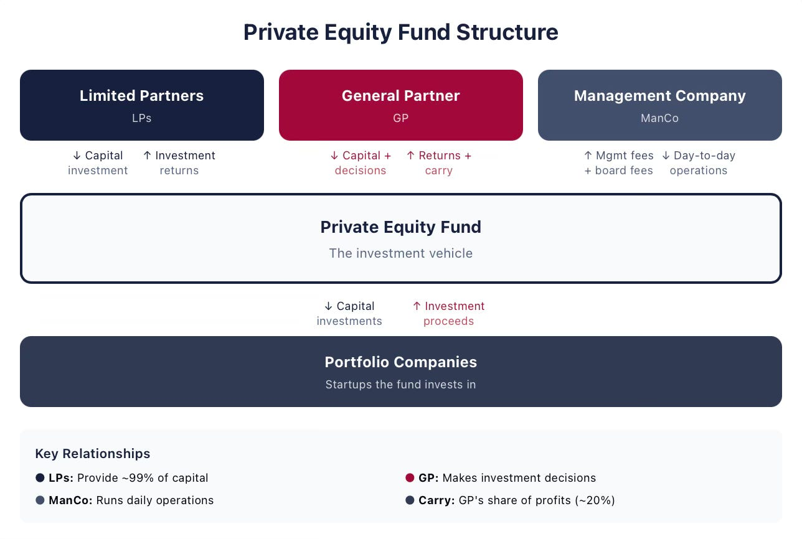
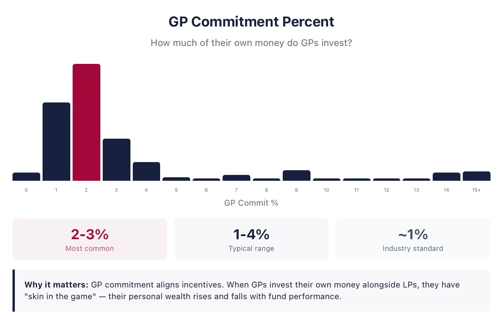

# 3/20. Что такое private equity

## Представляем private equity

*Опубликовано 2026-04-12. Источник: https://ilyastrebulaev.substack.com/p/introducing-private-equity*

Частный капитал (private equity, PE) стоит за всем — от стартапов на ранней стадии до выкупов на миллиарды долларов, но его механика остаётся непрозрачной для большинства людей, которых она касается. Будь вы фаундер (founder), который привлекает венчурный капитал (venture capital), венчурный инвестор (VC), который его размещает, или человек, чей пенсионный фонд имеет заметную долю в PE, понимание того, как PE на самом деле работает, — дело практическое, а не академическое.

Фаундерам, которые договариваются о термшитах (term sheets), полезно понимать структурные стимулы фондов, которые пишут эти чеки: почему венчурный инвестор может давить на последующий раунд (follow-on), как вклад генерального партнёра (general partner, GP; это GP commitment) формирует аппетит к риску, или что жизненный цикл фонда значит для давления по срокам выхода (exit). Для венчурных инвесторов и будущих управляющих фондами правовая архитектура, механика вознаграждения и динамика ограниченных партнёров (limited partners, LP), о которых здесь говорится, — это операционная система бизнеса. А для широкой публики компании, в которых мы работаем, услуги, которыми пользуемся, и пенсионные активы, от которых зависим, все формируются потоками капитала и структурами управления, описанными на этих страницах. Дальше — обзор этих оснований.

> **Что такое private equity**

Private equity (PE) обычно означает инвестиции в непубличные (privately held) долевые бумаги или бумаги, похожие на долю (equity-like securities). Критическое уточнение — «непубличные»: эти инвестиции не торгуются активно на фондовом рынке.

Цель PE — отобрать и сделать эти инвестиции, со временем повысить их ценность и в итоге выйти с прибылью. Инвестиции PE покрывают широкий спектр активов. Сюда входят выкупы (buyouts) и инвестиции роста (growth) в зрелые компании, а также венчурные инвестиции в компании на ранней стадии. Инвестиции PE также покрывают недвижимость, инфраструктуру и другие PE-фонды и фирмы. Хотя «equity» в «private equity» подразумевает, что большинство инвестиций — в бумаги, похожие на долю, а «private» — в непубличные сделки, «PE» также может включать инвестиции в частный кредит (private credit), а также то, что называют частными инвестициями в публичный капитал (private investment in public equity, PIPE). Особенно в последние годы PE становится более многогранным, и хотя я постараюсь по возможности не писать «обычно», «в основном» или «часто», описывая практики и соглашения PE, всегда имейте в виду, что эти слова легко могли бы заполнить половину предложений в моём тексте.

Два самых важных типа инвестиций PE — выкупы и венчурный капитал (VC). Они довольно сильно различаются по тому, во что вкладываются (инвестиции называют портфельными компаниями (portfolio companies)). Фонды выкупа обычно приобретают контрольный пакет в своих инвестициях, то есть могут осуществлять большую степень контроля. Венчурные фонды обычно приобретают миноритарную долю. Фонды выкупа часто используют заёмный капитал (leverage), чтобы финансировать инвестиции. Венчурные фонды редко используют заёмный капитал. Фонды выкупа могут сделать в портфельную компанию разовую инвестицию. Венчурные фонды склонны делать последующие инвестиции, потому что их портфельные компании привлекают деньги снова и снова.

Поскольку фонды выкупа инвестируют в более зрелые компании, а венчурные фонды — в компании на ранней стадии, любой анализ доходности фондов выкупа и венчурных фондов разумно проводить отдельно, хотя сравнения между ними часто весьма поучительны.

Многие стороны экономики фондов выкупа и венчурных фондов, однако, похожи и подчиняются одним и тем же схемам и механизмам. Многое из того, что я разбираю, относится к выкупам, венчуру и другим углам индустрии PE. Это касается правовых договорённостей, структур вознаграждения и отношений между управляющими фонда и их инвесторами.

*Оговорка: термин PE может означать широкое понимание PE (которое покрывает все инвестиции, описанные выше, включая венчур) и узкое понимание PE, которое покрывает только выкупы. Я буду использовать «PE» в широком смысле.*

> **Структура PE-фирм и фондов**

В разговоре PE-фирмы (PE firms) и PE-фонды (PE funds) часто путают, но между ними есть важное различие. PE-фирма со временем организует несколько фондов и часто управляет более чем одним фондом одновременно. Например, Blackstone — это PE-фирма, Blackstone IX — PE-фонд под управлением Blackstone, а Blackstone Opportunity Fund X — ещё один PE-фонд под управлением Blackstone.

Юридически каждый PE-фонд обычно создаётся как отдельное лицо и структурируется как партнёрство с ограниченной ответственностью (limited partnership) между ограниченными партнёрами (LP) и генеральным партнёром (GP). Каждый новый фонд обычно формируется и собирается отдельно от предшественников. Хотя юридически ситуация сложнее, с экономической точки зрения PE-фирма, которая организует фонд, стоит и за GP этого фонда.

LP — это инвесторы, которые дают большую часть инвестиционного капитала фонда. Многие из них — институциональные инвесторы (institutional investors): пенсионные фонды (например, CalPERS), эндаументы (endowments, например Stanford Management Company) и суверенные фонды благосостояния (sovereign wealth funds, например Abu Dhabi Investment Authority). Семейные офисы (family offices) тоже всё чаще инвестируют в PE-фонды. Цель LP — распределить капитал среди многих возможностей, чтобы получить привлекательную инвестиционную доходность. У одного PE-фонда обычно много LP.

GP — фидуциарий (fiduciary), ответственный за управление и контроль фонда от имени LP. Сюда входит принятие практически всех инвестиционных решений. Экономически GP в конечном счёте принадлежит одному или нескольким партнёрам PE-фирмы. Юридически GP обычно организован как общество с ограниченной ответственностью (limited liability company) или партнёрство с ограниченной ответственностью. Эта структура отделяет GP и от PE-фирмы, и от самого фонда. Одно из преимуществ — ограничить личную ответственность партнёров PE-фирмы.

GP обычно нанимает инвестиционного управляющего или управляющую компанию (management company), чтобы принимать инвестиционные решения и вести фонд от его имени, хотя GP сохраняет фидуциарную обязанность перед фондом и его инвесторами. PE-фирма может либо сама выступать управляющей компанией, либо создать отдельную управляющую компанию, чтобы оказывать операционные услуги GP. Управляющая компания нанимает сотрудников, которые делают повседневную работу. Когда я говорю «PE-фирма» в смысле её деятельности, я имею в виду в совокупности GP и управляющую компанию. Там одни и те же люди, хотя экономические отношения между этими людьми могут быть очень сложными. Часто подмножество партнёров PE-фирмы держит существенную долю собственности в управляющей компании, хотя её собственность может отличаться от собственности самой PE-фирмы.

Важная сторона разделения GP и управляющей компании в том, что поток дохода к PE-фирмам приходит двумя главными разными путями. Управляющие компании получают комиссию за управление (management fee) за управление фондом. GP получает долю в прибыли (profit share) от доходности фонда.

> **Договорные отношения в индустрии PE**

Все лица, которые участвуют в PE-фонде, поддерживают отношения друг с другом через разные соглашения, включая соглашение о партнёрстве с ограниченной ответственностью (Limited Partnership Agreement, LPA), операционное соглашение (Operating Agreement) и соглашение об управлении (Management Agreement). Все эти правовые соглашения шьются под конкретный случай и часто тяжело согласовываются. Соглашения фонда покрывают всех LP, хотя LP могут согласовать некоторые дополнительные положения.

Широкий экономический смысл этих соглашений двоякий. Во-первых, соглашения предписывают, как будут управляться и делиться будущие денежные потоки. Во-вторых, они накладывают разные ограничения, которые стесняют стороны в будущих действиях.

Вот главные соглашения, которые любой LP может ожидать увидеть.

- **Соглашение о партнёрстве с ограниченной ответственностью (Limited Partnership Agreement, LPA):** LPA регулирует структуру фонда и отношения между GP и LP. Для конкретного фонда LPA описывает инвестиционный период, срок фонда, обязательство по капиталу (capital commitment) со стороны LP, взносы капитала со стороны GP, вознаграждение GP и срок жизни партнёрства с ограниченной ответственностью.
- **Меморандумы частного размещения (Private Placement Memorandums, PPM):** PPM говорят LP, во что они входят. Сюда входят организационные детали фонда, инвестиционная стратегия, риски и правовые соображения.
- **Соглашения о подписке (Subscription Agreements, SA):** SA содержит условия обязательств LP по капиталу и изъятия из законодательства о ценных бумагах.
- **Соглашение об инвестиционном управлении (Investment Management Agreement):** соглашение об управлении регулирует отношения между GP и управляющей компанией. В частности, оно описывает комиссии за управление, которые получает управляющая компания.
- **Дополнительные письма (side letters):** дополнительные письма содержат договорные положения и изъятия, специфичные для конкретного LP. Документы выше одинаковы для всех LP, а дополнительные письма согласовываются между управляющими PE-фонда и каждым LP по отдельности. Они становятся всё более распространёнными.
  Ещё один важный правовой документ покрывает отношения на стороне PE-фирмы.
- **Операционное соглашение (Operating Agreement):** операционное соглашение описывает структуру управления GP. В него входят структура собственности GP, правила управления, права голоса и распределение прибыли.

> **LP не участвуют активно в жизни PE-фонда**

В типичном PE-фонде LP — пассивные инвесторы. Они не участвуют в повседневном управлении и не принимают конкретные инвестиционные решения.

LP могут осуществлять формальный контроль над некоторыми важными решениями фонда; подробности зависят от LPA. У большинства PE-фондов есть консультативный комитет LP (LP advisory committee, LPAC). LPAC часто состоит из представителей крупных LP. LPAC имеет право одобрять некоторые решения GP, например инвестиционные решения, в которых есть конфликт интересов. Например, у LPAC часто есть право одобрить инвестицию в портфельную компанию, в которую раньше уже инвестировал другой PE-фонд той же PE-фирмы. У фондов с ограниченным сроком жизни у LP также есть право одобрить продление жизни фонда. Одно из самых важных положений LPA — так называемое положение о ключевом лице (key-man provision), которое срабатывает, когда конкретные управляющие фонда не могут выполнять свои обязанности. При срабатывании положения о ключевом лице LP обычно получают дополнительные права, которые могут включать право распустить партнёрство PE-фонда.

LP принимают очень важные решения — просто не на уровне отдельных портфельных компаний. Их решения включают выбор управляющего фонда и распределение капитала, в том числе решение инвестировать в последующие фонды того же управляющего.

> **Капитал по обязательствам**

Когда PE-фонд стартует, LP обещают внести определённую сумму капитала в течение конкретного периода. Это называют капиталом по обязательствам (committed capital). Важное отличие PE-фондов от многих других инвестиций, например взаимных фондов (mutual funds) или хедж-фондов (hedge funds), в том, что LP обязуются внести капитал, но не дают этот капитал в самом начале фонда. Вместо этого GP время от времени просит LP прислать деньги во исполнение обязательства. Это называют требованиями о внесении капитала (capital calls).

Эта договорённость резко меняет экономику PE-фондов. Если вы обязуетесь вложить 100 миллионов долларов во взаимный фонд, вы переводите 100 миллионов долларов сразу. Если вы обязуетесь вложить 100 миллионов долларов в PE-фонд, GP может просить вас переводить разные суммы каждый квартал в течение нескольких следующих лет. Это поднимает кучу вопросов: надо ли резервировать все 100 миллионов долларов в ожидании требований о внесении капитала? Как инвестировать эти 100 миллионов долларов или то, что осталось, пока всё не отправлено управляющему фонда? Все эти вопросы влияют на решения инвестора, его риски и метрики доходности PE.

> **Вклад GP**

Как и в других договорных отношениях, проблемы стимулов и конфликты интересов в PE обычны. Если что, эти вопросы острее, потому что PE-фонды инвестируют в непубличные активы, о которых известно меньше. Есть много способов, которыми инвесторы пытаются ослабить конфликты и выровнять интересы управляющих фонда и LP. Один способ — вклад GP, лучше известный как «своя шкура в игре» (skin in the game).

Во вкладе GP управляющие фонда инвестируют свои собственные деньги рядом с LP. Экономическая идея простая. Если фонд работает хорошо, выиграют и LP, и управляющие. А если фонд работает плохо, управляющие потеряют деньги вместе с LP. Исследования показывают, что «своя шкура в игре» влияет на инвестиционную доходность. Например, для венчурных фондов более высокий вклад GP связан с лучшей доходностью фонда.¹

Многие в индустрии думают, что управляющие фонда обычно совокупно вносят один процент от всего капитала. Рисунок ниже, из недавней академической статьи Greg Brown и William Volckman, показывает распределение вклада GP по данным 1 503 PE-фондов, которыми управляли 917 PE-фирм, винтажи 2000–2019.² Ясно, что вклад GP часто больше 1%. Есть и большая вариация. Есть много PE-фондов с 5% и больше, и довольно много фондов, где вклад GP составляет 10% или выше от размера фонда.

> **Винтажный год и жизненный цикл PE-фонда**

Ещё одно важное понятие в PE — «винтажный год» (vintage year). Для PE-фонда винтажный год — это год, когда фонд начинает инвестировать в портфельные компании. Винтажный год важен, потому что большую часть анализа доходности делают относительно набора сравнения из других похожих фондов, и в этот набор чаще всего входят винтажные когорты (vintage cohorts).

Хотя идея винтажного года кажется очень простой, нюансов много. Что если фонд закрывается (то есть получает все обязательства от LP и больше не принимает новые) в ноябре 2026 и начинает инвестировать в 2027. Это винтаж 2026 или 2027? Что если фонд закрывается в несколько этапов (как делают многие фонды первого раза). Фонд имеет первое закрытие (first close, когда часть LP обязуется) в ноябре 2026, делает первую инвестицию в марте 2026 и имеет финальное закрытие (final close) в марте 2028. Это винтаж 2026, 2027 или 2028? Ответ может быть важен для анализа доходности.

У большинства PE-фондов обычно конечный срок жизни, хотя вечнозелёные фонды (evergreen funds) — то есть без заданного горизонта, которые в принципе могут продолжаться бесконечно, — то здесь, то там встречаются. Срок жизни фонда обычно десять лет, с возможностью продлить ещё на несколько лет. На практике многие фонды, особенно венчурные, в итоге имеют более длинный горизонт, потому что выйти из всех инвестиций может занять очень много времени.

Типичный PE-фонд делает инвестиции в портфельные компании в первые четыре-шесть лет — период, который часто называют «периодом обязательств» (commitment period) или «инвестиционным периодом» (investment period). Когда этот период заканчивается, PE-фонд обычно может делать только последующие инвестиции в компании, в которые уже вложился.

Остальные лекции PE 101 ещё не опубликованы.

Дальше: 4/20. Введение: бумаги и первая сделка
