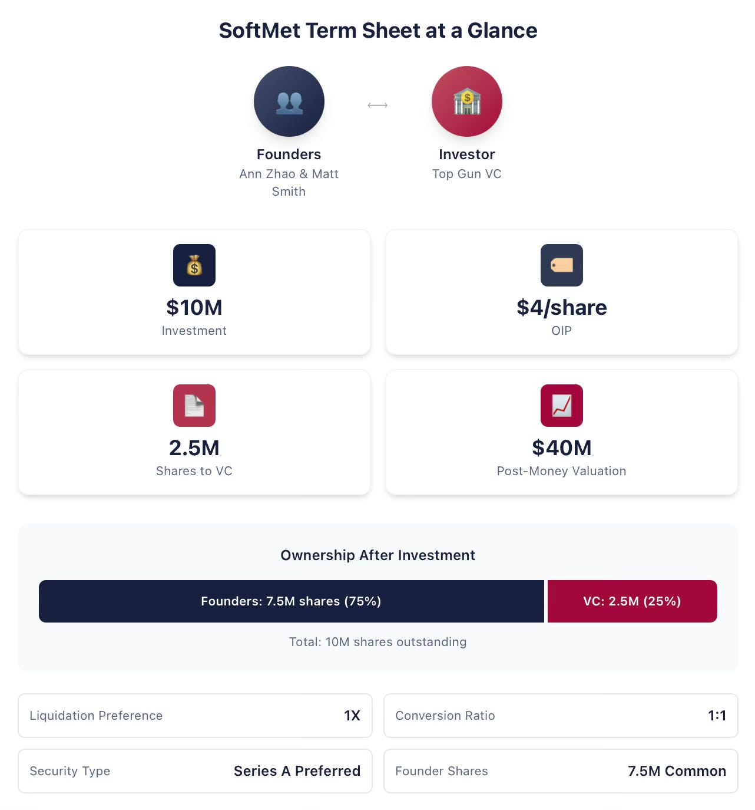
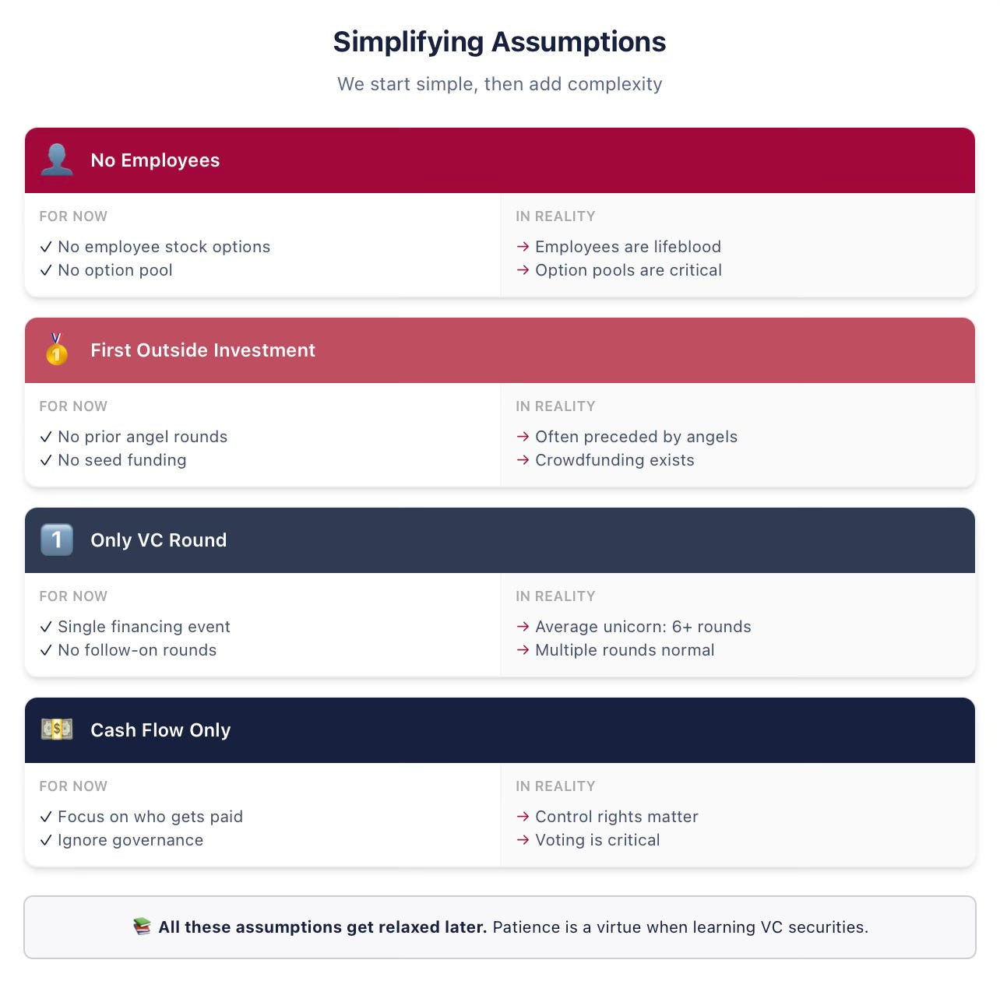
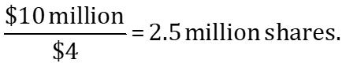
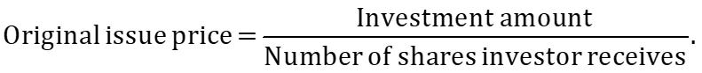
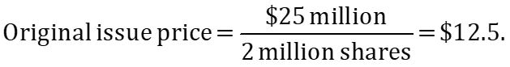
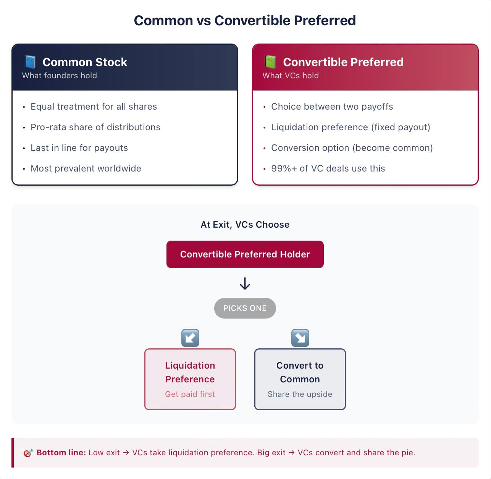
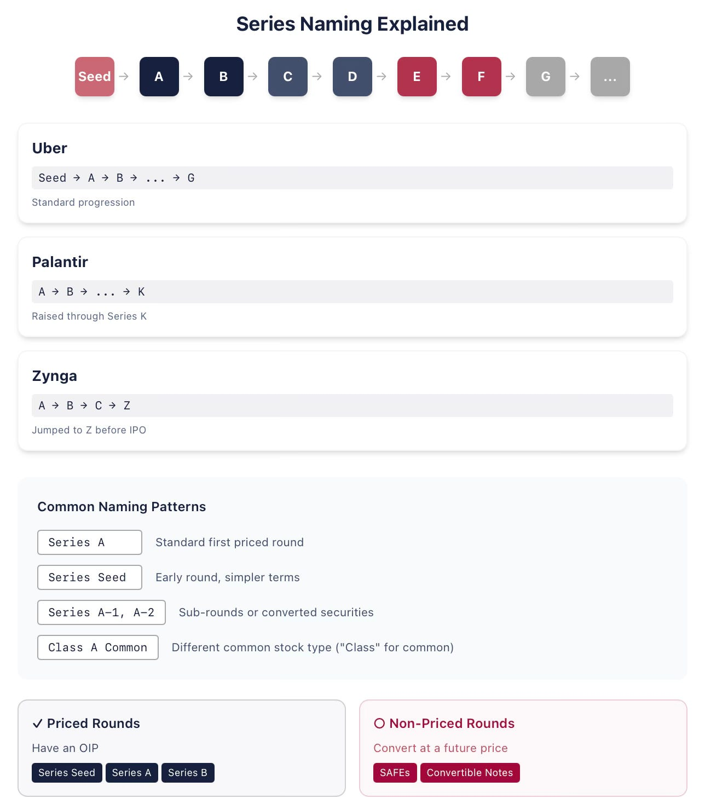

# 4/20. Введение: бумаги и первая сделка

*Опубликовано 2026-03-03. Источник: https://ilyastrebulaev.substack.com/p/venture-capital-101-introduction*

**Коротко:** открываю конспекты стэнфордского курса по венчурному капиталу (venture capital) для всех. В этом тексте разберём, как работают условия по денежным потокам, как ликвидационная преференция (liquidation preference) влияет на то, сколько вы получите, и как конвертируемые привилегированные акции (convertible preferred stock) дают инвестору преимущество — база, которую стоит знать фаундеру (founder) стартапа.

> **Приветствие и зачем я это пишу**

Я много лет преподаю курс по венчурному капиталу в Stanford Graduate School of Business. За это время курс прошли больше 1 300 студентов, около 500 потом основали стартапы, около 600 пошли работать инвесторами в венчур и шире — в частный капитал (private equity). Я остаюсь на связи со многими студентами и часто получаю письма или сообщения: они поднимают раунд или торгуют термшит (term sheet) и снова «достали конспекты и слайды с вашего курса, профессор».

Я всегда хотел делиться знаниями и опытом широко — тем более что мир венчура и стартапов так часто закрыт и его плохо понимают. Поэтому я почти каждый день выкладывал результаты своих исследований венчура в LinkedIn. Но чтобы разобрать сложный курс, где идеи опираются друг на друга, нужен другой формат. Вот я и здесь.

После каждого текста вы будете гораздо лучше понимать, как инвесторы принимают решения, как предприниматели и инвесторы договариваются о разделе денежных потоков и корпоративном управлении (corporate governance) и о множестве других вещей, которыми каждый день пользуются в мире стартапов.

**Опубликованные тексты:**

1. [Венчурный капитал 101. Чего на самом деле хотят фаундеры и инвесторы? Часть 1](https://ilyastrebulaev.substack.com/publish/posts/detail/189233942)
2. [Венчурный капитал 101. Агентские проблемы: что не даёт спать инвесторам и фаундерам](https://ilyastrebulaev.substack.com/publish/posts/detail/189391676)
3. [Венчурный капитал 101. Термшит: проход по документу](https://ilyastrebulaev.substack.com/publish/posts/detail/189393057)
4. [Венчурный капитал 101. Ликвидационная преференция конвертируемых привилегированных акций](https://ilyastrebulaev.substack.com/publish/posts/detail/189233977)
5. [Венчурный капитал 101. Опциональная конвертация конвертируемых привилегированных акций](https://ilyastrebulaev.substack.com/publish/posts/detail/192550486)
6. [Венчурный капитал 101. Таблица капитализации и оценка post-money](https://ilyastrebulaev.substack.com/publish/posts/detail/193729186)
7. [Венчурный капитал 101. Участие в конвертируемых привилегированных акциях](https://ilyastrebulaev.substack.com/publish/posts/detail/194411064)
8. [Венчурный капитал 101. Дивиденды в венчурном финансировании](https://ilyastrebulaev.substack.com/publish/posts/detail/195776846)
9. [Шпаргалка по Series A: кто выигрывает, когда ужесточается каждый пункт](https://ilyastrebulaev.substack.com/p/the-series-a-cheat-sheet-who-wins)

> **Условный пример**

По темам денежных потоков я буду пользоваться одним условным примером и буду его менять и расширять, когда добавятся новые вещи. Ann Zhao и Matt Smith — сооснователи SoftMet, технологического стартапа. В ходе фандрайзинга они познакомились с Rob Arnott, партнёром венчурной фирмы Top Gun. Rob затем пригласил Ann и Matt рассказать идею стартапа всему партнёрству Top Gun. Через неделю фаундеры получили термшит от Top Gun. Термшит предлагает следующее:

- Top Gun инвестирует $10 млн в SoftMet.

- Top Gun получает привилегированные акции SoftMet серии A (Series A Preferred stock), которые выпускают по цене первоначального выпуска (original issue price) $4.

- У привилегированных акций серии A ликвидационная преференция 1X.

- Одна привилегированная акция серии A может конвертироваться в одну обыкновенную акцию SoftMet.

- У привилегированных акций серии A есть разные дополнительные условия.

- Фаундерам принадлежат 7,5 млн обыкновенных акций.

- Оценка компании после денег (post-money valuation) — $40 млн.

Ann и Matt нужно понять, что означает этот термшит. Что такое привилегированные акции серии A? Что такое оценка после денег? Что такое ликвидационная преференция? Что такое конвертация (conversion)? На какие пункты этого предложения им особенно стоит смотреть? Какие из условий могут сильно ударить по деньгам и их стоит передоговорить? Какие формулировки дружелюбнее к фаундеру?

> **Чтобы ввести все понятия, нужны упрощения**

Чтобы было ясно, начнём с упрощений. Все временные допущения мы снимем в следующих конспектах — не уходите. И не закрывайте текст потому, что вам кажется: этот профессор из башни из слоновой кости не знает, что фаундеры не «владеют акциями», а «вестируют» (vest), и так далее. Я знаю. Мы ко всему этому вернёмся, когда придёт время.

Полезно сразу сказать, что я буду предполагать в первой серии конспектов про первый венчурный раунд (если термины ниже незнакомы — именно поэтому мы пока упрощаем):

- **Допущение: SoftMet никого не нанимает.** Значит, SoftMet не нужно платить сотрудникам деньгами или акциями. И фаундеров мы пока рассматриваем только как собственников, не как сотрудников. Про вестинг и трудовые условия фаундеров я расскажу позже.
- **Допущение: Top Gun — первый внешний инвестор SoftMet.** На практике большинству венчурных раундов предшествует ангельское или сид-финансирование с другими бумагами.

- **Допущение: этот раунд — единственная инвестиция, которую SoftMet когда-либо поднимет как частная компания с венчурными инвесторами.** На практике, по моим исследованиям, средний единорог (unicorn) в США поднимает больше шести венчурных раундов. Это допущение мы снимем довольно скоро.

- **Допущение: важны только условия по денежным потокам.** В термшите также есть корпоративное управление — права контроля, голосование, места в совете директоров, — но этим мы займёмся позже.

  

> **Инвесторы получают финансовые бумаги взамен на свои деньги**

Инвестиция Top Gun в $10 млн — это **венчурный раунд** (venture round): деньги в обмен на бумаги (securities). Сумма $10 млн, которую Top Gun предлагает вложить, называется **суммой инвестиции** (investment amount).

Взамен Top Gun получит бумаги, которые дают частичную собственность на SoftMet. Конкретно: в рамках раунда выпустят некоторое число акций новой бумаги — привилегированных акций серии A — и отдадут их Top Gun. Но сколько акций получит Top Gun? Как разделится собственность после инвестиции? И как любые будущие поступления разделят между фаундерами и венчурными инвесторами?

Термшит даёт зацепки: он говорит, кто что получает в разных сценариях. Число акций, которое получает Top Gun, задаётся суммой инвестиции и ценой первоначального выпуска привилегированных акций серии A. **Цена первоначального выпуска** (original issue price) — цена одной акции, которую инвестор платит в момент выпуска. Обычно её сокращают как **OIP**. Её также называют **ценой первоначальной покупки** (original purchase price, **OPP**).

> **ОСТОРОЖНО**
>
> **OIP и номинал**
>
> Цену первоначального выпуска (OIP) не нужно путать с номиналом. **Номинал** (par value) акции — стоимость акции, записанная в уставе компании (corporate charter). Номинал выбирают произвольно в момент регистрации и он почти не связан с реальной оценкой компании. Практического экономического смысла у него нет. Типичные номиналы — $0.001 или $0.0001. Бывает и «без номинала» (no par).

Через OIP можно узнать, сколько акций получает Top Gun. Сумма инвестиции — $10 млн, OIP — $4. Top Gun получает частное этих двух чисел:

Итак, Top Gun получает 2,5 млн привилегированных акций серии A взамен на денежную инвестицию $10 млн в SoftMet. В общем виде связь между OIP, суммой инвестиции и числом акций, которое инвестор получает в этом раунде, такая:

Если вы знаете две из трёх величин в этом уравнении, третью можно найти. Реальные термшиты довольно по-разному описывают предлагаемую инвестицию, но из того, что дано, всегда можно восстановить все три величины. В термшите SoftMet даны сумма инвестиции и OIP. В других термшитах могут дать сумму инвестиции и число акций, которые получают инвесторы.

**Пример 1. Цена первоначального выпуска**
**Задача**

Венчурный фонд Great Innovation Partners инвестировал в раннюю компанию Fox Solutions, Inc. За сумму инвестиции $25 млн фонд получил 2 млн привилегированных акций серии Seed (Series Seed Preferred stock). Какова цена первоначального выпуска этой бумаги?

**Решение**

Цена первоначального выпуска равна

Иначе говоря, Great Innovation заплатил $12.5 за каждую привилегированную акцию серии Seed.

> **Фаундеры обычно владеют обыкновенными акциями**

Фаундеры ранних компаний обычно владеют **обыкновенными акциями** (common stock) — самым распространённым типом собственности в публичных и частных компаниях по всему миру.[^1] **Акция** (stock) — форма корпоративной собственности, которая даёт владельцам (акционерам, stockholders) определённые права. Иначе говоря, у акционеров есть требование к компании. **Капитал** (equity) — другое слово, которым часто называют это требование; здесь мы будем пользоваться «акциями» и «капиталом» как синонимами. Слова «акции» или «капитал» также отличают эти бумаги от другого частого типа корпоративного требования — долга (debt).[^2]

Приставка «обыкновенные» в «обыкновенных акциях» или «обыкновенном капитале» (common equity) по-настоящему начинает что-то значить, если та же компания выпустила бумаги другого типа. Если обыкновенные акции — единственная бумага компании, каждая акция равна любой другой: в обращении только один тип требования. В более общем случае каждая обыкновенная акция равна любой другой обыкновенной.

Когда есть выплата, одна обыкновенная акция даёт ровно тот же платёж, что и любая другая обыкновенная. Выплату делят поровну между всеми обыкновенными акциями в обращении. Но если у других владельцев бумага другого типа, делёж может быть совсем другим. В венчурных сделках так бывает почти всегда.

> **Инвесторы владеют конвертируемыми привилегированными акциями**

Привилегированные акции серии A, которые получает Top Gun, — пример конвертируемых привилегированных акций. Это бумага выбора для большинства венчурных инвесторов в США. В ней есть черты и долга, и обыкновенного капитала. К несчастью для начинающих предпринимателей и инвесторов в стартапы, устройство этой бумаги сложное — особенно рядом с простым долгом (straight debt) и обыкновенными акциями, привычными финансовыми бумагами. К счастью, мы сейчас вместе в ней разберёмся.

В ядре **конвертируемые привилегированные акции** — финансовая бумага, которая даёт владельцу право выбрать один из двух вариантов выплаты. Владелец может конвертировать конвертируемые привилегированные акции в другую бумагу, обычно в обыкновенный капитал (это называют *опциональной конвертацией*, optional conversion feature). Или владелец может получить паушальную выплату раньше, чем что-либо получат держатели обыкновенных акций (это называют *ликвидационной преференцией*, liquidation preference feature). У этого права обычно много оговорок, и оно зависит от многих дополнительных пунктов контракта, которые мы разберём. Но ядро такое: бумага даёт инвестору выбор между конвертацией и ликвидационной преференцией.

Очень важно заметить — особенно тем, кто знаком с фондовым рынком и инвестбанком, — что на обычных финансовых рынках компании тоже время от времени выпускают бумаги, которые называют привилегированными акциями (preferred stock). На поверхности они похожи, но бумаги в венчурных сделках отличаются сразу по нескольким свойствам. Если вы знаете привилегированные акции с публичного рынка — это другое. Не пропускайте этот кусок.

**Пример 2. Привилегированные акции публичной компании**

В 2018 году MetLife, крупная публичная страховая компания, выпустила новую серию привилегированных акций, MET-E, предложив рынку 28 млн акций. Такие привилегированные акции работают похоже на долговую бумагу: инвесторам гарантирован фиксированный дивиденд бессрочно. MET-E даёт купон 5,63%, но не даёт права голоса (в отличие от обыкновенных акций). Держатели привилегированных акций имеют приоритет по доходу компании и получают дивиденды раньше обыкновенных акционеров (но после держателей долга). Привилегированные акции вроде MET-E обычно не имеют функции конвертации.

В венчурных контрактах эту бумагу обычно называют просто Preferred stock, но когда вы видите Preferred stock в венчурном контракте или термшите, можно спокойно считать, что она ещё и конвертируемая. В моём разборе тысяч венчурных контрактов больше 99% «Preferred stock» на самом деле конвертируемые.

Контракты часто опускают слово «Convertible» в названии бумаги, но обычно добавляют другое. Например, бумагу могут назвать *Series A* Preferred stock — как в предложении Top Gun.

**Пример 3. Буквы в сериях**

Компания заказа поездок Uber, пока была частной компанией с венчурными инвесторами, выпускала Series Seed, Series A, Series B и так далее до Series G Preferred stock. Компания аналитики больших данных Palantir в раунде 2015 года выпустила Series K Preferred stock (до этого были Series A до Series J). Космической компании SpaceX букв алфавита на серии привилегированных акций может не хватить ещё до выхода на биржу (я пишу это в январе 2026 года). Иногда компании выпускают бумаги не по алфавиту — например, при реорганизации. Онлайн-игровая компания Zynga выпустила Series A, Series B и Series C Preferred stock, а затем прыгнула к Series Z Preferred stock перед первичным размещением.

Исторически Series A Preferred stock называли бумагу первого венчурного раунда. Примерно последние пятнадцать лет первую бумагу часто называют и Series Seed Preferred Stock (как у Uber). Это часто сигнал, что устройство бумаги проще, чем у полноценных привилегированных акций серии A. Фаундеры и инвесторы также могут хотеть показать, что компания совсем ранняя. Когда компания поднимает следующий раунд, она обычно уже выпускает Series A Preferred stock. Вывод: не считайте, что «Series A» обязательно значит первый венчурный раунд.

Что тогда считать первым венчурным раундом? Лучший вопрос — является ли раунд **раундом с ценой** (priced round), то есть есть ли у бумаги OIP. Если компания выпускает SAFE или конвертируемый займ (convertible note), это не раунд с ценой; Series Seed Preferred stock — раунд с ценой. (Осторожно: обычно говорят, что раунды без цены не ставят компании никакой оценки. Это неверно; разберём в своё время.)

Юристы, которые советуют венчурным инвесторам и стартапам, довольно изобретательны в названиях, поэтому вариантов много. Иногда тонкая разница в имени означает конкретную договорённость. Например, за любой серией могут идти или рядом с ней стоять дополнительные нумерованные серии (за Series A могут следовать Series A-1, A-2 и так далее). Если это часть того же раунда, такие акции Series A-1 обычно чуть отличаются по отдельным пунктам и в остальном совпадают с Series A — часто потому, что в них конвертировали какие-то уже выпущенные бумаги почти в Series A. Либо это часть совсем другого раунда: например, компания ещё не считает, что дошла до вех, которых рынок ждёт от компаний серии B в этой отрасли.

Конвертируемые привилегированные акции — безусловно самый частый финансовый контракт, которым венчурные инвесторы пользуются в финансировании ранних стартапов в США. В выборке больше 1 500 инвестиционных раундов больше чем 500 американских компаний с венчурными инвесторами с 1995 по 2025 год почти каждое долевое финансирование включало конвертируемые привилегированные акции или один из множества их вариантов.[^4] Если посмотреть на самые дорогие компании с венчурными инвесторами — единорогов — каждый из них хотя бы раз пользовался этим типом бумаги, а большинство — почти во всех своих раундах.[^5] Это не новое явление. В выборке около 200 раундов более раннего периода 1990-х около 95% включали конвертируемые привилегированные акции, иногда вместе с другими бумагами.[^6]

Почему такая странная конструкция? Это глубокий вопрос — и мы разберём его в одном из следующих текстов. Пока сосредоточимся на том, что это значит для выплат.

**Главное**

1. Связь между ценой первоначального выпуска (OIP), суммой инвестиции и числом акций, которое получает инвестор, задаёт долю инвестора.

2. Два самых частых типа бумаг, которые выпускают ранние компании, — обыкновенные акции и конвертируемые привилегированные акции.

3. Владельцы конвертируемых привилегированных акций получают выплату через конвертацию и/или ликвидационную преференцию.

4. Если дана цена бумаги или оценка после денег — это раунд с ценой (priced round).

Дальше: 5/20. Чего хотят фаундеры и инвесторы
