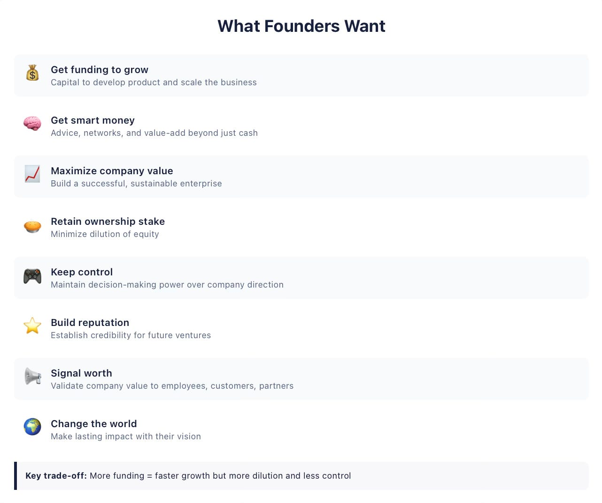
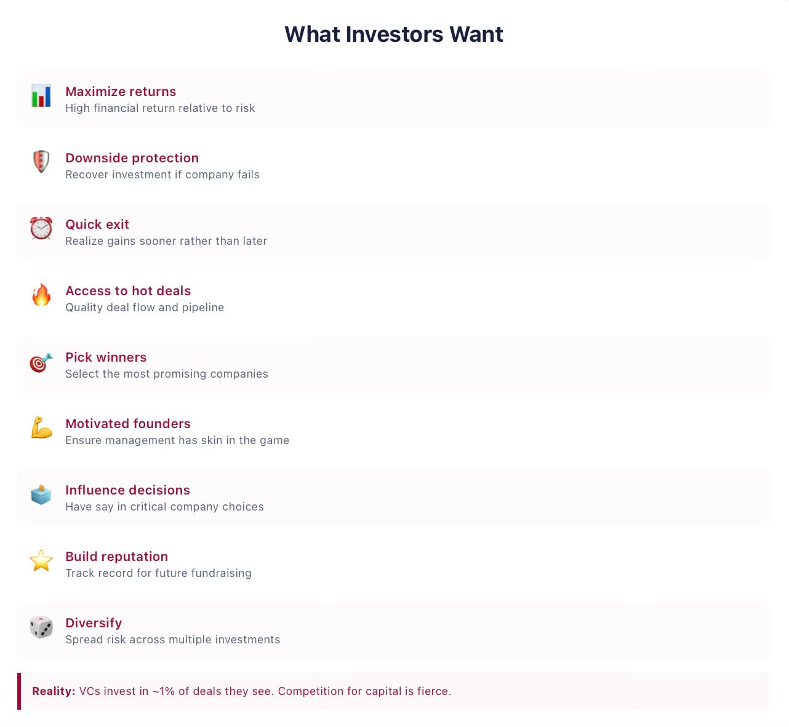

# 5/20. Чего хотят фаундеры и инвесторы

*Published 2026-03-07. Source: https://ilyastrebulaev.substack.com/p/venture-capital-101-what-founders*

В 2004 году Eduardo Saverin подписал акционерное соглашение (shareholder agreement), которое давало ему 3 млн акций Facebook. Через два месяца Mark Zuckerberg выпустил 9 млн новых акций — и мгновенно разводнил (dilution) долю Saverin с 24% до меньше чем 10%. Saverin отдал свои права голоса (voting rights) и интеллектуальную собственность (intellectual property). Он не до конца понял, что контракт разрешал.

Эта серия существует, потому что такая история не редкость. Контракты решают, как делят будущую добычу, как принимают критические решения в компании и кто их принимает, какие защиты и переговорную силу стороны имеют в разных будущих сценариях. Язык контракта выглядит пугающе. Не должен — и понимать его слишком важно, чтобы оставлять это только юристам.

#### **Разве юристов недостаточно?**

Часто фаундеры (founders) думают, что им нужно сосредоточиться на отличном продукте, а договорные условия оставить юристам. Или смотрят только на заголовочные цифры — предложенную «оценку» (valuation) и сумму инвестиции (investment amount). Это ошибка. Конечно, фаундерам стоит нанять лучших юристов, которые знают венчурные контракты вдоль и поперёк. Но единого приемлемого стандартного венчурного контракта нет — каждый уникален, и в выборке тысяч контрактов, которые я изучал, они отличались друг от друга по делу. Фаундеры и инвесторы должны понимать, чего они хотят и как это может отразиться в контрактах. В конце концов, именно у них правильные стимулы. Стимулы двигают поведение.

#### **Мотивирующий пример**

Anna Zhao и Matt Smith — сооснователи SoftMet, технологического стартапа. Сначала они бутстрапили (bootstrapping) на свои ресурсы, потом несколько месяцев встречались с инвесторами. Rob Arnott, партнёр венчурной фирмы Top Gun, встречался с ними несколько раз, затем пригласил рассказать идею всему партнёрству. Через несколько дней Arnott позвонил с хорошей новостью: Top Gun хочет инвестировать. Он прислал Anna и Matt предложенный термшит (term sheet) серии A.

Anna и Matt были в восторге, но от друзей знали: термшит — только начало. Им нужно понять, что он на самом деле значит. Он дружелюбен к фаундеру? На какие пункты смотреть? SoftMet будет нашим опорным примером на всю серию.

#### **Интересы фаундеров**

Когда я разговариваю с фаундерами, они часто сразу задают очень конкретные вопросы по отдельным строкам термшита. Насколько уменьшение опционного пула (option pool) на 3% улучшит их долю? Что будет, если поднять кэп (cap) конвертируемого займа (convertible note) с $5 млн до $8 млн? Эти вопросы важны, но опасность сразу лезть в детали в том, что вы не видите леса. Понимание большой картины даёт лучшую стратегию переговоров: вы будете знать, чего хотите вы и другие и чего бояться.

**Бесплатного обеда нет.** Взять чужие деньги значит что-то отдать взамен.

> **Получить финансирование**

Большинство фаундеров не могут сами профинансировать рост, поэтому перед ними главный обмен: поднять деньги и разводниться (dilute) — или бутстрапить и рисковать, что вас обгонят. Даже Elon Musk, уже богатый после PayPal, нуждался во внешних деньгах для SpaceX. Решение очень личное, но понимание того, что инвесторы предлагают и чего требуют, помогает фаундеру выбрать правильно.

> **Получить умные деньги**

Есть «деньги» — и есть «**умные деньги**» (smart money). Фаундеры обычно сильны в узком наборе дел — продукт, инженерия, — но не в найме топ-менеджеров, переговорах с поставщиками или увольнениях. Умные инвесторы дают не только кэш. Они помогают нанять старших руководителей, привлечь членов совета директоров, дают стратегические советы, открывают связи в отрасли и помогают найти первого или самого большого клиента. Вместе это может дать критический край в конкурентной среде.

> **Максимизировать стоимость, сохранив долю и контроль**

Фаундеры хотят привлечь финансирование так, чтобы максимизировать стоимость компании, шанс выжить и долгосрочный успех. Но стоимость стартапа почти целиком про будущий потенциал — заводов на продажу нет. Если Anna и Matt уйдут из SoftMet, компания стоит ноль.

Взяв внешние деньги, фаундеры **разводняют** свою долю. При слишком сильном разводнении сладкий нектар успеха может на вкус оказаться разбавленным пуншем. Поднять слишком мало — и понадобится аварийное финансирование на плохих условиях. Поднять слишком много — и вы отдадите компанию. Первый раунд задаёт траекторию.

Внешнее финансирование также значит отказ от исключительного права принимать решения. Если Top Gun инвестирует, Rob Arnott войдёт в совет SoftMet и будет иметь голос по всем важным сторонам жизни компании. Даже с миноритарной долей венчурные инвесторы имеют огромное влияние — включая право уволить CEO.

Это может звучать неожиданно, но **на ранних стадиях развития компании контроль часто важнее, чем раздел будущих денежных потоков.** Почему? Потому что стоимость и все выгоды лежат в будущем, и путь туда непростой. Особенно в быстрорастущих стартапах финансирование — это решительно не только деньги, но и контроль.

> **Построить репутацию и послать сигнал о ценности**

Мир инвесторов тесный, информация ходит свободно. Один раз поведите себя плохо — и слово разлетается быстро: поднять деньги снова станет гораздо труднее. Раунд также сигналит ценность сотрудникам, клиентам и будущим инвесторам. И, как некоторые говорят, деньги от топ-венчурного инвестора — самый простой способ получить право хвастаться в баре Кремниевой долины.

> **Изменить мир**

Далеко не последняя цель многих фаундеров — оставить большой и долгий след. Но чтобы построить устойчивую быстрорастущую компанию, всё равно нужно аккуратно думать, как привлечь внешние деньги. Если вы фаундер: потратьте время и поймите, что из этого списка для вас критично. Если есть сооснователи, услышать цели друг друга помогает снять различия заранее.

#### **Интересы инвесторов**

Фаундеры, которые ищут внешние деньги, должны ясно понимать, что движет инвесторами. Длительность отношений инвестора и фаундера в стартапах того же порядка, что длительность браков во многих западных обществах. Разве вы не захотели бы много узнать о партнёре, прежде чем вступать в долгие отношения?

> **Максимизировать доходность, минимизировать просадку**

Инвесторы хотят получить прибыль и компенсацию за риск, который берут. Фаундеры конкурируют с любым другим применением капитала инвестора — публичными рынками, недвижимостью, другими стартапами. Венчурные деньги должны бить эти альтернативы.

В инвестициях в стартапы риск просадки (downside) играет огромную роль, потому что у ранних компаний высокая вероятность провала. Инвесторам важно не только снять сливки с компаний, которые получились, но и вернуть как можно больше с тех, которые не получились. Договорные условия, которые мы разберём в этой серии, — главный механизм такой защиты.

> **Получать доступ к лучшим сделкам и выбирать их**

Большой и качественный **поток сделок** (deal pipeline) критичен. Многие венчурные инвесторы говорят, что в среднем инвестируют только в одну компанию на каждые 100 потенциальных сделок, которые смотрят. Одно это должно отрезвлять фаундера: за внимание инвесторов жёсткая конкуренция. Когда спрос на сделку превышает предложение капитала, это называют «**горячей сделкой**» (hot deal). Исследования ясно показывают: качество потока сделок немало определяет успех инвестора.

> **Обеспечить правильную мотивацию и влиять на решения**

Человеческий капитал фаундеров и сотрудников часто решает, получится стартап или нет. Инвесторы хотят фаундеров с кожей в игре (skin in the game) — большая доля в капитале мотивирует работать жёстче. Как устроены стимулы, так же важно, как и насколько они велики.

Инвестор, который вложил пять миллионов долларов в молодую технологическую компанию, вряд ли одобрит, если эти пять миллионов потратят на парк корпоративных Ferrari. Инвесторы стараются получить права **условного контроля** (contingent control) — права, которые можно использовать в зависимости от того, как дела у компании, или от характера решения.

> **Строить репутацию и диверсифицироваться**

У венчурных фирм, которые судятся с фаундерами, ниже шанс получить доступ к будущим сделкам. Молодые венчурные инвесторы получают до половины всего дохода за жизнь с будущих фондов, которые ещё поднимут, — репутация это деньги. Инвесторов с лучшей репутацией чаще зовут в синдикаты (syndicates).

Умные инвесторы раскладывают риски по многим компаниям. Фаундеры, напротив, вынуждены класть все яйца в одну корзину. У этой асимметрии важные следствия для того, как разворачиваются конфликты, — это мы увидим в части 2.

Дальше: 6/20. Агентские проблемы
