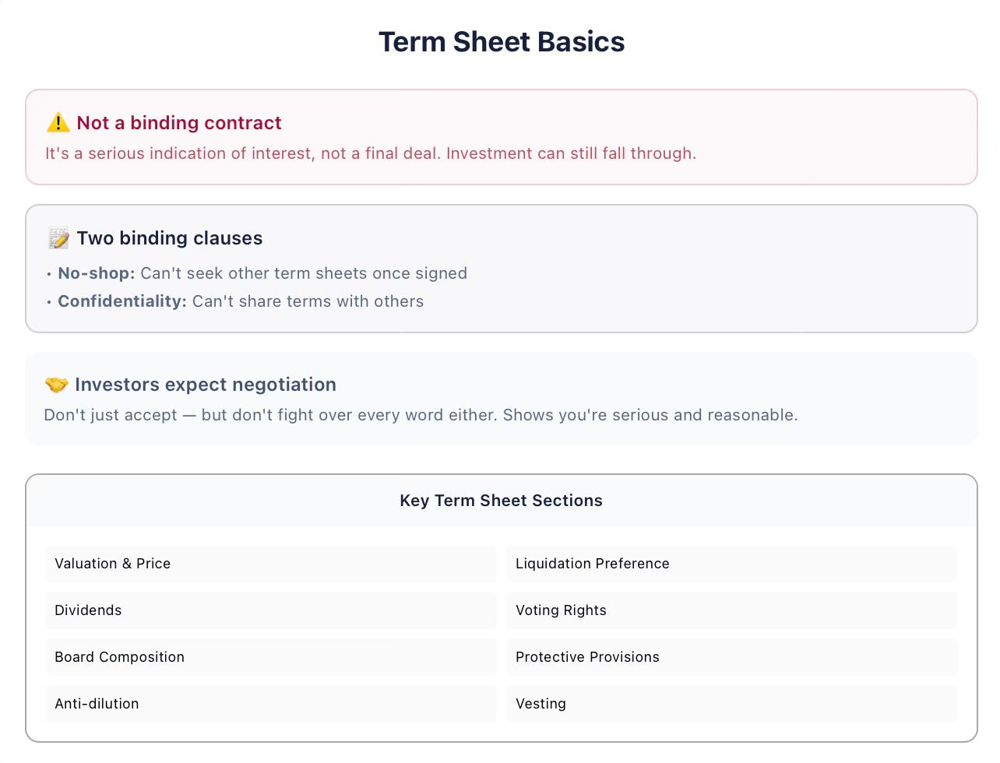
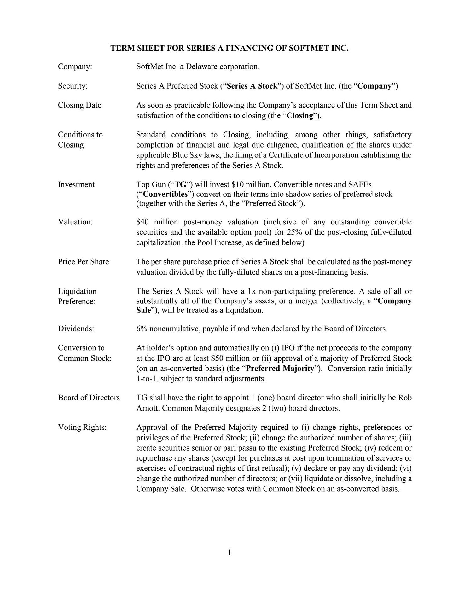
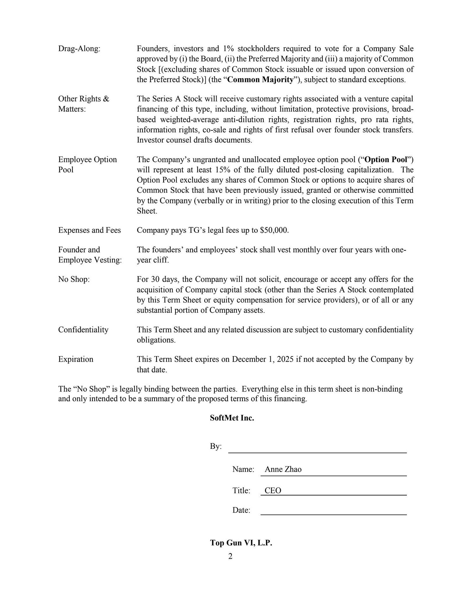
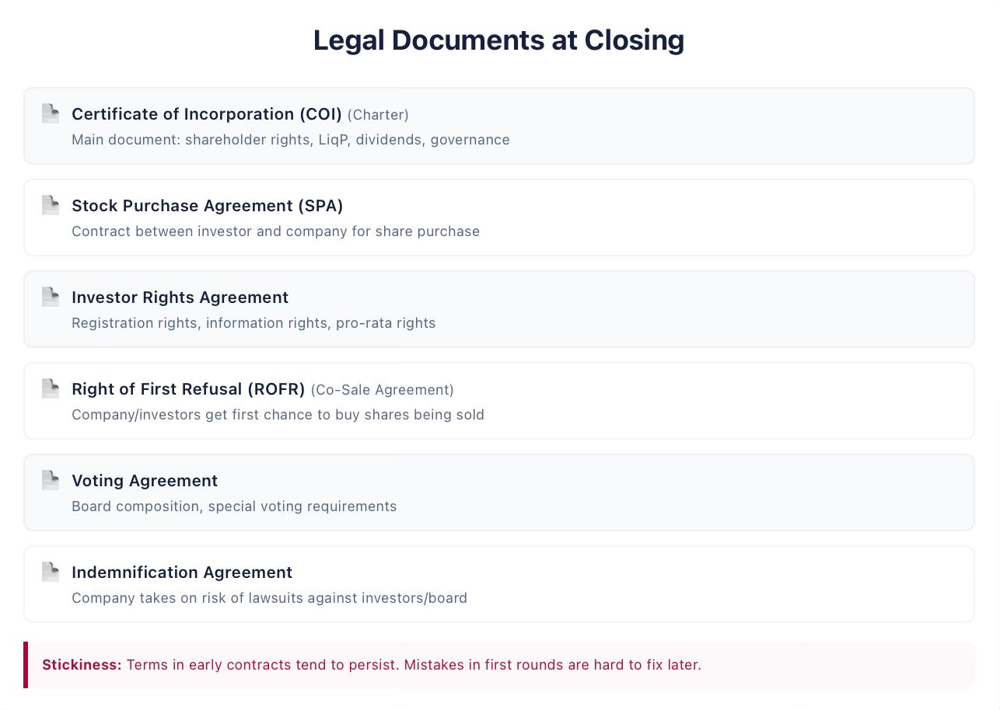

# 7/20. Термшит

## Venture Capital 101. Термшит: разбор

*Опубликовано 2026-03-21. Источник: https://ilyastrebulaev.substack.com/p/vc-101-the-term-sheet-a-walkthrough*

**Термшит** (term sheet) — это краткое изложение договорных условий, которые инвестор предлагает компании и её фаундерам (founders), часто всего на пару страниц. Получить первый термшит — важная веха в жизни каждого фаундера. Вот несколько важных пунктов:

> **Термшит — не обязывающий юридический документ**

Стоит повторить: термшит *не* обязывающий юридический документ. Даже если фаундеры и инвесторы его подпишут, это не значит, что инвестиция завершена. Термшит — серьёзный знак интереса: он значит, что инвесторы готовы тратить время и силы на то, чтобы довести сделку до конца.

Есть два исключения. **Пункт о запрете поиска других предложений** (no shopping clause) значит: как только фаундеры подписали, они соглашаются не искать термшиты у других инвесторов, пока подписанный термшит не истечёт. **Пункт о конфиденциальности** (confidentiality clause) значит: стороны соглашаются не разглашать информацию, содержащуюся в термшите. Пытаться получить конкурирующие термшиты *до* того, как вы подписали, — нормально; и если удастся получить два или больше, ваша переговорная сила растёт.

> **Инвесторы ждут, что вы будете торговаться**

Термшит — это чертёж. Инвесторы полностью ждут, что фаундеры будут согласовывать его положения. Но два типа фаундеров беспокоят инвесторов.

Первый взволнован и сразу говорит: «О, это круто, мы готовы подписать.» Как сказал мне один известный венчурный инвестор (VC): «Это может звучать здорово, но это не так. Если фаундеры не готовы торговаться со мной, хватит ли у них сил торговаться с первыми клиентами?»

Второй тип спорит из-за каждого слова. «Если вы неразумны на переговорах, будете ли вы разумны следующие пять лет, работая над компанией?» Многие положения — стандартная юридическая «вода» (boilerplate). Потеть над ними выдаёт незнание.

> **Практические советы**

- **Вы отвечаете за то, чтобы понять договорные условия.** Юристы и советники важны, но у них не те же стимулы, что у вас. В конце концов затронуты ваша компания и ваша жизнь.
- **Первые договоры особенно критичны.** Договоры склонны быть **липкими** (sticky) — условия переходят из раунда в раунд. Новый инвестор может резонно сказать: «Предыдущий инвестор это получил, значит и мне положено.» Как только контроль потерян, он, скорее всего, потерян навсегда. Если фаундеры после первого венчурного раунда в меньшинстве в совете директоров, позже большинство они вряд ли вернут.
- **Про каждый пункт задайте два вопроса.** Первый: в каких сценариях этот пункт заработает? Многие пункты, которые кажутся страшными, зависят от конкретных будущих событий, которые могут быть не очень вероятны. Второй: как этот пункт затронет разные стороны — фаундеров, инвесторов, сотрудников — с точки зрения денежных потоков, контроля и вероятности выживания компании?

**Пример: разбираем термшит SoftMet**

В термшите SoftMet указаны название компании, бумага (привилегированные акции Series A, Series A Preferred Stock), инвестор (Top Gun), сумма привлечения (10 миллионов долларов), оценка после денег (post-money valuation, 40 миллионов долларов) и цена за акцию. Вот ключевые положения и что они значат.

> **Дивиденды (dividends)**

Стоят на 6%, но некумулятивные (non-cumulative) и выплачиваются, только если совет директоров их объявит. Перевод: дивиденды почти наверняка никогда не выплатят. Как увидим в более поздней записи, некумулятивные дивиденды — декорация на витрине.

> **Ликвидационная преференция (liquidation preference)**

Самый важный пункт про денежные потоки. Он устанавливает старшинство инвестора: в событии ликвидации инвесторам платят первым. Если компания идёт плохо, инвесторы могут получить весь выплачиваемый результат, а фаундеры — ничего. Это подробно разбираем в следующей записи.

> **Опциональная конвертация (optional conversion)**

Привилегированные акционеры могут в любой момент конвертироваться в обыкновенные акции. На выходе это создаёт развилку: сохранить ликвидационную преференцию или отказаться от неё ради шанса на больший потенциал роста через конвертацию. Значение выхода, при котором инвестору всё равно, — **точка конвертации** (conversion point); это понятие разберём глубже.

> **Защитные положения (protective provisions)**

Семь положений, которые требуют одобрения большинства привилегированных акционеров, прежде чем компания сможет совершить определённые действия. Они защищают инвесторов, но также служат хорошему корпоративному управлению. Они ничего не запрещают напрямую — они дают инвесторам право вето.

> **Антиразмытие (anti-dilution)**

Даёт инвесторам право скорректировать цену конвертации, если компания привлекает **даун-раунд** (down round) — раунд по более низкой цене акции. По сути привилегированные акционеры в итоге владеют большим числом обыкновенных акций за счёт фаундеров и сотрудников.

> **Автоматическая конвертация (automatic conversion)**

Привилегированные акции принудительно конвертируются в обыкновенные при определённых условиях. Для SoftMet: если компания выходит на биржу с чистой выручкой не меньше 50 миллионов долларов (**квалифицированное публичное размещение** (qualified public offering)) или если большинство держателей привилегированных акций голосует за конвертацию.

> **Права на совет директоров (board rights)**

Top Gun изберёт одного директора. Состав совета — сколько мест контролируют фаундеры, а сколько инвесторы — одно из самых весомых положений в термшите.

> **Вестинг (vesting)**

Стандартный четырёхлетний вестинг с годовым клиффом (cliff): 25% вестятся через год, затем ежемесячно в течение 36 месяцев. Это относится и к сотрудникам, и к акциям фаундера.

> **Прочие положения**

В термшите есть права принудительного присоединения (drag-along rights: миноритарные акционеры не могут заблокировать продажу), права продажи (sale rights), пункт о запрете поиска других предложений, конфиденциальность и дата истечения. Некоторые термшиты гораздо короче, чем у SoftMet, — но отсутствующие пункты всё равно появятся в финальных юридических договорах. Будьте настороже не только из-за пунктов, которые есть, но и из-за важных пунктов, которых *нет*.

> **Пакет юридических документов**

Когда термшит подписан и дью-дилидженс (due diligence) завершён, юристы готовят документы закрытия. Главные из них:

- **Сертификат о регистрации (Certificate of Incorporation, COI)** — главный документ, который регулирует отношения между акционерами. Задаёт права на денежные потоки (ликвидационная преференция, дивиденды), защитные положения и корпоративное управление.
- **Соглашение о покупке акций (Stock Purchase Agreement, SPA)** — юридический документ между инвестором и компанией. В основном стандартная «вода»; смотрите туда, где он отклоняется.
- **Соглашение о правах инвестора (Investor Rights Agreement)** — перечисляет права инвестора: права регистрации (registration rights), информационные права и критически важные **права pro rata** (pro rata rights) — право участвовать пропорционально в будущих раундах.
- **Соглашение о праве первого отказа / совместной продаже (Right of First Refusal / Co-Sale Agreement)** — даёт компании и инвесторам приоритет в покупке акций, если фаундеры или сотрудники продают.
- **Соглашение о голосовании (Voting Agreement)** — предписывает состав совета и правила голосования.
- **Соглашение об индемнизации (Indemnification Agreement)** — компания соглашается взять на себя риск за инвесторов и членов совета от убытков, которые могут возникнуть из исков. Это снижает личную ответственность тех, кто сидит в совете.

На этом этапе по-настоящему важен знающий юрист, чтобы в финальные договоры не проскользнули необычные условия. Когда все документы подписаны, инвестиция завершена и компания получает деньги.

*Дальше в этой серии: погружаемся в конкретные пункты про денежные потоки, начиная с самого важного — ликвидационной преференции.*

Дальше: 8/20. Ликвидационная преференция
