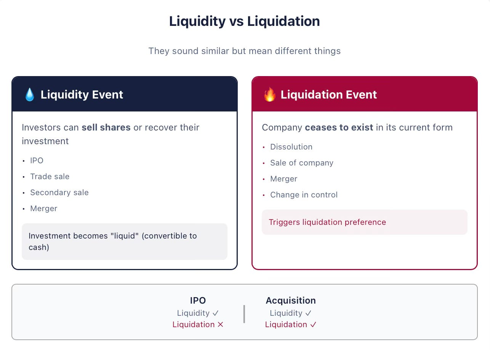
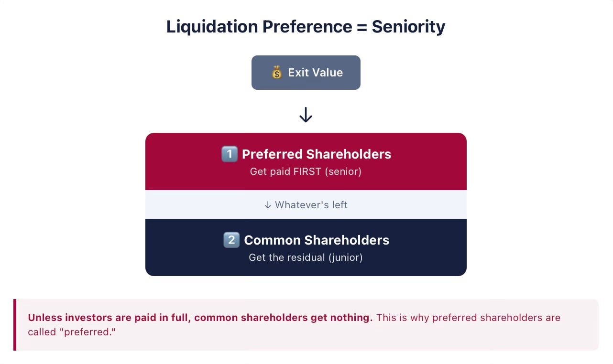
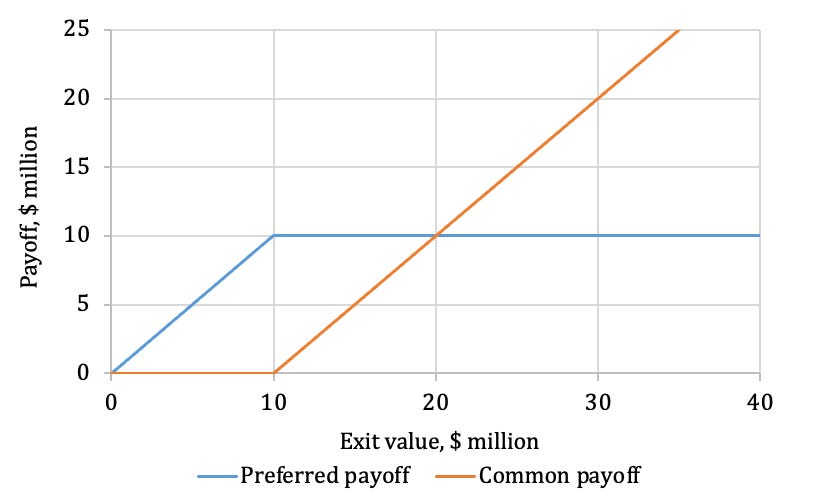
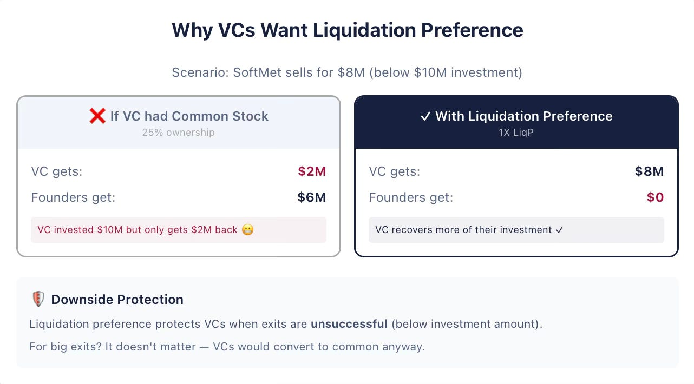

# 8/20. Ликвидационная преференция

## С возвращением

В предыдущем уроке я ввёл конвертируемые привилегированные акции (convertible preferred stock) — бумагу, которой чаще всего пользуются в стартапах с венчурными деньгами. Здесь разберём первое из многих условий этой бумаги, которое фаундерам нужно понять — и понять хорошо: ликвидационную преференцию (liquidation preference).

## Ликвидационная преференция закрепляет старшинство привилегированных акционеров

Финансовые бумаги стоят столько, сколько инвесторы ждут от будущих выплат. В ранних компаниях эти выплаты обычно случаются, когда компания «выходит» — в эффектном IPO, в продаже или слиянии, или при провале. Их называют выходами (exits), потому что венчурные инвесторы почти всегда сбрасывают всю долю в результате таких событий. Вместе эти **выходы** — примеры **события ликвидности** (liquidity event) с точки зрения инвестора. Стоимость активов, которые раздают владельцам на выходе, называют **стоимостью выхода** (exit value). Слово «ликвидность» подчёркивает, что инвестор наконец может получить живые деньги и тем самым сделать вложение ликвидным. Другой важный пример события ликвидности — вторичная продажа (secondary sale), когда инвестор продаёт свои акции другой стороне. Здесь про вторичные продажи говорить не будем: та другая сторона продолжит держать бумагу до выхода или до следующей перепродажи.

События ликвидности, которые не являются IPO, называют событиями ликвидации. **Событие ликвидации** (liquidation event) — это роспуск компании, продажа или реорганизация. При продаже компания перестаёт существовать как самостоятельное лицо. При роспуске компания исчезает, а оставшиеся активы продают и раздают владельцам. При реорганизации или слиянии может смениться контроль. Важно: что именно считается событием ликвидации, прописывают контракты. Точная юридическая формулировка может оказаться решающей: от неё зависит, сработает ли условие про ликвидационную преференцию. Например, в термшите Top Gun ликвидация определена как «a sale of all or substantially all of the Company’s assets, or a merger» — продажа всех или практически всех активов компании либо слияние. Реальные юридические контракты ещё точнее и часто добавляют, что событием ликвидации считается любое событие, которое «results in the stockholders owning less than a majority of the voting equity of the surviving company» — после которого акционеры владеют меньше чем контрольным пакетом голосующего капитала выжившей компании. Точное определение важно, потому что именно в событии ликвидации срабатывает ликвидационная преференция.

Заметьте: «ликвидность» — это *не* «ликвидация». Их часто путают, поэтому я отдельно подчёркиваю разницу.

> **Ликвидность и ликвидация**
>
> Отличайте событие **ликвидности** (liquidity) от события **ликвидации** (liquidation). Слова звучат похоже, но значат разное. Ликвидация значит, что компания перестаёт существовать в нынешнем виде. Ликвидность значит, что акционеры — например инвесторы — могут продать бумаги или хотя бы вернуть часть вложений. Слово «ликвидность» здесь потому, что вне этих событий инвестиция «неликвидна»: из неё трудно или невозможно выйти. Например, IPO — событие ликвидности, но не событие ликвидации.

В событии ликвидации у привилегированных акционеров есть особые права: им платят первыми, до того как обыкновенные акционеры получат хоть какую-то долю стоимости выхода. Именно об этом ликвидационная преференция.

**Ликвидационная преференция** (liquidation preference) — это сумма, которую обязаны вернуть держателю конвертируемых привилегированных акций в событии ликвидации *до* того, как заплатят кому-либо из обыкновенных акционеров. «До» значит, что инвесторы с конвертируемыми привилегированными акциями пользуются **старшинством** (seniority) над обыкновенными акционерами. Старшие инвесторы получают деньги первыми. Пока инвесторы не получили ликвидационную преференцию *целиком*, обыкновенные акционеры получают *ноль*. Старшинство часто называют ещё **приоритетом** (priority): привилегированные акционеры имеют приоритет над обыкновенными. **Старшинство** — и есть причина, почему этих акционеров вообще называют *привилегированными* (preferred). И наоборот: раз привилегированные старше обыкновенных, про обыкновенных говорят, что они **младшие** (junior) по отношению к привилегированным.

Ликвидационную преференцию часто задают через ликвидационный мультипликатор. **Ликвидационный мультипликатор** (liquidation multiple) — число, на которое умножают сумму инвестиций, чтобы получить ликвидационную преференцию. Обычно его пишут как число и X: 1X, 1.5X, 2X и так далее. Например, если мультипликатор 1.5X, а сумма инвестиций $3 million, ликвидационная преференция равна

$$4.5 million = 1.5 *$3 million$$

Это значит, что привилегированные акционеры имеют старшинство на первые $4.5 million из распределения стоимости выхода.

В контрактах ликвидационную преференцию часто формулируют через цену первоначального выпуска (original issue price), которую инвестор платит за одну акцию. Посмотрим, как это звучит в юридическом контракте — например, в контракте Dropbox, Inc. 2014 года:

“The holders of each share of Preferred Stock … shall be entitled to be paid … prior and in preference to any payment or distribution … of any available funds and assets on any shares of … Common Stock … an amount per share equal to the Original Issue Price for each such series of Preferred Stock.”[^1]

По-русски это значит: держатели каждой акции Preferred Stock имеют право получить выплату раньше и предпочтительно перед любой выплатой или распределением доступных средств по обыкновенным акциям — в размере Original Issue Price за каждую серию Preferred Stock. Это юридический способ определить ликвидационную преференцию. То, что преференция равна цене первоначального выпуска за акцию, значит: ликвидационный мультипликатор равен 1X.

Ещё один пример — контракт 2015 года другой ранней компании, Actifio, Inc:

“The holders of shares of … Series F Preferred Stock … shall be paid out of the assets of the Corporation … before any payment shall be made to the holders of Common Stock … an amount per share equal … one-and-one-half times (1.5x) the Series F Original Issue Price…”[^2]

По-русски: держатели Series F Preferred Stock получают выплату из активов корпорации до любой выплаты держателям обыкновенных акций — в размере полутора (1.5x) Original Issue Price серии F за акцию. Видно, что Actifio выпустила много классов привилегированных акций, и Series F — лишь один из них. Ликвидационный мультипликатор равен 1.5X. У держателей Series F Preferred stock Actifio ликвидационная преференция на акцию на 50% выше цены первоначального выпуска, которую они заплатили.

Рискуя потерять часть читателей, введу математические обозначения. Чтобы следить за текстом, математика не обязательна — можно перейти сразу к разделу про защиту от падения. Но обобщения помогают поймать интуицию.

Можно записать формулу выплаты инвесторам на выходе, которая следует из ликвидационной преференции. Такую выплату называем **выплатой по ликвидационной преференции** (liquidation preference payoff), или **LiqP payoff**. Обозначим ликвидационный мультипликатор как *LM*, цену первоначального выпуска привилегированных акций как *OIP*, общую сумму инвестиций в этом раунде как *I* (иногда *I_A*, где A в нижнем индексе означает Series A), число привилегированных акций как *N^P* (*P* в верхнем индексе означает preferred), а **общую стоимость выхода** (total exit value) как *V*. Думайте о *V* как о том, что все акционеры вместе получают на выходе, и пока считайте это кэшем. Вопрос — как эту сумму *V* делят между разными акционерами.

Ликвидационная преференция Series A Preferred stock (LiqP) равна

$$LiqP=LM × I=LM × OIP × N^P$$

а LiqP payoff равна

$$LiqP Payoff=min⁡(LM × I,V)=min⁡(LM × OIP × N^P,V)$$

В этой формуле min — математический оператор минимума: он выбирает меньшее из двух значений в скобках. Если ликвидационная преференция, которая равна *LM × I*, *меньше* стоимости выхода *V*, инвесторы получат только то, на что имеют право, — свою ликвидационную преференцию. Остаток уйдёт обыкновенным акционерам или будет распределён по другим условиям контракта.

Если же ликвидационная преференция *больше* общей стоимости выхода *V*, живые деньги получают только привилегированные инвесторы — и получат они только *V*. Инвесторы могут получить меньше своей ликвидационной преференции, потому что стоимость выхода компании слишком мала, чтобы покрыть эту сумму. Важно: обыкновенные акционеры пользуются **ограниченной ответственностью** (limited liability) и не обязаны доплачивать привилегированным ничего сверх стоимости компании на выходе. Поэтому инвесторы не могут получить больше стоимости выхода. В крайнем (но частом!) случае, когда компания проваливается и ценности не остаётся, инвесторы получают ноль.

Если остаток — то, что осталось после удовлетворения ликвидационной преференции инвесторов, — платят обыкновенным акционерам, выплату обыкновенных акционеров можно записать так:

$$Common Stock LiqP Payoff=V-min(LM × OIP × N^P,V)$$

Заметьте: значение *min(LM × OIP × N^P, V)* никогда не больше *V*, поэтому выплата по обыкновенным акциям никогда не отрицательна. Почему она не может быть отрицательной: привилегированным платят полностью первыми — либо всю их LiqP payoff, либо стоимость выхода фирмы. В первом случае оставшуюся стоимость выхода получают обыкновенные акционеры. Во втором выплачивать нечего, и обыкновенные получают ноль. Ограниченная ответственность как раз и гарантирует, что обыкновенным акционерам не придётся платить из своего кармана, чтобы закрыть обязательства фирмы перед привилегированными на момент выхода.

> **Пример: ликвидационная преференция**
>
> **Задача:**
>
> Венчурный фонд Beta Capital вложился в стартап Alpha. Инвесторы получили 2 million акций Series A Preferred по OIP $35 с ликвидационным мультипликатором 1.5X. Чему равна LiqP у Beta? Чему равна LiqP payoff Beta, если Alpha продают за $50 million? За $250 million?
>
> **Решение**
>
> LiqP Beta равна:
>
> $$LiqP= LM × OIP × N^P=1.5 ×$35 ×2 million=$105 million$$
>
> Если Alpha выходит за $50 million, LiqP payoff инвестора равна
>
> $$Beta LiqP payoff = min(LiqP, V) = min($105 million, $50 million) = $50 million$$
>
> В этом случае Beta Partners забирает всю стоимость $50 million, а обыкновенные акционеры получают ноль.
>
> Если Alpha выходит за $250 million, выплата равна
>
> $$Beta LiqP payoff = min(LiqP, V) = min($105 million, $250 million) = $105 million$$
>
> Остаток $145 million распределят по другим условиям контракта. Часто всю эту сумму $145 million получают обыкновенные акционеры. (Но заметьте: привилегированные могут предпочесть отказаться от ликвидационной преференции и вместо этого конвертироваться.)

> **Пример: ликвидационная преференция**
>
> **Задача:**
>
> Венчурный фонд Theta Capital вложился в стартап Gamma. Инвесторы получили 2 million акций Series A Preferred по OIP $3 с ликвидационным мультипликатором 2X. Ниже какой стоимости выхода обыкновенные акционеры получают ноль? Как изменится ответ, если LM станет 1.5X? 1X?
>
> **Решение**
>
> LiqP Theta равна:
>
> $$LiqP=LM ×OIP× N^P=2 ×$3 ×2 million=   $12 million$$
>
> Вспомните: привилегированные акционеры имеют приоритет над обыкновенными. Значит, если Gamma выходит ниже $12 million, обыкновенные акционеры получают ноль.
>
> Если бы LM был 1.5X, LiqP Theta была бы:
>
> $$LiqP=LM ×OIP× N^P=1.5 ×$3 ×2 million=   $9 million$$
>
> По той же логике обыкновенные акционеры получают ноль при стоимости выхода ниже $9 million.
>
> Если LM равен 1X, LiqP Theta равна:
>
> $$LiqP=LM ×OIP× N^P=1 ×$3 ×2 million=   $6 million$$
>
> Тогда обыкновенные акционеры получают ноль только при стоимости выхода ниже $6 million.

## Ликвидационная преференция даёт инвесторам защиту от падения

Вернёмся к SoftMet. В термшите Top Gun сказано, что ликвидационный мультипликатор равен 1X. Там же написано «non-participating» — без участия. Participation разберём позже; здесь это значит, что после выплаты ликвидационной преференции остаток уходит обыкновенным акционерам.

Сумма инвестиций Top Gun — $10 million, значит ликвидационная преференция тоже $10 million. Рисунок 1 показывает выплату на выходе, которую венчурные инвесторы могут ждать в событии ликвидации. По горизонтали — общая стоимость выхода в миллионах долларов. Снизу она ограничена нулём из-за ограниченной ответственности акционеров. По вертикали — LiqP payoff венчурных инвесторов: сколько они получат при каждой реализации общей стоимости выхода согласно условиям ликвидационной преференции. Там же показан остаток после полного удовлетворения ликвидационной преференции. В термшите Top Gun этот остаток идёт обыкновенным акционерам.

> **Выплаты по ликвидационной преференции**
>
> 
>
> Рисунок показывает, как ликвидационная преференция задаёт выплаты привилегированных и обыкновенных акционеров при разной стоимости выхода компании. Привилегированным гарантирована их ликвидационная преференция. Обыкновенные получают остаток стоимости компании.

Если исход компании ниже $10 million, ликвидационная преференция обеспечивает инвесторам всю стоимость выхода. Обыкновенные акционеры — фаундеры — получают ноль. Например, если компанию продают за $6.5 million, выплаты инвестора и фаундеров соответственно:

$$Preferred LiqP payoff = min(1*$4*2.5 million, $6.5 million) = $6.5 million$$

и

$$Common LiqP payoff = $6.5 million - min(1*$4 *2.5 million, $6.5 million) = $0$$

При любой стоимости компании выше $10 million ликвидационный мультипликатор 1X значит, что Top Gun не получает больше $10 million.

Следующее предложение суммирует экономический и практический смысл ликвидационной преференции: она играет очень важную роль, давая инвесторам **защиту от падения** (downside protection) при маленьких и не очень успешных выходах. «Падение» (downside) значит, что у компании финансово не сложилось. В венчуре один способ определить downside — все значения ниже общей суммы инвестиций.

Чтобы увидеть, как защита от падения *защищает* инвесторов, на секунду представим, что вопреки термшиту Top Gun инвесторы SoftMet получают 2.5 million *обыкновенных* акций, а не привилегированных. Тогда инвесторы будут владеть 25% всех обыкновенных акций компании. Других бумаг у компании нет.

Все обыкновенные акции равны — и инвесторские, и фаундерские. Если компанию, скажем, продают через год за $8 million, инвесторы получают 25% этой суммы, то есть $2 million, а фаундеры остальные 75%, то есть $6 million. Но Top Gun вложил в SoftMet $10 million. Даже при неуспешном выходе (общая стоимость выхода меньше $10 million) фаундеры получают куда больше, чем инвесторы. Обыкновенные акции не защищают инвесторов на падении.

Как только инвесторы выторговывают условие про ликвидационную преференцию, они получают всю стоимость выхода $8 million, а фаундеры — ноль. В этом случае добавление ликвидационной преференции даёт инвесторам дополнительные $6 million. Не удивляйтесь: когда мы с коллегами опрашивали венчурных инвесторов, ликвидационная преференция оказалась одним из условий, от которого они не готовы отказаться.

Заметьте: защита от падения — именно *падение*. В успешных выходах она ни к чему. Если компанию, скажем, продают за $100 million, и если бы Top Gun получил обыкновенные акции, он получил бы $25 million (25% общей стоимости выхода) — больше «защищённых» $10 million. В очень успешных выходах ликвидационная преференция по сути не важна.

Ближайший аналог защиты от падения — в обычных долговых контрактах. Например, банковский долг старше обыкновенного капитала. Должникам платят первыми, и только потом — держателям акций. Это не значит, что конвертируемые привилегированные акции — типичный долговой контракт: многих их свойств в обычном долге нет.

Более высокая ликвидационная преференция улучшает исход для инвестора за счёт фаундеров.

## Выплаты при разных ликвидационных мультипликаторах

Если компанию продают, скажем, за $18 million, инвесторы получают $10 million при мультипликаторе 1X, $15 million при 1.5X и всю стоимость выхода $18 million при 2X. В последнем случае им обещаны $20 million, но доступны только $18 million, чтобы закрыть это обещание. Фаундеры тогда не получают ничего.

Инвесторы, при прочих равных, очевидно предпочитают более высокий ликвидационный мультипликатор. На практике, когда компании не очень успешны, общая стоимость выхода в диапазоне от одного до трёх размеров суммы инвестиций (и значит 1X–3X ликвидационной преференции) — не редкость. Это ещё сильнее подогревает желание инвесторов к более высокой ликвидационной преференции. Например, вполне вероятно, что SoftMet продадут за сумму между $15 million и $20 million. Выясняется: хотя венчурные инвесторы вкладываются в надежде, что ликвидационная преференция никогда не понадобится, её влияние — и влияние мультипликаторов — на доходность фонда и на оценку может быть вовсе не пустяковым.

Фаундеры, наоборот, не любят мультипликаторы выше 1X и считают их несправедливыми и завышенными. Как в любых переговорах, величина мультипликатора зависит от **переговорной силы** (bargaining power) сторон. Переговорная сила в первую очередь зависит от рыночных условий: на каких контрактах сходятся другие инвесторы и компании той же стадии. Рыночные условия особенно важны в первом венчурном раунде. Если венчурных денег много и инвесторы конкурируют друг с другом, в первых раундах обычно виден мультипликатор 1X. В кризисы часто встречаются мультипликаторы выше 1X. В следующих раундах важно и состояние самой компании. Чем хуже дела компании, тем слабее переговорная сила существующих акционеров (и старых инвесторов, и фаундеров) и тем более высокий мультипликатор могут выторговать новые инвесторы, при прочих равных.[^3]

Мультипликатор 1X — безусловно самый частый для первого прайсед-раунда (priced round). Фаундеры: если в термшите что угодно кроме 1X, это красный флаг. Важно чувствовать пульс рынка (и адекватность инвесторов!).

Однако более высокие мультипликаторы не так уж редки в последующих раундах финансирования — о них позже. В выборке из 135 единорогов 15% дали ликвидационный мультипликатор выше 1X хотя бы одному из инвесторов.[^4] Мультипликаторы также выше, когда у компании дела плохи и она вынуждена поднимать следующие раунды в стеснённых обстоятельствах.

Ещё один важный момент: у конвертируемых привилегированных акций ликвидационный мультипликатор практически никогда не бывает меньше 1X. (Разумеется, при мультипликаторе 0X привилегированные акции по сути перестают быть «привилегированными».)

## Главное

a. Конвертируемые привилегированные акции старше обыкновенных.

b. Ликвидационная преференция даёт инвесторам защиту от падения и менее важна в успешных выходах.

c. Ликвидационный мультипликатор в первых венчурных раундах — 1X. Всё остальное — красный флаг.

---

[^1] Источник: Restated Certificate of Incorporation of Dropbox, Inc., 01/29/2014.

[^2] Источник: Seventh Amended and Restated Certificate of Incorporation of Actifio, Inc., 07/29/2015, Article B.2.1.

[^3] Иначе, имея большую переговорную силу, инвесторы могут выторговать более низкую цену первоначального выпуска вместо более высокого ликвидационного мультипликатора.

[^4] См. Will Gornall and Ilya A. Strebulaev, “Squaring Venture Capital Valuations with Reality,” 2020, *Journal of Financial Economics*, 135, 120—143. Доступно: [https://papers.ssrn.com/sol3/papers.cfm?abstract_id=2955455](https://papers.ssrn.com/sol3/papers.cfm).

Дальше: 9/20. Опциональная конвертация
