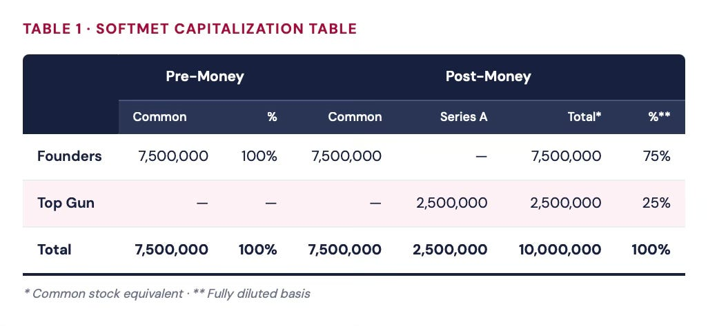
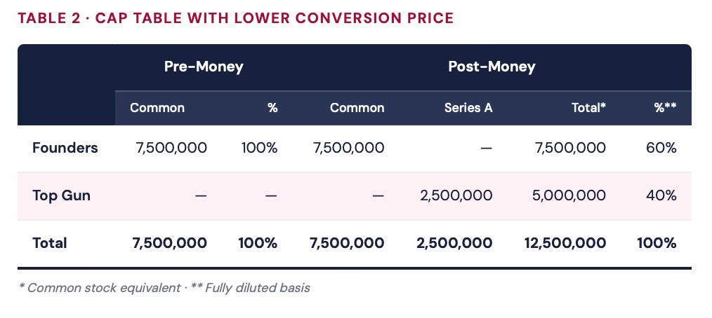
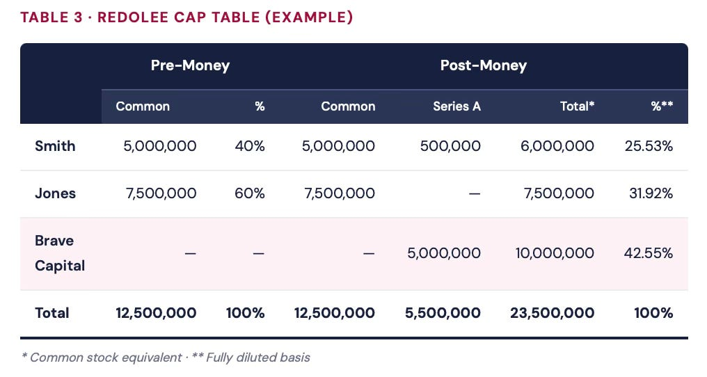
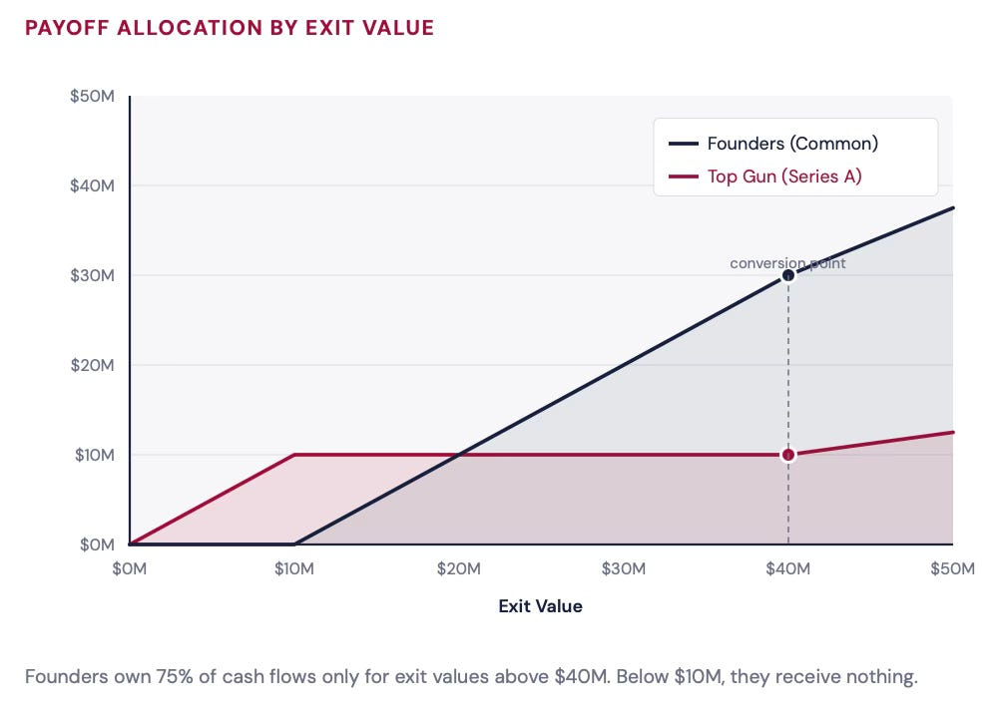
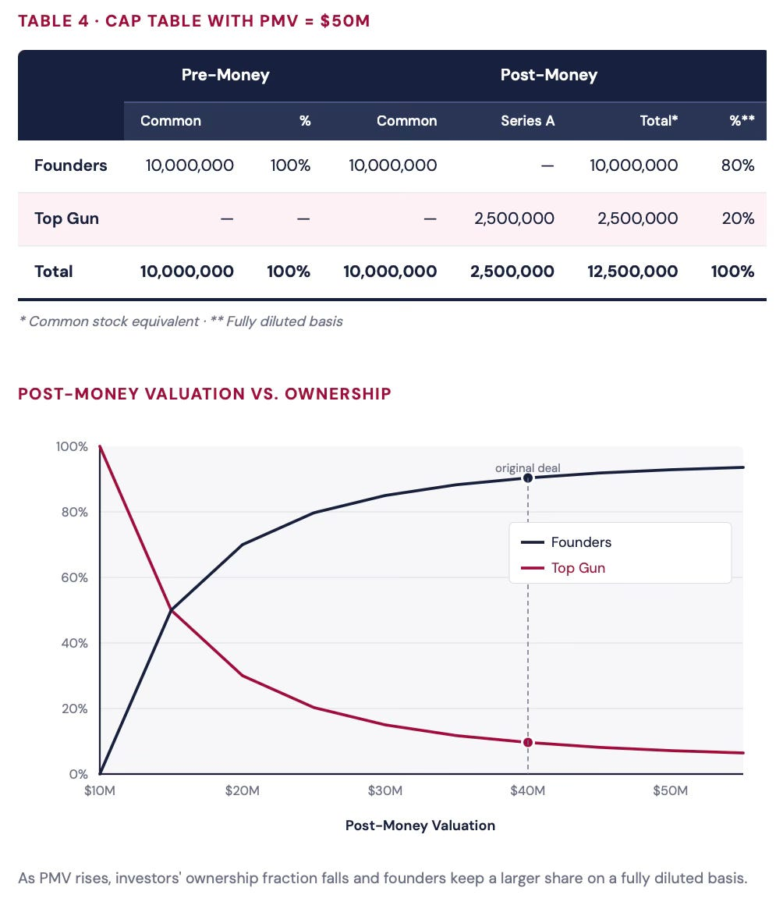
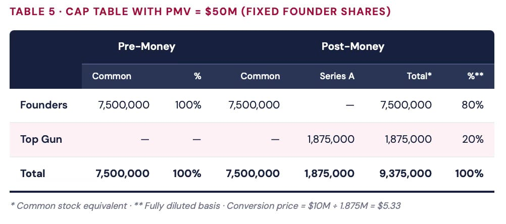
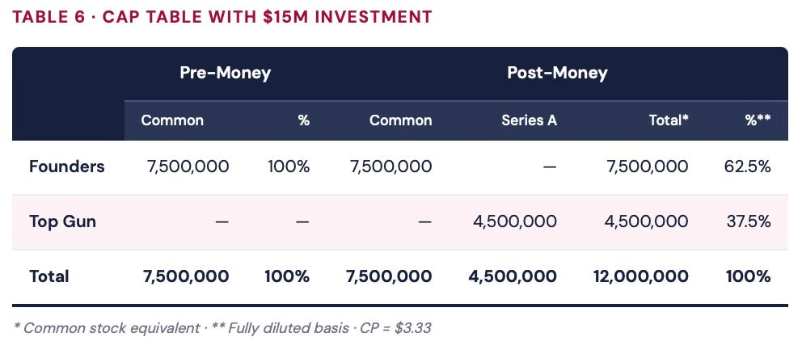

# 10/20. Cap table и оценка

В предыдущих уроках VC 101 мы разобрали ликвидационную преференцию (liquidation preference) и опциональную конвертацию (optional conversion) — два важных условия конвертируемых привилегированных акций (convertible preferred stock), самой частой финансовой бумаги в стартапах с венчурными деньгами. Здесь разберём **таблицу капитализации** (capitalization table) и **постмани-оценку** (post-money valuation).

*В 2014 году Uber объявила, что привлекла $1.2 billion при оценке $18.2 billion. Большинство прочитали это и решили, что Uber стоит $18.2 billion. Это не так — не в каком-либо осмысленном значении слова «стоит».*

Постмани-оценка — одно из самых цитируемых и самых неправильно понимаемых чисел в мире стартапов. Покажу, как строить и читать таблицу капитализации, почему cap table по сути смотрит на мир через розовые очки и что на самом деле значит (и не значит) «оценка», когда вы видите её в новостях.

## Таблица капитализации суммирует, кому что принадлежит

Когда компания привлекает внешние деньги, разумно дать отчёт, кто чем владеет. В частных компаниях с венчурными деньгами это делают через **таблицу капитализации** (capitalization table, её же называют **cap table**): она показывает владение всеми бумагами, которые либо являются капиталом, либо могут в него конвертироваться.

Посмотрим на SoftMet. До раунда фаундеры были единственными владельцами компании — им принадлежали 7.5 million обыкновенных акций. После того как Top Gun получает 2.5 million акций Series A Preferred (каждая конвертируется в одну обыкновенную), структура владения меняется:

В постмани cap table колонок больше, потому что теперь в обращении два типа бумаг: обыкновенные и Series A Preferred. Конвертируемые бумаги вносят **на базе as-converted** (as-converted basis; её же называют **эквивалентом обыкновенных акций**, common stock equivalent) — как будто они уже конвертированы. Последняя колонка показывает **полностью разводнённую долю** (fully diluted ownership) в предположении, что все конвертируемые бумаги конвертированы в обыкновенные акции.

## Cap table строится на полностью разводнённой основе

Важный момент: cap table строится в предположении полностью разводнённой основы (fully diluted basis). Все конвертируемые бумаги считают уже конвертированными — критическое допущение для компаний с венчурными деньгами, где почти у всех на руках что-то конвертируемое.

Чтобы понять, почему это важно, представьте, что Top Gun выторговал лучшую сделку: 2.5 million акций Series A Preferred, каждая конвертируется в *две* обыкновенные. Цена конвертации падает до $2, а цена первоначального выпуска остаётся $4.

На базе as-converted Top Gun теперь владеет 5 million обыкновенных акций — 40% компании, фаундерам остаётся 60%.

**РАЗОБРАННЫЙ ПРИМЕР · CAP TABLE**

**Задача:** Brave Capital покупает 5 million привилегированных акций Series A компании Redolee с коэффициентом конвертации 2×. У Redolee двое фаундеров, Smith и Jones: им принадлежат 5 million и 7.5 million обыкновенных акций соответственно. Smith соинвестирует в раунд A, покупая 0.5 million привилегированных акций Series A. Постройте cap table.

**Решение:** До раунда Smith и Jones владеют 40% и 60% соответственно. После раунда у Smith 5M обыкновенных + 0.5M привилегированных × 2 = **6M акций** на полностью разводнённой основе. У Brave Capital 5M привилегированных × 2 = **10M акций**. Всего полностью разводнённых акций = 23.5M.

## Проблема розовых очков

Вот что фаундеры часто пропускают. Слишком многие фаундеры и сотрудники считают, что им принадлежит ровно то, что показывает полностью разводнённая основа. Фаундеры могут верить, что им принадлежит 75% стоимости компании. **Это не так.**

Трюк: венчурным инвесторам оптимально конвертироваться только когда у компании дела хороши и она выходит относительно дорого. Когда фаундеры смотрят на cap table, будто надевают розовые очки. Cap table предполагает, что все держатели требований конвертируются — иначе говоря, предполагает достаточно высокую стоимость выхода.

*Таблица капитализации построена на самом оптимистичном сценарии. Реальная доля фаундеров в очень многих сценариях оказывается ниже.*

Фаундерам принадлежит 75% денежных потоков только при стоимости выхода выше $40M. Ниже $10M они получают ноль.

## Постмани-оценка и премани-оценка

**Постмани-оценка** (post-money valuation, **PMV**) — произведение двух величин: общего числа акций, которые будут в обращении на полностью разводнённой основе после инвестиционного раунда, и цены конвертации, которую платят инвесторы.

PMV = Conversion Price × Total Shares (fully diluted)

В случае SoftMet: PMV = $4 × 10,000,000 = **$40 million**.

Постмани-оценку публично называют после инвестиционного раунда. Важно: даже если слово «постмани» явно не сказано, можно считать, что сообщают именно её. Когда Uber объявила, что «привлекла $1.2 billion в сделке, которая оценила компанию в $18.2 billion», эти $18.2 billion — постмани-оценка, *не* справедливая рыночная стоимость Uber.

«Постмани-оценка» нужно произносить одним словом: это не то же самое, что «оценка» в том смысле, в каком это слово повсюду используют в финансах.

> **РАЗОБРАННЫЙ ПРИМЕР · ПОСТМАНИ-ОЦЕНКА**
>
> **Задача:** Lasso Partners купила акции Series A Preferred компании LaCruise при PMV $20 million. Цена конвертации $5/share, фаундерам принадлежат 3 million акций. Сколько привилегированных акций купила Lasso Partners?
>
> **Решение:** Всего акций N = $20M ÷ $5 = 4 million. Фаундерам принадлежат 3M, значит инвесторы купили **1 million привилегированных акций**.

**Премани-оценка** (pre-money valuation) определяется похоже — общее число акций до инвестиционного раунда × цена конвертации нового раунда.

PMV = Pre-Money Valuation + Investment Amount

Для SoftMet: $40M − $10M = **$30M премани-оценка**.

Ровно по той же причине, по которой постмани-оценку нельзя путать со справедливой стоимостью после раунда, **премани-оценку нельзя путать со справедливой стоимостью до раунда**. Сколько фаундеров прочитали «премани-оценка: $30 million» и решили, что их компания стоит $30 million? Это не так.

Почему? Потому что обыкновенные акции всегда *дешевле* конвертируемых привилегированных (которые конвертируются 1:1). А формулы и PMV, и премани-оценки оценивают все акции по одной и той же цене конвертации.

## PMV сильно влияет на долю

Представьте, что фаундеры и Top Gun передоговариваются на более высокую PMV $50 million (всё остальное без изменений). Top Gun по-прежнему вкладывает $10M по $4/share и по-прежнему получает 2.5M акций. Но теперь фаундерам принадлежит 10 million акций — 80% компании вместо 75%.

Когда PMV растёт, доля инвесторов падает, а фаундеры оставляют себе большую долю на полностью разводнённой основе.

На практике число уже существующих акций обычно фиксировано. Когда меняется PMV, подстраивается цена конвертации. Если у фаундеров было 7.5M обыкновенных акций и PMV выросла до $50M, инвесторам принадлежало бы 20% (= $10M / $50M), а значит 7.5M акций = 80% компании:

Хотя общее число акций и цена конвертации изменились, PMV и доли владения остались теми же. Число акций — это *нумератор* (numeraire); важно именно доли владения.

**⚠ ОСТОРОЖНО · ЧИСЛО АКЦИЙ**

Хотите 10,000,000 акций по $1 или 1,000,000 акций по $10? Они стоят одинаково — но эксперименты показывают, что люди предпочитают большее число, даже при более низкой цене за акцию. В стартапах эта путаница ещё шире, потому что истинная стоимость одной акции размыта. Если вам предлагают миллионы акций или опционов, чтобы присоединиться к стартапу, не считайте, что станете миллионером. Всё зависит от того, сколько миллионов (или миллиардов) принадлежит всем остальным.

---

## Ключевые формулы

N = N[^C] × PMV / (PMV − I)

N[^P] = N[^C] / CR × I / (PMV − I)

CP = I / (CR × N[^P])

Где N[^C] = уже существующие обыкновенные акции, N[^P] = новые привилегированные акции, CR = коэффициент конвертации (conversion ratio), I = сумма инвестиций, CP = цена конвертации (conversion price).

> **РАЗОБРАННЫЙ ПРИМЕР · ЦЕНА КОНВЕРТАЦИИ И ЧИСЛО АКЦИЙ**
>
> **Задача:** Best VC вложила $20M в раунд Series A компании BestStartUp, PMV = $40M. Фаундерам принадлежат 10M обыкновенных акций, привилегированные конвертируются в 2 обыкновенные каждая. Сколько привилегированных акций получила Best VC и какова была цена конвертации?
>
> **Решение:** Всего акций N = 10M × ($40M / $20M) = 20M. Привилегированных акций = (20M − 10M) / 2 = **5M акций**. Цена конвертации = $20M / (2 × 5M) = **$2**.

> **РАЗОБРАННЫЙ ПРИМЕР · SOFTMET С ИНВЕСТИЦИЕЙ $5M**
>
> **Задача:** SoftMet, PMV = $40M, фаундерам принадлежат 7.5M обыкновенных акций, конвертация 1:1. Top Gun вкладывает $5M. Найдите число привилегированных акций и цену конвертации.
>
> **Решение:** N[^P] = 7.5M × ($5M / $35M) = **1.071M акций**. CP = $5M / 1.071M = **$4.67**.

## Сумма инвестиций зеркалит PMV

Когда сумма инвестиций растёт, венчурные инвесторы владеют большей частью компании, а существующие акционеры — меньшей. Если Top Gun вкладывает $15M вместо $10M (PMV по-прежнему $40M):

Заметьте: если и сумма инвестиций, *и* PMV вырастут в одной и той же относительной мере, cap table не изменится — доля инвестора просто равна I / PMV. Умножьте оба числа на один и тот же множитель — отношение останется на месте.

## Главное

1. Таблица капитализации всегда предполагает **полностью разводнённую основу** (fully diluted basis) — самый оптимистичный сценарий.
2. Разница между постмани-оценкой и премани-оценкой — это **сумма инвестиций**, привлечённая в этом раунде.
3. Смотрите на **долю владения**, а не на число акций, которыми владеете.

**Примечания:**

¹ «В обращении» (outstanding) значит все акции, реально выпущенные вплоть до раунда финансирования включительно. «Объявленные» (authorized) акции могут так и не быть выпущены — механику разберём позже.

² Цены принято обрезать на 4–6 знаках. В контрактах есть стандартные положения: акционеры могут владеть только целым числом акций.

Дальше: 11/20. Participation
