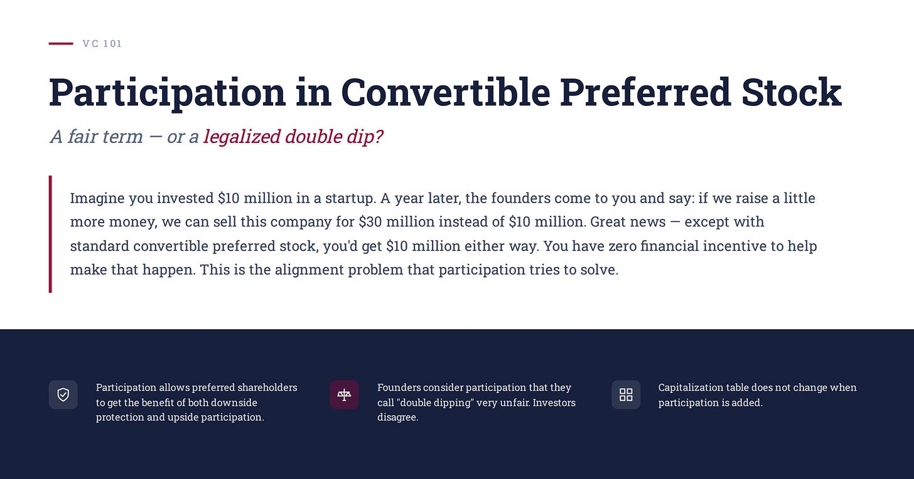
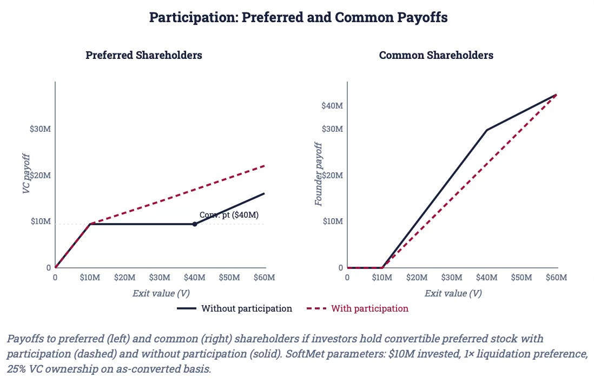
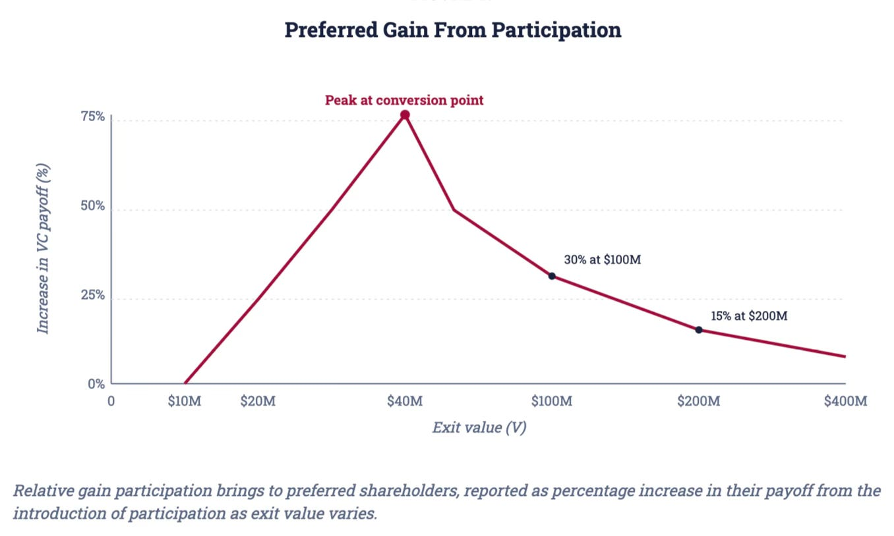
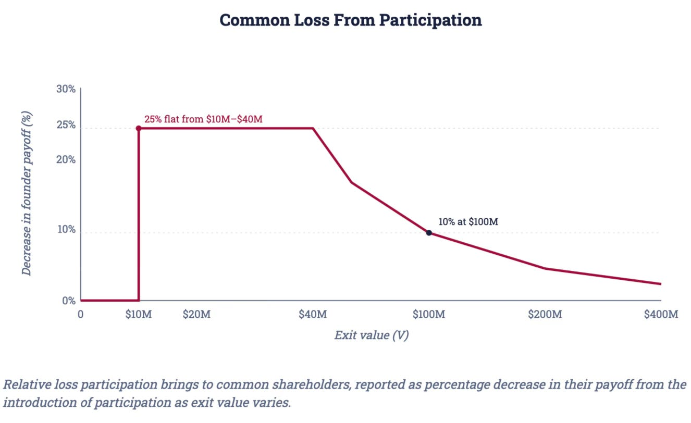

# 11/20. Participation

## С возвращением

До сих пор мы разобрали основную механику стандартных конвертируемых привилегированных акций (convertible preferred stock) — ликвидационную преференцию (liquidation preference), опциональную конвертацию (optional conversion) и то, как к ним стыкуется таблица капитализации (capitalization table). Здесь разберём вариант конвертируемых привилегированных акций с условием participation.

Представьте: вы вложили $10 million в стартап.

Через год фаундеры приходят и говорят: если привлечём ещё немного денег, сможем продать компанию за $30 million вместо $10 million. Отличные новости — только со стандартными конвертируемыми привилегированными акциями вы получите $10 million в любом случае. Финансового стимула помогать этому нет. Это проблема выравнивания интересов, которую пытается решить participation, — и причина, почему фаундеры и инвесторы никогда до конца не согласятся, справедливое это условие или узаконенный двойной куш. Покажу, как работает participation на реальном языке контракта DocuSign, насколько оно сдвигает выплаты на практике и почему спор вокруг него тоньше, чем признаёт любая из сторон.

## Participation даёт инвесторам и защиту от падения, и выигрыш от роста на выходе

Начнём с реального примера: DocuSign привлекла раунд в 2015 году. Контракт DocuSign говорит:[^2]

> *“… the holders of the Series A Preferred stock … shall be entitled to receive, prior and in preference to any distribution … to the holders of Common Stock … an amount equal to [Original Issue Price] ….
>
> …. Upon the completion of distributions [to Preferred Stock] … if assets … remain, such assets shall be distributed with equal priority and pro rata among the holders of the Series A Preferred Stock …. and Common Stock ….”*

По-русски: держатели Series A Preferred stock имеют право получить — раньше и предпочтительно перед любым распределением держателям обыкновенных акций — сумму, равную Original Issue Price. После завершения распределений привилегированным, если активы ещё остались, эти активы распределяют с равным приоритетом и pro rata между держателями Series A Preferred Stock и Common Stock.

Первый абзац выше мы уже встречали: он определяет ликвидационную преференцию, закрепляя старшинство привилегированных акционеров и ставя ликвидационный мультипликатор 1X.

Второй абзац, однако, существенно меняет эту ликвидационную преференцию: по сути он говорит, что *после* того как ликвидационная преференция полностью выплачена привилегированным, оставшуюся стоимость делят между привилегированными *и* обыкновенными акционерами. Иначе говоря, даже после того как привилегированные получили ликвидационную преференцию целиком, они всё ещё имеют право на дальнейшую выплату из стоимости выхода.

Сколько ещё они получат? Второй абзац ставит два условия: «equal priority» и «pro rata». **Равный приоритет** (equal priority) значит, что привилегированных и обыкновенных акционеров теперь считают равными и ни один класс не старше другого. Чтобы полностью понять pro rata в этом контексте, посмотрим продолжение контракта DocuSign:[^3]

> *“(with the shares of Series A Preferred Stock … being treated for this purpose as if they had been converted into shares of Common Stock at the then applicable Conversion rate).”*

По-русски: акции Series A Preferred Stock для этой цели считают так, будто их уже конвертировали в обыкновенные по действующему на тот момент коэффициенту конвертации.

**Pro rata** поэтому значит, что привилегированные акционеры получают выплату пропорционально своей доле обыкновенных акций на базе as-converted (as-converted basis — как будто конвертировались, даже если им это не нужно). Например, если им принадлежит 40% обыкновенных акций на базе as-converted, то с каждого оставшегося $1 стоимости выхода компании (после выплаты ликвидационной преференции) они имеют право получить $0.40.

Что контракт DocuSign на самом деле говорит: привилегированным акционерам DocuSign не нужно конвертироваться, чтобы получить выплату от опциональной конвертации. Это контрактное условие называют participation. Условие **participation** значит, что привилегированные акционеры имеют право *и* на ликвидационную преференцию, *и* на выплату от опциональной конвертации. По сути это всё ещё конвертируемые привилегированные акции, но с дополнительным условием participation. Поскольку изменённое правило «кто что получает» достаточно другое, эту бумагу иногда называют ещё **participating convertible preferred stock** — конвертируемые привилегированные акции с участием.[^4]

Экономический смысл participation: инвесторы одновременно получают и защиту от падения, и выигрыш от роста, так что выбирать — конвертироваться или нет — не нужно. Инвесторы получают лучшее из двух миров. Неудивительно, что инвесторы любят participation. Фаундеры по столь же очевидной причине считают participation несправедливым. Фаундеры часто называют participation **«двойным черпаком»** (double dipping): инвесторы могут «черпнуть» и из ликвидационной преференции, и из конвертации одновременно.

## Participation увеличивает выплату венчурным инвесторам за счёт обыкновенных акционеров

Представим, что Top Gun выторговывает participation, все остальные условия те же.

Если SoftMet продают за $30 million, выплата по стандартным конвертируемым привилегированным — $10 million, потому что инвесторы предпочитают не конвертироваться. С participation инвесторы получают:

$10M + 25% × ($30M − $10M) = $10M + $5M = **$15M**

Условие participation добавляет $5 million (или 50%) к их выплате.

Это игра с нулевой суммой, поэтому фаундеры получают лишь половину того, что получили бы со стандартными конвертируемыми привилегированными.

Если компания выходит по стоимости $40 million, без participation инвесторы получают $10 million. С participation их выплата вырастает до:

> $10M + 25% × ($40M − $10M) = **$17.5M**

Значит, при стоимости выхода $40 million participation увеличивает выплату инвесторов на:

> ($17.5M − $10M) / $10M = **75%**

Инвесторы больше всего выигрывают в значениях вокруг своей оптимальной точки конвертации (разумеется, с условием participation им на самом деле конвертироваться не нужно). Поскольку ликвидационная преференция — фиксированная сумма, роль participation постепенно слабеет при более крупных стоимостях выхода. Например, если SoftMet продают за $200 million, Top Gun получает:

> $10M + 25% × ($200M − $10M) = **$57.5M**

Выплата $57.5 million «всего» на 15% больше выплаты $50 million без participation. Разумеется, если SoftMet продадут за $10 billion, дополнительные $10 million от participation увеличат выплату инвестора всего на 0.3%. Поэтому для очень крупных выходов participation относительно неважно.

Конечно, выход за $200 million в пять раз больше постмани-оценки раунда A в $40 million и его вполне можно считать очень успешным.

Рисунок ниже показывает соответствующую потерю фаундеров из-за добавления participation:

Мы уже отмечали: инвесторы, при прочих равных, любят participation. Пример SoftMet проясняет одну причину, почему инвесторы могут ценить participation. Диапазон значений, где participation важнее всего, — как раз те, которые инвесторы по опыту знают как довольно частые. Продажи компании по 0.5×–4× постмани-оценки вполне обычны, и именно для этих стоимостей выхода participation важнее всего.

Есть ещё одна причина, почему participation кажется инвесторам справедливым. Снова возьмём SoftMet со стандартными конвертируемыми привилегированными акциями, без participation. При стоимости выхода между $10 million и $30 million привилегированные не конвертируются. По сути это значит, что им почти всё равно, продадут компанию за $12 million или за $29 million. Фаундерам, конечно, это очень важно.

Вот суть дела. Допустим, SoftMet получила инвестиции Top Gun, и дальше у неё не очень складывается. Есть предложение о покупке за $10 million. Top Gun возвращает свои деньги, фаундеры получают ноль. Фаундеры возвращаются к Top Gun и говорят: смотрите, если просто пойдём и привлечём ещё $3 million у других инвесторов, сможем продать компанию за $30 million. Верят инвесторы Top Gun фаундерам или нет — не так важно. Даже если верят, они *не* выиграют от этого роста стоимости и только потеряют временну́ю стоимость денег.

С условием participation все выигрывают, когда стоимость растёт с $10 million до $30 million. Отсутствие participation поэтому может привести к совсем нетривиальному расхождению интересов. Конечно, в переговорах это обмен: даже если инвесторы считают participation справедливым, им, возможно, придётся перестать на нём настаивать, если рынок достаточно дружелюбен к фаундерам.

А что с таблицей капитализации? Условие participation *не* меняет таблицу капитализации, потому что на базе as-converted относительные доли акционеров не изменились. Значит, розовые очки cap table (из прошлого урока) становятся ещё розовее.

Общую формулу выплаты инвестора с условием participation можно записать так:

> Investor payoff = LiqP payoff + (VC% on as-conv. basis) × (V − LiqP payoff)

где Investor LiqP payoff по-прежнему — сумма, на которую инвестор имеет право по базовой ликвидационной преференции (без модификации participation). Доля обыкновенных акций инвестора, разумеется, дана на базе as-converted. В обозначениях, которые мы уже вводили, эту выплату можно записать так:

> Investor payoff = min(LM × OIP × N[^P], V) + (N[^P] × CR / N) × (V − min(LM × OIP × N[^P], V))

Тогда выплату фаундеров можно записать просто как:

> Founder payoff = V − Investor payoff

> **ПРИМЕР · ВЫПЛАТА ИНВЕСТОРА И СТОИМОСТЬ ВЫХОДА**
>
> **Задача**
>
> Gamma Capital — венчурная фирма, которая вкладывает $20 million в раунд Series A компании AlphaTech с ликвидационным мультипликатором 2×. Gamma получает 1 million привилегированных акций, конвертируемых один к одному. Существующим фаундерам принадлежат 4 million акций. Какова выплата инвестора и фаундеров, если стоимость выхода равна (i) $10 million (ii) $200 million?
>
> **Решение — часть (i): V = $10M**
>
> По уравнению (18):
>
> Investor payoff = min(2 × $20M, $10M) + (1M / 5M) × ($10M − min(2 × $20M, $10M))
> = $10M + 20% × ($10M − $10M) = **$10M**
>
> Венчурный инвестор забирает всю стоимость выхода, фаундеры получают ноль:
>
> Founder payoff = V − Investor payoff = $10M − $10M = **$0**
>
> **Решение — часть (ii): V = $200M**
>
> Investor payoff = min(2 × $20M, $200M) + (1M / 5M) × ($200M − min(2 × $20M, $200M))
> = $40M + 20% × ($200M − $40M) = $40M + $32M = **$72M**
>
> Фаундеры получают оставшуюся стоимость фирмы:
>
> Founder payoff = $200M − $72M = **$128M**

> **ПРИМЕР · ВЫПЛАТА ИНВЕСТОРА, ЧИСЛО АКЦИЙ И СТОИМОСТЬ ВЫХОДА**
>
> **Задача**
>
> Theta Capital — венчурная фирма, которая вкладывает $100 million в раунд Series A компании BetaTech с ликвидационным мультипликатором 3×. Постмани-оценка Beta равна $200 million. Существующим фаундерам принадлежат 5 million акций, каждая привилегированная конвертируется в две обыкновенные. Сколько акций получает Theta Capital? Какова выплата инвесторам и фаундерам, если Beta выходит за $500 million?
>
> **Решение**
>
> Считаем число привилегированных акций, выпущенных Theta:
>
> N[^P] = (N[^C] / CR) × I / (PMV − I)
> = (5M / 2) × ($100M / ($200M − $100M)) = **2.5M акций**
>
> Теперь считаем выплату инвестора:
>
> Investor payoff = min(3 × $100M, $500M) + (2.5M × 2 / (2.5M × 2 + 5M)) × ($500M − min(3 × $100M, $500M))
> = $300M + 50% × ($500M − $300M) = **$400M**
>
> Фаундеры получают:
>
> Founder payoff = $500M − $400M = **$100M**

## Главное

- Participation позволяет привилегированным акционерам получить и защиту от падения, и участие в росте.
- Фаундеры считают participation — они называют его «двойным черпаком» (double dipping) — очень несправедливым. Инвесторы не согласны.
- Таблица капитализации не меняется, когда добавляют participation.

[^2] Amended and Restated Certificate of Incorporation of DocuSign, Inc., 04/30/2015, Article B.2.a/b.

[^3] Amended and Restated Certificate of Incorporation of DocuSign, Inc., 04/30/2015, Article B.2.b.

[^4] Если вам сейчас интересно, почему бумагу всё же называют *participating convertible preferred stock*: опциональная конвертация — лишь один способ получить «конвертированную» выплату. Другой способ — автоматическая конвертация (automatic conversion), когда конвертируемые привилегированные бумаги могут принудительно перевести в обыкновенные акции. Обещаю разобрать это в одном из следующих уроков.

Дальше: 12/20. Дивиденды
