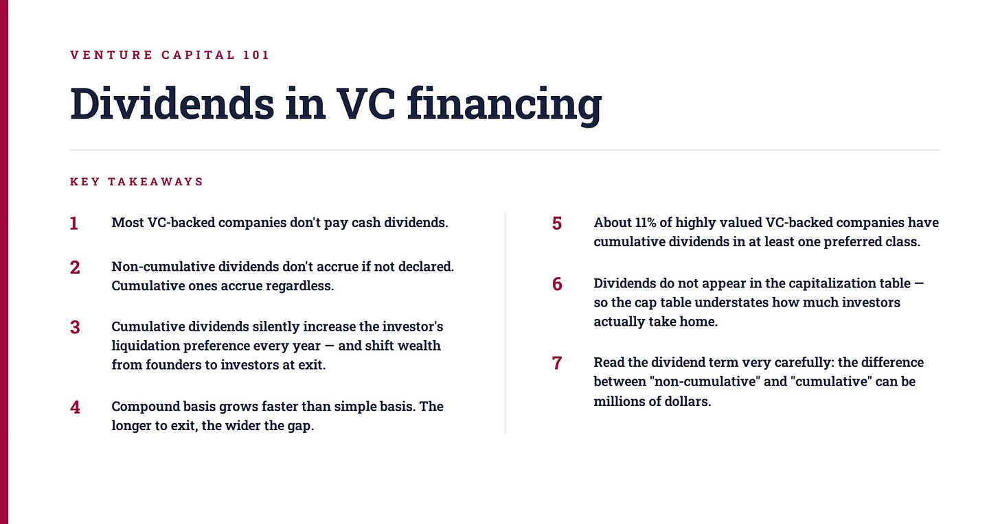
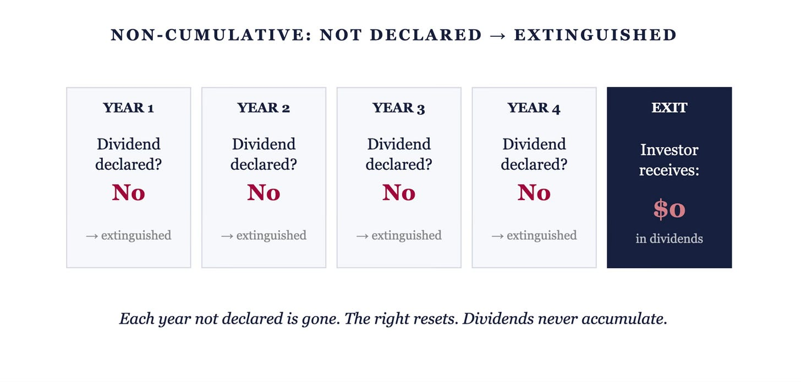
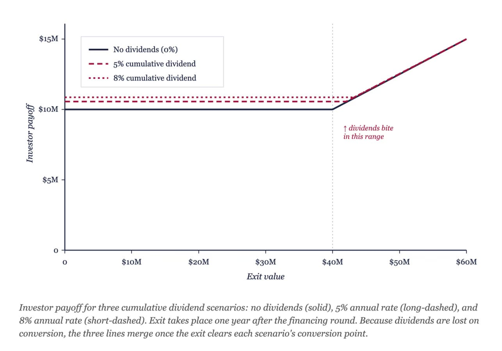
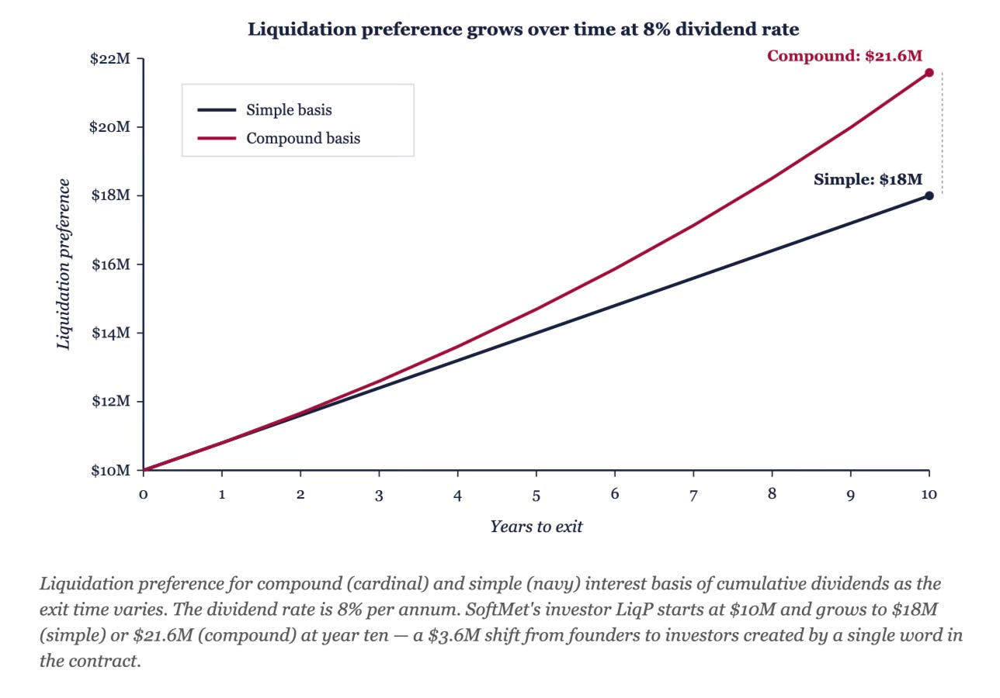

# 12/20. Дивиденды

*Опубликовано 2026-04-28. Источник: https://ilyastrebulaev.substack.com/p/venture-capital-101-dividends-in*

Мы уже разобрали главные ликвидационные условия (liquidation terms). В этом уроке поговорим о дивидендах (dividends). Оказывается, в венчуре (venture capital, VC) дивиденды важны меньше, чем на финансовых рынках вообще. Если какой-то урок из этой серии можно пропустить — то именно этот. Но останьтесь: крайние случаи имеют значение.

*Вот два предложения из двух настоящих венчурных контрактов. У Glassdoor: «дивиденды являются некумулятивными» («dividends shall be non-cumulative»). У Uptake Technologies: «дивиденды начисляются изо дня в день, независимо от того, объявлены они или нет и есть ли у компании законно доступные средства» («dividends shall accrue from day to day, whether or not declared and whether or not there are any funds legally available»). Одно и то же слово — «дивиденды» — совершенно разная экономика. Первое значит: никогда ничего не выплатят. Второе тихо увеличивает ликвидационную преференцию (liquidation preference) инвестора каждый день, с капитализацией год за годом, есть у компании деньги или нет. Через десять лет одна эта оговорка может переложить миллионы долларов от фаундеров (founders) к инвесторам. Большинство дивидендных условий в венчуре — декорация на витрине. Но те, что не декорация, могут больно укусить. В этом уроке я покажу, как отличить одно от другого.*

### Дивиденды

На традиционных финансовых рынках дивиденды играют огромную роль. **Дивиденд (dividend)** — это выплата компании своим акционерам. Дивиденды обычно бывают двух видов. **Денежные дивиденды (cash dividends)** — это выплаты деньгами, обычно доля прибыли компании. **Дивиденды в натуральной форме (dividends in kind)** — это неденежные распределения, обычно акциями. Большинство дивидендов платят регулярно (например, ежеквартально) и называют **обычными дивидендами (ordinary dividends)**. Компании также могут выплачивать фиксированные суммы как **чрезвычайные дивиденды (extraordinary dividends)** — разовые, а не регулярные.

В отличие от традиционных компаний, стартапы почти никогда не платят денежные дивиденды в обычных обстоятельствах. Причина простая. Денежные дивиденды платят из прибыли или денежных резервов компании. У стартапов прибыли как таковой нет, а если она появляется — её реинвестируют. Денежные резервы изначально пришли от инвесторов — возвращать их как дивиденды было бы хождением по кругу. Поэтому денежные дивиденды в компаниях с венчурным финансированием не важны, особенно на ранней стадии. Дивиденды в натуральной форме тоже редки, но компании с венчурным финансированием иногда их выплачивают, и это может заметно повлиять на выплаты.

### Некумулятивные дивиденды обычно не платят

Всё равно важно понимать, как дивиденды прописаны в контрактах и как они влияют на итоговые выплаты. Возьмём контракт Glassdoor, Inc., которая привлекла раунд финансирования в 2016 году:

> *“Holders of Series A Preferred, in preference to the holders of Common Stock, shall be entitled to receive, when, as and if declared by the Board of Directors … cash dividends at the rate of 8% of the Original Issue Price per annum … Such dividends … shall be non-cumulative.”[^1]*

По-русски: держатели Series A Preferred, в преимуществе перед держателями Common Stock, имеют право получать, когда, как и если это будет объявлено советом директоров (Board of Directors) … денежные дивиденды по ставке 8% от Original Issue Price в год … Такие дивиденды … являются некумулятивными (non-cumulative).

Три положения, все критичны. Первая строка устанавливает, что у привилегированных акционеров (preferred shareholders) есть **старшинство (seniority)** над обыкновенными акционерами (common shareholders) в отношении дивидендов — типично для таких контрактов, и при ликвидации, и на постоянной основе. (Равноприоритетные схемы существуют, но очень редки.)

Вторая строка задаёт денежные дивиденды в размере 8% от OIP в год. 8% — это **ставка дивиденда (dividend rate)** — отношение суммы дивиденда к первоначальной цене выпуска. Из этого можно решить, что Glassdoor на самом деле платит дивиденды своим привилегированным акционерам. Этот вывод был бы неверным по двум причинам.

Во-первых, в том же предложении сказано, что эти дивиденды платят только «когда, как и если объявлены» («when, as and if declared»). Это значит: дивиденды в контракте не гарантированы, хотя совет директоров имеет право инициировать их в будущем.

Самое важное положение, однако, в третьей строке: «Такие дивиденды … являются некумулятивными». **Некумулятивный дивиденд (non-cumulative dividend)** — это дивиденд, на который акционеры не имеют права, если он не был объявлен за текущий период. Необъявленные некумулятивные дивиденды просто исчезают — они никогда не возвращаются. Итог: «некумулятивные» + «если и когда объявлены» = дивиденды, которые почти наверняка никогда не выплатят, и их не стоит включать в расчёт выплат.

С учётом этого вот термшит (term sheet) Top Gun для SoftMet:

> *“6% noncumulative, payable if and when declared by the Board of Directors.”*

По-русски: 6% некумулятивные, выплачиваются если и когда объявлены советом директоров.

Стандартная формулировка. На бумаге театрально, на практике никогда не срабатывает.

**КАК ИСЧЕЗАЕТ НЕКУМУЛЯТИВНЫЙ ДИВИДЕНД**

### Кумулятивные дивиденды могут сильно повлиять на выплаты

Сравним контракт Glassdoor с контрактом Uptake Technologies, Inc., которая привлекла раунд в 2015 году:

> *“From and after the date of the issuance … of Series B Preferred Stock, dividends shall accrue … at the rate of five percent (5.0%) per annum on the sum of (i) the Series B Original Issue Price … plus (ii) all accrued but unpaid dividends thereon (the ‘Accruing Dividends’). Accruing Dividends shall accrue from day to day, whether or not declared and whether or not there are any funds of the Corporation legally available for the payment of dividends, and shall be cumulative.”[^2]*

По-русски: с даты выпуска … Series B Preferred Stock дивиденды начисляются … по ставке пять процентов (5.0%) в год на сумму (i) Series B Original Issue Price … плюс (ii) все начисленные, но невыплаченные дивиденды по ним («Accruing Dividends»). Accruing Dividends начисляются изо дня в день, независимо от того, объявлены они или нет и есть ли у корпорации законно доступные средства для выплаты дивидендов, и являются кумулятивными (cumulative).

В отличие от Glassdoor, дивиденды Uptake кумулятивные и начисляемые. **Кумулятивный дивиденд (cumulative dividend)** начисляется независимо от того, объявлен он или нет — право переносится вперёд, пока дивиденд не выплатят, не прекратят или не изменят.

Поскольку у компаний ранней стадии нет денег на выплату дивидендов, эти дивиденды обычно накапливаются до выхода (exit). **Накопленный дивиденд (accrued dividend)** объявлен, но ещё не выплачен. Они копятся, пока компания не выйдет (или пока совет директоров не решит их распределить).

Как думать о накопленных дивидендах: **ликвидационная преференция растёт с каждым прошедшим годом**. Это даёт инвесторам минимальную доходность на первоначальные вложения.

При кумулятивных накопленных дивидендах нужно ещё знать, имеют ли привилегированные акционеры право на них при любом выходе или только в отдельных случаях. Один сценарий: дивиденды пропадают при конвертации (conversion) в обыкновенные акции. Тогда дивиденды работают как надбавка к ликвидационной преференции — как только привилегированные акционеры конвертируются, они отказываются от условий LP, включая накопленные дивиденды. Кумулятивные дивиденды тогда добавляют ещё одно измерение к другим условиям, например к участию (participation). Другой сценарий: дивиденды начисляются и сохраняются независимо от конвертации. Третий: их статус зависит от того, выходит компания через продажу или через IPO. Из-за гибкости контрактов условия кумулятивных дивидендов могут стать очень запутанными. Итог: когда дивиденды кумулятивные, внимательно читайте точную формулировку — последствия для будущих выплат нетривиальны.

Насколько распространены кумулятивные дивиденды в стартапах? В выборке из 135 высокооценённых компаний с венчурным финансированием 15 (около 11%) дали кумулятивные дивиденды хотя бы одному классу привилегированных акционеров.[^3] Значит, они не частые — но и не отсутствуют, вопреки тому, что думают некоторые предприниматели и инвесторы.

Вернёмся к раунду финансирования SoftMet и рассмотрим сценарий, в котором Top Gun выторговал кумулятивную ставку дивиденда 8%, все остальные условия без изменений. Конкретно: привилегированные акционеры имеют право на дивиденды как часть своей ликвидационной преференции, а конвертация лишает прав на дивиденды. (Это консервативно — если права на дивиденды никогда не истекают, эффект ещё больше.)

Представьте, что компанию продают ровно через год после раунда. При ставке дивиденда 8% и OIP $4 каждая из 2.5 million привилегированных акций имеет право на кумулятивный дивиденд $0.32. По мере начисления дивиденд фактически поднимает ликвидационную преференцию за год до $4.32 на акцию, а цена конвертации (conversion price) остаётся прежней.

Поскольку кумулятивные денежные дивиденды меняют ликвидационную преференцию, они также меняют оптимальную точку конвертации (conversion point). Для выхода через один год:

> LiqP = ($4 + $0.32) × 2.5 million = $10.8 million

Чтобы найти новую точку конвертации, нужна стоимость выхода, при которой Top Gun получит $10.8 million при конвертации:

> Точка конвертации = LiqP ÷ доля инвестора в CS = $10.8M ÷ 0.25 = $43.2 million

Если SoftMet продают за $30 million через год после раунда, Top Gun предпочтёт не конвертироваться. Инвесторы получают $10.8 million; фаундеры получают $19.2 million.

Рисунок 24 показывает, как меняются выплаты инвестору при ставках дивиденда 5% и 8% при разных стоимостях выхода, через один год. Поскольку начисление дивидендов не переживает конвертацию, дивиденды важны только при промежуточных стоимостях выхода.

**ВЫПЛАТА ИНВЕСТОРУ ПРИ КУМУЛЯТИВНОМ ДИВИДЕНДЕ ЧЕРЕЗ ОДИН ГОД**

Заметьте: **дивиденды не отражены в таблице капитализации (capitalization table, cap table)**. Поэтому кумулятивные дивиденды заставляют cap table рисовать для обыкновенных акционеров более радужную картину, чем есть на самом деле.

### Влияние кумулятивных дивидендов зависит от базы и времени до выхода

Вернёмся к контракту Uptake. Кумулятивность дивидендов значит, что привилегированные акционеры серии B фактически увеличивают свой запас акций серии B на 5% каждый год. Формула дивиденда Uptake использует **базу сложных процентов (compound interest basis)**: 5% считают каждый год как долю от OIP *плюс все накопленные к этому моменту дивиденды*. По сути, вы получаете дивиденды на дивиденды. Альтернативно формула может использовать **базу простых процентов (simple interest basis)**: ставку дивиденда считают каждый год только как долю от OIP. Сложные дивиденды могут гораздо сильнее влиять на выплаты, чем простые.

Чтобы увидеть разницу, снова возьмём раунд серии A SoftMet в двух сценариях. В первом фаундеры и Top Gun договорились о простой базе; во втором — о сложной. Если компанию продают через год, дивиденды начислились только один раз (они начисляются в год), и выплаты одинаковы. Но что если компанию продают через десять лет после раунда (предположим, без дальнейшего финансирования)?

В случае простой базы ликвидационная преференция инвестора становится:

> LiqP = $10M × (1 + 0.08 × 10) = $18 million

Поскольку права на дивиденды пропадают при конвертации, точка конвертации сдвигается к:

> Точка конвертации = $18M ÷ 0.25 = $72 million

Например, при стоимости выхода $50 million Top Gun решает не конвертироваться. Инвесторы получают $18 million (против $12.5 million без дивидендов), а фаундерам достаётся $32 million (против $43.5 million без дивидендов).

В случае сложной базы 8% применяется к растущей сумме каждый год:

> LiqP = $10M × (1.08)^10 ≈ $21.589 million

(Точное значение — $21,589,250.) При стоимости выхода $50 million Top Gun получает свою LiqP около $21.589 million, а фаундерам достаётся оставшиеся $28.411 million. Точка конвертации тоже сдвигается:

> Точка конвертации = $21.589M ÷ 0.25 ≈ $86.36 million

Сложная база даёт инвесторам более высокую доходность, чем простая (по крайней мере до конвертации). Чем дольше тянется выход, тем шире разрыв между двумя базами и тем сильнее влияние дивидендов на ликвидационную преференцию привилегированных инвесторов.

**ЛИКВИДАЦИОННАЯ ПРЕФЕРЕНЦИЯ: СЛОЖНАЯ ПРОТИВ ПРОСТОЙ БАЗЫ ДИВИДЕНДА**

#### Точка конвертации с дивидендами

**Задача:** Liquid Adventure купила 15 million привилегированных акций серии A ZenMax Inc. по $10 за акцию с 2× LP и ценой конвертации $10. Привилегированные акции имеют кумулятивную ставку дивиденда 10%, начисляемую на базе сложных процентов. Права на дивиденды пропадают при конвертации. Фаундерам принадлежат 20 million обыкновенных акций. Других акционеров нет. При какой стоимости выхода Liquid Adventure выберет конвертацию, если компанию продадут без дальнейших раундов через 1 год? Через 5 лет? Через 10 лет?

**Решение:** Инвестор выбирает конвертацию, когда выплата при конвертации превышает ликвидационную преференцию. Кумулятивные дивиденды в момент T:

> Кумулятивные дивиденды = 15M × $10 × (1.10^T − 1)

А модифицированная ликвидационная преференция:

> LiqP инвестора = 15M × $10 × 2 + Кумулятивные дивиденды = $300M + $150M × (1.10^T − 1)

При конвертации Liquid Adventure получает 15 million обыкновенных акций — 15M / (15M + 20M) = 0.42857 обыкновенного акционерного капитала.

Для выхода через 1 год:

> Точка конвертации = $315M ÷ 0.42857 = $735 million

Для выхода через 5 лет:

> Точка конвертации = $391.58M ÷ 0.42857 ≈ $913.68 million

Для выхода через 10 лет:

> Точка конвертации = $539.06M ÷ 0.42857 ≈ $1,257.81 million

Чем дольше компания идёт к выходу, тем выше цена, которую фаундерам нужно выручить, прежде чем Liquid Adventure конвертируется — и тем большая доля любой продажи сначала уходит инвесторам.

#### КЛЮЧЕВЫЕ ВЫВОДЫ

1. Большинство компаний с венчурным финансированием не платят денежные дивиденды.
2. Некумулятивные дивиденды не начисляются, если их не объявили. Кумулятивные дивиденды начисляются в любом случае.
3. Кумулятивные дивиденды тихо увеличивают ликвидационную преференцию инвестора каждый год — и при выходе перекладывают богатство от фаундеров к инвесторам.
4. Сложная база растёт быстрее простой. Чем дольше до выхода, тем шире разрыв.
5. Около 11% высокооценённых компаний с венчурным финансированием имеют кумулятивные дивиденды хотя бы в одном привилегированном классе.
6. Дивиденды не появляются в таблице капитализации — поэтому cap table занижает, сколько инвесторы на самом деле забирают домой.
7. Читайте дивидендное условие очень внимательно: разница между «некумулятивными» и «кумулятивными» может составлять миллионы долларов.

Дальше: 13/20. Размытие доли
