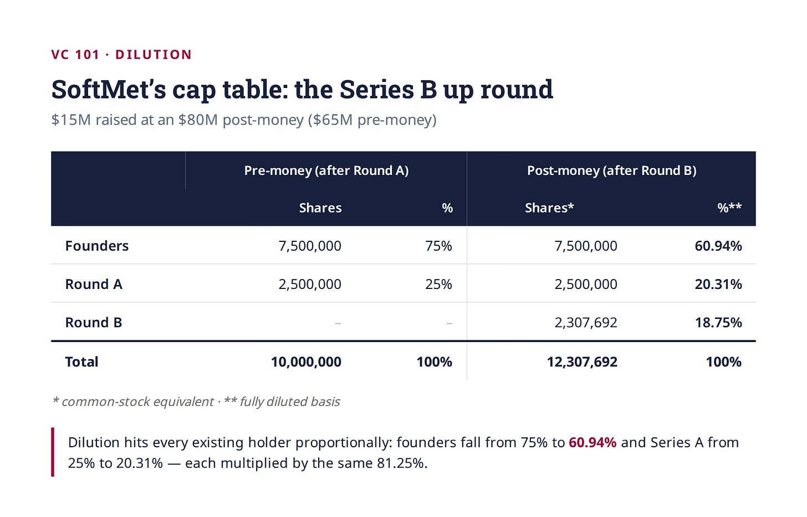
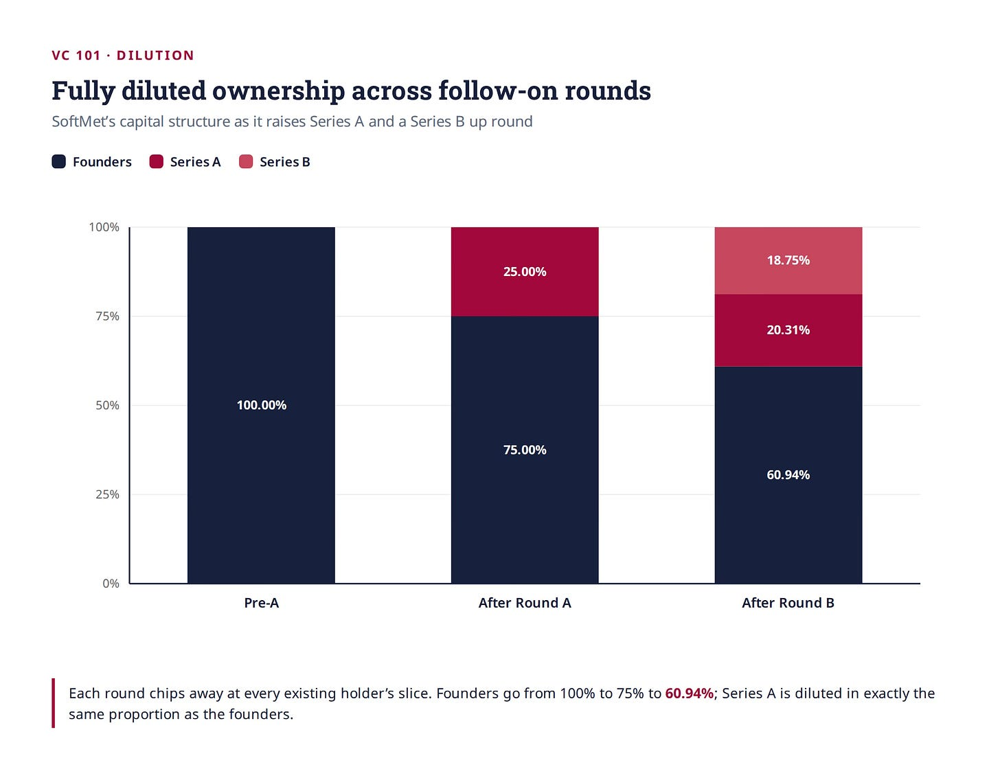
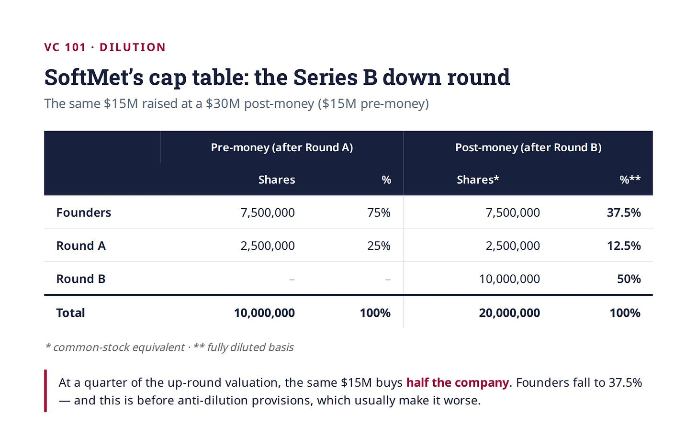
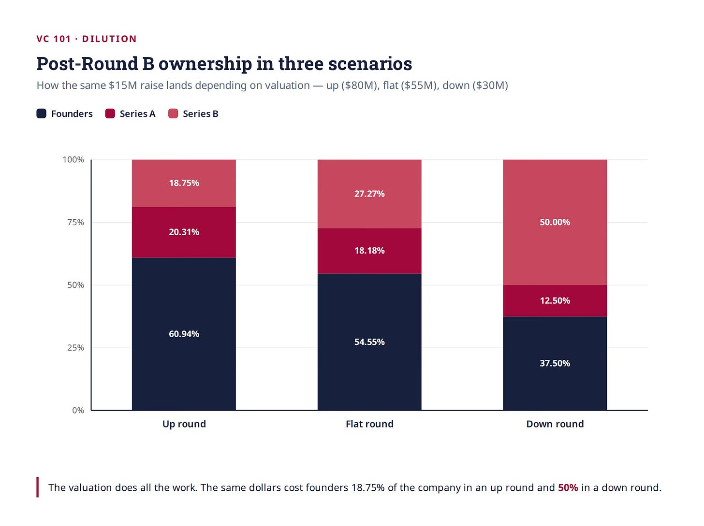
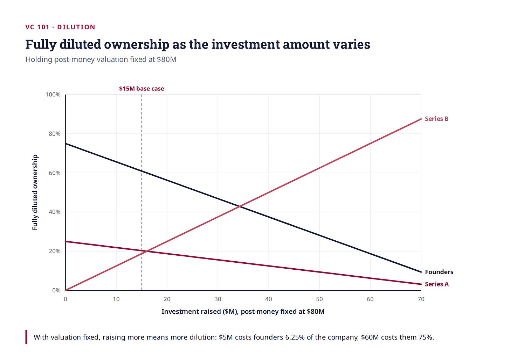
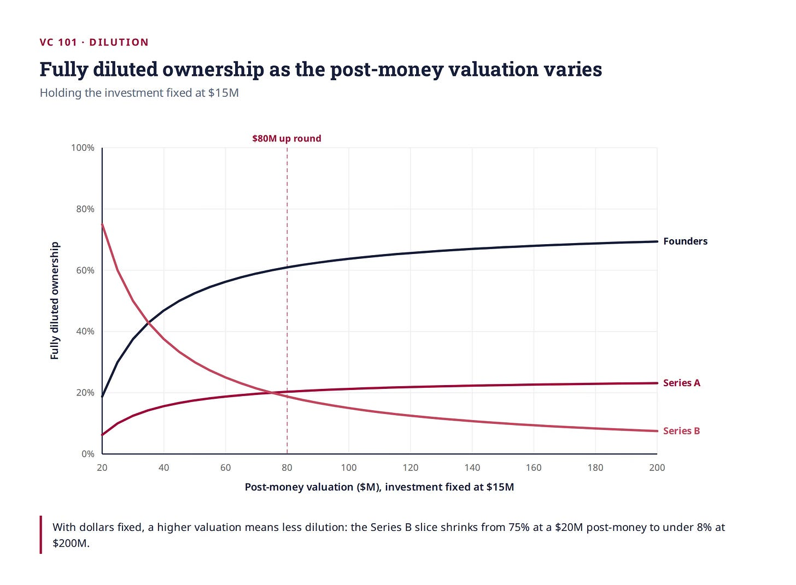
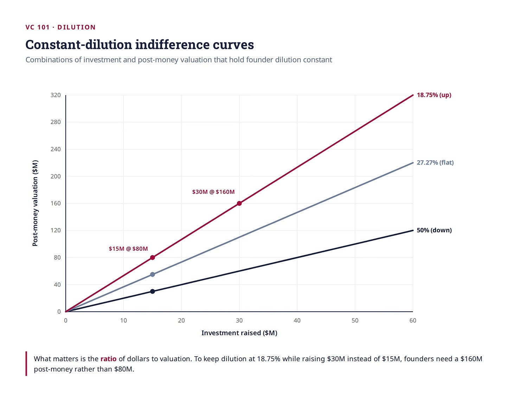
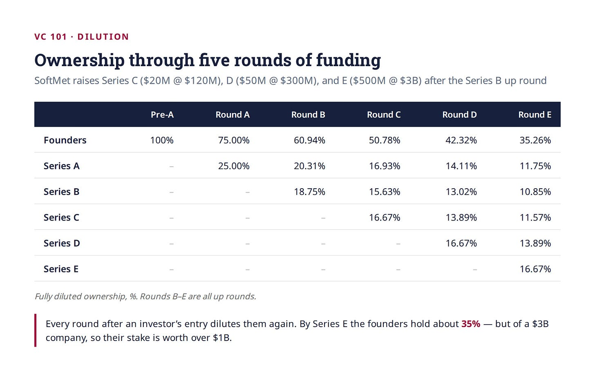
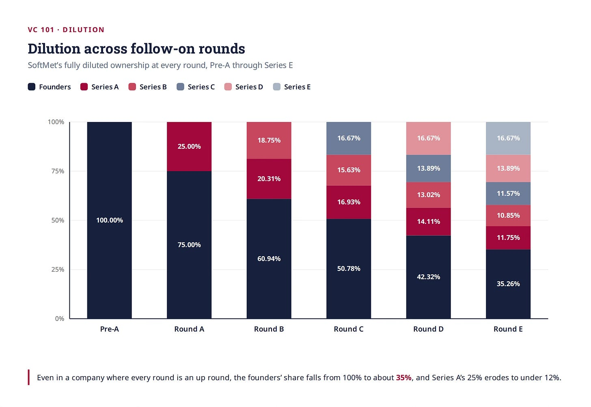

# 13/20. Размытие доли

*Опубликовано 2026-05-22. Источник: https://ilyastrebulaev.substack.com/p/how-founders-lose-control-to-dilution*

Вот число, которое удивляет даже моих студентов MBA в Стэнфорде: к серии B (Series B) средняя команда фаундеров (founders) владеет ~40% своей компании. К IPO часто уже меньше 20%.

И это у успешных компаний.

Возьмите Uber. На IPO трое фаундеров вместе владели ~17%. Трэвис Каланик (Travis Kalanick): ~8.6%; Гарретт Кэмп (Garrett Camp): ~6%; Райан Грейвс (Ryan Graves): ~2.4%.

Большинство фаундеров понимают размытие доли (dilution) абстрактно. Вы привлекаете деньги, отдаёте долю, ваш кусок пирога становится меньше. Если вам принадлежит 100% и вы привлекаете $10M за 25%, теперь вам принадлежит 75%. Достаточно просто.

Но механика размытия через несколько раундов неинтуитивна. Ошибка — не само размытие, а его непонимание. И исходы могут радикально различаться в зависимости от оценки (valuation) и привлечённого капитала. Эта статья — по моему стэнфордскому курсу по венчуру — разбирает это по шагам.

Размытие может быть сложным. Чтобы вас ввести, мы будем использовать один сквозной пример, наращивая сложность по ходу. К концу вы сможете посмотреть на любой последующий раунд (follow-on round) и сразу понять, что он значит для каждого акционера за столом.

#### **Постановка**

Если вы читали мои предыдущие уроки VC 101, вы уже встречали Энн и Мэтта! Энн Чжао (Ann Zhao) и Мэтт Смит (Matt Smith) три года назад основали SoftMet, технологический стартап. Они привлекли $10 million серии A (Series A) от Top Gun Ventures, которая получила 2.5 million акций конвертируемых привилегированных акций (convertible preferred stock) серии A по первоначальной цене выпуска (original issue price, OIP) $4 за акцию. Фаундеры сохранили 7.5 million обыкновенных акций (common shares). Постмани-оценка (post-money valuation): $40 million. (Если что-то в этом абзаце непонятно — вернитесь к предыдущим урокам VC 101!)

Теперь, 18 месяцев спустя, они привлекают $15 million серии B. Вопросы у них в голове — те же, что у каждого фаундера на этой стадии: какую долю компании получат новые инвесторы? Что случится с долей каждого? И насколько разной будет эта картина, если у компании всё хорошо, и если она буксует?

#### **Последующие раунды — норма, а не исключение**

Прежде чем нырять в математику — контекст. Привлекать несколько раундов не необычно. Это норма. Средний стартап с венчурным финансированием в США за последние 20 лет привлёк больше трёх раундов. Многие привлекают гораздо больше. Мои исследования показывают: средний единорог (unicorn) привлёк больше шести раундов.

Снова Uber. Между 2010 и 2018 компания привлекла как минимум 15 раундов финансирования — начиная с посевной серии (Series Seed) при премани-оценке (pre-money valuation) $3.86 million и заканчивая IPO в 2019 примерно на $68 billion. По пути инвесторы платили от $0.01 за акцию (Series Seed) до $48.77 за акцию (серия G / Series G). Соглашение называть бумаги по алфавиту — серия A, B, C и так далее — стандарт в отрасли. Иногда внутри одного раунда бывают подсерии: у серии C Uber были транши C-1, C-2 и C-3, каждый с чуть разными условиями.

Важный вывод: если вы фаундер или ранний инвестор, ожидайте проходить этот процесс несколько раз. Понимать механику — не опционально.

#### **Раунды роста, раунды падения и плоские раунды**

Один базовый вопрос, на который все хотят ответить с первого взгляда: как у компании дела между раундами?

Самый частый ярлык: сравнить **премани-оценку нового раунда** с **постмани-оценкой предыдущего раунда**. Почему именно это сравнение? Потому что оба числа описывают один и тот же набор акционеров.

Напомним: в каждом раунде постмани-оценка равна премани-оценке плюс сумма привлечённых инвестиций. Постмани-оценка раунда A включает всех, кто был акционером сразу после закрытия раунда A — фаундеров плюс инвесторов серии A.

Премани-оценка раунда B отражает тех же акционеров, что сразу после раунда A. Это оценка владения тех же акционеров до прихода новых денег. Это сравнение «яблоки с яблоками»: как одни и те же акции оценены в два разных момента. Итог: не сравнивайте премани-оценки двух последовательных раундов или две постмани-оценки двух последовательных раундов. Эти сравнения бессмысленны.

Альтернатива — сравнить первоначальные цены выпуска между раундами, с поправкой на любые дробления акций (stock splits). Если инвесторы заплатили $4 за акцию в раунде A и $6.50 за акцию в раунде B, подразумеваемая стоимость компании на акцию выросла.

На основе этого сравнения:

> **Раунд роста (up round)** значит, что премани-оценка в раунде B *выше*, чем постмани-оценка в раунде A. Компанию воспринимают как успешную. В нашем примере SoftMet привлечение при постмани-оценке $80 million (премани $65 million против постмани раунда A $40 million) было бы раундом роста.
>
> **Раунд падения (down round)** значит, что премани-оценка в раунде B *ниже*, чем постмани-оценка раунда A. Дела идут неважно. SoftMet, привлекающая при $30 million постмани ($15 million премани против $40 million постмани раунда A), была бы в раунде падения.
>
> **Плоский раунд (flat round)** значит, что премани-оценка в раунде B *равна* постмани-оценке раунда A. SoftMet, привлекающая при $55 million постмани ($40 million премани, совпадает с постмани раунда A), была бы плоской.

Несколько реальных примеров оживляют это.

Пример раунда роста: в марте 2015 Lyft привлекла $680 million финансирования серии E при премани-оценке $1.93 billion — заметно выше $971 million постмани на предыдущей серии D. Явный раунд роста, движимый быстрым ростом.

Пример раунда падения: на другом конце маркетплейс-кредитор Prosper пережил жестокий раунд падения серии G в сентябре 2017: премани-оценка была $500 million по сравнению с постмани $1.87 billion на предыдущем раунде — после того как сектор ударили обвинения в мошенничестве и регуляторные угрозы.

Пример плоского раунда: компания для совместной работы Slack привлекла финансирование серии D1 в марте 2015 при премани-оценке $1.12 billion. Постмани-оценка Slack на предыдущей серии D в октябре 2014 была $1.12 billion — получился плоский раунд D1.

**Слово осторожности.** Эти индикаторы несовершенны. Первоначальная цена выпуска — лишь одно из многих контрактных условий. Акции, выпущенные в раунде B, могут иметь совершенно другую защиту, чем акции раунда A. Думайте о ликвидационных мультипликаторах (liquidation multiples), participation rights и старшинстве (seniority). Поэтому рост OIP не *гарантирует*, что компании лучше; это значит лишь, что заголовочное число выросло. Нужно смотреть под капот (и мы посмотрим!). Правильное сравнение простое: премани (новый раунд) против постмани (предыдущий раунд). Сравнивать премани-с-премани или постмани-с-постмани между раундами просто неверно.

#### **Как работает размытие: раунд роста**

Теперь посчитаем. В сценарии раунда роста SoftMet привлекает $15 million при постмани-оценке $80 million, значит премани-оценка — $65 million.

До раунда B на полностью разводнённой основе (fully diluted basis) в обращении 10 million акций: 7.5 million обыкновенных акций фаундеров и 2.5 million привилегированных акций серии A. Премани-оценка $65 million подразумевает цену $6.50 за акцию ($65 million ÷ 10 million акций). Это также OIP для серии B, то есть сколько инвесторы раунда B платят за каждую привилегированную акцию, выпущенную им.

За свои $15 million инвестиций инвесторы серии B получают $15 million ÷ $6.50 ≈ 2,307,692 акций. Если акции серии B тоже конвертируются в одну обыкновенную акцию, на полностью разводнённой основе они в итоге владеют 18.75% компании после раунда B ($15 million ÷ $80 million).

Теперь можно построить постмани cap table (то есть после раунда B):

До привлечения серии A фаундерам принадлежало 100% компании. После серии A — 75%. Теперь, после серии B, им принадлежит 60.94%. Каждый раунд откусывает от их куска. Это пример **размытия доли (dilution)**. График показывает динамику структуры капитала SoftMet и прогрессирующее размытие фаундеров через раунды финансирования.

> **Доля на полностью разводнённой основе в последующих раундах.**
>
> Этот рисунок показывает процент владения всех акционеров SoftMet на полностью разводнённой основе в трёх последовательных раундах финансирования.

Заметьте важное: размытие бьёт *по всем* существующим акционерам пропорционально. Инвесторы серии A ушли с 25% на 20.31% — то же пропорциональное сокращение, что у фаундеров. (Как обсудим в следующем уроке, положения об антиразмытии (anti-dilution) в раундах падения могут сломать эту симметрию — иногда драматически.)

**Коэффициент размытия (dilution factor)** — это процент потери доли существующих акционеров. Для раунда B SoftMet коэффициент размытия равен 1 − (премани / постмани) = 1 − ($65M / $80M) = 18.75%. Доля каждого существующего акционера умножается на 81.25%.

#### **Заметка в сторону: дробление акций**

Дробления акций ни у кого не меняют долю — но меняют числа в каждой строке cap table.

Правило большого пальца: дробления механически просты, но их легко упустить. Они ничего не меняют в стоимости или доле — но меняют каждое поакционное число в сделке, а в венчуре контракты пишутся именно в поакционных числах.

При дроблении каждый акционер получает дополнительные акции за каждую акцию, которой владеет. Дробление 3-к-1 значит: вы переходите от одной акции к трём. Стоимость не создаётся и не уничтожается — у вас просто больше акций, каждая пропорционально дешевле.

Вернёмся к раунду роста SoftMet: привлечено $15 million при $80 million постмани ($65 million премани). Без дробления мы уже знаем математику: 10 million существующих акций, эффективная цена $6.50 за акцию, серия B получает около 2.31 million новых акций.

Теперь предположим, SoftMet проводит дробление обыкновенных акций 3-к-1 до закрытия раунда B. 7.5 million акций фаундеров становятся 22.5 million.

Для серии A есть две возможности. 2.5 million привилегированных акций серии A могут остаться 2.5 million привилегированных акций, но каждая привилегированная акция конвертируется в три обыкновенные. Тогда привилегированные акции конвертируются в 7.5 million обыкновенных. Или привилегированные акции серии A тоже дробят 3-к-1, и каждая привилегированная теперь конвертируется в одну обыкновенную. В любом случае общее число обыкновенных акций на полностью разводнённой основе утраивается до 30 million.

Со стоимостью компании ничего не происходит. До денег по-прежнему $65 million. Но эффективная цена одной обыкновенной акции падает до $65 million ÷ 30 million ≈ $2.17.

Инвесторы серии B теперь получают $15 million ÷ $2.17 ≈ 6.92 million привилегированных акций серии B, каждая из которых конвертируется в одну обыкновенную.

Проверьте долю: 6.92 million из 36.92 million всех акций — всё ещё 18.75%. То же размытие, та же экономика, другие числа.

Зачем тогда заморачиваться? Две практические причины. Во-первых, дробления (могут) скорректировать OIP и цену конвертации более ранних раундов. Первоначальная цена выпуска серии A $4 становится $4 ÷ 3 = $1.33 после дробления. Это важно, потому что цены конвертации напрямую входят в корректировки антиразмытия, расчёты конвертации и механику ликвидационной преференции (liquidation preference). Если игнорировать прошлые дробления, каждое число в cap table будет неверным.

Во-вторых, компании часто дробят акции перед IPO, чтобы привести цену за акцию в привычный торговый диапазон. Когда вы видите, что самые ранние инвесторы Uber «платили $0.01 за акцию», это цифра с поправкой на дробление — никто в тот момент не покупал акции за пенни. Когда вы сравниваете OIP между раундами, чтобы понять, был ли раунд роста или падения, нужно использовать числа с поправкой на дробление — иначе сравнение бессмысленно.

#### **Как работает размытие: раунд падения**

Теперь рассмотрим раунд падения: SoftMet привлекает те же $15 million, но при постмани-оценке всего $30 million (премани $15 million).

Эффективная цена за акцию теперь $1.50, и инвесторы серии B получают 10 million акций — в четыре раза больше, чем в раунде роста. Предположим, все остальные условия те же, что в раунде роста (смелое предположение!). Даже тогда cap table выглядит совсем иначе:

В этом cap table фаундеры ушли с 75% на 37.5%. Инвесторы серии B теперь владеют половиной компании.

Почему таблица построена на «смелом предположении»? Потому что на практике часто бывает хуже.

Положения об антиразмытии переносят дополнительную долю от обыкновенных акционеров к более ранним привилегированным акционерам в раундах падения. Эти положения почти всегда есть. Но их часто передоговаривают и снимают, так что cap table, который я показываю здесь, может быть фактическим cap table после раунда B.

Но для обыкновенных акционеров может быть гораздо (гораздо!) хуже. Положениями об антиразмытии мы займёмся в отдельном уроке. Пока запомните: раунд падения обычно приводит к существенному падению доли фаундера (и, конечно, сотрудников).

График визуализирует влияние на долю в трёх сценариях (плоский cap table и изменения долей вы можете вывести сами).

#### **Два рычага: оценка и сумма инвестиций**

Что на самом деле определяет размытие? Две ключевые переменные: сколько вы привлекаете и при какой постмани-оценке. Они работают в противоположных направлениях.

При фиксированной постмани-оценке привлечь больше денег значит больше размытия. Если SoftMet привлечёт $60 million при тех же $80 million постмани? Коэффициент размытия прыгает до 75% — фаундеры и серия A вместе остаются всего с четвертью компании. Привлечь только $5 million при той же оценке? Размытие всего 6.25%. График показывает, как меняется доля при изменении суммы инвестиций (заметьте: постмани-оценку здесь держим фиксированной).

При фиксированной сумме инвестиций более высокая постмани-оценка значит меньшее размытие. Привлечь $10 million при $100 million → размытие 10%. Привлечь $10 million при $50 million → размытие 20%. График показывает это для SoftMet (антиразмытие я здесь тоже игнорирую).

Вот почему фаундеры одержимы оценкой — и правильно (но нужно учитывать и остальное тоже! Как обсудим ниже и в следующих уроках).

Что реально важно — это *отношение* инвестиций к постмани-оценке. Отношение определяет размытие. Если фаундеры хотят то же размытие 18.75%, что в нашем примере раунда роста, им нужно держать отношение $15M / $80M = 18.75% независимо от абсолютных чисел. Привлекают $30 million? Нужна постмани-оценка $160 million. Привлекают $50 million? Нужно $267 million.

Экономисты описывают это через «кривые безразличия» (indifference curves). Это комбинации инвестиций и постмани-оценки, которые дают одно и то же размытие. График показывает три кривые безразличия, по одной на каждый рассмотренный сценарий (снова игнорируя антиразмытие). $15 million при $80 million даёт размытие 18.75%. $30 million при $160 million даёт *то же* размытие.

#### **Размытие накапливается — и может стать большим**

Реальное влияние размытия видно, когда смотришь через несколько раундов. Продолжим историю SoftMet. После раунда роста серии B предположим, компания привлекает раунд C ($20M при $120M постмани), раунд D ($50M при $300M постмани) и раунд E ($500M при $3B постмани). Вот как эволюционирует доля:

График визуализирует динамику cap table.

К пятому раунду фаундерам принадлежит около 35% компании. Инвесторы серии A — которые когда-то держали 25% — опустились ниже 12%. Каждый раунд после раунда входа инвестора размывает его дальше.

И это *успешная* компания. Каждый раунд от B до E — раунд роста. Фаундеры менее успешных компаний — или тех, у кого был хотя бы один раунд падения — заканчивают с гораздо меньшей долей. В некоторых случаях ранних обыкновенных акционеров по сути вычищают.

#### **Но размытие не обязательно плохо**

Вот часть, которую легко забыть среди всей арифметики: пока проценты владения сжимаются, *стоимость* того, что осталось, может расти драматически. В сценарии SoftMet фаундеры идут от 100% владения к 35.26% после серии E — драматическое размытие. Но им принадлежит 35.26% компании, оценённой в $3 billion. Их доля, по крайней мере в терминах постмани-оценки, стоит больше $1 billion. Инвесторы серии A идут от 25% компании в $40 million ($10 million) к 11.75% компании в $3 billion ($352 million) — доходность 35×. (Как правильно думать о постмани-оценке, я обсужу в следующем уроке.)

Размытие — проблема только когда пирог растёт недостаточно быстро, чтобы компенсировать. Фаундерам не стоит думать о размытии изолированно. Настоящий вопрос не: «Какая доля компании мне принадлежит?» А: «Сколько стоит моя доля — и как быстро она растёт?»

Важный итог: студенты часто спрашивают, стоит ли привлекать совсем чуть-чуть, откладывать привлечение, пока оценка не вырастет, или бутстрапить (bootstrap). Это правда: если вы избегаете привлечения, чтобы снизить размытие, вам будет принадлежать большая доля. Но чего? Стартапам нужен капитал, чтобы расти. Конкурент может привлечь больше денег, и фаундеры конкурента размоются — но по пути станут единорогом. По моему опыту, фаундеры часто психологически не готовы к размытию. Это дорого им самим и компаниям, которые они пытаются построить.

#### **Что показывают данные**

С каким размытием фаундеры сталкиваются на практике? В большой выборке компаний с венчурным финансированием за последнее десятилетие доля обыкновенных акций в среднем упала с 68% после серии A примерно до 40% после серии B. И у распределения длинный хвост: падение до 20% обыкновенной доли к серии B — не редкость. (Заметка: для этого урока я игнорирую деньги до венчура, но данные, конечно, их включают.)

Эти числа должны формировать ожидания фаундеров перед любым раундом. Если вы привлекаете серию B и ожидаете удержать 70% компании, вас, скорее всего, ждёт разочарование. Многие исходы предполагают существенно большее размытие, чем ожидает большинство фаундеров в первый раз.

Если вы цитируете или переиспользуете эту статью, пожалуйста, укажите источник: *Ilya Strebulaev, Substack: https://ilyastrebulaev.substack.com*.

#### **Ключевые выводы**

- **Сравнение, которое имеет значение**, — это премани-оценка в новом раунде против постмани-оценки в предыдущем. Это говорит, раунд роста, падения или плоский — и это единственное сравнение «яблоки с яблоками» того, как одни и те же акции оценены во времени.
- **Размытие двигают два рычага** — сумма привлечённого и постмани-оценка. При любом заданном уровне размытия эти два движутся вместе: привлечь больше капитала требует пропорционально более высокой оценки, чтобы размытие осталось постоянным.
- **Размытие накапливается** через раунды, и даже у успешных компаний доля фаундеров существенно падает. Но сжимающиеся проценты всё равно могут означать растущую стоимость, если каждый раунд — раунд роста.

Дальше: 14/20. Pro rata
