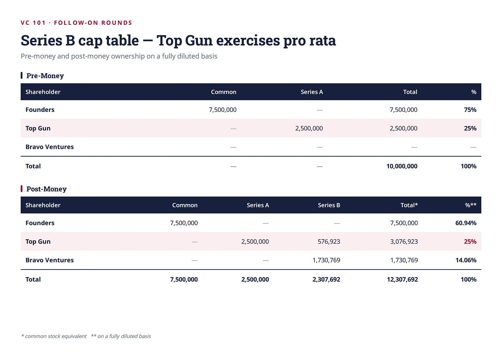
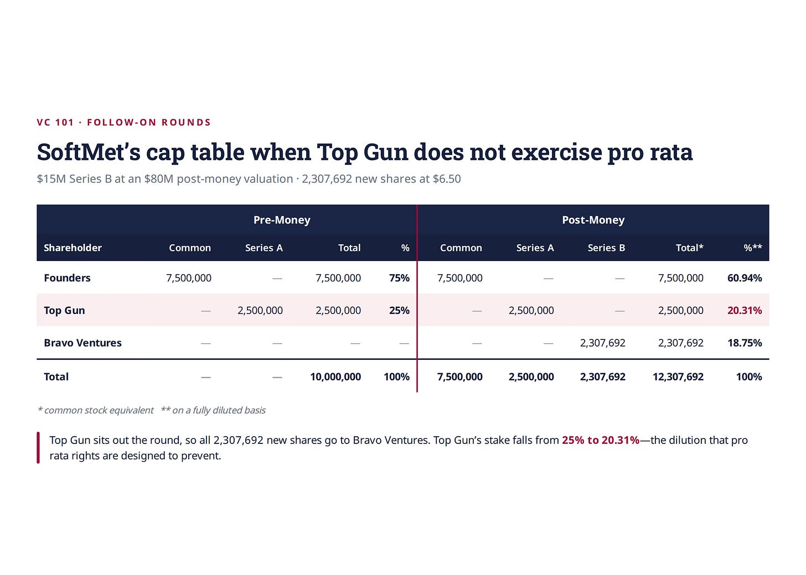

# 14/20. Pro rata

*Опубликовано 2026-06-09. Источник: https://ilyastrebulaev.substack.com/p/pro-rata-rights-the-least-negotiable*

Мои коллеги и я проводили много опросов венчурных инвесторов. Когда мы просим инвесторов ранжировать двенадцать самых важных контрактных условий, одно условие выделяется: права pro rata (pro rata rights). Мы специально спрашивали, насколько венчурные инвесторы гибки в переговорах по этим условиям. По правам pro rata они наименее гибки.

Не ликвидационные преференции (liquidation preferences), не места в совете (board seats), не антиразмытие (anti-dilution) — pro rata.

Этот рейтинг людей удивляет. Почему право *инвестировать ещё денег* — самое яростно охраняемое условие в венчуре? Права pro rata просты в принципе: они позволяют существующему инвестору купить достаточно каждого нового раунда, чтобы его процент владения не сжался. Если венчурному фонду принадлежит 25% компании и он хочет по-прежнему владеть 25% после следующего раунда, именно право pro rata позволяет это сделать.

Эта статья объясняет, как это работает на практике и почему инвесторы так яростно это охраняют, на нашем сквозном примере SoftMet — чтобы показать, как pro rata перекраивает cap table.

#### **Внутренние и внешние инвесторы**

Прежде чем переходить к pro rata, нужно важное различие. Когда компания привлекает последующий раунд (follow-on round), часть инвесторов уже может иметь деньги в компании. Другие — новые.

Возьмите Sunrun, компанию домашней солнечной энергии, основанную в 2007. После раннего ангельского раунда Sunrun привлекла серию A (Series A) в 2008, лид — Foundation Capital. Год спустя компания привлекла серию B (Series B). Этот раунд вели две фирмы: Accel Partners и Foundation Capital.

Foundation Capital уже инвестировала в серию A — это был **внутренний инвестор (inside investor)** (также называют существующим инвестором / existing investor). Accel Partners инвестировала в Sunrun впервые — это был **внешний инвестор (outside investor)** (также называют новым инвестором / new investor). Когда Sunrun привлекла серию C в июне 2010, раунд вела Sequoia Capital, Accel и Foundation тоже участвовали. К этому моменту и Accel, и Foundation были внутренними инвесторами, а Sequoia — новым внешним инвестором.

Почему это различие важно? Три причины.

Во-первых, внутренние инвесторы знают о компании гораздо больше, чем внешние. Компании с венчурным финансированием — среды, богатые информацией, и внешние могут знать о компании не так уж много. Инсайдеры сидят в советах, видят ежемесячную отчётность и регулярно разговаривают с фаундерами (founders). Этот разрыв в знаниях значит, что у внутренних и внешних асимметричная информация (asymmetric information), и к одной и той же сделке они могут подойти очень по-разному.

Во-вторых, и это важнее для цены: если в новом раунде участвуют только инсайдеры, они сталкиваются с важным конфликтом. Они договариваются об условиях, которые затрагивают их и как существующих акционеров, и как входящих инвесторов. Оценка, на которую они согласятся, может не отражать то, что независимый участник рынка счёл бы справедливым. Наличие внешнего инвестора — особенно того, кто ведёт раунд и задаёт условия, — гарантирует, что цена отражает то, что рынок на самом деле думает о перспективах компании. Этот второй пункт особенно важен для фаундеров, команды менеджмента и обыкновенных акционеров (common shareholders). Если раунд — просто внутренний раунд (то есть только существующие инвесторы кладут ещё денег), как вы можете быть уверены, что пересмотренная стоимость компании справедлива? Поэтому многие инсайдеры настаивают на внешнем раунде, чтобы оценка была согласована тем, кого мы называем инвестором «на расстоянии вытянутой руки» (arm’s-length) — тем, у кого нет существующей доли, которую надо защищать.

В-третьих, у внутренних инвесторов могут быть дополнительные стимулы, которые выходят за рамки просто максимизации стоимости компании или того, что лучше для компании. Психологи давно установили важность эскалации обязательств (escalation of commitment) в ситуациях, когда один и тот же человек снова и снова принимает решения по проекту. Даже если проект идёт плохо и в него не стоит инвестировать или оценка должна быть ниже, внутренний инвестор уже выработал «обязательство» перед проектом. В конце концов, всегда можно вообразить чудо, когда упорство окупится. Поэтому это и называют «эскалацией обязательств».

По моему опыту, это один из самых критичных и сложных вопросов в венчурных решениях (и не только). В книге The Venture Mindset мы с соавтором посвящаем этому целую главу. Умные венчурные инвесторы стараются минимизировать эскалацию обязательств. Некоторые добиваются, чтобы весь партнёрский состав одобрял решение о доинвестировании, а не партнёр в совете стартапа. Но самый прямой и эффективный способ — привлечь инвесторов без эскалации обязательств: внешних инвесторов.

Для фаундеров и команд менеджмента: если раунд — просто внутренний, это потому что у компании всё так хорошо, что вы не хотите давать аллокацию новым инвесторам, или у компании всё так плохо, что кроме внутренних инвесторов никому не интересно? Заметка: команда менеджмента может как будто выиграть от эскалации обязательств, если инсайдеры продолжают финансировать стартапы-зомби. Но это, конечно, происходит ценой времени, которое вы могли бы потратить на новую компанию или другие проекты.

#### **Как работают права pro rata**

**Права pro rata (pro rata rights)** дают внутреннему инвестору право — но не обязанность — участвовать в будущих раундах финансирования, чтобы сохранить свою процентную долю в компании. Когда право реализуют полностью, доля инвестора остаётся ровно там, где была до нового раунда.

Вот как оговорка pro rata обычно выглядит в термшите (term sheet). Из серии A SoftMet:

*“[Top Gun] shall have a pro rata right, based on their percentage equity ownership in the Company (assuming the conversion of all outstanding Preferred Stock into Common Stock and the exercise of all options outstanding under the Company’s stock plans), to participate in subsequent issuances of equity securities of the Company.”*

По-русски: [Top Gun] имеет право pro rata, исходя из процентного долевого владения в Компании (предполагая конвертацию всех находящихся в обращении Preferred Stock в Common Stock и исполнение всех опционов, находящихся в обращении по опционным планам Компании), участвовать в последующих выпусках долевых ценных бумаг Компании.

Это даёт Top Gun право купить вновь выпущенные акции в следующем раунде финансирования SoftMet. А вот соответствующая оговорка из термшита серии B SoftMet, теперь когда есть ещё и внешний инвестор:

*“All Investors shall have a pro rata right, based on their percentage equity ownership in the Company [on the fully diluted basis], to participate in subsequent issuances of equity securities of the Company. In addition, should any Investor choose not to purchase its full pro rata share, the remaining Investors shall have the right to purchase the remaining pro rata shares.”*

По-русски: все инвесторы имеют право pro rata, исходя из процентного долевого владения в Компании [на полностью разводнённой основе (fully diluted basis)], участвовать в последующих выпусках долевых ценных бумаг Компании. Кроме того, если какой-либо инвестор решит не выкупать свою полную долю pro rata, остальные инвесторы имеют право выкупить оставшиеся акции pro rata.

Заметьте два изменения. Теперь, когда есть инвестор серии B, оба инвестора несут права pro rata дальше. А последнее предложение создаёт опцию «сверх-pro rata» (super pro rata): если один инвестор отказывается от своей pro rata, другой может забрать неиспользованные акции. Иногда эти права ограничивают инвесторами выше определённого порога владения.

#### **Pro rata в деле: cap table SoftMet**

Посмотрим механику. Вспомните сценарий раунда роста (up round) из предыдущей статьи: SoftMet привлекает $15 million в серии B при постмани-оценке (post-money valuation) $80 million (премани $65 million). До раунда в обращении 10 million акций, и выпускают 2,307,692 новых акций серии B по $6.50 каждая.

Теперь предположим, Top Gun, инвестор серии A, хочет полностью реализовать свои права pro rata. До раунда B Top Gun владела 25% SoftMet на полностью разводнённой основе. Полностью реализовать pro rata значит: Top Gun хочет по-прежнему владеть 25% после раунда B.

Чтобы этого добиться, Top Gun должна приобрести 25% вновь выпущенных акций. Почему? Потому что если она держит 25% всего, что существовало до раунда B, и 25% всего, что выпущено в раунде B, она будет держать 25% итога. Значит, Top Gun нужно купить:

25% × 2,307,692 = 576,923 акций серии B

Важно: Top Gun заплатит новую цену $6.50 за акцию. Права pro rata дают внутренним инвесторам право купить акции, но они должны платить ту же цену, что и другие инвесторы в новом раунде.

При цене серии B $6.50 за акцию дополнительная инвестиция Top Gun — $3.75 million. Оставшиеся 1,730,769 акций идут Bravo Ventures, внешнему инвестору, который ведёт этот новый раунд. Вот изменённый cap table:

Сравните это с cap table в предыдущей статье (где Top Gun не реализовывала pro rata).

Общее число акций и общая сумма инвестиций идентичны. Единственная разница — кто чем владеет. Top Gun сохраняет свои 25%; Bravo Ventures получает меньший кусок (14.06% вместо 18.75%).

Поскольку Top Gun покупает больше раунда, новый инвестор покупает меньше. Pro rata не меняет размер пирога и не меняет общую инвестицию. Она меняет распределение между инвесторами.

Конечно, Top Gun не обязана реализовывать pro rata полностью. Она может реализовать частично — или не реализовывать вовсе. Распределение между внутренними и внешними инвесторами часто предмет горячих переговоров. Новые инвесторы могут давить, чтобы приобрести большую долю раунда. А если права pro rata не реализуют, они обычно истекают.

#### **Почему инвесторам так важна pro rata**

Так почему pro rata — самое непереговорное условие в венчуре? Есть несколько обоснований, и их стоит понимать, даже если доказательства их важности смешанные.

**Аргумент портфельной стратегии.** Большинство портфельных компаний венчурного фонда проваливаются. Права pro rata позволяют инвесторам удваивать ставки на победителей. Если фонд отказывается от pro rata по буксующим компаниям, но сохраняет её у лучших, портфель со временем естественно смещается к компаниям более высокого качества. Концентрировать капитал в победителях и отпускать остальных — звучит очевидно правильно. Вот почему так много венчурных инвесторов твёрдо верят, что настоящая доходность в венчуре делается на правах pro rata, а не на первоначальных инвестициях.

Но вот возражение из учебника финансов: если каждый раунд оценён справедливо — то есть инвесторы платят ровно столько, сколько стоят их акции, — то реализация pro rata не должна давать избыточной доходности. Вы платите полную стоимость за полную стоимость, так что вам ни лучше, ни хуже. Значит, либо цена не полностью справедлива (возможно, из-за информационной асимметрии между внутренними и внешними), либо одно это обоснование не объясняет одержимость.

**Аргумент контроля.** Когда инвесторы сохраняют свою долю, они сохраняют голосующую силу и место за столом. Права управления (governance rights) в венчуре часто зависят от порогов владения — право назначить члена совета, наложить вето на определённые решения или одобрить крупные сделки. Если вашу долю размоют ниже соответствующего порога, вы теряете эти права. Для многих венчурных инвесторов сохранить влияние на направление компании как минимум так же важно, как финансовая доходность любого одного раунда.

**Аргумент сигнала.** В венчурном капитале то, что инвестор *делает*, несёт больше информации, чем то, что написано в термшите. Если внутренний инвестор отказывается участвовать в последующем раунде, это замечает каждый другой инвестор на рынке. Возникает вопрос: инсайдер знает что-то, чего не знаем мы? Реализация pro rata посылает противоположный сигнал — говорит, что инвестор, у которого информации больше, чем у кого бы то ни было, готов вложить ещё денег. Этот сигнал может быть критичен для способности компании привлечь внешний капитал.

#### **Права сверх-pro rata**

Выше я упоминал право сверх-pro rata. По сути, оно даёт инвестору опцион увеличить, а не просто сохранить, свою долю в компании. На практике это можно сделать либо дав инвестору остаточные права забрать нереализованные права pro rata других инвесторов, либо дав инвестору право увеличить свою долю владения.

Например, Top Gun могла выторговать право увеличить свою долю, с 25% до 30% в следующем раунде. Тогда у неё будет право купить больше следующего раунда. Если это происходит, либо все остальные инвесторы (например, Bravo Ventures) должны купить меньше, либо нужно продать больше акций — и у фаундеров будет большее размытие (dilution).

Права сверх-pro rata очень сильны для инвесторов, которые их выторговали, и пугающее предложение почти для всех остальных. Bravo Ventures может сказать, что у них есть минимальная доля владения, и уйти от сделки, в которой они приобретают меньшую долю раунда.

#### **Что фаундерам нужно знать**

На практике подавляющее большинство венчурных инвесторов считают права pro rata непереговорным условием инвестирования. Некоторые инвесторы думают, что важность больше в восприятии, чем в реальности, и что pro rata на самом деле не ведёт к лучшей доходности фонда. Текущие доказательства, как так часто бывает в венчуре, неоднозначны.

Но практический вывод для фаундеров ясен: ожидайте, что ваши инвесторы потребуют права pro rata, и ожидайте, что они будут в этом несгибаемы. Это имеет прямое следствие для вашего фандрайзинга. Если инвестор серии A реализует pro rata в вашей серии B, объём раунда, доступный новым инвесторам, меньше. Это может повлиять на то, насколько раунд привлекателен для потенциальных лидов — и скольких новых инвесторов вы можете привести к столу. При этом жёстко отбивайте права сверх-pro rata.

Обратная сторона тоже стоит отметить. Когда ваш существующий инвестор с энтузиазмом реализует pro rata, это мощная поддержка. Рынок слышит: кто-то с глубоким знанием вашей компании ставит на неё свежий капитал.

#### **Ключевые выводы**

- **Внутренние и внешние инвесторы имеют значение.** У внутренних инвесторов информационное преимущество и потенциальный конфликт при ценообразовании последующих раундов. Внешние инвесторы помогают обеспечить рыночное ценообразование.
- **Права pro rata позволяют существующим инвесторам сохранить долю.** Они покупают пропорциональную долю новых выпусков, чтобы их процент владения не размылся. Механика прямолинейна: если вам принадлежит 25% и вы хотите остаться на 25%, вы покупаете 25% новых акций.
- **Pro rata не меняет размер раунда — меняет распределение.** Когда инсайдеры реализуют право, аутсайдеры получают меньше раунда. Общая инвестиция и общее число акций остаются теми же.
- **Несгибаемость настоящая.** Инвесторы ссылаются на портфельную стратегию, контроль и сигнал. Финансовые доказательства смешанные, но переговорное поведение однозначно: pro rata — самое негибкое условие в венчуре.

Дальше: 15/20. Старшинство и водопад
