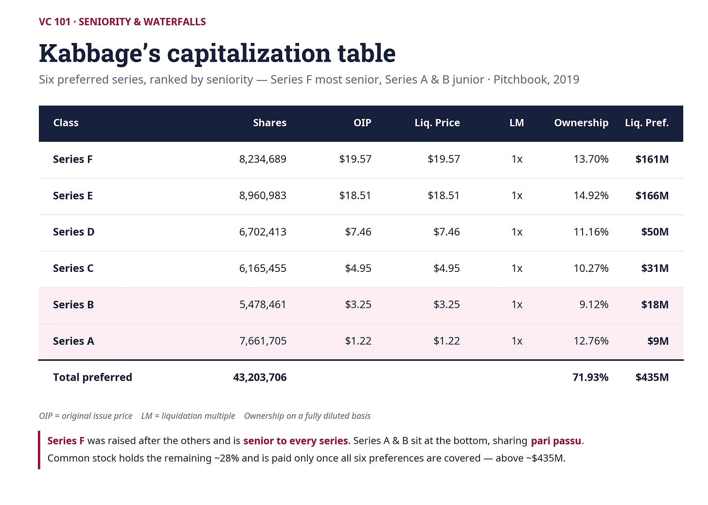
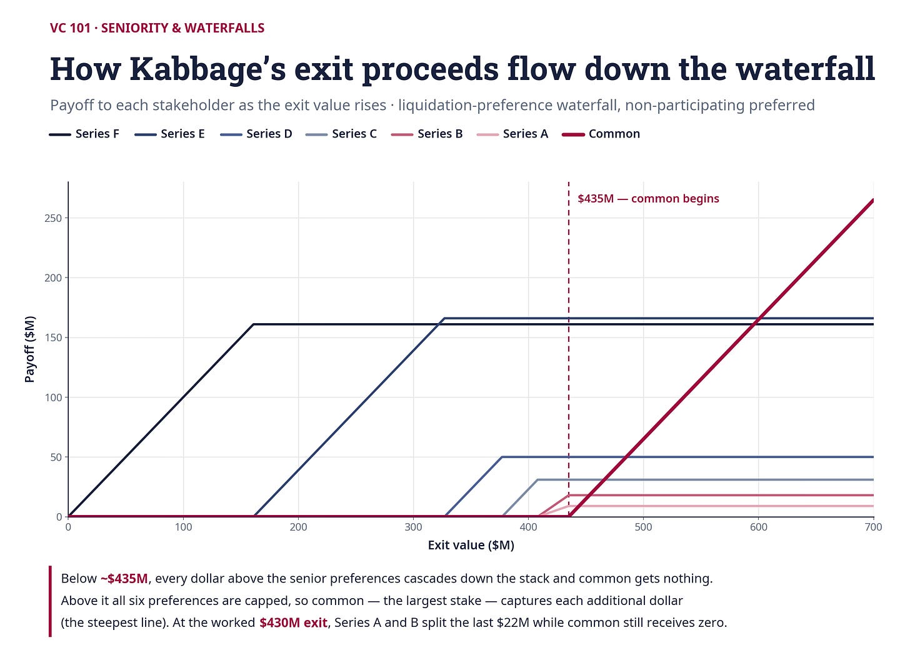

# 15/20. Старшинство и водопад

*Опубликовано 2026-06-13. Источник: https://ilyastrebulaev.substack.com/p/who-gets-paid-first-seniority-waterfalls*

В предыдущих статьях мы разбирали размытие доли (dilution) и права pro rata. Оба важны, но они описывают, как делится *владение*. Эта статья о другом: как делятся *деньги*, когда компанию продают.

Компании с венчурным финансированием скрывают неудобный факт: доля владения 25% не гарантирует 25% выручки от выхода (exit). Порядок, в котором акционеры получают деньги, — так называемый водопад (waterfall) — может перенаправить миллионы долларов от одной группы к другой. Мелкий шрифт имеет огромное значение. И как только вы привлекаете несколько раундов, мелкий шрифт быстро усложняется.

## Почему несколько раундов всё усложняют

В предыдущей статье о размытии мы смотрели, что происходит с процентами владения. Но владение рассказывает только часть истории. При выходе важно *выплата (payoff)* — сколько денег каждый акционер реально получает.

Вспомните из более ранних уроков VC 101: привилегированные акции (preferred stock) серии A идут с ликвидационной преференцией (liquidation preference) — обычно 1X, то есть инвесторы возвращают свои деньги раньше, чем обыкновенные акционеры (common shareholders) увидят хоть цент. С одним инвестором это прямолинейно. Что происходит, когда у нас две или больше привилегированных серий?

Снова пример SoftMet. Что будет, если у SoftMet две серии привилегированных акций, у каждой потенциально разные условия? Нет причин предполагать, что после переговоров серия B понесёт те же условия, что серия A.

На самом деле, хотя акции серии A сейчас часто принимают стандартизированную форму — ликвидационный мультипликатор (liquidation multiple) 1X, цена конвертации (conversion price) равна OIP, без участия (participation), — условия бумаг, выпускаемых в последующих раундах, могут существенно отличаться. И один практический пункт стоит запомнить:

*Условия, на которые вы соглашаетесь в ранних раундах, будут иметь каскадные эффекты в последующем фандрайзинге.*

Новые инвесторы почти никогда не принимают худшие условия, чем у ранее выпущенных бумаг. Если серия A выторговывает ликвидационный мультипликатор 2X, отправная точка переговоров серии B тоже будет 2X. Отдав серии A больше территории, чем нужно, фаундеры (founders) на самом деле отдают ещё больше, чем собирались, потому что все последующие инвесторы потребуют похожих уступок.

Хорошее правило: прежде чем соглашаться на любое условие, спросите себя — если я на это соглашусь, как это повлияет на будущие раунды финансирования? Учитывая, что стартапы с венчурным финансированием в среднем привлекают больше трёх раундов, а единороги (unicorns) — больше шести, это не абстрактная забота.

Снова SoftMet. Компания привлекла $10 million в раунде A с ликвидационным мультипликатором 1X, затем $15 million в раунде B. Если у серии B тоже мультипликатор 1X, общая ликвидационная преференция всех инвесторов — $25 million. Но если серия B выторговывает мультипликатор 2X, итог становится $10 million + (2 × $15 million) = $40 million. Эта разница в $15 million может означать разницу между тем, что фаундеры получают выплату при выходе $40 million, и тем, что не получают ничего.

## Pari passu: когда привилегированных акционеров трактуют одинаково

Как только у вас несколько серий привилегированных акций, нужно правило, как между ними распределяются ликвидационные преференции. Самое простое правило — **pari passu** — латынь для «на равных» («equal footing»). При pari passu все привилегированные серии делят выручку от выхода пропорционально своим ликвидационным преференциям. Ни одна серия не получает деньги раньше других; они делят то, что доступно, pro rata.

Вот как Dropbox описал это в сертификате инкорпорации 2014 года:

*“If upon liquidation … the available funds and assets shall be insufficient to permit the payment to holders of the Preferred Stock of their full preferential amounts …, then all the remaining available funds and assets shall be distributed among the holders of … Preferred Stock pro rata, on an equal priority, pari passu basis, according to their respective liquidation preferences.”*

По-русски: если при ликвидации … доступных средств и активов будет недостаточно, чтобы выплатить держателям Preferred Stock их полные преимущественные суммы …, тогда все оставшиеся доступные средства и активы распределяются среди держателей … Preferred Stock pro rata, с равным приоритетом, на основе pari passu, согласно их соответствующим ликвидационным преференциям.

Заметьте черновик «и ремень, и подтяжки»: юристы использовали три почти синонима — «pro rata», «с равным приоритетом» («on an equal priority») и «на основе pari passu» — чтобы избежать любой двусмысленности.

Посмотрим, как это работает для SoftMet. Предположим, и серия A, и серия B имеют ликвидационные мультипликаторы 1X, давая общую ликвидационную преференцию $25 million. Если SoftMet выходит всего за $5 million — сильно ниже общей преференции — обыкновенные акционеры не получают ничего. Для привилегированных инвесторов считаем долю pro rata каждой серии:

Pro rata серии A: $10M / $25M = 40%

Pro rata серии B: $15M / $25M = 60%

Серия A получает: 40% × $5M = $2 million

Серия B получает: 60% × $5M = $3 million

Теперь предположим, серия B выторговала ликвидационный мультипликатор 2X. Привилегия серии B становится $30 million, толкая итог к $40 million. Доли pro rata сдвигаются:

Pro rata серии A: $10M / $40M = 25%

Pro rata серии B: $30M / $40M = 75%

При том же выходе $5 million серия A теперь получает только $1.25 million (вниз с $2 million), а серия B получает $3.75 million. Более высокий ликвидационный мультипликатор перекладывает деньги от серии A к серии B, хотя обе «равны» по старшинству. При pari passu выплаты пропорциональны *ликвидационной преференции*, а не первоначальной сумме инвестиций.

## Старшинство: когда некоторые инвесторы получают деньги раньше других

Альтернатива pari passu — неравное старшинство. **Старшинство в ликвидационной преференции (seniority in liquidation preference)** значит, что один класс привилегированных акций должен получить всю свою ликвидационную преференцию, прежде чем младший класс получит что-либо. Это создаёт настоящий водопад: деньги текут сначала к самому старшему классу, затем к следующему, и так далее.

Обычно именно более поздняя серия старше более ранней. Серия B старше серии A; серия C старше обеих. Новые инвесторы жёстко торгуются, чтобы получить условия как минимум не хуже, чем у существующих инвесторов, и обычно не принимают младшую позицию.

Снова SoftMet. Если у серии B старшинство над серией A и компания выходит за $5 million, серия B забирает все $5 million. Серия A не получает ничего.

Если выход $20 million, серия B сначала получает свою полную преференцию $15 million, а оставшиеся $5 million идут серии A (всё ещё меньше её преференции $10 million).

Только когда стоимость выхода превышает $25 million, обе серии получают свои полные ликвидационные преференции.

## Реальный мир грязнее: водопад Kabbage

Реальные контракты редко используют чистое pari passu или чистое старшинство. Большинство смешивает оба, и читать эти положения внимательно необходимо. Kabbage, компания кредитования малого бизнеса, даёт яркую иллюстрацию.

К июню 2015 Kabbage выпустила пять разных серий привилегированных акций: A, B, C, D и E. Ранжирование старшинства было ясно прописано в контракте:

*“In a Liquidation Event … First, the holders of shares of Series E Preferred Stock … shall be entitled to receive … the Series E Liquidation Preference. … After the full Series E Liquidation Preference has been paid, … the holders of shares of Series D Preferred Stock … shall be entitled to receive … Series D Liquidation Preference. … After the full Series D Liquidation Preference has been paid, … the holders of shares of Series C Preferred Stock … shall be entitled to receive … Series C Liquidation Preference. … After Series C Liquidation Preference has been paid, … Series A Preferred Stock and Series B Preferred Stock shall be entitled to … Junior Liquidation Preference.”*

По-русски: в событии ликвидации (Liquidation Event) … во-первых, держатели Series E Preferred Stock … имеют право получить … Series E Liquidation Preference. … После того как полная Series E Liquidation Preference выплачена, … держатели Series D Preferred Stock … имеют право получить … Series D Liquidation Preference. … После того как полная Series D Liquidation Preference выплачена, … держатели Series C Preferred Stock … имеют право получить … Series C Liquidation Preference. … После того как Series C Liquidation Preference выплачена, … Series A Preferred Stock и Series B Preferred Stock имеют право на … Junior Liquidation Preference.

Читайте сверху вниз. Серия E получает деньги первой. Если стоимость выхода не может покрыть преференцию серии E полностью, все остальные получают ноль. Только после того как серия E полностью удовлетворена, серия D видит доллар. Затем серия C. И только после того как E, D и C все удовлетворены, очередь серий A и B.

Но внизу есть твист: серии A и B трактуют pari passu *относительно друг друга*. Их ликвидационную преференцию в контракте даже называют «младшей» (Junior), потому что она младше всего выше. Если оставшихся активов после выплаты E, D и C недостаточно, чтобы покрыть и A, и B, эти двое делят то, что осталось, пропорционально своим преференциям. Так структура капитала Kabbage сочетает строгое старшинство (E над D над C) с pari passu внизу (A и B делят поровну).

Вот фактические числа из cap table Kabbage, взятые из Pitchbook на 2019:

Заметьте: в дополнение к пяти сериям, описанным в тексте водопада выше, Kabbage позже привлекла серию F, которая была старше всех остальных серий.

Пройдём, что происходит, если Kabbage выходит за $430 million. Водопад идёт сверху: серия F получает свои полные $161 million; серия E свои $166 million; серия D свои $50 million; серия C свои $31 million. Это $408 million выплачено, остаётся $22 million на младшее ведро pari passu серий A и B.

Серия A получает: ($9M / $27M) × $22M ≈ $7.33 million

Серия B получает: ($18M / $27M) × $22M ≈ $14.67 million

Ни A, ни B не получают полную ликвидационную преференцию. А обыкновенные акционеры — которые всё ещё держат крупнейшую долю на полностью разводнённой основе (fully diluted basis), примерно 28%, — при этой стоимости выхода не получают ничего. Они начинают получать деньги только когда все шесть серий привилегированных акций полностью удовлетворены, для чего нужен выход заметно выше $435 million.

> **Выплаты инвесторам Kabbage**
>
> Этот рисунок иллюстрирует выплаты разным стейкхолдерам Kabbage, как обсуждалось в предыдущем примере. Заметьте: обыкновенное владение всё ещё крупнейшая доля на полностью разводнённой основе, поэтому выплаты растут наиболее круто.

## Когда pari passu и старшинство сосуществуют

Положения водопада могут стать ещё замысловатее. Рассмотрим твист к контракту SoftMet:

*“Series B Preferred is entitled to the first $3.25 for each Series B share outstanding. After Series B Preferred receives $3.25 per share, Series A Preferred and Series B Preferred share pro rata.”*

По-русски: Series B Preferred имеет право на первые $3.25 за каждую находящуюся в обращении акцию Series B. После того как Series B Preferred получит $3.25 на акцию, Series A Preferred и Series B Preferred делят pro rata.

Это значит: у серии B старшинство над серией A на *половину* её полной ликвидационной преференции ($3.25 на акцию из OIP $6.50, применено к 2,307,692 акциям = $7.5 million старших). Как только этот старший транш выплачен, оставшиеся преференции возвращаются к pari passu.

При выходе $5 million старшие $7.5 million даже не удовлетворены, так что серия B по-прежнему забирает всё, а серия A — ничего: как при полном старшинстве. Но при выходе $10 million всё меняется. Серия B сначала получает свой старший транш $7.5 million. Оставшиеся $2.5 million делят pari passu между серией A (остаточная преференция $10 million) и серией B (остаточная преференция $7.5 million):

Серия A: ($10M / $17.5M) × $2.5M ≈ $1.43 million

Серия B: $7.5M + ($7.5M / $17.5M) × $2.5M ≈ $8.57 million

Гибридная структура даёт серии B гарантированный первый кусок, сохраняя при этом некоторое пропорциональное деление внизу. Такие смешанные положения на практике обычны и объясняют, почему так важно читать фактический язык контракта.

## Ключевые выводы

**Условия ранних раундов имеют каскадные эффекты.** То, на что вы соглашаетесь в серии A, становится полом для переговоров серии B. Новые инвесторы почти никогда не принимают худшие условия.

**Pari passu значит на равных.** Привилегированные инвесторы делят выручку пропорционально своим ликвидационным преференциям. Никто не получает деньги первым, но более высокие ликвидационные мультипликаторы перекладывают деньги внутри пула.

**Старшинство создаёт водопад.** Старшие классы выплачиваются полностью, прежде чем младшие классы получат что-либо. Более поздние серии почти всегда старше более ранних.

**Реальные контракты смешивают оба.** Структура Kabbage — строгое старшинство сверху, pari passu внизу — типична. Всегда читайте фактический язык контракта.

Дальше: 16/20. Конвертация в нескольких раундах
