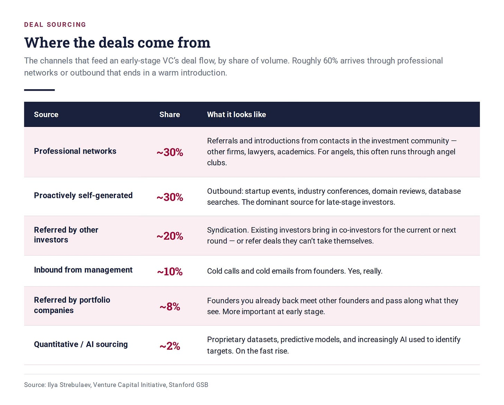
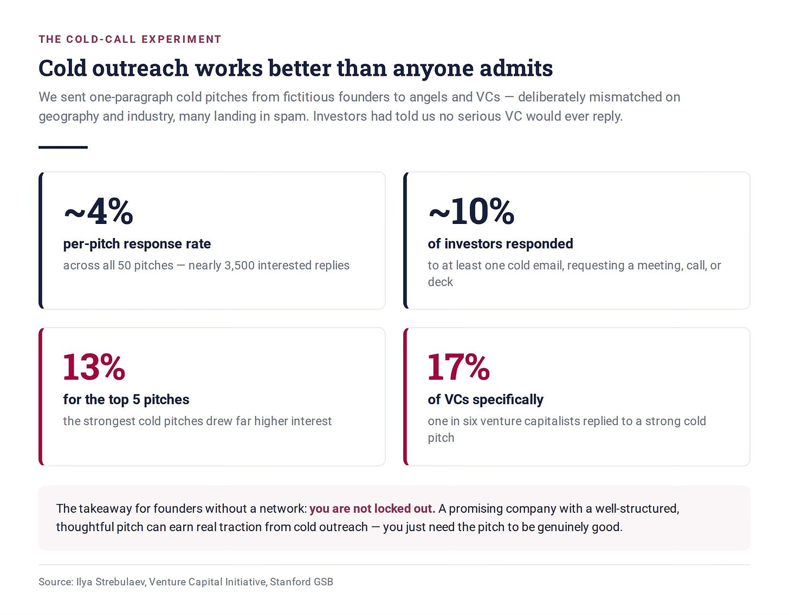
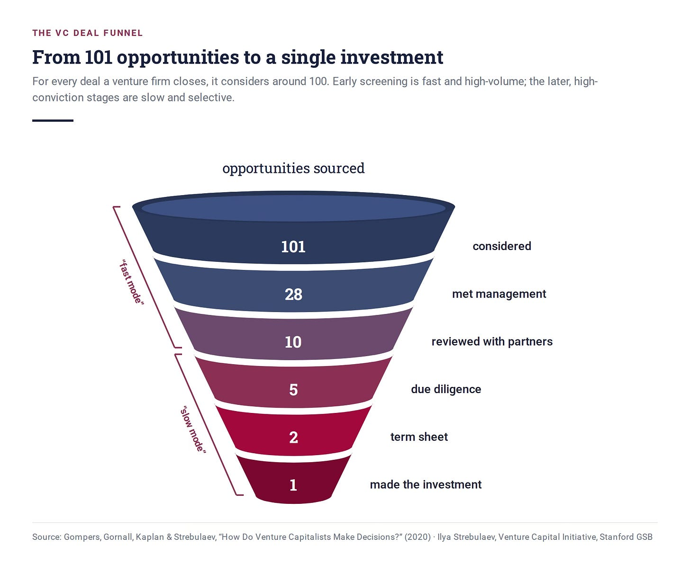
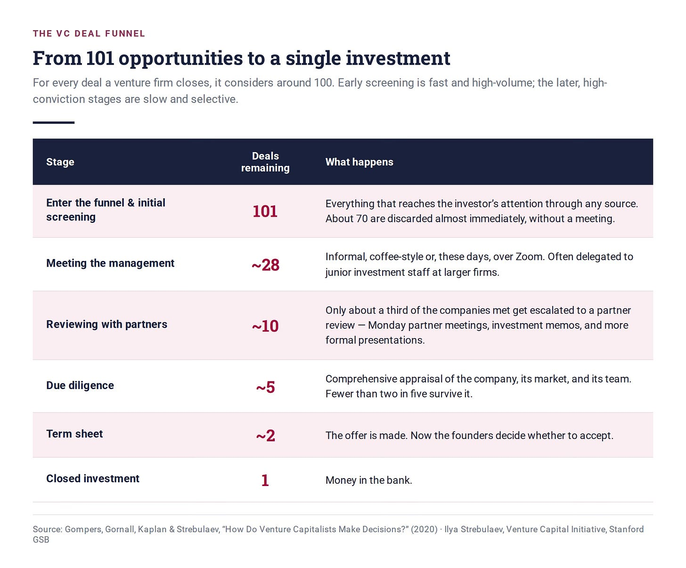
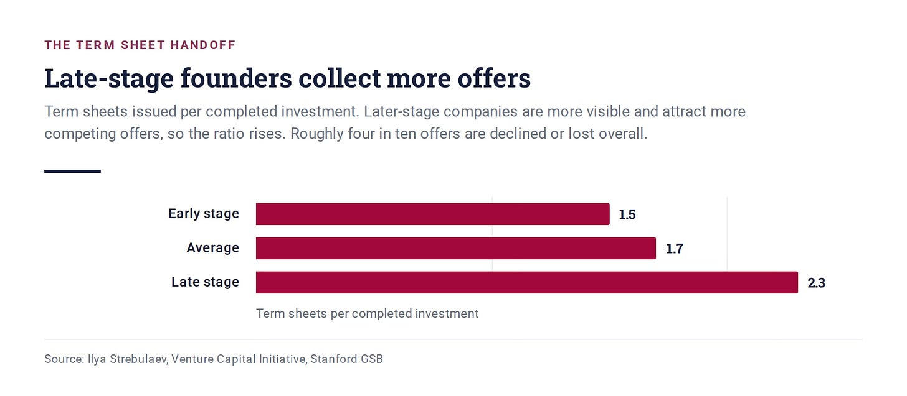

# 18/20. Воронка сделок

*Опубликовано 2026-07-20. Источник: https://ilyastrebulaev.substack.com/p/the-deal-funnel-why-vcs-say-no-to*

Средний венчурный капиталист (venture capitalist, VC) просматривает больше 100 стартапов, прежде чем сделать одну инвестицию. Конкретно: моё исследование показывает, что среднее число стартапов на одну закрытую инвестицию — 101.

Это замечательная цифра, над которой стоит подумать каждому фаундеру и каждому инвестору. Сто одна компания, которые зашли достаточно далеко, чтобы попасть в воронку сделок венчурного инвестора, отобрали измеримую долю его внимания — и затем почти все были отброшены. Если вы фаундер и собираетесь поднимать раунд, вот число, против которого вы играете. Если вы инвестор, вот механизм, который вы крутите, рисовали вы его на бумаге или нет.

У инвесторов с фокусом на IT цифра поднимается примерно до 150. У ранних инвесторов — около 120. У венчурных инвесторов в здравоохранении — 78 стартапов на одну закрытую сделку. (Если вам интересно, почему здравоохранение так отличается: оценивать такие инвестиции труднее, и вселенная фаундеров в здравоохранении меньше.) Как ни режь отрасль, соотношение жестокое. На каждую сделку инвесторы быстро оценивают небольшое число сигналов с высоким весом и решают, заслуживает ли эта сделка ещё одного дефицитного ресурса — времени. По мере того как стартап движется по воронке сделок, инвесторы меняют способы, которыми оценивают качество сделки и её перспективы.

Этот урок — о том, откуда берутся эти сто сделок и как их отфильтровывают до одной. Понимать воронку фаундеру нельзя по желанию: если не знаешь, как работает фильтр, с большей вероятностью окажешься не с той стороны. А если вы инвестор, надеюсь, вы внимательно пересмотрите свою воронку и сверите записи, когда дочитаете.

## Сначала сделки нужно найти

Прежде чем инвесторы что-то оценят, им нужно это найти. **Поиск сделок** (deal sourcing) — процесс, которым инвесторы находят потенциальные инвестиционные возможности. В отрасли эти возможности просто называют **сделками** (deals).

Многие венчурные инвесторы твёрдо верят: поиск — критический ингредиент их секретного соуса. Это особенно верно на самых ранних стадиях, где неопределённость огромна и нет централизованного справочника, который скажет, какие компании существуют и какие из них хороши. Инвесторы особенно голодны до проприетарных сделок (proprietary deals): возможностей, которые видят только они, или которые видят раньше всех остальных. Ещё недавно многие венчурные инвесторы сосредоточились на том, чтобы пестовать проприетарные сделки. Это по-прежнему верно, но сегодня стоимость поиска сделок со всеми новыми инструментами ИИ ниже — проприетарных сделок меньше, и венчурным инвесторам нужно искать новые способы их создавать. Больше 60% сделок не проприетарные.

Результат поиска сделок — **поток сделок** (deal flow): общее число инвестиционных возможностей, которые инвестор рассматривает, в единицу времени. У типичной активной венчурной фирмы ранней стадии поток сделок — примерно 1 000 возможностей в год. Конечно, это зависит от размера фирмы и числа людей, которые там работают. Кто-то видит несколько десятков; кто-то — многие тысячи. Количество — только половина истории. Важно качество того, что течёт внутрь, и способность инвестора правильно выбрать из этого потока.

Откуда сделки на самом деле берутся? Примерно, в порядке объёма:

Несколько пунктов стоит разобрать.

**Про активную самостоятельную генерацию.** Вот как это работает в одной венчурной фирме с несколькими генеральными партнёрами (general partners) и ассоциированными сотрудниками (associates). Вся инвестиционная команда формулирует тезис и сужает его до конкретного вертикального рынка. Затем ассоциированные сотрудники запускают метапоиск, чтобы найти каждый стартап в этом узком пространстве. Поиск нарочно перепроизводит — смысл в том, чтобы увидеть всё поле. Анализ потом срезает список примерно до дюжины по-настоящему интересных возможностей. Наконец команда использует профессиональную сеть, чтобы получить тёплые представления (warm introductions) к каждому. Заметьте: даже «исходящий» канал заканчивается сетевым представлением.

**Про рекомендации инвесторов.** Возьмите компанию SelfScore. Терезия Гоу (Theresia Gouw), партнёр Aspect Ventures, вложила относительно небольшой сид-чек в компанию в 2014 году. Затем она представила её Самиру Ганди (Sameer Gandhi) из Accel, и они вдвоём совместно лидировали Series A SelfScore в июне 2015. В процессе они привели третьего инвестора, Блейка Модерзицки (Blake Modersitzki) из Pelion Venture Partners, с которым раньше синдицировались. Pelion взяла небольшой кусок Series A — а затем лидировала следующий раунд в 2016. За каждым представлением стояли настоящие деньги. Именно поэтому рекомендации инвесторов вызывают доверие так, как большинство представлений не вызывают.

## Эксперимент с холодными письмами

Примерно одна сделка из десяти начинается с холодного обращения (cold call). Это странно: если спросить инвесторов про холодный аутрич, большинство скажет, что он не работает — они не отвечают на письма от фаундеров, которых не знают и которых им не представил доверенный источник. И всё же инвесторы любого типа, успешные и менее успешные, крупные фонды и маленькие, называют одну и ту же цифру: примерно одна из десяти.

Несколько лет назад моя исследовательская команда решила проверить это напрямую. Мы разослали короткие холодные вступительные письма ангелам и венчурным капиталистам — якобы от вымышленных предпринимателей, в каждом был абзац питча очень раннего стартапа.

Всё было против этих писем. Совпадение интересов инвестора и характеристик стартапа нарочно было неидеальным — расхождения по географии, по отрасли. И немалая часть сообщений, надо полагать, умерла в спам-фильтрах, так и не попав к человеку.

Мы не ждали многого. Наши знакомые венчурные инвесторы были ещё резче. Один известный инвестор сказал нам, без обиняков, что ответить могут какие-нибудь неудачники, но ни один разумный венчурный инвестор — ни за что.

Вот что произошло. Почти 10% инвесторов ответили интересом хотя бы на одно письмо — запросили встречу, звонок, дополнительные детали или презентацию (deck). Поскольку многие инвесторы получили больше одного питча, безусловная частота ответа на один питч была ниже, но при более чем 4% это всё равно почти 3 500 заинтересованных ответов. И распределение показательное: из 50 питчей, которые мы использовали, топ-5 набрали общую частоту ответа 13%, а среди венчурных капиталистов — 17%. Один из шести венчурных капиталистов ответил на холодный питч от этих стартапов.

Это намекает: фаундер с перспективной компанией и хорошо собранным, продуманным питчем может получить настоящий отклик от холодного аутрича. Это по-настоящему хорошая новость для предпринимателей, у которых нет сильной сети и которым нужны инвесторы.

Есть послесловие. Каждый раз, когда я показываю эти результаты залу инвесторов и упоминаю, что все нам говорили: исследование невозможно, потому что никто никогда не отвечает на холодные письма, — после лекции выстраивается очередь. Ангел за ангелом, венчурный инвестор за венчурным инвестором подходят рассказать про инвестицию, которая началась с холодного обращения фаундера.

## Зачем инвесторы так много работают над поиском

Логика разнообразного поиска простая: более широкая сеть ловит больше. Больше значит выше шанс поймать что-то исключительное. Разнообразный поиск даёт ещё одну критическую пользу: никогда не знаешь, откуда придёт та самая сверхуспешная сделка. Часто лучшие сделки приходят из неожиданных источников.

Именно поэтому ангелы вступают в ангельские группы — главная польза в том, чтобы складывать поток сделок от людей, которым доверяешь и которые эксперты в областях (и потому получают поиск), которых у тебя нет. Sand Hill Angels — полезный пример. Основанная в 2000 году, SHA — консорциум более чем 100 индивидуальных ангелов в Кремниевой долине. Она ищет главным образом по трём трубам: сайт, рекомендации членов и рекомендации синдицированных венчурных инвесторов или акселераторов. Заявители с сайта подаются через платформу для управления возможностями ангельской группы. Но большинство реальных инвестиций приходит из рекомендаций членов. Члены SHA каждый год приходят на мой стэнфордский венчурный курс делиться опытом. Один за другим говорят: главная причина, по которой вступили, — делиться качественным потоком сделок от доверенных людей, экспертов в своих областях: диверсифицировать и поток, и итоговый портфель и опираться на совокупное знание группы. Чтобы ещё шире открыть диафрагму, SHA годы была ограниченным партнёром (limited partner) в акселераторах вроде 500 Startups: это расширило поток сделок и дало группе доступ к внешней экспертизе. Неудивительно, что в моих рейтингах инвесторов в единорогов SHA оказывается близко к вершине среди акселераторов и ангельских клубов.

Для новых инвесторов — скажем, только что нанятого ассоциированного сотрудника венчурной фирмы — построить личную сеть поиска почти наверху списка приоритетов, и не зря: поток сделок — то, что венчурные инвесторы считают своим главным вкладом, тем, что их отличает. Ходить на презентации стартапов, отраслевые конференции и расширять разнородный список контактов увеличивает число потенциальных сделок, которые вам встречаются. Репутация компаундится: станьте известны как человек, который по-настоящему помогает фаундерам и разбирается в конкретном пространстве, — и поток растёт. Как любит говорить моим MBA-студентам мой сопреподаватель Брайан Джейкобс (Brian Jacobs): «лучший день, чтобы увеличить записную книжку, был вчера». Но никогда не поздно.

Диверсификация источников критична. Если вы пользуетесь LinkedIn, мой совет — проверьте, насколько разнообразны ваши контакты: география, отрасль, образование, роль, тип компаний. Если большинство контактов из одной отрасли, одной географии или одной школы, как инвестор вы с меньшей вероятностью будете успешны.

Но ничто не генерирует поток сделок так, как успех. В инвестициях ранней стадии успех рождает успех. Инвестору, которого связывают с одной великой проприетарной сделкой, следующие достанутся гораздо легче. Мы с Блейком Джексоном (Blake Jackson) недавно посмотрели на венчурных инвесторов, которые едва попали в список Midas, который Forbes публикует каждый год. Мы сравнили их с венчурными инвесторами, которые, по нашему разбору, были сразу за топ-100. Они были очень близко, но не попали. Если вы номер 99, а другой инвестор — номер 101, можно подумать, что разница маленькая. Мы нашли, что разница большая. Попадание в список Midas заметно увеличивает способность делать больше инвестиций (эта находка настолько интересная, что я посвящу ей отдельный материал).

Практические следствия. Инвестору: серьёзно подумайте о сети и поиске. Вспомните успешные сделки в вашем пространстве или географии, которые *не* попали в ваш поток. Как это случилось и что сделать, чтобы не повторилось? В конце концов важно качество поиска. Если лучшие сделки даже не вошли в вашу воронку — что-то серьёзно не так. Моё исследование находит: то, что на самом деле отличает великих венчурных инвесторов, — качество их сети рекомендаций и механизмов поиска. Обратите на это внимание.

Фаундеру: тёплое интро обычно лучше холодного письма, но не отчаивайтесь из-за холодных писем, если делаете их хорошо. И ещё: я сказал «обычно» в предыдущем предложении — важно качество тёплого интро. Приносил ли ваш представляющий успешные сделки этим венчурным инвесторам раньше? Какая у него репутация? Ещё лучше: подумайте, что сделать, чтобы венчурные инвесторы сами выходили на вас, а не наоборот. Или если выходите на венчурного инвестора — сделайте это до того, как вам нужно поднимать деньги. Как Скотт Санделл (Scott Sandell), очень успешный венчурный инвестор, сказал моему стэнфордскому MBA-классу: «Если просишь денег, венчурные инвесторы дают советы. Если просишь совета, венчурные инвесторы дают деньги». Это очень верно.

## Внутри воронки: от 101 к одной

Венчурные инвесторы говорят, что тратят около 15 часов в неделю на поиск и отсев сделок. Единственное, что забирает у них больше времени, — помощь существующим портфельным компаниям, 18 часов. Так что процесс отсева — от взгляда на вступительное письмо до финального инвестиционного решения — существенная доля работы венчурного инвестора.

Вот форма типичной воронки сделок ранней стадии:

Смотрите, где воронка сужается резче всего. На самом верху — и это не случайность. Каждая следующая стадия стоит инвестору драматически больше времени, чем предыдущая, поэтому самый дешёвый фильтр должен делать самую тяжёлую работу.

**Первичный отсев** (initial screening) — место, где умирают примерно 70 из 100 возможностей, обычно за минуты и вообще без встречи. Здесь инвесторы различаются: крупные фонды охотнее встречаются с фаундерами, вероятно потому что у них есть младший персонал, которому можно делегировать разведывательные встречи. Калифорнийские инвесторы тоже чаще встречаются — вероятно, потому что чувствуют конкурентное давление. Важно: мои данные показывают, что более успешные инвесторы тоже охотнее берут встречи. Это меня не удивило: в предыдущем исследовании более успешные инвесторы также чаще отвечали на холодные письма фаундеров. (Они также готовы прогонять больше сделок через следующие дорогие стадии отсева: пот в венчурном мире окупается.) Так или иначе, заголовок везде один. Больше половины, часто три четверти, отпадают почти сразу у венчурного инвестора любого типа.

Часть этого может быть простым несовпадением. Стартап может быть слишком ранним для инвесторов, или вне их вертикали, или в неправильной географии. Любой фаундер, который чего-то стоит, должен знать мандат инвестора, прежде чем к нему идти. Гораздо интереснее вопрос, почему инвесторы отказывают сделкам, которые *в* их пространстве, на их стадии, в их географии. Этому будет посвящён отдельный материал.

**Встреча с менеджментом** (meeting the management) на поверхности неформальна — кофе или звонок в Zoom, слайды не обязательны. Фаундерам не стоит строить иллюзий о том, что происходит. Их и их компанию оценивают, рассматривают и сравнивают с тысячами других команд и идей и с паттернами успеха, которые инвестору знакомы. Инвестор решает, эскалировать ли. Я использую слово «эскалировать» нарочно. Получасовая встреча по-настоящему дорогая, когда вы смотрите 200 сделок в год. Но следующая стадия гораздо дороже: она значит часы и часы вашего времени и времени других людей на одну сделку.

**Разбор с партнёрами** (reviewing with partners) — место, где воронка схлопывается сильнее всего: проходят только около 10 из исходных 100, примерно треть тех, кто получил встречу. В Кремниевой долине и большинстве других хабов традиционный день для этого — понедельник. Обсуждение идёт с коротким инвестиционным меморандумом (investment memo), который суммирует сделку, её плюсы, её риски; часто с презентацией фаундеров всему партнёрству или ангельскому клубу. На этой стадии инвесторы могут выйти и за пределы фирмы: позвонить академикам или отраслевым руководителям, чтобы оценить потенциал продукта и интерес рынка.

Вынести сделку к партнёрам — решение нелёгкое, и причина только отчасти во времени. Инвесторам важна репутация внутри собственной фирмы. Никто не хочет быть партнёром, который потратил всем понедельник на слабую сделку.

**Должная проверка** (due diligence, DD) — в отраслевом жаргоне просто DD — это всесторонняя оценка потенциальной инвестиции (конечно, «всесторонняя» зависит от стадии стартапа). Конкретные шаги меняются со стадией и с тем, сколько данных существует. Из каждых пяти сделок, которые входят в DD, с другой стороны выходят меньше двух. Те, что выходят, получают термшит (term sheet): документ, который суммирует условия, на которых инвестор готов инвестировать.

И затем эстафетная палочка меняет руки. До этого момента фаундеры убеждали инвестора. Как только термшит лёг на стол, решают фаундеры — принять, торговаться или отказаться и продолжать разговаривать с другими. Поэтому в среднем на одну завершённую инвестицию нужно 1,7 термшита. Это соотношение 1,5 на ранней стадии и 2,3 на поздней: компании поздней стадии виднее, дают меньше проприетарного доступа и привлекают больше конкурирующих офферов.

Несколько (очень важных!) практических следствий для фаундеров. Во-первых: когда вы поднимаете деньги, всегда знайте, где вы находитесь в воронке сделок у каждого инвестора, на которого целитесь. Потому что то, как к нему подходить, и весь процесс меняются, пока вы движетесь по воронке. Так часто я вижу фаундеров с одним и тем же письмом и одной и той же колодой на все стадии: это ошибка. На первичном отсеве инвесторы на самом деле не решают инвестировать: они решают, эскалировать ли и потратить на вас больше усилий. На более поздней стадии они задают другие вопросы. Когда вас пригласили встретиться с другим партнёром, вы один из десяти — отличный прогресс! Но требования тоже меняются.

Запомните: на первичном отсеве отправьте письмо, которое выживает 30 секунд; на стадии встречи с менеджментом готовьтесь к 30-минутному разговору, который эскалирует в due diligence; на стадии DD помогите подготовить меморандум, который кто-то другой напишет о вас людям, с которыми вы, возможно, никогда не встречались. Ещё раз: одна из самых частых ошибок, которые я вижу, — фаундеры готовят одну колоду, один разговор, одну линию аргументов на все стадии.

Во-вторых, хорошая стратегия — быть полезным инвесторам. Венчурные инвесторы чудовищно заняты. Помогите им: предугадайте все вопросы, которые они хотят задать (есть список из 100+ вопросов, которые задают венчурные инвесторы). Подготовьте материалы DD, которые они смогут отдать партнёрам.

В-третьих, фаундеры часто спрашивают меня, имеет ли смысл встречаться с младшим персоналом крупных венчурных фирм. Я бы сказал да, потому что они работают как скауты сделок. Они не могут выписать чек, но могут представить вас нужному партнёру, который будет принимать решение. Но осторожно: моё любимое выражение — «стимулы определяют поведение» (incentives drive behavior). У младших венчурных сотрудников могут быть стимулы помимо максимизации доходности для их LP; им важны репутация и карьера, и многое зависит от их положения и отношений с более старшими партнёрами. Снова: помогите младшим венчурным сотрудникам — узнайте о них. Самое важное: узнайте, кто правильный человек в целевой венчурной фирме. В конце концов, даже если инвестирует фонд, ваши долгосрочные отношения будут с одним партнёром.

## Воронка — не закон природы

Всё выше — представительное, не универсальное. Каждая фирма вырабатывает свой причудливый процесс и свою культуру решений. Для инвесторов это возможность учиться у других венчурных инвесторов. Для фаундеров процесс из-за этого хитрее. Младшие венчурные сотрудники здесь могут помочь, если вы наладили с ними хороший контакт: попробуйте выяснить, как принимают решения и кто их принимает.

Один венчурный инвестор, которого я знаю, партнёр фонда средней величины на ранней IT-стадии, приводит фаундеров на формальную презентацию всему партнёрству *в конце* due diligence — к этому моменту решение предложить термшит по сути уже принято. Другой, партнёр фирмы из четырёх-пяти человек, сам принимает инвестиционные решения до финансового порога; партнёры советуют друг другу, но каждый владеет своим решением. Это полностью меняет форму воронки.

Стадия тоже её меняет. У компаний поздней стадии более жёсткие финансовые данные и подробная информация о клиентах, и эти данные чувствительны. Они откроются только инвесторам, достаточно серьёзным, чтобы показать приверженность. Поэтому порядок переворачивается: инвестор выпускает термшит, *условный* (contingent) на дальнейшую проверку, и только если условия приемлемы, компания открывает комнату данных (data room).

А конкуренция может сжать воронку или взорвать её полностью. Когда стартап явно горячий и конкурент кладёт термшит на стол, инвестору, возможно, придётся со скоростью молнии решить, бросать ли в ринг конкурирующий оффер — без нормального разбора, без проверки, на свой риск.

Отсюда — превентивные термшиты (preemptive term sheets). Иногда венчурный инвестор предложит такой до любой формальной проверки — специально чтобы закрыть сделку. Эти термшиты эксклюзивные: подписал — и обязан добросовестно вести переговоры с этим инвестором и не выставлять сделку на витрину одновременно. Расчёт инвестора: эта компания соберёт толпу, и скорость бьёт процесс. Это вероятнее, если инвестор уже знает фаундеров, возможно в другом качестве (скажем, как сотрудника компании, которую инвестор раньше поддержал).

Фаундерам, которые получают превентивный термшит, стоит спросить, в чём логика. Здесь настоящий компромисс. Синица в руках — один рабочий подписанный термшит — лучше перспективы нескольких. Но несколько термшитов улучшают переговорную силу и повышают шансы найти инвестора, который действительно подходит. Что фаундеры обязаны зафиксировать — сигнал: превенция значит, что инвестор верит, что вы вот-вот станете горячими. Это информация, и ею нужно пользоваться.

## Ключевые выводы

- **Воронка — машина распределения времени, а не только машина обнаружения качества.** Каждая стадия стоит дороже предыдущей, поэтому 70% сделок умирают на самом дешёвом фильтре. Инвесторы наверху воронки не ленятся — они экономят, потому что альтернатива: тратить настоящие часы на компании, которым они и так собирались отказать.
- **Поиск — это сеть, и сети компаундятся.** Примерно 60% сделок приходят через профессиональные сети или проактивный исходящий поиск, который заканчивается сетевым представлением. Поэтому инвесторы относятся к репутации как к активу и поэтому успех рождает успех. Поэтому фаундерам стоит думать не только о том, представят ли их, но и о том, кто представляет.
- **Холодный аутрич работает лучше, чем кто-либо признаёт.** Одна сделка из десяти начинается так, а наш эксперимент нашёл почти 10% инвесторов, которые с интересом ответили на холодное письмо от незнакомца — и до одного из шести венчурных капиталистов на самых сильных питчах. Если у вас нет сети, вы не заперты снаружи. Просто питч должен быть по-настоящему хорошим.
- **Термшит — это передача эстафеты, а не финиш.** Чтобы получить одну инвестицию, нужно 1,7 термшита: примерно четыре из десяти офферов отклоняют или теряют. В момент, когда инвестор берёт на себя обязательство, рычаг переходит к вам — а превентивный оффер: самый громкий сигнал, который вы когда-либо получите, что другие инвесторы вот-вот захотят войти.

Дальше: 19/20. Команда или рынок
