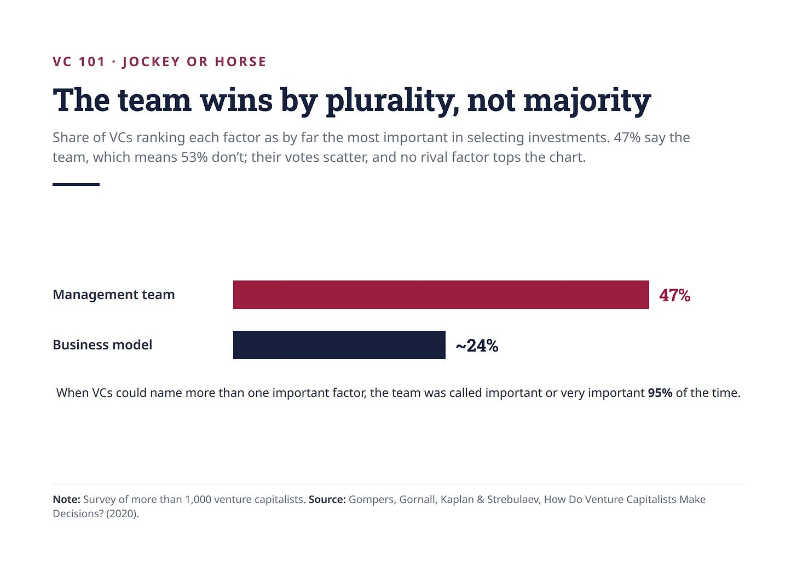
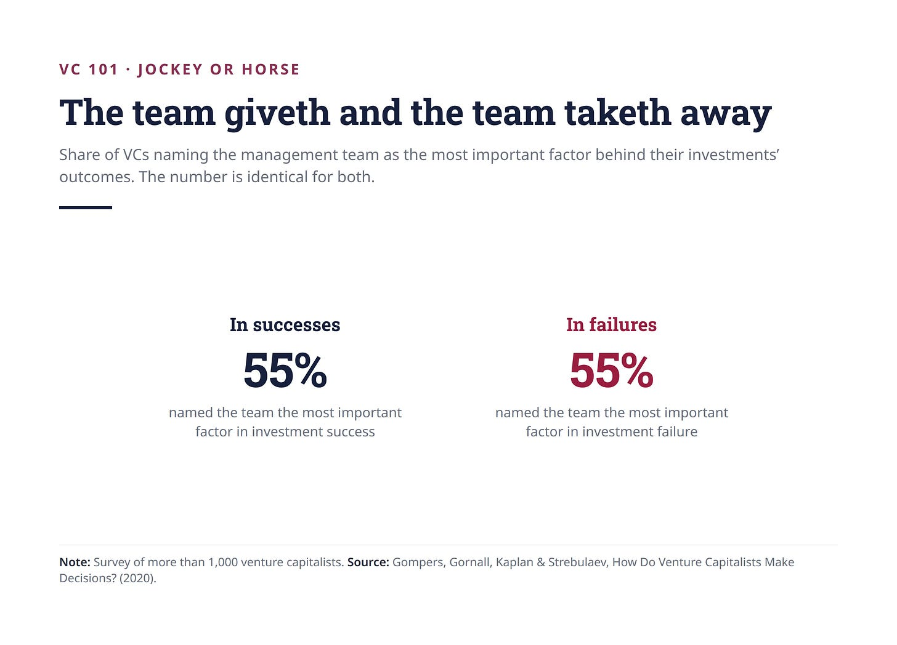
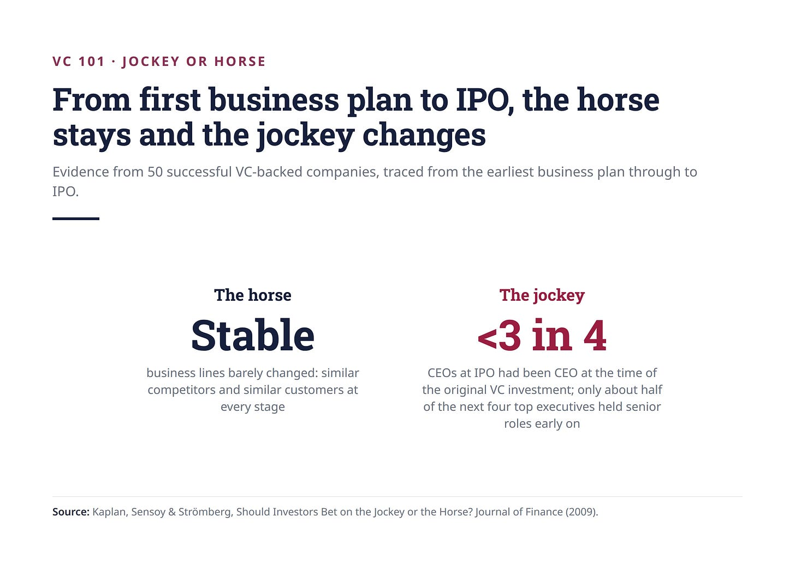

# 19/20. Команда или рынок

*Опубликовано 2026-08-07. Источник: https://ilyastrebulaev.substack.com/p/jockey-or-horse-the-oldest-debate*

В середине 1980-х Дон Валентайн (Don Valentine) из Sequoia смотрел на маленький сетевой стартап под названием Cisco. Многие инвесторы уже отказали — и отказали по одной причине: команда менеджмента выглядела слабой.

Валентайн всё равно инвестировал. Он считал, что рынок продукта Cisco огромен. Затем он по сути сразу заменил команду основателей.

Cisco затем доминировала в компьютерных сетях. История знаменита среди инвесторов и печально известна среди предпринимателей — и стоит в центре самого старого нерешённого спора в венчурном капитале: ставить на жокея (jockey) или на лошадь (horse)?

## Доводы в пользу жокея

Классическую формулировку дал генерал Жорж Дорио (George Doriot), основатель современной венчурной индустрии: дайте мне команду менеджмента уровня A с продуктовой идеей уровня B или команду уровня B с продуктовой идеей уровня A — и я каждый раз возьму первую.

Один из основателей Greylock хорошо сформулировал логику. Инвестиция в предпринимательскую компанию — марафон, не спринт. Правила игры изменятся: конкурентный ландшафт сдвинется, и компанию придётся перепозиционировать — не на 180 градусов, а на 15 или 20, пока вы её строите. Команда A этот поворот исполнит. Слабая команда, какой бы хорошей ни была исходная продуктовая идея, с высокой вероятностью его не пройдёт.

Этот довод — про адаптивность в условиях неопределённости, и он по-настоящему сильный. Большинство сегодняшних венчурных капиталистов с ним согласны. Вот что показывает моё исследование:

Из более чем тысячи опрошенных венчурных инвесторов 47% говорят, что команда — безусловно самый важный фактор отбора. Фактор на втором месте, бизнес-модель (business model), набирает лишь половину стольких. Инвесторы ранней стадии кладут на команду больший вес, чем инвесторы поздней стадии, — это интуитивно понятно, — но даже поздние инвесторы ставят её далеко выше всего остального. И неудивительно: когда мы разрешили венчурным инвесторам назвать больше одного важного фактора, команду назвали важной или очень важной в 95% случаев.

Мы подошли к вопросу и с другого конца: спросили, что двигает успешные и провальные инвестиции. Снова команда, с большим отрывом, и — поразительно — симметрично. Пятьдесят пять процентов назвали команду самым важным фактором успеха, и те же самые 55% назвали её фактором провала. Команда даёт — и команда забирает.

Фаундеры, заметьте: только одна группа поставила команду на второе место — венчурные инвесторы в здравоохранении, и даже там это было ноздря в ноздрю с продуктом. Причина поучительная. В инновациях здравоохранения инвесторы ожидают, что продукт к моменту инвестиции будет существенно дальше, и, прямо говоря, команду менеджмента легче заменить, когда продукт уже есть.

## Доводы в пользу лошади

Значит, вопрос закрыт. Кроме того, что нет — по причине, которую легко пропустить, если смотреть только на заголовочную цифру.

Сорок семь процентов говорят, что команда важнее всего. Значит, пятьдесят три процента так не считают. Они просто не согласны друг с другом, что важнее всего вместо этого, поэтому их голоса размазываются по нескольким факторам, и ни одна альтернатива не возглавляет таблицу. Команда побеждает по относительному большинству (plurality), не по абсолютному (majority).

И некоторые из самых легендарных инвесторов отрасли твёрдо в другом лагере. Том Перкинс (Tom Perkins), сооснователь Kleiner Perkins, оценивал прежде всего технологическую позицию компании: превосходит ли технология альтернативы и является ли она проприетарной? Ставка Валентайна на Cisco была чистым рыночным пари, сделанным при явном знании, что команда — слабое место, из теории, что команду можно заменить.

В этом суть довода про лошадь. Команды можно менять; рынки — нет.

Есть и более жёсткая версия довода, которую редко произносят вслух. В идеальном мире инвесторы выбирали бы компании и с сильным бизнесом, и с сильной командой. В реальности эта комбинация по сути никогда не появляется — а когда кажется, что появилась, опытные инвесторы предполагают, что что-то упускают. Что на самом деле приходит — компания с относительно более слабой командой менеджмента или относительно более слабым бизнесом. Так что вопрос не в том, что вы предпочитаете. Вопрос в том, какую слабость вы готовы подписать.

Заметьте также, что здесь на самом деле значит «слабее». Это покрывает неопределённость не меньше, чем недостаток. О лидерских качествах фаундера-новичка известно гораздо меньше, чем о рынке, который уже существует и который можно измерить. Фаундер-новичок не обязательно хуже. Его труднее прочитать. А инвесторы, которые быстро решают под давлением времени, систематически дисконтируют то, что не могут прочитать. С другой стороны, представьте рынки, которых ещё нет, — как ИИ до самого недавнего времени. Тогда неопределённость рынка настолько велика, что качество команды не только критичнее, но и, относительно говоря, менее определённо. Этим объясняется, почему в здравоохранении, например, качество команды менеджмента менее важно: не потому что качество команды не важно, а потому что остальные параметры «лошади» — рынок, продукт, бизнес-модель — менее неопределённы.

## Что говорят исследования

Вопрос «жокей против лошади» мучительно трудно изучать в поле, но Стивен Каплан (Steven Kaplan) из University of Chicago, Берк Сенсой (Berk Sensoy), сейчас в Vanderbilt University, и Пер Стрёмберг (Per Strömberg), сейчас в Stockholm School of Economics, нашли остроумный вход. Они взяли 50 успешных компаний с венчурным капиталом и проследили эволюцию их характеристик от самого раннего бизнес-плана до IPO. Исследование замечательно доступом: бизнес-планы в нескольких точках жизненного цикла, которые почти никогда не сохраняются в виде, доступном исследователям.

Отступление: есть много отличных академических исследований венчурного капитала и предпринимательства, которые сделали мои коллеги по всему миру, и их стоило бы знать лучше.

Находки были однобокими. Линии бизнеса были поразительно стабильны. Эти компании конкурировали с похожими конкурентами и продавали похожим клиентам на каждой стадии. Лошадь, иначе говоря, почти не менялась.

Жокей менялся постоянно. Меньше трёх четвертей CEO на момент IPO были CEO в момент исходной венчурной инвестиции. Из следующих четырёх топ-руководителей на IPO только около половины были на старших ролях на ранней стадии. Сменяемость менеджмента была существенной и обыденной.

Следствие бьёт по тому, что инвесторы говорят о себе: на пределе инвесторы в стартапы кладут больше веса на лошадь, чем на команду менеджмента, если судить по эволюции стартапов. Что бы они ни думали, что делают, бизнесы сохраняются, а людей заменяют.

Это стыкуется с более ранней работой Stanford Project on Emerging Companies, крупной инициативы 1990-х по изучению быстрорастущих компаний ранней стадии. Исследователи там отслеживали эволюцию команд топ-менеджмента и нашли: характеристики человеческого капитала команд основателей не предсказывали ни венчурное финансирование, ни выход на биржу.

Эти находки друг другу не противоречат. Когда венчурные инвесторы инвестируют, качество команды менеджмента важно драматически. Но поскольку многие команды менеджмента исполняют плохо, со временем их заменяют. Это связано со следующим пунктом. Фаундеры и те, кто хочет ими стать, внимание!

## Очень ранняя стадия против всего остального

У этих исследований есть одна оговорка, которую нужно обсудить. Данные приходят со стадии роста, после того как фирма уже создана. В исследовании 50 компаний с венчурным капиталом медианная компания уже была 23 месяца от роду к моменту анализируемого бизнес-плана. Почти два года. К тому времени бизнес существует, клиенты существуют, и вопрос, кто это основал, уже отошёл назад.

Роль команды на по-настоящему ранней стадии гораздо важнее, и на это тоже есть свидетельства. Амар Бхиде (Amar Bhide) в Columbia University изучил 100 компаний из списка Inc. Magazine 500 самых быстрорастущих. Он нашёл, что фаундеры обычно воспроизводили или модифицировали идею, встреченную на предыдущей работе, и относительно мало формально планировали перед стартом. В результате эти компании были сильно склонны корректировать исходные бизнес-концепции. Хотя исследование сделано довольно давно, базовый механизм совпадает с моим опытом.

Если бизнес-концепция при рождении текуча, если саму лошадь ещё выбирают, то фаундер — единственный стабильный вход, и его качество, так сказать, менее неопределённо. На этой стадии предприниматель — безусловно более критический ресурс.

Так что два массива свидетельств могут вообще не конфликтовать. Они могут просто описывать разные моменты. При рождении жокей выбирает лошадь. К 23-му месяцу лошадь уже бежит, и жокея можно заменить.

## Где инвесторы на самом деле не согласны

Есть способ прочитать все эти данные, который, мне кажется, полезнее, чем выбрать сторону.

Вспомните из предыдущего материала: 95% инвесторов говорят, что команда — важный фактор. Теперь поставьте рядом 47%, которые ставят её самой важной. Разрыв между этими двумя цифрами, почти половина рынка, — это инвесторы, которые команду внимательно учитывают, а затем решают, что что-то другое важнее.

Этот разрыв — реальная структура рынка. Инвесторы не спорят о том, какие факторы существуют; они спорят о весах. И поскольку они спорят о весах, одна и та же компания по-настоящему является разной инвестиционной ставкой для разных инвесторов, что бы ни говорила колода. Разница сидит в функции оценки.

Исключение здравоохранения делает это конкретным. Венчурные инвесторы в здравоохранении — единственная группа, которая не ставит команду первой, и причина, как я думаю, прямая: к моменту инвестиции продукт с большей вероятностью уже существенно развит, а развитый продукт делает команду более заменимой. Те же инвесторы, те же инстинкты, другие веса — целиком из-за того, как выглядит актив в момент инвестиции.

Что подсказывает честную версию вопроса «жокей или лошадь»: не «что важнее?», а «что важнее на этой стадии, в этой отрасли, для этой сделки?» У этого вопроса есть ответы.

## Что это значит на практике

Отсюда следует несколько вещей, которые важно держать в голове фаундерам и инвесторам.

- **Фаундерам:** практический факт в том, что инвесторы, которых вы встречаете, будут существенно различаться в весах, которые кладут на эти факторы. Ученик Дорио и ученик Валентайна проведут одну и ту же встречу и услышат совершенно разные вещи. Знать, напротив кого вы сидите, стоит больше любой полировки колоды. Задайте себе и такой вопрос: на этой стадии неопределённее качество моей лошади или качество моей команды? И как веса на этой стадии выглядят по сравнению с похожими компаниями с точки зрения инвестора?
- **Инвесторам:** есть структурный сдвиг, который стоит заметить. Фаундеры всё чаще ищут финансирование на более ранней стадии развития компании, и это делает команду более критическим фактором, чем раньше. Я действительно думаю, что именно поэтому ученики Дорио выигрывают в последние годы. Но это режет в обе стороны. Чем раньше вы поддерживаете фаундеров, тем вероятнее столкнётесь с напряжением между качествами команды менеджмента и конечными нуждами фирмы. Стоит ли тогда ждать более высокой сменяемости менеджмента? Вероятно. Или стоит ждать, что контрактные условия отразят риск, который берут инвесторы и фаундеры? Тоже вероятно. Как инвестору важно думать, какие сценарии вы можете предвидеть и можете ли подготовиться к ним сейчас.

## Ключевые выводы

1. **Команда побеждает по относительному большинству, не по абсолютному.** Сорок семь процентов венчурных инвесторов называют команду самым важным фактором — значит, 53% так не считают. Они просто не согласны друг с другом насчёт альтернативы, поэтому ни один соперничающий фактор не возглавляет таблицу. Консенсус тоньше, чем кажется из заголовка.
2. **То, что инвесторы говорят, и то, что происходит с компаниями, расходится.** По 50 успешным компаниям с венчурным капиталом линии бизнеса оставались поразительно стабильными, а менеджмент постоянно сменялся: меньше трёх четвертей CEO на IPO занимали эту должность при первой инвестиции. На пределе свидетельства в пользу лошади.
3. **Большую часть работы в этом споре делает стадия.** Исследования в пользу лошади смотрели компании, которым уже было около двух лет. Работа Бхиде намекает: при настоящем рождении, когда сама бизнес-концепция ещё текуча, фаундер — единственный стабильный вход. Оба лагеря могут быть правы про разные моменты.
4. **Команду учитывают 95%, но решающей она далеко не в 95%.** Девятнадцать из двадцати инвесторов её взвешивают. Меньше половины дают ей решать. Фаундерам не стоит полагать, что сильный рассказ про команду достаточен, а инвесторам — что сослаться на команду значит иметь тезис.
5. **Знайте, в каком лагере ваш инвестор.** Ученик Дорио и ученик Валентайна просидят один и тот же питч и оценят вас по разным осям. Это можно узнать до встречи, и это должно формировать то, с чего вы начнёте.

Дальше: 20/20. Due diligence
