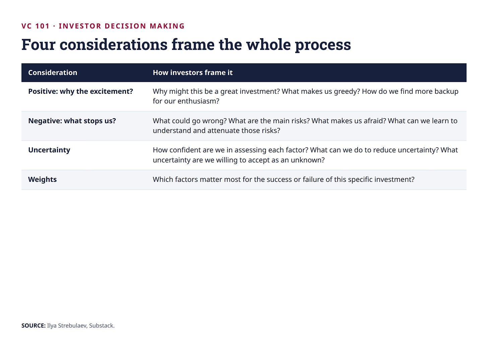
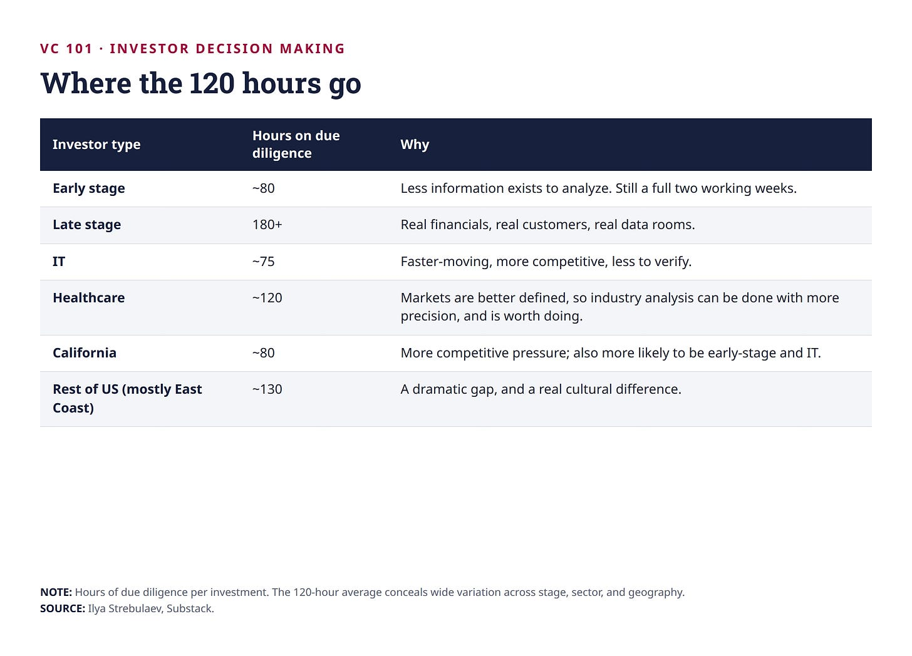
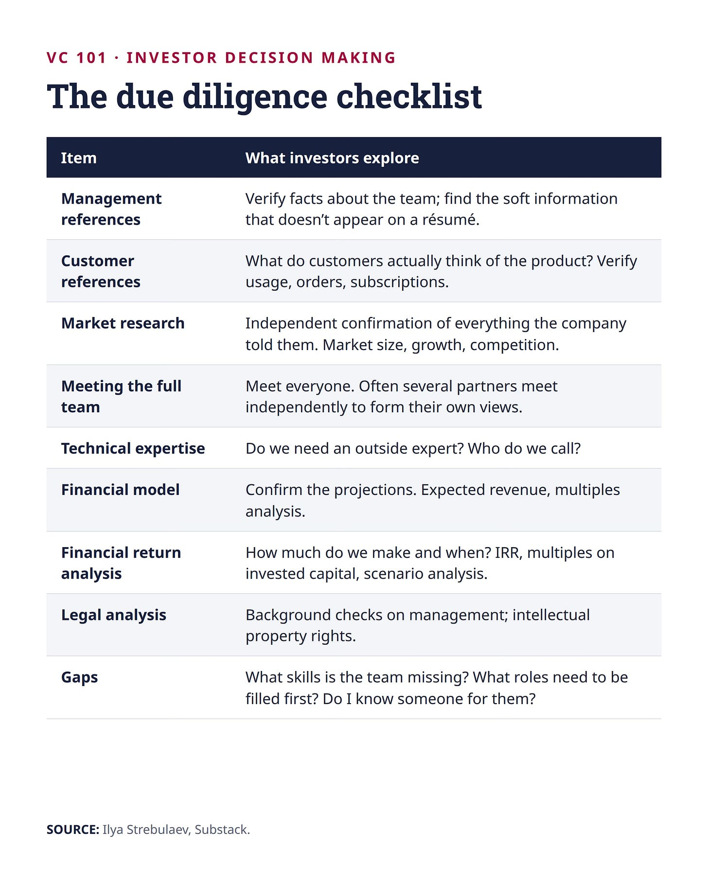
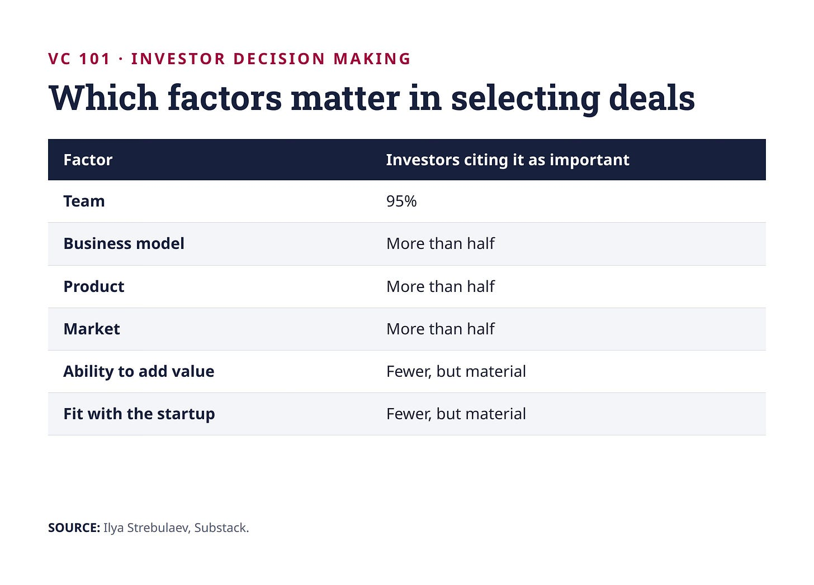
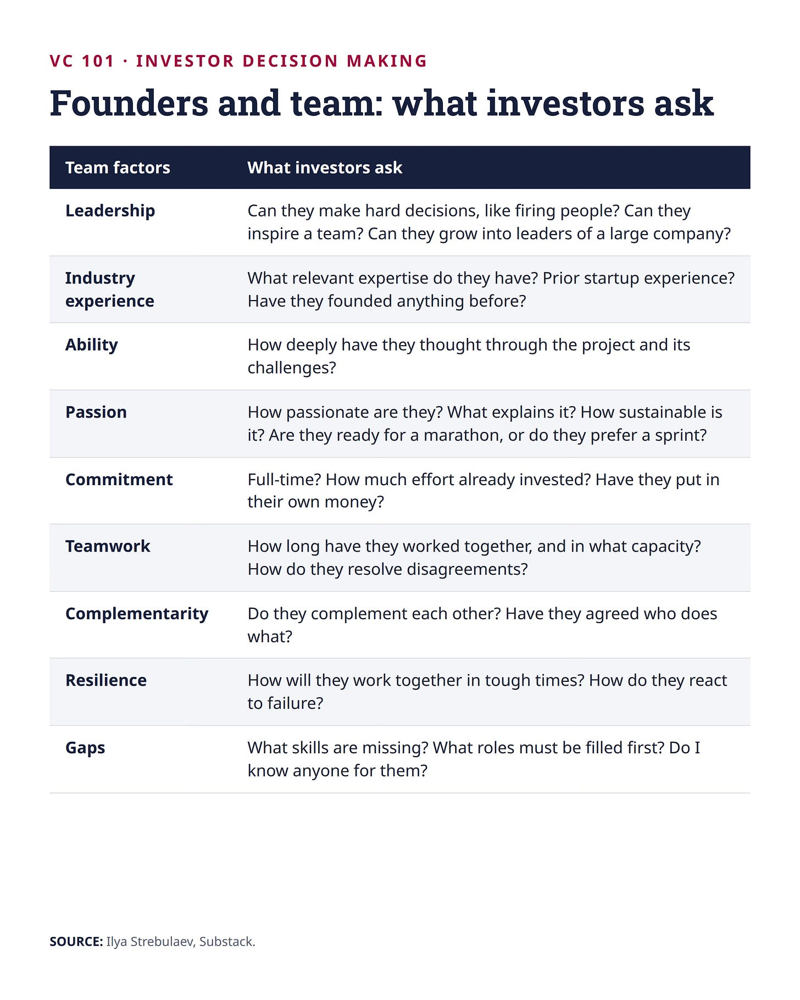
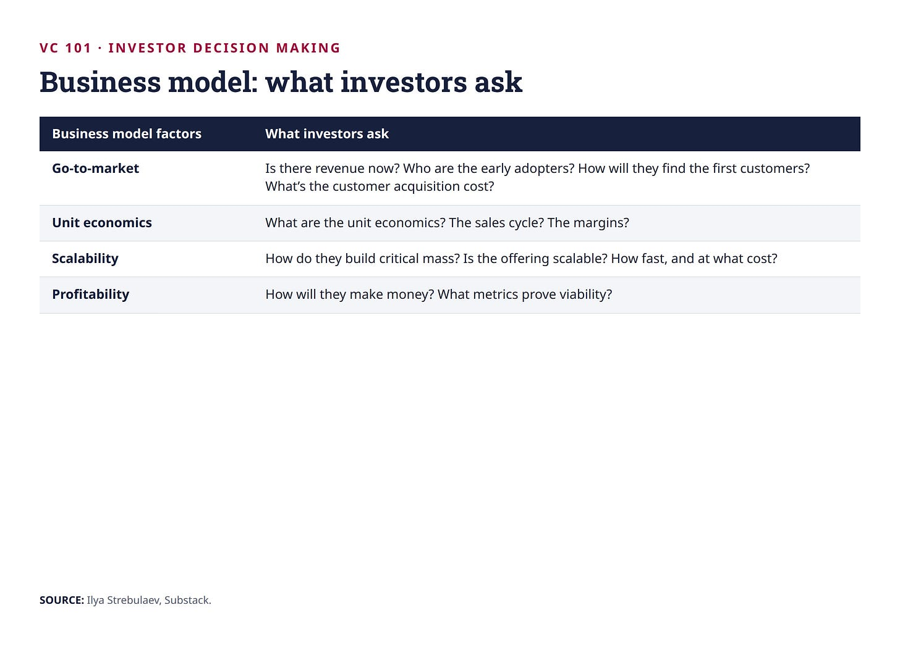
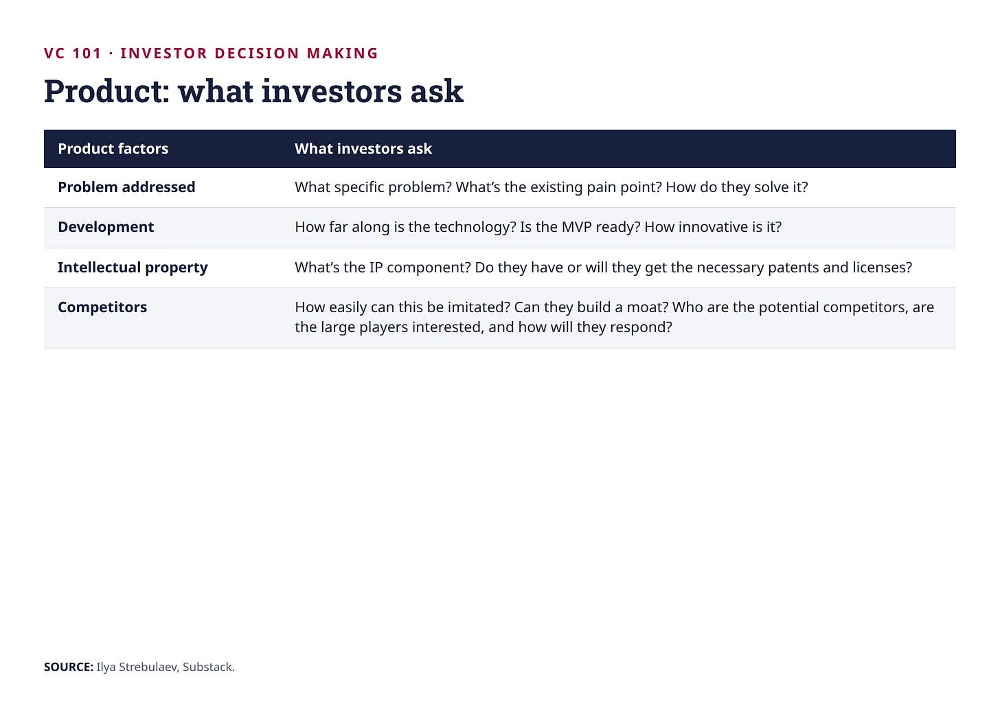
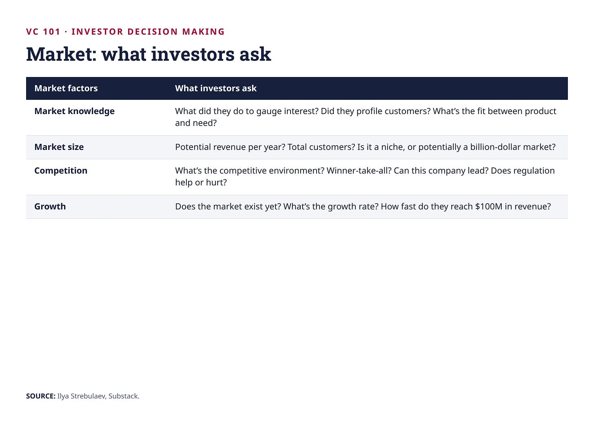
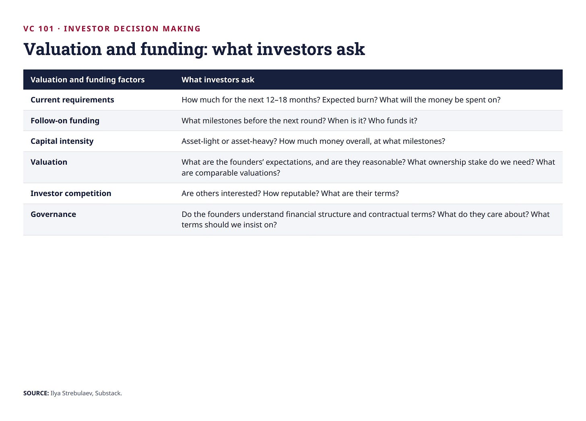
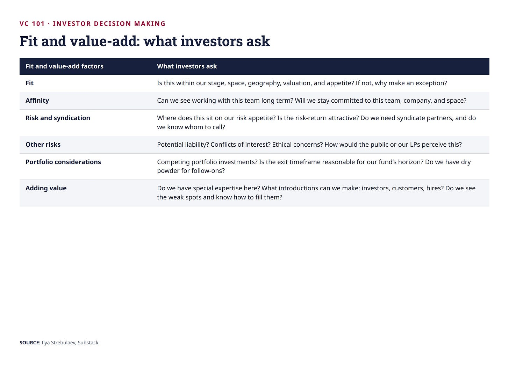

# 20/20. Due diligence

*Опубликовано 2026-08-28. Источник: https://ilyastrebulaev.substack.com/p/due-diligence-what-investors-actually*

Инвестор тратит примерно 120 часов на должную проверку (due diligence), которая в итоге приводит к инвестиции.

Но вспомните воронку. Большую часть due diligence делают по сделкам, которые никогда не закроются. Сложите часы, сожжённые на них, и реальная цифра уверенно больше 250 часов проверки на одну завершённую инвестицию. Три недели полной занятости на сделку, большую часть — на компании, которым венчурные инвесторы откажут.

Эта цифра говорит о важном: венчурные инвесторы относятся к этому серьёзно. Фаундерам она говорит то, что они редко по-настоящему усваивают: процесс длинный, и вам нужно быть живыми к его концу.

## Зеркальное отражение отсева

В материале про воронку мы смотрели на первичный отсев (initial screening): цель — отклонить как можно больше сделок как можно эффективнее, максимизируя скорость и принимая, что какие-то отличные сделки провалятся сквозь щели.

Due diligence это переворачивает. Цель теперь — собрать как можно больше относящейся к делу, всесторонней информации за разумное время, чтобы инвестор мог принять обоснованное решение. Алгоритм меняется соответственно. Наверху воронки сделок инвесторы идут по быстрой линии: ищут причину отказать. Как только сделка проходит этот порог, инвесторы переключаются на взвешивание сильных сторон против слабых — и, пока красный флаг не всплывёт снова в свете новой информации, решение больше не висит на каком-то одном перекрывающем факторе. Оно висит на комбинации.

Именно поэтому два инвестора, которые смотрят на одинаковую информацию, на этой стадии регулярно приходят к противоположным выводам. Способов взвесить факторы по сути бесконечно, и инвесторов обычно ведёт собственная история — то, что, казалось, сработало раньше. Фаундеры, заметьте. Даже если в голове есть инвестор мечты, всегда работайте больше чем с одним: всеобъемлющая неопределённость огромна.

Весь процесс держат четыре соображения:

Есть ещё кое-что, что нужно подчеркнуть: венчурная due diligence — не про азартную игру. И не про то, чтобы снять все риски. Это про то, чтобы выбрать факторы, которые вы не можете обезопасить, и честно себе в этом признаться. Фаундеры, вам нужно проработать, какие риски у вас и у стартапа инвесторы примут, а какие — нет.

## Куда уходят часы

Как подтвердило моё исследование, средние 120 часов прячут огромный разброс:

Иногда часы сжимают жестоко. Обычно причина — конкурентное давление: если у компании уже есть термшит (term sheet) или несколько, инвестору, возможно, нужно решить за ночь. И инвесторы не гнушаются подсесть на чужую работу. В синдикате лид обычно делает большую часть проверки, а остальные играют вторую роль. Остальные всё равно принимают собственные решения, но сильно опираются на работу лида.

## Что они на самом деле делают

Due diligence — не одно занятие. Это чеклист, который проходят параллельно:

Референс-звонки (reference calls) — двигатель всего этого. Инвесторы делают в среднем около десяти на сделку — восемь на ранней стадии, тринадцать на поздней. Десять разговоров о вас, вашем продукте и вашей отрасли, большинство — с людьми, которых вы не выбирали и о которых не узнаете.

Многие инвесторы, особенно в венчурных фирмах, за этот период также пишут один или несколько инвестиционных меморандумов (investment memos). Меморандум ставит всех на одну страницу и делает итоговое групповое решение эффективнее. Он также забирает настоящее время. К меморандумам вернёмся в другой лекции.

## 83 дня

Фаундерам стоит приготовиться к жёсткой правде: даже когда сделка случается, деньги приходят позже, чем вы думаете. От начала отсева сделки до закрытия в среднем проходит **83 дня**. У кого-то быстрее — Калифорния, IT, ранняя стадия, — но почти в каждой категории это всё равно не меньше двух месяцев.

Именно здесь фаундеров часто неприятно удивляет не плохой продукт и не маленький рынок, а арифметика.

Правило большого пальца: закладывайте двойной буфер. Если сделки вашего типа в среднем занимают 60 дней, держите достаточно кэша, чтобы прожить 120. Иногда больше. Если ваш кэшберн (burn) $100,000 в месяц, а закрытие занимает шесть месяцев, на старте вам нужно $1.2 million в банке — не $600,000. А по моему опыту очень многие фаундеры в этой ситуации имеют меньше $300,000! Плохо. Вы потеряете переговорную силу и не сможете получить несколько термшитов. Хуже: потеряете контроль над стартапом или останетесь без денег.

Копнём глубже: это настолько критично. Причина не только выживание. Это рычаг. Пока резервы кэша тают и процесс тянется, одновременно деградируют две вещи: мотивация сотрудников и ваша переговорная сила. Новые инвесторы — и действующие, которые доинвестируют, — чувствуют запах отчаяния и заложат его в цену. Более низкая оценка значит существенное размытие доли (dilution), и оно ложится непропорционально на обыкновенных акционеров. То есть на вас и вашу команду.

Фаундеры часто формулируют это как компромисс между несправедливым размытием от слишком раннего раунда и катастрофой от слишком позднего. Но заметьте (!): начать рано не значит закрыть рано. По мере того как вы набираете интерес, оценка может вырасти — даже если стартовая точка была более ранней.

## Факторы, которые решают

Инвесторы сталкиваются с большим числом неизвестных, чем известных, и знают, что многие инвестиции провалятся независимо от того, как сильно они работают. Такова природа этого класса активов. Но это делает проверку важнее, а не менее важной. При такой высокой частоте провалов даже чуть срезать частоту провалов осмысленно улучшает ваши шансы. Ещё важнее: хорошая проверка помогает не пропустить выброс, который оплачивает всё остальное.

Когда мы с коллегами спросили венчурных инвесторов, какие факторы важны при отборе сделок, инвесторы резко сходятся:

Девяносто пять процентов — девятнадцать из каждых двадцати инвесторов — называют команду. Но заметьте, что эта цифра говорит и чего не говорит. Она говорит, что команду учитывают почти все. Она не говорит, что команда решает. Это различие мы разбирали в предыдущем уроке, и оно спорнее, чем кажется.

Разброс между инвесторами — здесь настоящая история. Никто не ждёт идеальной сделки, где каждый фактор положительный. На самом деле, появись такая, они бы решили, что с ней что-то не так. Один управляющий партнёр крупной венчурной фирмы Кремниевой долины сказал партнёрам на инвестиционном комитете (investment committee) при мне: «Эта сделка кажется слишком хорошей. Давайте проверим ещё раз и обсудим завтра». Вместо этого существуют сильные стороны, слабые стороны и несводимые неизвестные. Где инвесторы дико расходятся — в *весах*. Значит, когда вы заходите на встречу, самая полезная вещь, которую можно знать, — на что именно этот инвестор кладёт большой вес. Это определит, больше чем что-либо ещё, как вас оценят.

## Шпаргалки

Дальше — что инвесторы на самом деле пытаются выяснить, фактор за фактором. Фаундерам: пройдите это по своей компании. Обсудите с сооснователями, менторами, советниками. Если найдёте вопрос, на который ваш ответ неудовлетворителен, поздравьте себя: вы только что нашли слабое место раньше инвестора и теперь успеете его закрыть.

Инвесторам: сделайте это конкретным. Возьмите самую свежую возможность, на которую смотрели, и прогоните через неё каждый вопрос. Любой вопрос, на который, вам кажется, ответ должен быть, а его нет, — учебный опыт.

### Фаундеры и команда

Инвесторы ищут пять качеств: отраслевой опыт, предпринимательский опыт, способность, командную работу и страсть. Они добираются до них, разговаривая с фаундерами и командой, делая референс-звонки и сопоставляя паттерны с каждым фаундером, которого встречали раньше, — успешным и провалившимся. Некоторые более крупные фирмы теперь держат профессиональных психологов, чтобы помочь оценить такие вещи, как устойчивость и способность собирать команду.

Про устойчивость стоит сказать отдельно. Как бы успешен ни стал стартап в итоге, все они проходят через несколько околосмертных опытов. Старая фраза про то, что когда становится трудно, трудные продолжают, здесь работает с необычной буквальностью. Фаундеры, которым не хватает жёсткости, не переживают американские горки — и инвесторы это знают, поэтому зондируют именно это.

### Бизнес-модель, продукт, рынок

**Бизнес-модель** (business model)

**Продукт**

**Рынок**

### Оценка, выход и совместимость

**Факторы оценки и финансирования**

**Факторы совместимости и добавленной стоимости** (fit and value-add)

На последнем кластере стоит задержаться: фаундеры его систематически игнорируют. Инвестор может любить вашу команду, ваш продукт и ваш рынок — и всё равно отказать, потому что горизонт выхода не влезает в оставшийся срок жизни фонда, или потому что нет сухого пороха (dry powder) на ваш следующий раунд, или потому что он уже поддерживает конкурента. Ничто из этого не про вас. Всё это можно узнать заранее.

## Ключевые выводы

- **Проверка переворачивает отсев.** Отсев оптимизирует скорость и отказывает по одному изъяну. Проверка оптимизирует точность и решает по комбинации. Поэтому два инвестора с одинаковой информацией приходят к противоположным выводам — они по-разному взвешивают факторы.
- **Инвесторы тратят 250+ часов на одну закрытую сделку.** Цифра в 120 часов покрывает только сделки, которые закрываются; добавьте те, что нет, и настоящая стоимость гораздо выше. Проверка на ранней стадии занимает около 80 часов, на поздней — больше 180, а калифорнийские инвесторы движутся примерно на 50 часов быстрее, чем Восточное побережье.
- **Закладывайте 83 дня и держите двойной кэш.** Это среднее от первого отсева до денег на счёте. Если ваш кэшберн $100K в месяц, а закрытие занимает шесть месяцев, вам нужно $1.2 million на руках — не из-за самого кэшберна, а потому что тающий кэш уничтожает переговорную силу именно тогда, когда она нужна.
- **Шпаргалки — подарок, пользуйтесь ими как противником.** Прогоните каждый вопрос против своей компании. Любой вопрос, на который вы не можете ответить хорошо, — слабое место, которое вы нашли раньше инвестора, и у вас ещё есть время его закрыть.
- **Некоторые отказы вообще не про вас.** Горизонт фонда, сухой порох, конфликты портфеля и восприятие со стороны LP могут убить сделку, которая инвестору по-настоящему нравится. Сделайте домашнюю работу по фонду, прежде чем тратить три месяца на его процесс.

Это последний урок бесплатной двадцатки. За пейволлом у того же курса есть ещё лекции — шпаргалка по due diligence, холодный питч, инвестиционный комитет и плейбук фандрайзинга. Их текст сюда не входит.