# Venture Capital 101

Angel and Venture Capital Financing for Entrepreneurs and Investors  
Stanford GSB course by Ilya A. Strebulaev (FINANCE 385), with Theresia Gouw (2013–2018) and Brian Jacobs (2019–present).

These are the free lecture notes the professor is publishing from that class. Source: Ilya Strebulaev’s VC 101 series on Substack. Subscribe CTAs and ranking posts are omitted. Paywalled lectures are listed at the end without their text.

## Contents

- Venture Capital 101 Class. What to expect?
- Venture Capital 101. Introduction
- Venture Capital 101. What Founders and Investors Actually Want? Part 1
- Venture Capital 101. Agency Problems: What Keeps Investors and Founders Up at Night
- Venture Capital 101. The Term Sheet: A Walkthrough
- Venture Capital 101. Liquidation Preference of convertible preferred stocks
- Venture Capital 101. Optional conversion of convertible preferred stocks
- Venture Capital 101. Capitalization table and post-money valuation
- Venture Capital 101: Participation in Convertible Preferred Stock
- Venture Capital 101. Dividends in VC financing
- How Founders Lose Control to Dilution (And Don’t See It Coming) 
- Pro Rata Rights: The Least Negotiable Term in Venture Capital 
- Who Gets Paid First? Seniority, Waterfalls, and Pari Passu
- When Investors Disagree: Conversion Decisions Across Multiple Rounds
- The Hold-Up Problem and Mandatory Conversion: Who Controls the IPO? 
- The Deal Funnel: Why VCs Say No to 99 Out of 100 Startups
- Jockey or Horse? The Oldest Debate in Venture Capital
- Due Diligence: What Investors Actually Do With Those 120 Hours

---

## Venture Capital 101 Class. What to expect?

*Published 2026-05-19. Source: https://ilyastrebulaev.substack.com/p/vc-101-class-what-to-expect*

I have been fortunate to have developed and taught the Venture Capital class to more than 1,500 Stanford MBA students since 2013. Many of my students became founders of angel- and VC-backed companies, angel, VC, and PE investors, and capital allocators.

Now my goal is to make my detailed VC class notes available to my Substack community. I’m publishing this master plan to help you navigate the entire VC 101 series.

I would like to thank all my students — I have learned a lot from them. I also would like to thank two very successful VCs with whom I co-taught the class: Theresia Gouw (2013–2018) and Brian Jacobs (2019–present).

### What my VC class covers

This note series is based on Stanford GSB’s *Angel and Venture Capital Financing for Entrepreneurs and Investors*, as well as my interactions with VCs and founders over many years, and my research into the VC ecosystem. The course walks through the entire funding lifecycle of early-stage, high-growth companies — from seed and angel rounds through venture capital financing to exit.

The emphasis is practical. We go deep on the questions that founders and investors actually face: How should entrepreneurs approach fundraising and avoid common mistakes? How do angels and VCs source, evaluate, and select deals? What belongs in a term sheet, and what do the key contract provisions really mean? How are early-stage companies valued? How do VCs get involved in operating decisions like recruiting and replacing CEOs?

We cover topics such as contracting and negotiations, building up the mechanics of VC term sheets piece by piece — the securities, the protective provisions, the economics, the governance rights — as well as VC decision-making (deal sourcing, selection, due diligence, value-add) and the valuation of startups.

### How to approach VC class notes

These notes can be read in two ways. Read straight through, they work as a textbook on early-stage venture capital, with each post building on the one before it. Read individually, each note stands on its own as a reference on a single topic — whether that’s understanding a liquidation preference before signing a term sheet or revisiting cap-table mechanics ahead of a board meeting.

The free notes are open to share. If you quote, forward, or build on them, please add *Ilya Strebulaev’s VC 101 series on Substack* as the source.

**FREE** Free for all readers · **PAID** For paid subscribers · **SOON** Coming soon

### Introduction to Venture Capital and High-Growth Startup Financing

> **SOON** **Who Funds Startups? A Map of Every Investor Type Founders Will Encounter**
>
> *What you’ll learn: The full landscape of startup investors — from friends-and-family checks to late-stage mega-funds — and why each type exists at a specific point in the funding lifecycle.*

> **SOON** **Angel Investors: The Most Misunderstood Force in Startup Funding**
>
> *What you’ll learn: Who angel investors actually are, how they operate, what returns they earn, and why angel money has become an increasingly serious competitor to early-stage VC.*

> **SOON** **Venture Capital 101: How the Industry Actually Works**
>
> *What you’ll learn: What venture capital is, how VC firms and funds are structured, and what VCs actually do all day — the primer every founder and aspiring investor needs before engaging with the industry.*

> **SOON** **The Lifecycle of a Startup: From Garage to Exit**
>
> *What you’ll learn: How startups evolve from an idea to a scaled business, and the funding gauntlet they must survive along the way.*

> **SOON** **Patience, Illiquidity, and the Power Law: Why VC Is Nothing Like the Stock Market**
>
> *What you’ll learn: The three features that make venture capital fundamentally different from any asset class your readers are familiar with — and why most people underestimate all three.*

> **SOON** **Who Really Owns Your Startup? Ownership, Dilution, and the VC’s Seat at the Table**
>
> *What you’ll learn: How much of a startup VCs actually end up owning, and why governance is the hidden lever that shapes founder outcomes.*

### Overview of Startup Fundraising

> **FREE** **Introduction** — Published
>
> *What you’ll learn: Why this series exists, who it’s for, and how to use it as either a textbook or a reference.*

> **FREE** **What Founders and Investors Actually Want**
>
> *What you’ll learn: What each side is optimizing for, where the goals overlap, and where they diverge.*

> **FREE** **Agency Problems: What Keeps Both Sides Up at Night** — Published
>
> *What you’ll learn: The information asymmetries and misaligned incentives that shape every VC negotiation.*

> **SOON** **VCs vs. Angels and Other Investors: When Is VC the Right Approach?**
>
> *What you’ll learn: When founders should pursue VCs and when they should fundraise from other types of investors.*

> **FREE** **The Term Sheet: A Walkthrough** — Published
>
> *What you’ll learn: The anatomy of a term sheet and what each provision is actually doing.*

### How Investors Make Decisions

> **SOON** **The Deal Funnel: Why VCs Say No to 99 Out of 100 Startups**
>
> *What you’ll learn: How investors source deals, the funnel that filters thousands of opportunities down to one investment, and why the math is stacked against founders.*

> **SOON** **Cold Pitch: How to Ensure the Investor Gets Back to You**
>
> *What you’ll learn: How to approach investors you don’t know and maximize your chances to start a conversation.*

> **SOON** **The First Two Minutes: How Investors Decide to Pass (Before You’ve Finished Talking)**
>
> *What you’ll learn: How the critical-flaw approach works, what red flags investors scan for, and exactly how to survive the initial screening.*

> **SOON** **Due Diligence: What Investors Actually Do With Those 120 Hours**
>
> *What you’ll learn: What happens after the handshake — how investors investigate your team, market, product, and financials before writing a term sheet.*

> **SOON** **Jockey or Horse? The Oldest Debate in Venture Capital**
>
> *What you’ll learn: Whether investors really bet on the team or the business — and what the evidence actually says.*

> **PAID** **Questions Smart Investors Ask Founders** — Published
>
> *What you’ll learn: The diligence questions sophisticated investors ask, and how founders should prepare for them.*

> **SOON / PAID** **The Art and Science of Writing an Investment Memo**
>
> *What you’ll learn: How to write an effective investment memo.*

> **SOON** **How VCs Actually Decide: Group Dynamics and the Unanimity Trap**
>
> *What you’ll learn: How investment committees work, why unanimity kills returns, and what founders and VCs should be on the lookout for.*

> **SOON** **The Follow-On Trap: Escalation of Commitment and Practical Advice for Founders and Investors**
>
> *What you’ll learn: Why VCs keep funding losers, how to avoid being one, and a field-tested playbook for getting funded again.*

> **SOON / PAID** **Cheat Sheet on Investor Due Diligence for Founders**
>
> *What you’ll learn: A single-page reference summarizing this section from the founder point of view.*

> **SOON / PAID** **Cheat Sheet on Investor Due Diligence for Investors**
>
> *What you’ll learn: A single-page reference summarizing this section from the investor point of view.*

### Cash Flows in the First VC Round

> **FREE** **Liquidation Preference** — Published
>
> *What you’ll learn: How preferred shareholders get paid before common in a sale, and why 1× non-participating is the market default.*

> **FREE** **Optional Conversion** — Published
>
> *What you’ll learn: When converting preferred to common pays more than taking the preference, and how to spot the threshold.*

> **FREE** **Capitalization Table** — Published
>
> *What you’ll learn: How to build and read a cap table, and track ownership through funding rounds.*

> **FREE** **Participation** — Published
>
> *What you’ll learn: The mechanics of participating preferred — getting the preference and a share of the upside.*

> **FREE** **Capped Participation** — Published
>
> *What you’ll learn: How caps on participation work and the point at which they push investors to convert.*

> **FREE** **Dividends** — Published
>
> *What you’ll learn: Cumulative, non-cumulative, and PIK dividends — when they affect returns and when they don’t.*

> **PAID** **Cheat Sheet for Cash Flows in First VC Round** — Published
>
> *What you’ll learn: A single-page reference summarizing the rules covered in this section.*

### Cash Flows in Follow-On VC Rounds

> **SOON** **Dilution: How Founders Lose Control (And Don’t See It Coming)**
>
> *What you’ll learn: How follow-on rounds shrink founder ownership, and where founders typically miss it.*

> **SOON** **Anti-Dilution Provisions: How They Actually Work**
>
> *What you’ll learn: How different anti-dilution provisions are structured, and why they are often (but not always) renegotiated.*

> **SOON** **Pro-Rata Rights**
>
> *What you’ll learn: How investors maintain their ownership share through later rounds, and what founders give up to grant them.*

> **SOON** **Who Gets Paid First: Seniority**
>
> *What you’ll learn: How preferred series stack in payout order when a company has raised multiple rounds.*

> **SOON** **Conversion in Multiple Rounds**
>
> *What you’ll learn: The conversion math when several preferred series carry different terms and preferences.*

> **SOON** **Mandatory Conversion and Hold-Up**
>
> *What you’ll learn: Forced conversion at IPO or qualified financing, and how hold-up rights cut in both directions.*

> **SOON / PAID** **Cheat Sheet for Follow-On VC Rounds**
>
> *What you’ll learn: A single-page reference summarizing the rules covered in this section.*

### Non-Priced Rounds: SAFEs and Convertible Notes

> **SOON** **“Non-Priced” Securities: SAFEs and Convertible Notes**
>
> *What you’ll learn: A brief intro to SAFEs and convertible notes, and how they differ from each other.*

> **SOON** **SAFEs: Why Founders Love Them and Investors Don’t**
>
> *What you’ll learn: What SAFEs actually are, how they differ from other early-stage instruments, why they became the default instrument for pre-VC financing, and their most important features.*

> **SOON** **Unsafe SAFEs: What Can Happen to a SAFE Instrument**
>
> *What you’ll learn: All the possible scenarios that can happen when startups issue SAFEs.*

> **SOON** **SAFE Valuation Cap: How Conversion Pricing Actually Works**
>
> *What you’ll learn: How the cap works, and different cap and discount scenarios.*

> **SOON / PAID** **SAFE Cheat Sheet**
>
> *What you’ll learn: What founders and investors need to know and the questions they need to consider when dealing with SAFEs.*

> **SOON** **Convertible Notes: Why Seed Investors Use Debt That Isn’t Really Debt**
>
> *What you’ll learn: What convertible notes actually are, how they differ from equity and straight debt, and why they are still often used for pre-VC financing.*

> **SOON** **The Convertible Note Fine Print: Interest, Maturity, Discounts, and What Founders Actually Owe**
>
> *What you’ll learn: How convertible note terms work mechanically — principal, accrued interest, maturity, prepayment, and the discount.*

> **SOON** **Convertible Notes: What Can Happen to a Convertible Note**
>
> *What you’ll learn: All the possible scenarios that can happen when startups issue convertible notes.*

> **SOON** **Convertible Note Valuation Cap: How Conversion Pricing Actually Works**
>
> *What you’ll learn: Why uncapped convertible notes are a terrible deal for angels, how caps fix the problem (mostly), and the pre-money vs. post-money conversion trap that nobody talks about.*

> **SOON / PAID** **Convertible Note Cheat Sheet**
>
> *What you’ll learn: What founders and investors need to know and the questions they need to consider when dealing with convertible notes.*

### Founder and Employee Vesting and Contracts

> **SOON** **Founder Stock: The Vesting Clock That Starts the Day You Take VC Money**
>
> *What you’ll learn: Why your own shares become unvested when you raise the first VC round, how the cliff-plus-monthly schedule works, and what partial credit you can negotiate.*

> **SOON** **The Option Pool Shuffle: How a Pool Costs Founders More Than They Think**
>
> *What you’ll learn: How employee option pools are structured, why they come from pre-money, and the math that turns a 10% post-money pool into 13.33% pre-money dilution.*

> **SOON** **What Startup Employees Actually Own: Options, RSUs, Strike Prices, and 409A**
>
> *What you’ll learn: The difference between stock options and RSUs, why your strike price matters enormously, and the 409A valuation that determines it.*

> **SOON** **Single Trigger, Double Trigger, and What Happens to Your Shares When the Company Is Sold**
>
> *What you’ll learn: How vesting interacts with acquisitions and IPOs, why double-trigger protection matters, and the re-vesting trap.*

> **SOON** **Fired by Your Own Company: Dismissal, Clawbacks, and Option Exercise**
>
> *What you’ll learn: How founders get fired as executives, what happens to their (and startup employees’) equity, and the clawback provisions that can render shares worthless.*

> **SOON** **Down Rounds and Carve-Outs: When Founders Get Wiped Out and How They Fight Back**
>
> *What you’ll learn: What happens to founder equity in a brutal down round, how re-ups work, and why carve-outs exist.*

### Corporate Governance of Startups

> **SOON** **Who Really Controls Your Startup? Corporate Governance Is More Than a Formality**
>
> *What you’ll learn: Why corporate governance matters more in startups than in public companies, and why minority investors need protection from Day One.*

> **SOON** **Shareholder Voting in Startups: It’s Different from Public Companies**
>
> *What you’ll learn: Who can vote, who can’t, and how majority and supermajority thresholds create power dynamics most founders don’t anticipate.*

> **SOON** **Supervoting: How Founders Can Keep Control After Dilution**
>
> *What you’ll learn: How dual-class structures separate cash flow rights from voting power, and when founders should (and shouldn’t) push for them.*

> **SOON** **Inside the Boardroom: How Startup Boards Are Built, Seat by Seat**
>
> *What you’ll learn: How board composition is negotiated, why every seat is allocated to a specific party, and how control shifts from founders to investors over successive rounds.*

> **SOON** **What Boards Actually Do: Firing CEOs, (Dis)Functional Boards, and the Anna Karenina Principle**
>
> *What you’ll learn: Why startup boards are often more intense than public company boards, what makes them functional or dysfunctional, and how founders and investors should approach board work.*

> **SOON** **Protective Provisions and Veto Rights: The Fine Print That Matters for Startups**
>
> *What you’ll learn: How investors use protective provisions to block decisions they don’t like — even when they’re minority shareholders with no board majority.*

### Valuation of VC-Backed Companies

> **SOON** **How VCs Actually Value Startups: It’s Not What Finance 101 Teaches in Business School**
>
> *What you’ll learn: What valuation methods VCs really use, why most skip DCF entirely, and the three rules that govern early-stage valuation.*

> **SOON** **The Rule-of-Thumb Valuation: How a 10-Second Calculation Sets Your Company’s Price**
>
> *What you’ll learn: How VCs arrive at a valuation using ownership targets and investment amounts, and why this shortcut dominates actual practice.*

> **SOON** **Using Past Rounds and Comparable Deals to Set a Price**
>
> *What you’ll learn: How previous round valuations frame negotiations, how comparable transactions work, and why “what did similar companies raise at” is the most common opening move.*

> **SOON** **Value × Probability of Success: The Back-of-the-Envelope Model VCs Use**
>
> *What you’ll learn: How to build a simple expected-value model for a startup, what inputs matter most, and why market size is the number VCs obsess over.*

> **SOON** **Why Valuation Is the Wrong Thing to Optimize: The Negotiation Founders Often Get Wrong**
>
> *What you’ll learn: Why founders who fixate on headline valuation often end up worse off, and how contract terms interact with the number on the term sheet.*

> **SOON** **Your Startup’s $1 Billion Valuation? Why Post-Money Valuation Isn’t What You Think**
>
> *What you’ll learn: Why the headline valuation number that VCs, founders, and journalists cite is not the company’s market cap — and how the math behind it systematically overstates what a company is actually worth.*

> **SOON** **The Fine Print That Moves Billions: How Contractual Terms Inflate Startup Valuations**
>
> *What you’ll learn: What waterfall provisions actually look like, how common they are among unicorns, and why about 70% of the most successful VC-backed companies have protections that substantially distort their reported valuations.*

> **SOON** **How It’s Easy for a $350 Million Company to Become a Unicorn: A Worked Example of VC Overvaluation**
>
> *What you’ll learn: How to calculate the fair value of a VC-backed company by working through the example step by step — and why the naïve approach gets the answer catastrophically wrong.*

> **SOON** **Financial Engineering and the Gornall–Strebulaev Method**
>
> *What you’ll learn: The option-pricing method that helps you get the implied fair value.*

### Exiting VC Deals

> **SOON** **How VC Deals End: The Exit Landscape Every Founder and Investor Needs to Understand**
>
> *What you’ll learn: The full menu of ways a VC-backed company reaches a liquidity event — and why the exit you’re planning for is probably not the exit you’ll get.*

> **SOON** **Sold! The M&A Exit — Cash vs. Stock, Drag-Along Rights, and the Provisions That Determine Who Gets What**
>
> *What you’ll learn: How the most common VC exit actually works mechanically, why the headline acquisition price can be misleading, and the contractual provisions that shift value between founders, employees, and investors at the moment of sale.*

> **SOON** **The IPO: What Can Go Wrong Between “We’re Going Public” and the Opening Bell**
>
> *What you’ll learn: What actually happens when a VC-backed company prepares for an IPO, why the process is far more fragile than it appears, and how contractual provisions create leverage for different parties at the worst possible moment.*

> **SOON** **When It All Goes Wrong: Liquidation, Write-Offs, and the Decisions Nobody Wants to Make**
>
> *What you’ll learn: How the majority of VC-backed companies actually end — not with a bang but with a difficult conversation about shutting down — and the decision framework for investors and founders navigating failure.*
>
> *This index will be updated as new notes are published. If you have a topic request or want to suggest a question I haven’t covered, leave a comment — many of the posts in this series began as student questions.*

---
## Venture Capital 101. Introduction

*Published 2026-03-03. Source: https://ilyastrebulaev.substack.com/p/venture-capital-101-introduction*

**TLDR:** Opening the Stanford VC class insights to everybody. In this post, we’ll be learning how cash flow terms work, how liquidation preferences affect your payout, how convertible preferred stock gives investors the upper hand — basics startup founders should know.

> **Welcome and my motivation**

I have been teaching the Venture Capital course at the Stanford Graduate School of Business for many years. In this time, 1,300+ students took the class, ~500 went on to found startups, ~600 went to work in the venture capital (VC) and more broadly private equity industry as investors. I stay in touch with many of my students and often get emails or messages from them saying that they were raising a round or negotiating a term sheet and once again “dusted off the teaching notes and slides from your class, Professor.”

I always wanted to share my knowledge and experience broadly, especially because the world of VC and startups is so often veiled in secrecy and misunderstood. This is why I started posting, almost daily, the results of my VC research on LinkedIn. But sharing the details of a complex and challenging course, where ideas build on other ideas, requires a different medium. And so, here I am.

After working on each article you should learn a great deal about the ways investors make decisions, entrepreneurs and investors negotiate with other on the allocation of cash flows and corporate governance, and myriads of other stuff that are used day in and day out in the startup world.

**Published articles:**

1. [Venture Capital 101. What Founders and Investors Actually Want? Part 1](https://ilyastrebulaev.substack.com/publish/posts/detail/189233942)
2. [Venture Capital 101. Agency Problems: What Keeps Investors and Founders Up at Night](https://ilyastrebulaev.substack.com/publish/posts/detail/189391676)
3. [Venture Capital 101. The Term Sheet: A Walkthrough](https://ilyastrebulaev.substack.com/publish/posts/detail/189393057)
4. [Venture Capital 101. Liquidation Preference of convertible preferred stocks](https://ilyastrebulaev.substack.com/publish/posts/detail/189233977)
5. [Venture Capital 101. Optional conversion of convertible preferred stocks](https://ilyastrebulaev.substack.com/publish/posts/detail/192550486)
6. [Venture Capital 101. Capitalization table and post-money valuation](https://ilyastrebulaev.substack.com/publish/posts/detail/193729186)
7. [Venture Capital 101: Participation in Convertible Preferred Stock](https://ilyastrebulaev.substack.com/publish/posts/detail/194411064)
8. [Venture Capital 101. Dividends in VC financing](https://ilyastrebulaev.substack.com/publish/posts/detail/195776846)
9. [The Series A Cheat Sheet: Who Wins When Every Term Goes Up](https://ilyastrebulaev.substack.com/p/the-series-a-cheat-sheet-who-wins)

> **Stylized example**

I will use one stylized example as we go through the cash flow topics, and will modify and expand it as more stuff is added. Ann Zhao and Matt Smith are co-founders of SoftMet, a technology startup. During their fundraising journey, they met with Rob Arnott, a partner at Top Gun, a venture capital (VC) firm. Rob then invited Ann and Matt to present the startup idea to the entire Top Gun’s partnership.  A week later, the founders received a term sheet from Top Gun. The term sheet proposes that:

- Top Gun invests $10 million into SoftMet.

- Top Gun receives SoftMet’s Series A Preferred stock that will be issued at the original issue price of $4.

- Series A Preferred stock has liquidation preference of 1X.

- One Series A Preferred share can convert into one common share of SoftMet.

- Series A Preferred stock comes with various additional terms and conditions.

- Founders own 7.5 million shares of common stock.

- The post-money valuation of the company is $40 million.

Ann and Matt need to understand the implications of this term sheet: What exactly is Series A Preferred stock? What is post-money valuation? What is liquidation preference? What is conversion? What features of this proposal should they pay particular attention to? Of all the terms, which ones might have important financial implications that they may want to renegotiate? What are more founder-friendly terms?

> **We need to make some simplifying assumptions to introduce all the concepts**

To keep things clear, we’ll start with some simplifying assumptions. We will relax all our temporary assumptions in subsequent notes, so stay tuned! And do not walk away because you think that this Ivory tower professor does not know that founders don’t “own shares” but rather “vest,” etc. I know and we will get back to all of this, in due time.

It is useful to summarize what I will be assuming throughout the first series of notes about the first VC round (and if the terms below are not familiar, this is exactly why we simplify for now!):

- **Assumption: SoftMet does not hire any employees**. This assumption implies that SoftMet does not need to compensate employees with cash or stock. It also means we treat founders purely as owners, not employees. I will discuss vesting and founder employment terms later!
- **Assumption: Top Gun is the first outside investor in SoftMet**. In reality, most VC rounds are preceded by angel or seed financing with different securities.

- **Assumption: This financing round will be the only investment SoftMet ever raises as a private VC-backed company**. In reality, my research shows that an average unicorn in the US raises more than six VC rounds. We certainly relax this assumption sooner than later.

- **Assumption: Only cash flow terms matter**. Term sheets also cover corporate governance — control rights, voting, board seats — but we’ll tackle those later.

  

> **Investors Get Financial Securities in Return for Their Investment**

Top Gun’s $10 million investment is a **venture round** — cash in exchange for securities. The $10 million that Top Gun proposes to invest is known as the **investment amount**.

In return for its investment, Top Gun will acquire securities that give it partial ownership of SoftMet. Specifically, certain number of shares of the new security, Series A Preferred stock, would be issued as a part of the round and given to Top Gun. But how many shares will Top Gun receive? What is the ownership split after Top Gun invests? And how will any future proceeds be shared between the founders and the VC investors?

The term sheet provides clues to answering these questions by specifying who gets what in different scenarios. The number of shares Top Gun acquires is determined by the investment amount and the original issue price of the Series A Preferred stock. **Original issue price** is the price of one share paid by investor at the time of issuance. It is commonly abbreviated as **OIP**. Original issue price also can be called **Original purchase price** (**OPP**).

> **CAUTION**
>
> **OIP vs Par Value**
>
> The Original Issue Price (OIP) should not be confused with the par value. The **par value** of a share of stock is the value of the share as stated in the corporate charter. The par value is arbitrarily chosen at the time of filing and has little bearing on actual company valuation. It really has no practically relevant economic meaning. The specific par values are typically $0.001 or $0.0001. “No par” also can be used.

We can use OIP to determine the number of shares that Top Gun acquires. The investment amount is $10 million and the OIP is $4. Top Gun receives the quotient of the two:

Thus, Top Gun receives 2.5 million shares of Series A Preferred stock in exchange for a $10 million cash investment in SoftMet. More generally, the relationship between OIP, investment amount, and the number of shares the investor in this round receives is:

Once you know two of the three quantities in Equation , you can determine the third. Real-world term sheets differ quite a bit in how exactly they describe the proposed investment, but it should always be possible to back out all the three quantities from information that is given. SoftMet’s term sheet gives the investment amount and OIP. Alternatively, term sheets may give the investment amount and the number of shares that investors receive.

**Example 1. Original issue price**
**Problem**

VC fund Great Innovation Partners invested in an early-stage company Fox Solutions, Inc. For the investment amount of $25 million the fund received 2 million shares of Series Seed Preferred stock. What is the original issue price of this security?

**Solution**

The original issue price is

In other words, Great Innovation paid $12.5 for each share of Series Seed Preferred stock.

> **Founders Typically Own Common Stock**

Founders of early-stage companies typically own **common stock**, the most prevalent type of ownership in public and private companies around the world.[^1] **Stock** is a form of corporate ownership that entitles its owners (known as stockholders) to certain rights. In other words, stockholders have a claim on the company. **Equity** is another term that is often used to describe stock claim, and we will use stock and equity interchangeably here. The words “stock” or “equity” also distinguish these securities from another often-used type of corporate claim, debt.[^2]

The addition of “common” in “common stock” or “common equity” really takes on meaning if there are other types of securities issued by the same company. If common stock is the only security issued by the company, then each company share is treated equally to any other company share – there is only one type of claim outstanding! More generally, each common share is treated in the same way as any other common share.

When there’s a payout, one common share is entitled to exactly the same payoff as any other common share. The payoff is thus divided equally among all the outstanding common shares. However, if other owners have a security of another type, the payoff could be divided very differently. In VC transactions, this is almost always the case.

> **Investors Own Convertible Preferred Stock**

Series A Preferred stock that Top Gun acquires is an example of convertible preferred stock. Convertible preferred stock is the security of choice for most VC investors in the U.S. This security combines features of both debt and common equity. Unfortunately for aspiring entrepreneurs or start-up investors, this security offers a complicated structure, especially when compared to straight debt and common equity – traditional financial securities.  Fortunately, we will now master it together.

At its core, **convertible preferred stock** is a financial security that gives its owner the right to choose between two possible payoff options. The owner can choose to convert the convertible preferred stock into a different security, typically into common equity (this is called the *optional conversion feature*). Or, the owner can get a lump-sum payout before common equityholders get anything (this is called the *liquidation preference feature*). This right is usually subject to many caveats and depends on many additional contractual provisions that we will be exploring. But the core idea is that the security provides investors with the choice between the conversion feature and the liquidation preference feature.

It is very important to note – especially to those who have experience in stock markets and investment banking – that in traditional financial markets companies also, from time to time, may issue securities that are known as preferred stock. While superficially similar, the securities issued in VC transactions have a number of features that stand them way apart. If you know preferred stock from public markets — this is different. Don’t skip this.

**Example 2. Preferred Stock Issued by a Public Company**

In 2018, MetLife, a large public insurance company, issued a new series of preferred stock, MET-E, offering 28 million shares to the market. Preferred stock of this kind functions similarly to a debt security, with investors guaranteed a fixed dividend payment in perpetuity. MET-E offers investors a 5.63% coupon but does not offer any voting rights (unlike common stock). Holders of preferred stock have priority over the company’s income and are paid dividends before common shareholders (but after debtholders). Preferred stock like MET-E generally does not have conversion features.

VC contracts typically call this security Preferred stock, but when you see Preferred stock in a VC contract or a term sheet, you can safely assume it is also convertible. In my analysis of thousands of VC contracts, more than 99% of ‘Preferred stock’ is actually convertible.

While contracts often omit “Convertible” in the security name, they usually have other add-ons. For example, the security may be named *Series A* Preferred stock, as in the case of Top Gun’s proposed investment.

**Example 3. Letters in Series**

Ride-sharing company Uber issued Series Seed, Series A, Series B, and so on, through to Series G Preferred stock during its time as a private VC-backed company. Big data analytics company Palantir issued Series K Preferred stock in its 2015 financing round (previously having issued Series A to Series J).  Space company SpaceX just may run out oi letters of alphabet for naming its series of preferred stock before it eventually goes public (I am writing this in January of 2026). Sometimes, companies issue securities out of alphabetical order, as when the company is undergoing reorganization. For example, online-gaming company Zynga issued Series A, Series B, and Series C Preferred stock, and then jumped to Series Z Preferred stock prior to its initial public offering.

Historically, Series A Preferred stock was the name given to the security issued in the first VC financing round. In the last fifteen years or so, the first security is also often called Series Seed Preferred Stock (as in the case of Uber). This often signals that this security may have simpler structure than the fully-fledged Series A Preferred stock. Founders and investors also may want to send a message that this is a very early-stage company. Once the company raises another financing round, it will then typically issue Series A Preferred stock. The implication is that you should not assume that “Series A” necessarily means first VC round.

What then is the first VC round? The best way to ask whether this round is a **priced round**, that is whether the security has OIP. If the company issues SAFE or a convertible note, it is not a priced round, but Series Seed Preferred stock is a priced round. (Be careful: what you typically hear is that non-priced rounds do not put any valuation on the company. This is not correct, as we will discuss in due time.)

Lawyers advising VC investors and startups are quite creative in naming stuff, so there are many other variations on the naming possibilities. Sometimes these subtle name differences signify some specific arrangements. For instance, any series could also be followed or accompanied by additional numbered series (Series A may be followed by Series A-1, A-2, etc.). If a part of the same round, usually such Series A-1 stocks differ only slightly in some specific terms and are otherwise identical to Series A, often because of conversion of some outstanding securities into (almost) Series A. Alternatively, they could be a part of a completely different financing round, for example, because the company does not yet feel it reached the milestones that the market expects for Series B companies in this space.

Convertible preferred stock is by far the most common financial contract VC investors use in early-stage startup financing in the U.S. In a sample of more than 1,500 investment rounds by more than 500 U.S. VC-backed companies that took place between 1995 and 2025, almost every single equity financing included convertible preferred stock or one of its many variants.[^4] Taking a look at the most valued VC-backed companies, unicorns, we see that every single one of them used this type of financial security at least once, and most of them have used it in almost all of their rounds of financing.[^5] This is not a recent phenomenon. For a sample of about 200 financing rounds at an earlier period of the 1990s, about 95% involved convertible preferred stock, sometimes in conjunction with other securities.[^6]

Why this peculiar structure? It’s a deep question — and one we’ll explore in a future article. For now, let’s focus on what it means for payoffs.

**Key Takeaways**

1. The relationship between Original issue price (OIP), investment amount, and the number of shares that investor receives determines investor ownership.

2. Two most common types of securities that early-stage companies issue are common stock and convertible preferred stock.

3. Convertible preferred stock owners get payoff through conversion and/or liquidation preference.

4. If you see security price or post-money valuation given, it is a priced round.

---
## Venture Capital 101. What Founders and Investors Actually Want? Part 1

*Published 2026-03-07. Source: https://ilyastrebulaev.substack.com/p/venture-capital-101-what-founders*

In 2004, Eduardo Saverin signed a shareholder agreement that gave him 3 million shares of Facebook. Two months later, Mark Zuckerberg issued 9 million new shares — instantly diluting Saverin’s stake from 24% to below 10%. Saverin had signed over his voting rights and intellectual property. He hadn’t fully understood what the contract allowed.

This series exists because that story is not unusual. Contracts determine how the future spoils are divided, how critical company decisions are made and who makes them, and what protections and bargaining power parties may have in various future scenarios. Contract language looks intimidating. It shouldn’t — and understanding it is too important to leave to lawyers.

#### **Aren’t Lawyers Enough?**

Often, founders think they should concentrate on building a great product and leave contractual terms to lawyers. Or they concentrate only on headline values — the offered “valuation” and the investment amount. This is a mistake. Of course, founders should retain the best possible lawyers who know venture contracts inside and out. But there is no single acceptable standard venture contract — each is unique, and in a sample of thousands of contracts I have studied, they differed from each other in meaningful ways. Founders and investors should understand what they want and how this could be reflected in contracts. After all, they are the ones properly incentivized. Incentives drive behavior!

#### **Motivating Example**

Anna Zhao and Matt Smith are co-founders of SoftMet, a technology startup. After bootstrapping with their own resources, they spent several months meeting with investors. Rob Arnott, a partner at Top Gun, a venture capital firm, met with them several times, then invited them to present to his full partnership. Several days later, Arnott called with good news: Top Gun was interested in investing. He e-mailed Anna and Matt the proposed Series A term sheet.

Anna and Matt were elated, but they knew from friends that the term sheet is only the start. They needed to understand what it actually means. Is it founder friendly? What terms should they pay attention to? SoftMet will be our benchmark example throughout this series.

#### **Interests of Founders**

When I talk to founders, they often immediately ask very specific questions about particular items on their term sheets. How would decreasing an option pool by 3% improve their ownership? What would be the implications of raising the cap on a convertible note from $5 million to $8 million? These questions matter, but the danger of getting into the weeds right away is that you miss the entire forest. Understanding the bigger picture gives you a better negotiation strategy: you’ll know what you and others want, and what to fear.

**There is no free lunch.**Taking others’ money means giving up something in return.

> **Get Funding**

Most founders can’t self-fund growth, so they face the central trade-off: raise money and dilute, or bootstrap and risk being outcompeted. Even Elon Musk, wealthy from PayPal, needed outside funding for SpaceX. The decision is highly personal, but knowing what investors offer and demand helps founders make the right choice.

> **Get Smart Money**

There is “money” and then there is “**smart money**.” Founders are typically great at a limited number of tasks — product development, engineering — but not at hiring executives, negotiating with suppliers, or managing layoffs. Smart investors don’t only provide cash. They help by hiring senior executives, attracting board members, providing strategic guidance, making industry connections, and helping find a company’s first or biggest customer. These combined activities may contribute the critical edge in a competitive environment.

> **Maximize Value While Retaining Stake and Control**

Founders want to raise financing in a way that maximizes company value, the likelihood of survival, and long-term success. But startup value is almost entirely about future potential — there are no factories to sell. If Anna and Matt leave SoftMet, the company is worth zero.

By taking outside money, founders **dilute** their ownership stake. With too much dilution, the sweet nectar of success may end up tasting like a watered-down punch. Raise too little and you’ll need emergency funding on bad terms. Raise too much and you give away the company. The first round sets the trajectory.

Raising outside funding also means giving up the exclusive right to make decisions. If Top Gun invests, Rob Arnott will join SoftMet’s board and will have a say in all important aspects of the company’s life. Even with minority ownership, VC investors wield enormous influence — including the power to fire the CEO.

It may sound surprising, but **control often matters more than allocation of future cash flows in the early stages of company development.** Why? Because the value and all the benefits lie in the future and it is a non-trivial path to get there. Especially in high-growth startups, funding is decisively not only about money, but also about control.

> **Build Reputation and Signal Worth**

The world of investors is tight-knit and information flows freely. Misbehave once, and the word spreads fast — raising money again becomes much harder. A round also signals value to employees, customers, and future investors. And as some claim, securing funding from a top venture capitalist is the easiest way to secure bragging rights at a Silicon Valley bar.

> **Change the World**

By far not the least objective many founders have is to make a big and lasting impact. But building a sustainable high-growth company still requires thinking carefully about how to attract outside funding. If you are a founder: spend time understanding what in this list is critical for you. If you have co-founders, hearing each other’s objectives can help resolve differences early.

#### **Interests of Investors**

Founders who seek outside funding should clearly understand what moves investors. The duration of investor-founder relationships in startups is of the same order of magnitude as the duration of marriages in many Western societies. Would you not want to find out a lot about your partner before entering into a long-term relationship?

> **Maximize Returns, Minimize Downside**

Investors want to make a profit and get compensated for the risk they’re taking. Founders compete with every other use of investor capital — public markets, real estate, other startups. VC money has to beat those alternatives.

In startup investments, downside risk plays an outsized role because early-stage companies have a high probability of failure. Investors care not only about reaping benefits from companies that succeed but also recovering as much as possible from companies that failed. The contractual terms we’ll cover in this series are the primary mechanism for that protection.

> **Access and Select the Best Deals**

Having a large and high-quality **deal pipeline** is critical. Many VCs report that they invest on average in only one company for every 100 potential deals they review. This alone should be sobering for founders: you face tough competition for investors’ attention. When demand for a deal exceeds supply of capital, it’s known as a “**hot deal**.” Research clearly shows that the quality of deal flow contributes in no small way to investor success.

> **Ensure Proper Motivation and Influence Decisions**

It is the human capital of founders and employees that is often decisive in the success or failure of startups. Investors want founders with skin in the game — a large equity stake motivates harder work. How incentives are structured matters as much as how large they are.

An investor who put five million dollars into a fledgling technology company is unlikely to approve of that company spending these five million on a fleet of company-owned Ferraris. Investors try to obtain **contingent control** rights — rights whose exercise depends on how well the company is doing or the nature of the decision.

> **Build Reputation and Diversify**

VC firms involved in lawsuits against founders have a lower chance of getting access to future deals. Young VCs get up to half of their total life income from future funds they raise — reputation is money. Investors with better reputations are more likely to be invited to join syndicates.

Smart investors spread their risks across many companies. Founders, by contrast, are forced to put all their eggs in one basket. This asymmetry has important implications for how conflicts play out — as we’ll see in Part 2.

---
## Venture Capital 101. Agency Problems: What Keeps Investors and Founders Up at Night

*Published 2026-03-19. Source: https://ilyastrebulaev.substack.com/p/venture-capital-101-agency-problems*

A lot of things can go wrong in a startup. Some are due to novelty, an unproven business model, or unknown market potential. But what really worries investors is that once they wire their money, people working in the startup will misbehave and damage the company’s chances of success.

#### **Why Agency Problems Hit Startups Hardest**

We call this potential for misbehavior an **agency problem** or **principal-agent problem**, and the costs associated with it **agency costs**. The gist: agents (founders, employees) can take actions that benefit themselves but hurt the company and the principal (investors). These **conflicts of interest** exist in all companies, but their impact is perhaps largest in early-stage ones.

The misbehavior of one person in a large corporation is unlikely to be devastating. In a small startup, it can be fatal. If the founder leaves, the business is often doomed. If the only sales manager decides to shirk, there’s no one to pick up the slack.

The degree of **information uncertainty** in startups is staggering. Different parties have disproportionate amounts of information — we call this **information asymmetry**. Founders always know more than investors. Much of what they know is **soft information** — customer reactions, team dynamics, competitive threats — that is difficult to verify objectively, unlike **hard information** such as financial statements or legal contracts. Public companies have auditors and analysts. Startups have none of those safeguards.

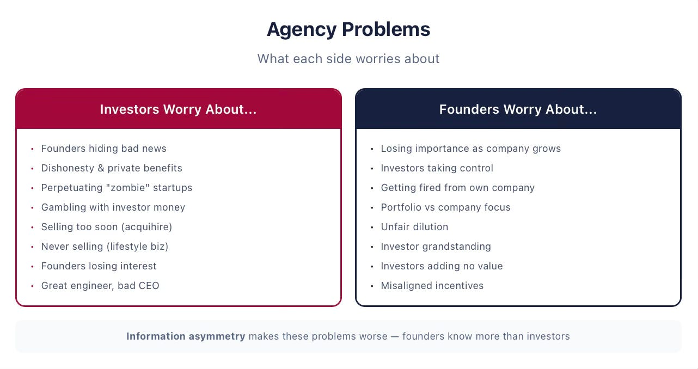

#### **Scenarios That Make Investors Worried**

- **Founders Conceal Unfavorable Information**

A founder talks to prospective customers and none show interest. Excellent engineers turn down job offers. A drug in trial shows unexpected side effects. This soft information may never reach investors — or may reach them too late. Founders have incentives to conceal bad news more than good news. The line between optimism and concealment is blurry — founders may genuinely believe the best interpretation of ambiguous signals. By the time investors learn the truth, it may be too late.

**Example: Theranos**

Elizabeth Holmes founded Theranos in 2003 to develop blood tests requiring only tiny amounts of blood. Over many funding rounds, she raised over $700 million. In October 2015, the *Wall Street Journal* reported that Theranos had been using traditional blood testing machines instead of their revolutionary product that never worked as advertised. In 2018, the SEC charged Holmes with “elaborate, years-long fraud.”

What stands out is how long it took for the cheating to be unmasked. Holmes and others started concealing unfavorable information quite early, when it became clear their technology didn’t work. And remarkably, the unmasking was done by an investigative journalist — not by any Theranos investor.

- **Founders Are Dishonest**

At a VC panel I organized, I asked what was the most important red flag. One panelist answered immediately: “A whiff of founder dishonesty. If I feel that person is untrustworthy, that would be the end of the road.” All the other VCs nodded in agreement.

When executives divert company resources for personal use, economists call it **private benefits**. Consider Dennis Kozlowski, CEO of Fortune 500 company Tyco, convicted of looting over $100 million, including $15,000 dog umbrella stands. Despite the damage, Tyco survived. A startup would not.

- **Founders Perpetuate Zombies**

Many startups fail. The art of startup investing is to identify these lemons quickly. But founders may be eager to continue with failing projects — we call such companies **zombies** or the “**living dead**.” Founders are often more optimistic. They’ve spent every waking hour with their “baby,” creating ripe conditions for **escalation of commitment** — throwing resources at failed projects because of psychological attachment. And their incentives differ from investors’: it’s not their money being spent, but if the startup miraculously succeeds, they benefit disproportionately.

- **Founders Gamble with Investors’ Money**

Consider a simple example. You have $1.5 million in the bank. A risky bet pays $3 million one-sixth of the time and zero five-sixths of the time. Expected return: negative $1 million. You wouldn’t take it.

Now imagine the $1.5 million came from investors who own 50%. If you lose, investors lose their money — not you. If you win, you get half of the $1.5 million profit. Your expected payoff: +$125,000. Suddenly the gamble looks attractive — to you, not to your investors. This asymmetric payoff structure is what makes investors worry about gambling for resurrection.

- **Other Investor Concerns**

Investors also worry that founders may sell too soon (via **acquihire**, when a company is bought for its employees rather than its products), or conversely never sell at all (building a comfortable lifestyle business that generates no returns for investors). They worry founders may lose passion — as Phil Libin of Evernote said when stepping down as CEO: “I realized I wasn’t passionate about being the CEO who will take this company public.” And they worry that a brilliant engineer may be a terrible leader, especially as a company grows from 5 people to 200.

#### **Scenarios That Make Founders Worried**

- **Investors Fire the Founder**

Zoox, a developer of autonomous vehicles, was founded in 2014 and raised its Series B of $500 million at a $3.2 billion valuation in July 2018. In August 2018 — one month later — the board suddenly fired CEO Tim Kentley-Klay. He took to social media: “The shocking reality is that this morning — without a warning, cause or right of reply — the board fired me.” Reports suggested “addition by subtraction” was the reasoning.

This is not isolated. In almost half of successful VC-backed companies, the CEO at the time of IPO was not one of the company’s founders.

- **Other Founder Concerns**

As the startup grows, the founder’s **human capital** — the skills and knowledge that made them indispensable — may become less critical. Their bargaining power declines. Investors may take control through board seats. They may prioritize their overall portfolio over any single company. They may unfairly dilute founders using superior knowledge of market trends. Younger VCs may engage in **grandstanding** — taking companies public too early to burnish their reputation. And some investors simply don’t add value beyond the check.

#### **How Agency Conflicts Are Resolved**

Investors and founders use both **formal mechanisms** (enshrined in contracts and law) and **informal mechanisms** (frequent interactions, advice, relationship-building) to address these conflicts.

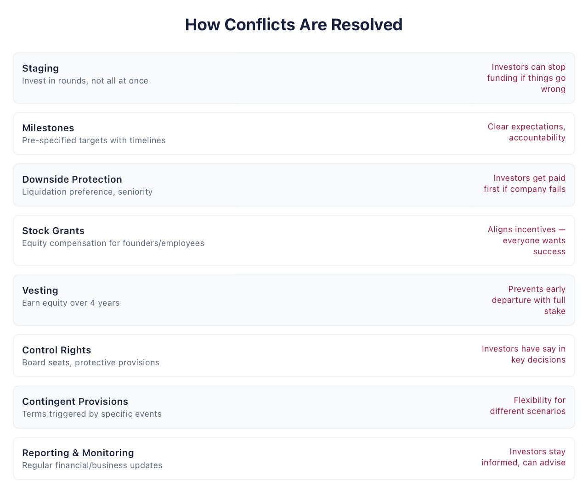

- **Staging and Milestones**

Startups raise funds over multiple rounds — a process called **staging**. Unicorns raise on average more than 6 rounds; an average VC-backed company raises at least 3. Nobody knows how much money the startup will ultimately need, and investors want to learn about a company’s prospects before committing more capital. Milestones — specific metrics or events marking stages of development — are typically 6 to 18 months in duration and timed to the budget.

- **Downside Protection, Stock Grants, and Vesting**

A typical contract gives investors downside protection: when the outcome is OK but not great, investors are paid first. This gives the management team incentives to do better than just “OK.”

**Vesting** is a procedure by which employees gradually earn their stock grant as they continue working. Typically over four years: 25% vests after one year (the **cliff**), then the remaining 75% vests monthly over 36 months. If an employee leaves before vesting is complete, they forfeit unvested stock. Founders are often dismayed to find their stock also falls under vesting — but it protects them too. If one co-founder leaves early, vesting prevents them from walking away with half the company.

- **Control Rights**

Consider two scenarios. In both, SoftMet has three board members. In the first, both founders are on the board joined by Rob Arnott. In the second, Anna is the sole founder representative, and Rob plus his partner Stuart Hennessy represent the VC. The board makes decisions by simple majority. The difference is obvious — and it’s why board structure is one of the most negotiated provisions in startup fundraising.

- **Information and Monitoring**

A venture capitalist from India once told me about investing in a rural hospital startup. When he visited and asked for financial reports, the founders were puzzled: “Why do you need all this? Can’t you see the patients are happy?” When they came back asking for more funding, he replied: “Why do you need money? Your patients are happy.” They got the message. They learned to prepare financial reports and business plans. Last I checked, they operate several dozen hospitals.

More than 60% of VCs interact with their portfolio companies at least once a week. Learning quickly is critical — investors need to decide whether to fund the company again.

---
## Venture Capital 101. The Term Sheet: A Walkthrough

*Published 2026-03-21. Source: https://ilyastrebulaev.substack.com/p/vc-101-the-term-sheet-a-walkthrough*

A **term sheet** is a summary of contractual terms offered by the investor to the company and its founders, often just a couple of pages long. Getting the first term sheet is an important milestone in the life of every founder. Here are some important points:

> **The Term Sheet Is Not a Binding Legal Document**

It is worth repeating: the term sheet is *not* a binding legal document. Even if founders and investors sign it, that doesn’t mean the investment is finalized. The term sheet is a serious indication of interest — it means investors are ready to spend time and effort finalizing the deal.

There are two exceptions. The **no shopping clause** means that once founders sign, they agree not to seek term sheets from other investors until the signed term sheet expires. The **confidentiality clause** means parties agree not to divulge the information contained in the term sheet. Trying to get competing term sheets *before* you sign is fine — and if you can get two or more, your bargaining power goes up.

> **Investors Expect You to Negotiate**

The term sheet is a blueprint. Investors fully expect founders to negotiate its provisions. But two types of founders worry investors.

The first is excited and says immediately: “Oh, this is cool, we’re ready to sign.” As one well-known VC told me: “That may sound great, but it’s not. If the founders aren’t ready to negotiate with me, would they have the strength to negotiate with their first customers?”

The second type fights over every single word. “If you’re not reasonable during negotiations, are you going to be reasonable for the next five years working on the company?” Many provisions are standard legal boilerplate. Sweating over them reveals ignorance.

> **Practical Advice**

- **You are responsible for understanding contractual terms.** Lawyers and advisors are important, but they don’t have the same incentives as you. At the end of the day, it’s your company and your life that will be affected.
- **First contracts are especially critical.** Contracts tend to be **sticky** — terms persist from one round to another. A new investor might reasonably say: “The previous investor got this, so I’m entitled to it too.” Once control is lost, it is likely lost forever. If founders are in the minority on the board after the first VC round, they’re unlikely to get majority later.
- **Ask two questions about every term.** First: in what scenarios will this term come into play? Many terms that seem scary are contingent on specific future events that may not be very likely. Second: how will this term affect different parties — founders, investors, employees — in terms of cash flows, control, and the likelihood of company survival?

**Example: Walking Through SoftMet’s Term Sheet**

SoftMet’s term sheet lists the company name, the security (Series A Preferred Stock), the investor (Top Gun), the amount raised ($10 million), post-money valuation ($40 million), and price per share. Here are the key provisions and what they mean.

> **Dividends**

Set at 6%, but non-cumulative and payable only if declared by the Board. Translation: dividends will almost certainly never be paid. As we’ll see in a later post, non-cumulative dividends are window dressing.

> **Liquidation Preference**

The most important cash flow term. It establishes investor seniority: in a liquidation event, investors are paid first. If the company doesn’t do well, investors may receive the entire payoff and founders get nothing. We cover this in detail in the next post.

> **Optional Conversion**

Preferred shareholders can convert into common stock at any time. This creates a trade-off at exit: retain the liquidation preference or give it up for a shot at larger upside through conversion. The exit value at which investors are indifferent is the **conversion point** — a concept we’ll explore in depth.

> **Protective Provisions**

Seven provisions that require majority approval of preferred shareholders before the company can take certain actions. These protect investors but also serve as good corporate governance. They don’t prohibit anything outright — they give investors a veto right.

> **Anti-Dilution**

Gives investors the right to adjust their conversion price if the company raises a **down round** (at a lower share price). Effectively, preferred shareholders end up owning more common shares at the expense of founders and employees.

> **Automatic Conversion**

Preferred stock is forced to convert into common under certain conditions. For SoftMet: if the company goes public with net proceeds of at least $50 million (a **qualified public offering**), or if a majority of preferred stockholders vote to convert.

> **Board Rights**

Top Gun will elect one director. Board composition — how many seats founders vs. investors control — is one of the most consequential provisions in the term sheet.

> **Vesting**

Standard four-year vesting with a one-year cliff: 25% vests after one year, then monthly over 36 months. This applies to employees and to founder stock.

> **Other Provisions**

The term sheet includes drag-along rights (minority shareholders cannot block a sale), sale rights, a no-shop clause, confidentiality, and an expiration date. Some term sheets are much shorter than SoftMet’s — but missing terms will still appear in the final legal contracts. Be on guard not only for the terms present, but for the important terms that are *not* there.

> **The Package of Legal Documents**

Once the term sheet is signed and due diligence complete, lawyers draft the closing documents. The main ones:

- **Certificate of Incorporation (COI)** — the main document governing relationships between shareholders. Sets cash flow rights (liquidation preference, dividends), protective provisions, and corporate governance.
- **Stock Purchase Agreement (SPA)** — the legal document between investor and company. Mostly standard boilerplate; pay attention where it deviates.
- **Investor Rights Agreement** — lists investor rights: registration rights, information rights, and the critical **pro rata rights** (the right to participate proportionally in future rounds).
- **Right of First Refusal / Co-Sale Agreement** — gives the company and investors priority in acquiring shares if founders or employees sell.
- **Voting Agreement** — prescribes board composition and voting rules.
- **Indemnification Agreement** — the company agrees to take on risk for investors and board members from losses that might arise from lawsuits. This reduces the personal liability of those serving on the board.

Having a knowledgeable lawyer at this stage is truly important to ensure no unusual terms get slipped into the final contracts. Once all documents are signed, the investment is finalized and the company gets its funds.

*Next in this series: we dive into the specific cash flow terms, starting with the most important one — liquidation preference.*

---
## Venture Capital 101. Liquidation Preference of convertible preferred stocks

*Published 2026-03-11. Source: https://ilyastrebulaev.substack.com/p/venture-capital-101-liquidation-preference*

#### **Welcome back**

In the previous [post](https://ilyastrebulaev.substack.com/p/venture-capital-101-introduction), I introduced convertible preferred stock, the most frequently used financial security in VC-backed startups. In this post, we will discuss the first of many convertible preferred stocks that founders need to understand and understand well: liquidation preference.

#### **Liquidation Preference Establishes Seniority of Preferred Shareholders**

Financial securities derive their value from investors’ expectations of future returns. For investments in early-stage companies, these returns usually happen when a company “exits” – in a spectacular IPO, a trade sale or merger, or a failure. They are named exits because VC investors typically offload all their ownership as a result of those events. Taken together, these **exits** are examples of a **liquidity event**from the point of view of investors. The value of assets that are distributed to owners at exit is called **exit value**. ‘Liquidity’ is used to emphasize that investors are able to generate some cash and this makes their investment liquid. Another important example of a liquidity event is a secondary sale, in which an investor sells its shares to another party. We won’t be talking about secondary sales here, because that other party will continue holding that security until an exit event or until it sells to somebody else.

Liquidity events that are not IPOs are known as liquidation events. A **liquidation event** is a company’s dissolution, sale, or reorganization. In a sale, the company ceases to operate as an independent entity. In dissolution, the company ceases to exist and its remaining assets are sold and distributed to owners. In a reorganization or a merger, a company may undergo a change in control. Importantly, contracts define what constitutes a liquidation event. The exact contractual language may turn out to be important, because it will determine whether the liquidation preference term is triggered. For example, if you check Top Gun’s Term Sheet, you will see that it defines liquidation as a ”a sale of all or substantially all of the Company’s assets, or a merger.” In fact, legal contracts will be more precise and often add additional terms such as treating any event which “results in the stockholders owning less than a majority of the voting equity of the surviving company” as a liquidation event. The precise definition is important, because a liquidation event is when liquidation preference is triggered.

Note that “liquidity” is *not* “liquidation.” As there is often a confusion, I highlight this difference.

> **Liquidity vs Liquidation**
>
> Note the distinction between a “**liquidity**” event and a “**liquidation**” event. Confusingly, the words sound similar, but they have a different meaning. Liquidation means that a company ceases existing in its current form and shape. Liquidity means that shareholders, such as investors, can sell their securities or, more generally, recover at least some of their investment. The word “liquidity” is used because outside of these events, investment is “illiquid,” that is, difficult or impossible to get out of. For example, an IPO is a liquidity event but not a liquidation event.

In a liquidation event, preferred shareholders have special rights that ensure they are paid out first, before common shareholders receive any portion of the exit value. This is what liquidation preference is about.

The **liquidation preference** states the amount that must be returned to the holder of the convertible preferred stock in a liquidation event *before* any common shareholders are paid. “Before” means that investors holding convertible preferred stock enjoy **seniority** over common shareholders. Senior investors get paid first. Unless investors get paid their liquidation preference *in full*, common shareholders get paid *nothing* at all. Seniority is also often called **priority**, that is, preferred shareholders have a priority over common shareholders**. Seniority** is also the reason why these shareholders are called *preferred* shareholders in the first place. Conversely, because preferred shareholders are senior to common shareholders, we also say that common shareholders are **junior** to preferred shareholders.

The liquidation preference is often stated in terms of a liquidation multiple. The **liquidation multiple** is the value by which investment amount should be multiplied to get liquidation preference. Conventionally, liquidation multiples are denoted as a number followed by X, e.g. 1X, 1.5X, 2X, and so on. For example, if the liquidation multiple is 1.5X and the investment amount is $3 million, then the liquidation preference is

$$4.5 million = 1.5 *$3 million$$

This means that preferred shareholders have a seniority over the first $4.5 million of the exit value distribution.

In contracts, the liquidation preference is also often stated in terms of the original issue price that investors pay per share. Let’s check how this is described in a legal contract, for example, in a 2014 contract of Dropbox, Inc:

“The holders of each share of Preferred Stock … shall be entitled to be paid … prior and in preference to any payment or distribution … of any available funds and assets on any shares of … Common Stock … an amount per share equal to the Original Issue Price for each such series of Preferred Stock.”[^[1]]

This entitlement to be paid prior and in preference to common shareholders is a legal way to define liquidation preference. The fact that this preference equals the original issue price per share means that liquidation multiple is 1X.

Let’s consider another example, this time from a 2015 contract by another early-stage company, Actifio, Inc:

“The holders of shares of … Series F Preferred Stock … shall be paid out of the assets of the Corporation … before any payment shall be made to the holders of Common Stock … an amount per share equal … one-and-one-half times (1.5x) the Series F Original Issue Price…”[^[2]]

As we can figure out, Actifio issued many classes of preferred stock, and Series F is just one of these classes. The liquidation multiple is 1.5X. Investors who hold Series F Preferred stock of Actifio have the liquidation preference per share that is 50% above the original issue price they paid.

At the cost of losing some of you, let me introduce some math notation. You don’t really need to know math to follow – or you can also skip to [the next discussion point](https://ilyastrebulaev.substack.com/i/189233977/liquidation-preference-provides-investors-with-downside-protection). But to understand intuition, I find generalizations useful.

We can write a formula for a payoff to investors that they will receive at exit based on liquidation preference. We call such a payoff **liquidation preference payoff**or **LiqP payoff**. Let’s denote liquidation multiple as *LM*, original issue price of the preferred shares as *OIP*, the total investment amount in this round is (A in subscript denotes Series A), the number of preferred shares as (*P* in superscript denotes preferred), and the**total exit value** as *V*. You should think about *V* as effectively what all the shareholders get at exit and for now think of this as cash. The question is how this amount of *V* is split among all the different shareholders.

The liquidation preference of Series A Preferred stock (LiqP) is

$$LiqP=LM × I=LM × OIP × N^P$$

and LiqP payoff is

$$LiqP Payoff=min⁡(LM × I,V)=min⁡(LM × OIP × N^P,V)$$

In this formula, min is the mathematical notation for the min operator, which chooses the smaller value of the two in brackets. If the liquidation preference, which equals , is *smaller* than exit value *V*, then investors will receive only what they are entitled to, their liquidation preference. The rest will be paid to common shareholders or distributed according to other provisions of the contract.

However, if the liquidation preference is *larger* than total exit value *V*, then only preferred investors get any cash and they will receive only *V*. The reason why investors may end up with less than their liquidation preference is that the company’s exit value was too low to pay that amount off. Importantly, common shareholders are subject to **limited liability** and have thus no obligation to pay preferred shareholders anything in excess of the company’s value at exit. Thus, investors cannot get more than the exit value. In the extreme (but frequent!) case, when the company fails and nothing of value is left, investors will receive zero.

If the residual – what is left after satisfying investors’ liquidation preference – is paid to common shareholders, we also can write the payoff of common shareholders:

$$Common Stock LiqP Payoff=V-min(LM × OIP × N^P,V)$$

Note that the value of is never greater than *V*, and so common stock payoff is never negative. For clarity, this is why the common stock payoff can never be negative: preferred shareholders are paid fully first, either their entire liquidation preference payoff, or the exit value of the firm. In the former case, the remaining exit value is paid to the common stockholders. In the latter, there is nothing left to be paid out and so the common shareholders receive nothing. Limited liability thus ensures that common shareholders will not need to pay out of their own pockets to meet the firm’s obligations to preferred shareholders at the time of exit.

> **Liquidation Preference Example**
>
> **Problem:**
>
> VC fund Beta Capital invested in startup Alpha. Investors received 2 million Series A Preferred shares at the OIP of $35 with a liquidation multiple of 1.5X. What is Beta’s LiqP? What is the LiqP payoff of Beta if Alpha is sold for $50 million? $250 million?
>
> **Solution**
>
> Beta’s LiqP is equal to:
>
>
>
> $$LiqP= LM × OIP × N^P=1.5 ×$35 ×2 million=$105 million$$
>
> If Alpha exits at $50 million, the investor LiqP payoff is
>
>
>
> $$Beta LiqP payoff = min(LiqP, V) = min($105 million, $50 million) = $50 million$$
>
> In this case, Beta Partners will receive the entire value of $50 million and common shareholders will receive nothing.
>
> If Alpha exits at $250 million, the payoff is
>
>
>
> $$Beta LiqP payoff = min(LiqP, V) = min($105 million, $250 million) = $105 million$$
>
> The residual $145 million will be distributed based on the other terms of the contract. Often, common shareholders will receive the entire $145 million residual. (But note that preferred shareholders may prefer to give up their liquidation preference and convert instead.)

> **Liquidation Preference Example**
>
> **Problem:**
>
> VC fund Theta Capital invested in startup Gamma. Investors received 2 million Series A Preferred shares at the OIP of $3 with a liquidation multiple of 2X. What is the exit value below which the common stockholders receive nothing? How does your answer change if the LM is changed to 1.5X? 1X?
>
> **Solution**
>
> Theta’s LiqP is equal to:
>
>
>
> $$LiqP=LM ×OIP× N^P=2 ×$3 ×2 million=   $12 million$$
>
> Recall that preferred shareholders have priority over the common shareholders. This means that if Gamma exits below $12 million, the common stockholders will receive nothing.
>
> If the LM was instead 1.5X, then Theta’s LiqP would be:
>
>
>
> $$LiqP=LM ×OIP× N^P=1.5 ×$3 ×2 million=   $9 million$$
>
> Following the same logic, common stockholders would receive nothing for exit values below $9 million.
>
> If the LM was 1X, then Theta’s LiqP would be:
>
>
>
> $$LiqP=LM ×OIP× N^P=1 ×$3 ×2 million=   $6 million$$
>
> Now, common stockholders would receive nothing only for exit values below $6 million.

#### **Liquidation Preference Provides Investors with Downside Protection**

Let’s come back to SoftMet. Top Gun’s term sheets says that the liquidation multiple is 1X. The Top Gun’s term sheet also says “non-participating.” We will discuss participation later, but it implies that after paying the liquidation preference, the residual will be paid to common shareholders.

The investment amount of Top Gun is $10 million, which means that the liquidation preference is also $10 million. Figure 1 shows the exit payoff VC investors can expect in a liquidation event The horizontal axis of the graph shows the total exit value in millions of dollars. This total exit value is bounded by zero, owing to shareholders’ limited liability. The vertical axis shows the LiqP payoff of VC investors, the amount investors will receive for each realization of the total exit value according to investors’ liquidation preference terms. It also shows the residual amount left after full satisfaction of the liquidation preference. Again, in Top Gun’s term sheet, this residual amount goes to common shareholders.

> **Liquidation Preference Payoffs**
>
>
>
> 
>
> The figure shows how liquidation preference determines the payoffs of preferred and common shareholders as the company’s exit value varies. Preferred shareholders are guaranteed their liquidation preference. Common shareholders receive the rest of the company’s value.

If the company’s outcome is lower than $10 million, liquidation preference ensures that investors receive the total exit value. Common shareholders – the founders – receive nothing. For example, if the company is sold for $6.5 million, the investor and founder payoffs are, respectively:

$$Preferred LiqP payoff = min(1*$4*2.5 million, $6.5 million) = $6.5 million$$

and

$$Common LiqP payoff = $6.5 million - min(1*$4 *2.5 million, $6.5 million) = $0$$

For any value of the company above $10 million, liquidation multiple of 1X implies that Top Gun does not receive more than $10 million.

The following sentence summarizes the economic and practical meanings of liquidation preference: Liquidation preference plays a very important role by providing investors with **downside protection** for small and not very successful exits. “Downside” means the company has not done well financially. In the VC world, one way to define downside is to think of all the values lower than the total investment.

To see how downside protection *protects* investors, assume for a second that, contrary to what Top Gun’s term sheet proposed, SoftMet’s investors receive 2.5 million *common* shares rather than preferred shares. Investors will then own 25% of all the common shares of the company. The company has no other securities outstanding.

All common shares are treated equally, whether they are investor shares or founder shares. If the company is, say, sold for $8 million a year later, the investors therefore receive 25% of that amount, or $2 million, and the founders receive the rest 75%, or $6 million. But Top Gun invested in SoftMet to the tune of $10 million. Even though the exit is unsuccessful (the total exit value is less than $10 million), the founders receive way more than the investors. Having common shares does not protect investors in downside.

Once the investors negotiate the liquidation preference term, however, the investors will receive the total exit value of $8 million, with the founders receiving nothing. In this case, adding liquidation preference results in the additional $6 million gain for the investors. You should not be surprised that when my colleagues and I surveyed VCs, liquidation preference was one of the terms they were not prepared to negotiate away.

Note that downside protection is truly *downside*: in successful exits, the protection it offers is of no use. If the company is, say, sold, for $100 million, if Top Gun were to receive common shares, it would have ended up with $25 million (25% of the total exit value), which is above the “protected” amount of $10 million. Liquidation preference basically does not matter in very successful exits.

The closest equivalent of the downside protection can be found in traditional debt contracts. For example, commercial bank debt is senior to common equity. Debtholders need to be paid first before equityholders can get paid. This does not mean, though, that convertible preferred stock is like a typical debt contract, for many of its features cannot be found in typical debt contracts.

Higher liquidation preference improves investor outcomes, at the expense of the founders.

#### **Liquidation Payoffs for Different Liquidation Multiples**

If the company is sold, say, for $18 million, investors get $10 million for the 1X liquidation multiple, $15 million for the 1.5X liquidation multiple, and the entire exit value of $18 million for the 2X liquidation multiple. In the latter case, investors are promised $20 million, but only $18 million are available to satisfy this promise. In this case, the founders get nothing at all.

Investors obviously prefer a higher liquidation multiple, all other things equal. In reality, when companies are not very successful, total exit values in the range of one to three times of the total investment amount (and thus 1X to 3X of the liquidation preference) are not uncommon. This drives investors’ desire for higher liquidation preference even further. For example, there is a good chance that SoftMet will end up being sold for between $15 million and $20 million. It turns out that although VCs invest because they hope liquidation preference will never be needed, the impact of liquidation preference and liquidation multiples on fund returns and valuation can be non-trivial.

Conversely, founders do not like liquidation multiples above 1X and consider them to be unfair and exorbitant. As in any negotiation, the liquidation multiple value will depend on the **bargaining power** of the parties. Bargaining power depends, most importantly, on the prevailing market conditions: what contracts other investors and companies at a similar stage of development agree on. Prevailing market conditions are particularly important at the time of the first VC round. If there is a large supply of VC money and investors compete with each other, we typically observe a 1X liquidation multiple for initial VC rounds. During economic downturns, we can often encounter liquidation multiples above 1X. For subsequent rounds, the condition of the company also matters. The worse the state of the company, the lower the bargaining power of existing shareholders (both existing investors and the founders), and the higher the liquidation multiple new investors can expect to negotiate, other things equal.[^[3]]

The multiple of 1X is by far the most common multiple for the first priced round. Founders: if you get a term sheet with anything but 1X liquidation multiple, this is a red flag. It is important to check the pulse of the market (and the reasonableness of investors!)

However, higher multiples are not infrequently observed in follow-on financing rounds that we will discuss later. In a sample of 135 unicorns, 15% of them gave the liquidation multiple of higher than 1X to at least one of their investors.[^[4]]Liquidation multiples are also higher when the company is not doing well and has to raise follow-on financing rounds in reduced circumstances.

Another important point to remember is that the liquidation multiple is virtually never less than 1X for convertible preferred stock. (Of course, when the liquidation multiple is 0X, preferred stock really stops being “preferred.”).

#### Key Takeaways

a. Convertible preferred stock is senior to common stock.

b. Liquidation preference provide investors with downside protection and is less relevant for successful exits.

c. Liquidation multiple for first-time VC rounds is 1X. Anything else raises a red flag.

---

[^[1]] Source: Restated Certificate of Incorporation of Dropbox, Inc., 01/29/2014.

[^[2]] Source: Seventh Amended and Restated Certificate of Incorporation of Actifio, Inc., 07/29/2015, Article B.2.1.

[^[3]] Alternatively, because investors have a higher bargaining power, they may negotiate a lower original issue price instead of a higher liquidation multiple.

[^[4]] See Will Gornall and Ilya A. Strebulaev,  “Squaring Venture Capital Valuations with Reality,” 2020, *Journal of Financial Economics*, 135, 120—143. Available at [https://papers.ssrn.com/sol3/papers.cfm?abstract_id=2955455](https://papers.ssrn.com/sol3/papers.cfm).

---
## Venture Capital 101. Optional conversion of convertible preferred stocks

*Published 2026-03-29. Source: https://ilyastrebulaev.substack.com/p/venture-capital-101-optional-conversion*

#### **Welcome back**

In the previous posts, we discussed [convertible preferred stock](https://ilyastrebulaev.substack.com/publish/posts/detail/189165716) and one of its important terms, [liquidation preference](https://ilyastrebulaev.substack.com/p/venture-capital-101-liquidation-preference). In this post, we will discuss another important term: that founders need to understand and understand well: optional conversion.

Convertible preferred stock gives investors the best of both worlds — but only if they choose correctly. At exit, every investor faces one decision: keep the downside protection of liquidation preference, or give it up and convert into common shares for a shot at a bigger payout. You can’t have both. I’ll break down how that decision works, what determines the tipping point, and why the investor’s choice directly controls how much founders take home.

#### **Optional Conversion Gives Investors the Right to Convert Their Preferred Shares into Common Shares**

Liquidation preference acts as a downside protection for investors. The optional conversion feature, on the other hand, enables investors to benefit from an upside, that is, successful outcomes.

**Optional conversion** gives investors *the right* to convert their convertible preferred stock into common stock at *any time* of their choice.[^1] Investors have a valuable **option** to convert.

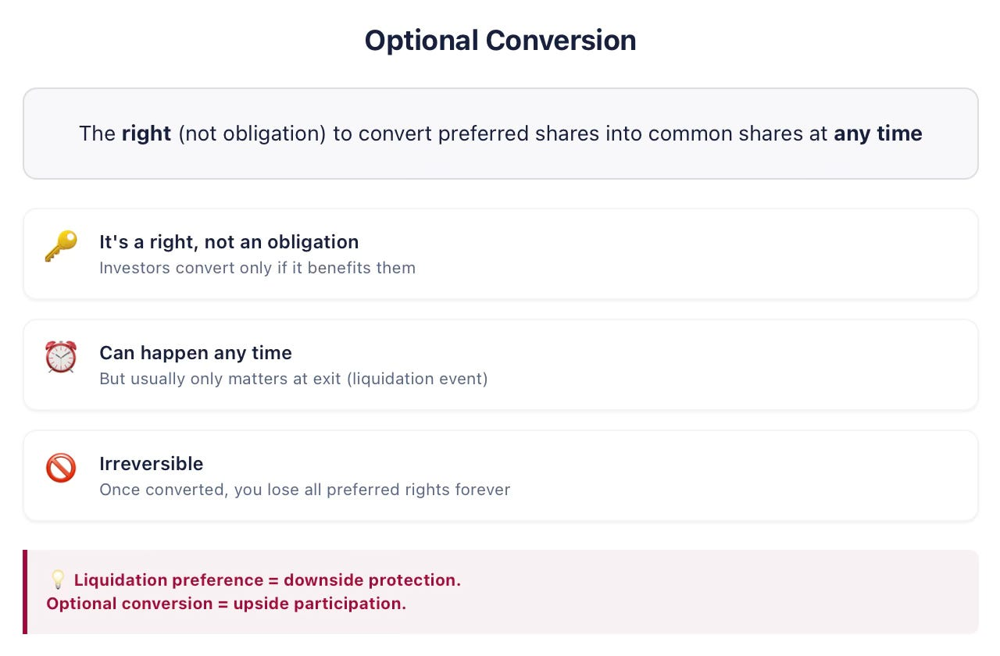

Here is the simple economic intuition about conversion: once one security converts into another security, it effectively loses all rights and preferences it enjoyed and acquires all the rights and preferences the new security enjoys.

Optional conversion comes with several strings attached. One of conditions is the **irreversibility of the conversion**. Once investors convert their convertible preferred stock into common stock, this decision cannot be undone. Common stock cannot be converted back into preferred stock. Irreversibility is important, because convertible preferred stock enjoys many valuable rights and preferences – and all of them are irretrievably lost once conversion takes place.

Going back to the example of SoftMet I introduced in previous posts, once its investor Top Gun converts its convertible preferred stock into common stock of SoftMet, Top Gun loses liquidation preference and will retain or acquire only those rights that other common stockholders have. In other words, Top Gun would lose all the downside protection of the convertible preferred stock. Thus, the conversion decision should not be taken lightly.

In practice, there’s no reason to convert early. Optional conversion usually takes place at the time of the company exit, most importantly when the company is sold. In fact, for the reasons I won’t go into now, optional conversion is relevant for a liquidation event and not really relevant at IPO.[^2]

The number of common shares convertible preferred stockholders get upon conversion depends on conversion price. **Conversion price**, or **CP**, is the price per share at which convertible preferred shares convert into common shares. To determine how many common shares one preferred share converts into, we should look at the ratio of original issue price and conversion price, which is known as conversion ratio:

**Conversion ratio** (also known as **Conversion rate**), ***CR***, is the number of common shares investors receive upon conversion of one convertible preferred share. If OIP is $15 and CP is $5, each preferred share converts into 3 common shares.

Typically, when convertible preferred shares are issued, conversion price is set to the original issue price. Let’s illustrate how actual contracts reflect optional conversion. For example, here is an extract from a 2016 Uber’s contract:

“… each share of … Series A Preferred stock … shall be convertible, at the option of the holder at any time after the date of issuance of such share … into such number of … Common Stock, as is determined by dividing … $0.07303 [Series A Original Issue Price] … by the Preferred Stock Conversion Price. … The initial “Preferred Stock Conversion Price” per share of … Series A Preferred Stock shall be $0.07303…”[^3]

In Uber’s case, as is typical, the initial conversion ratio is set to one. Here is how it is treated in Top Gun’s term sheet:

“Conversion ratio initially 1-to-1, subject to standard adjustments.”

That means that, as in Uber’s contract, the conversion price of Top Gun’s convertible preferred stock will be initially set to $4, its original issue price. When Top Gun converts 2.5 million convertible preferred shares, it will receive 2.5 million common shares.

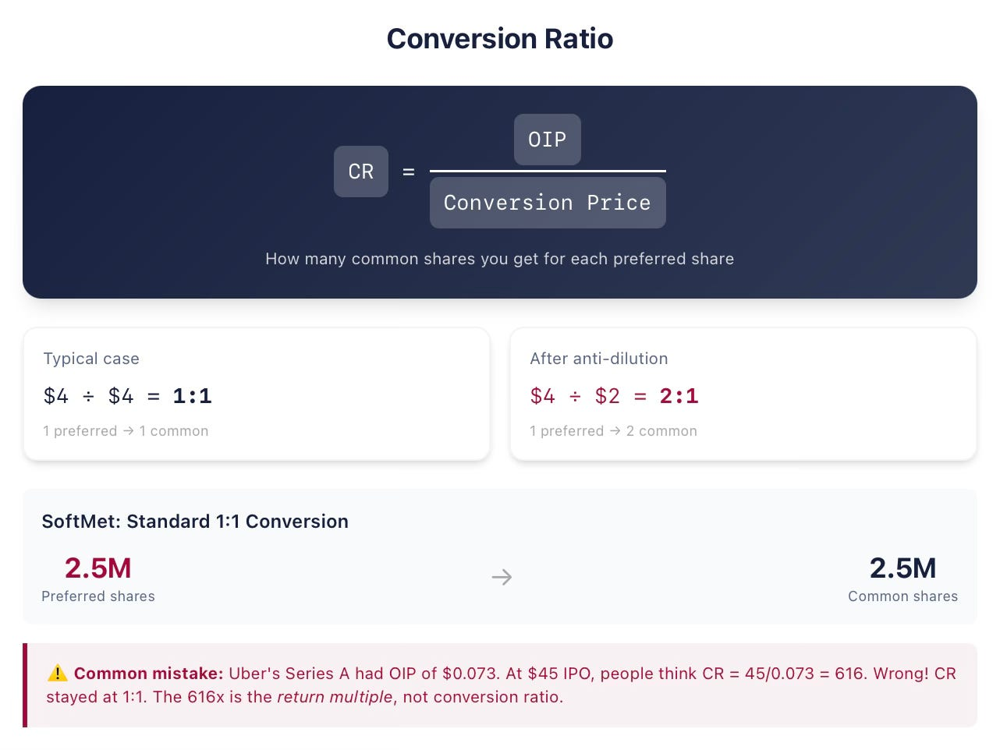

The conversion price can change later — most importantly through anti-dilution provisions (a topic for a future post) or stock splits.

To see what a non-1:1 conversion ratio looks like in practice, consider a 2015 contract of NJOY, Inc:

“… “Original Issue Price” shall mean $2.00 per share for each share of the Series A Preferred Stock … The Conversion Price for each series of the Preferred Stock shall be $0.3402935 for the Series A Preferred Stock…”[^4]

The holders of Series A Preferred stock of NJOY will get about 5.88 (dividing $2 by $0.34) common shares of NJOY upon conversion. In fact, NJOY’s Series A Preferred had initially the conversion ratio of one. When NJOY raised further financing rounds, it was subsequently modified because the company did poorly.

Sometimes, the initial conversion rate may be different from one. In November 2016, VC-backed company Buzzfeed raised funding by issuing Series G and Series G-1 Preferred stock. The original issue price for these classes was set at $45.04, while the conversion price was set at $4.504. That implies that the initial conversion rate is 10.[^5]

In Uber’s case, Series A Preferred stock original issue price and original conversion price were $0.07303. There were no any future adjustments. Uber went public at the price of $45 per common share. Now answer the following question before reading the next paragraph: how many common shares did Series A Preferred stockholders get for each preferred share they had?

Many divide $45 by 0.0733, which results in about 616. They then give a confident answer: 616 common shares. This is not correct. Because there were no adjustments, the conversion price stayed the same, and so the conversion ratio also stayed the same as it was at the issuance time: one. Preferred shareholders got only one common share for each preferred share they owned. 616 does have a meaning, though: preferred shareholders paid 7.3 cents per preferred share and converted this preferred share into one common share, which was worth $45 at IPO. Their multiple of return was 616x, not a bad outcome for an investment.

#### **At Exit Time, Investors Must Decide: To Convert or Not To Convert?**

Here’s the catch: at exit, investors can’t use both liquidation preference and optional conversion.

Rather, they have the right to choose *either*liquidation preference*or* optional conversion. The reason is that once investors convert into common shares, liquidation preference is lost. Conversely, if investors retain liquidation preference, no conversion takes place. Investors thus face a stark choice at the exit time: to convert or not to convert.

Assume that Top Gun invested $10 million in SoftMet at the proposed terms, receiving 2.5 million Series A Preferred shares with the original issue price of $4, liquidation multiple of 1X and the conversion price of $4. A year from now, the company is sold for $20 million. Should Top Gun exercise its conversion option and convert into common shares or should it retain its liquidation preference?

For the exit value of $20 million, if Top Gun does not convert, its liquidation preference ensures that Top Gun’s payoff is $10 million. If Top Gun converts, it will get 2.5 million common shares. With the founders owning 7.5 million shares (and no other common or any other shares outstanding), Top Gun will own 25% of the company and thus will be entitled to 25 cents of each dollar the company is sold for, giving Top Gun a payoff of

Not converting results in a larger payoff than converting, and therefore Top Gun optimally decides *not* to convert at this exit value.

Now imagine that the company is sold for $60 million. If Top Gun does not convert, the payoff stays the same at $10 million. If it converts, it again will own 25% of the company, or

At the total exit value of $60 million, Top Gun partners find it optimal to convert. Thus, the decision whether to convert or not depends on the total exit value. For any total exit value below $40 million it is optimal for the investor *not* to convert and retain its liquidation preference. For any value above $40 million, it is optimal for the investor to convert into common shares, because upside benefits from conversion dominate downside protection.

The value of $40 million is the **indifference point**or**conversion point**, the total exit value at which investors are indifferent between retaining their liquidation preference by not converting and exercising their conversion option.

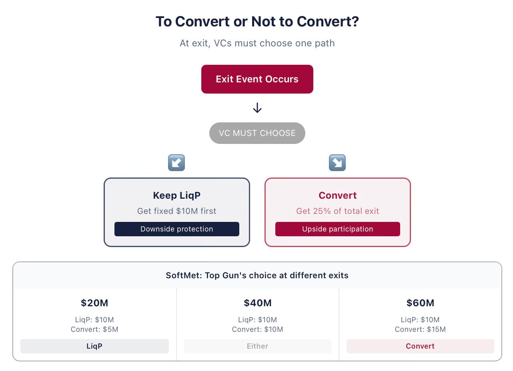

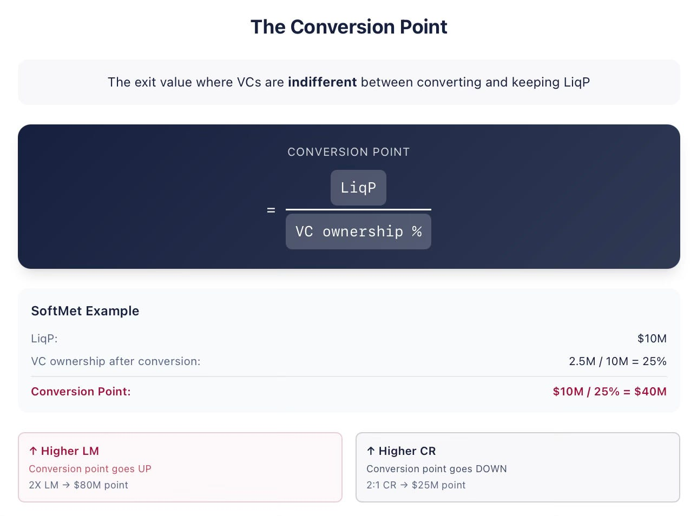

#### **Common Shareholders Are Affected by the Conversion  Decision of Investors**

Note that in our discussion of the conversion decision we concentrated on what Top Gun is going to do. That is because it is the convertible preferred stockholders that have the right to decide. The founders – common shareholders — do not make such a decision and are passive observers at that time, so to say. They are, however, greatly impacted by the conversion decision.

The payoffs have quite a complex structure. There are generally three regions of payoffs, when we deal with convertible preferred stock.

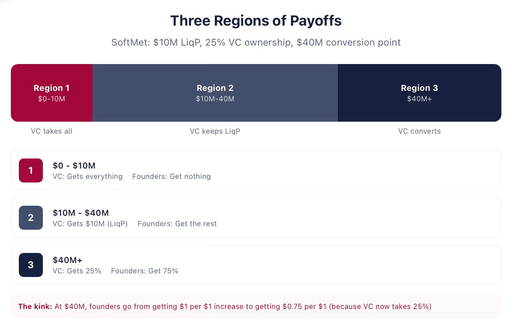

In the first region, common shareholders get nothing and investors receive the total exit value by claiming their liquidation preference. In our example, this region is for exit values between $0 and $10 million. In the second region, investors optimally decide not to convert and therefore are entitled to their liquidation preference. Common shareholders get the residual of the total exit value. For SoftMet, the second region is for values between $10 million and $40 million.

Finally, in the third region, investors optimally decide to convert into common shares. For SoftMet, the third region is for exit values above $40 million. Note that there is a kink in the payoff function of the common shareholders at the investors’ indifference point (the border of the second and third regions). As long as investors do not convert, common shareholders get $1 for each $1 increase in company’s exit value. Once investors convert, common shareholders own 75% of common shares, and thus for every $1 increase in company’s exit value, the payoff of common shareholders increases only by $0.75.

Conversion captures the upside; liquidation preference protects the downside. Together, they give investors the best of both worlds.

#### **Key Takeaways**

1. Common shareholders are affected by the conversion decision of preferred shareholders.

2. Preferred shareholders choose whether to convert into common stock at a liquidation even by comparing their payoffs in two scenarios: when they convert and when they don’t. They don’t take into account preferences of common shareholders at this time.

3. Higher liquidation multiple makes less likely preferred shareholders will convert, other things equal. Higher conversion ratio makes it more likely they will convert.

  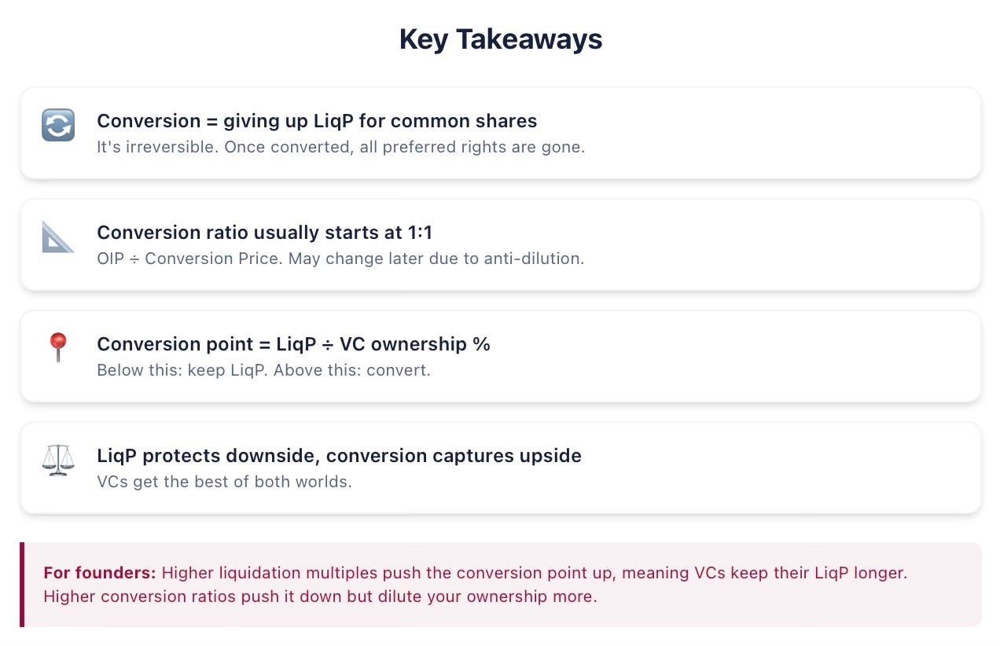

---
## Venture Capital 101. Capitalization table and post-money valuation

*Published 2026-04-09. Source: https://ilyastrebulaev.substack.com/p/venture-capital-101-capitalization*

In the previous VC 101 posts, we discussed liquidation preference and optional conversion, two important terms of convertible preferred stock — the most frequently used financial security in VC-backed startups. In this post, we’ll be discussing the **capitalization table** and **post-money valuation**.

*In 2014, Uber announced it had raised $1.2 billion at a valuation of $18.2 billion. Most people read that and assumed Uber was worth $18.2 billion. It wasn’t — not in any meaningful sense of the word “worth.”*

Post-money valuation is one of the most widely cited and widely misunderstood numbers in the startup world. I’ll show you how to build and read a capitalization table, why the cap table is essentially wearing rose-tinted glasses, and what “valuation” actually means (and doesn’t mean) when you see it in the news.

### **The Capitalization Table Summarizes Company Ownership**

Whenever a company raises external financing, it makes sense to provide an account of who owns what. In VC-backed private companies, this is accomplished by constructing a **capitalization table** that shows the ownership of all the securities that are either equity or can be converted into equity.

Let’s look at SoftMet. Before the round, its founders were the only owners of the company — they owned 7.5 million common shares. After Top Gun acquires 2.5 million Series A Preferred shares (each convertible into one common share), the ownership structure changes:

The post-money cap table has more columns because there are now two types of securities outstanding: common and Series A Preferred. Convertible securities are entered on an **as-converted basis** (also known as **common stock equivalent**) — as if they were already converted. The last column shows **fully diluted ownership**, assuming all convertible securities are converted into common shares.

### **The Cap Table Assumes a Fully Diluted Basis**

An important point: the cap table’s construction assumes a fully diluted basis. All convertible securities are treated as converted — a critical assumption for VC-backed companies, where nearly everyone holds something convertible.

To appreciate the importance of this, imagine that Top Gun negotiated a better deal: 2.5 million Series A Preferred shares, each convertible into *two*common shares. The conversion price drops to $2, while the original issue price stays at $4.

On an as-converted basis, Top Gun now owns 5 million common shares — 40% of the company, with the founders owning 60%.

**WORKED EXAMPLE · CAP TABLE**

**Problem:** Brave Capital is buying 5 million of Redolee’s Series A preferred shares with a 2× conversion ratio. Redolee has two founders, Smith and Jones, who own 5 million and 7.5 million common shares respectively. Smith co-invests in the A round by acquiring 0.5 million Series A preferred shares. Construct the cap table.

**Solution:** Before the round, Smith and Jones own 40% and 60% respectively. After the round, Smith has 5M common + 0.5M preferred × 2 = **6M shares** on a fully diluted basis. Brave Capital has 5M preferred × 2 = **10M shares**. The total fully diluted shares = 23.5M.

### **The Rose-Tinted Glasses Problem**

Here’s the problem founders miss. Too many founders and employees assume they own whatever the fully diluted basis shows. The founders may believe they own 75% of the company’s value. **They don’t.**

The trick: VC investors find it optimal to convert only when the company is doing well and exits for a relatively high value. When founders look at the cap table, it’s as though they are wearing rose-tinted glasses. The cap table assumes that all claimholders convert — in other words, it assumes a sufficiently high exit value.

*The capitalization table is built upon the most optimistic scenario. Founders’ actual ownership fraction ends up being lower for many scenarios.*

Founders own 75% of cash flows only for exit values above $40M. Below $10M, they receive nothing.

### **Post-Money Valuation and Pre-Money Valuation**

**Post-money valuation (PMV)** is the product of two quantities: the total number of shares the company will have outstanding on the fully diluted basis after the investment round, and the conversion price paid by investors.

PMV = Conversion Price × Total Shares (fully diluted)

In SoftMet’s case: PMV = $4 × 10,000,000 = **$40 million**.

Post-money valuation is what gets publicly reported after an investment round. Importantly, even when “post-money” isn’t stated explicitly, you can assume that’s what’s being reported. When Uber announced it “had raised $1.2 billion in a deal that valued the company at $18.2 billion” — the $18.2 billion is post-money valuation, *not* the fair market value of Uber.

“Post-money valuation” should be used in one breath and does not have the same meaning as “valuation” as that term is ubiquitously used in finance.

> **WORKED EXAMPLE · POST-MONEY VALUATION**
>
> **Problem:** Lasso Partners bought Series A Preferred shares of LaCruise at a PMV of $20 million. Conversion price is $5/share, and the founders own 3 million shares. How many preferred shares did Lasso Partners purchase?
>
> **Solution:** Total shares N = $20M ÷ $5 = 4 million. Founders own 3M, so investors purchased **1 million preferred shares**.

**Pre-money valuation** is defined similarly — the total number of shares before the investment round × the conversion price of the new round.

PMV = Pre-Money Valuation + Investment Amount

For SoftMet: $40M − $10M = **$30M pre-money valuation**.

For exactly the same reason that post-money valuation shouldn’t be confused with fair value after the round, **pre-money valuation should not be confused with the fair value before the round**. How many founders have read “pre-money valuation: $30 million” and believed their company was worth $30 million? It isn’t.

Why? Because common shares are always *less* valuable than convertible preferred shares (that convert 1:1). Yet both PMV and pre-money valuation formulas value all shares at the same conversion price.

### **PMV Has a Large Impact on Ownership**

Imagine the founders and Top Gun renegotiate a higher PMV of $50 million (everything else unchanged). Top Gun still invests $10M at $4/share, still receives 2.5M shares. But now the founders end up owning 10 million shares — 80% of the company, up from 75%.

As PMV rises, investors’ ownership fraction falls and founders keep a larger share on a fully diluted basis.

In practice, the number of pre-existing shares is typically fixed. When PMV changes, the conversion price adjusts. If the founders had 7.5M common shares and PMV rose to $50M, investors would own 20% (= $10M / $50M), meaning 7.5M shares = 80% of the company:

Although the total shares and conversion price changed, the PMV and ownership fractions stayed the same. The number of shares is a *numeraire*— what matters is the ownership fractions.

**⚠ CAUTION · NUMBER OF SHARES**

Do you want 10,000,000 shares at $1 or 1,000,000 shares at $10? They’re worth the same — yet experiments show people prefer the larger number, even at a lower per-share price. In startups, this confusion is even more widespread because the true value per share is vague. If you’re offered millions of shares or options to join a startup, don’t assume you’ll become a millionaire. It all depends on how many millions (or billions) everyone else owns.

---

### **Key Formulas**

N = N[^C] × PMV / (PMV − I)

N[^P] = N[^C] / CR × I / (PMV − I)

CP = I / (CR × N[^P])

Where N[^C] = pre-existing common shares, N[^P] = new preferred shares, CR = conversion ratio, I = investment amount, CP = conversion price.

> **WORKED EXAMPLE · CONVERSION PRICE AND NUMBER OF SHARES**
>
> **Problem:** Best VC invested $20M in a Series A round of BestStartUp, with PMV = $40M. The founders own 10M common shares, and preferred shares convert into 2 common shares each. How many preferred shares did Best VC acquire, and what was the conversion price?
>
> **Solution:** Total shares N = 10M × ($40M / $20M) = 20M. Preferred shares = (20M − 10M) / 2 = **5M shares**. Conversion price = $20M / (2 × 5M) = **$2**.

> **WORKED EXAMPLE · SOFTMET WITH $5M INVESTMENT**
>
> **Problem:** SoftMet, PMV = $40M, founders own 7.5M common shares, 1:1 conversion. Top Gun invests $5M. Find the number of preferred shares and conversion price.
>
> **Solution:** N[^P] = 7.5M × ($5M / $35M) = **1.071M shares**. CP = $5M / 1.071M = **$4.67**.

### **Investment Amount Mirrors PMV**

As the investment amount increases, VC investors own more of the company and existing shareholders own less. With Top Gun investing $15M instead of $10M (PMV still $40M):

Note: if both investment *and* PMV increase by the same relative amount, the cap table doesn’t change — the investor’s ownership fraction is simply I / PMV. Scale both by the same factor and the ratio stays put.

#### Key Takeaways

1. The capitalization table always assumes the **fully diluted basis** — the most optimistic scenario.
2. The difference between post-money valuation and pre-money valuation is the **investment amount** raised in that round.
3. Care about your **fraction of ownership**, not the number of shares you own.

**Notes:**

¹ “Outstanding” means all shares actually issued up to and including the financing round. “Authorized” shares may never be eventually issued — we discuss the mechanics later.

² It is customary for price values to be cut off at 4–6 digits. Contracts include standard provisions that shareholders can own only integer numbers of shares.

---
## Venture Capital 101: Participation in Convertible Preferred Stock

*Published 2026-04-16. Source: https://ilyastrebulaev.substack.com/p/vc-101-participation-in-convertible*

### Welcome back

So far, we’ve covered the core mechanics of standard convertible preferred stock — liquidation preference, optional conversion, and how the capitalization table fits together. In this post, we’ll discuss a variant of convertible preferred stock with the participation feature.

Imagine you invested $10 million in a startup.

A year later, the founders come to you and say: if we raise a little more money, we can sell this company for $30 million instead of $10 million. Great news — except with standard convertible preferred stock, you’d get $10 million either way. You have zero financial incentive to help make that happen. This is the alignment problem that participation tries to solve — and the reason founders and investors will never fully agree on whether it’s a fair term or a legalized double dip. In this post, I’ll show you how participation works using real contract language from DocuSign, how much it shifts payoffs in practice, and why the debate around it is more nuanced than either side admits.

### Participation entitles investors to both downside protection and upside benefits at exit

Let’s start with a real-world example: DocuSign raised a financing round in 2015. DocuSign’s contract says[^2]:

> *“… the holders of the Series A Preferred stock … shall be entitled to receive, prior and in preference to any distribution … to the holders of Common Stock … an amount equal to [Original Issue Price] ….
>
> …. Upon the completion of distributions [to Preferred Stock] … if assets … remain, such assets shall be distributed with equal priority and pro rata among the holders of the Series A Preferred Stock …. and Common Stock ….”*

We have already encountered the text of the first paragraph above: it defines the liquidation preference by imposing the seniority of preferred shareholders and setting the liquidation multiple of 1X.

The second paragraph, however, modifies this liquidation preference substantially: what it effectively says is that *after* liquidation preference has been fully paid to preferred shareholders, the remaining value will be distributed between preferred *and* common shareholders. In other words, even after preferred shareholders received the liquidation preference in full, they are still entitled to receive further payoff from the exit value.

How much more will they receive? The second paragraph imposes two conditions: “equal priority” and “pro rata.” **Equal priority** means that preferred and common shareholders will be now treated equally and neither class has seniority over another class. To get the full meaning of pro rata in this context, let’s see the continuation of the DocuSign contract[^3]:

> *“(with the shares of Series A Preferred Stock … being treated for this purpose as if they had been converted into shares of Common Stock at the then applicable Conversion rate).”*

**Pro rata** therefore means that preferred shareholders will receive the payoff proportionally to their ownership of common shares on an as-converted basis (as though they converted even if they don’t need to). For example, if they own 40% of the common shares on an as-converted basis, then for each remaining $1 of the company’s exit value (after liquidation preference is paid, that is) they will be entitled to receive $0.40.

What DocuSign’s contract really says is that DocuSign’s preferred shareholders do not need to convert to get the payoff from the optional conversion. This contractual term is called participation. The **participation** feature means that preferred shareholders are entitled to *both* the liquidation preference *and* the optional conversion payoff. Fundamentally, this security is still convertible preferred stock, with the additional participation term. Because this modified rule of who gets what is sufficiently different, this security is sometimes also called **participating convertible preferred stock**.[^4]

The economic meaning of participation is that it brings investors both downside protection and upside benefits at the same time, so that there is no need to choose whether to convert or not to convert. Investors get the best of both worlds. No wonder then that investors love participation. Founders, for a similarly obvious reason, believe that participation is unfair. Founders often call participation **“double dipping,”** meaning, of course, that investors can “dip” both in liquidation preference and conversion at the same time.

### Participation increases payoff to VC investors at the expense of common shareholders

Consider Top Gun negotiating participation, with all other terms intact.

If SoftMet is sold for $30 million, the standard convertible preferred payoff is $10 million, because investors prefer not to convert. With participation, the investors get:

$10M + 25% × ($30M − $10M) = $10M + $5M = **$15M**

That participation feature adds $5 million (or 50%) to their payoff.

It’s a zero-sum game, so founders get only half of what they would with standard convertible preferred.

If the company exits at the value of $40 million, in the absence of participation investors receive $10 million. With participation, their payoff improves to:

> $10M + 25% × ($40M − $10M) = **$17.5M**

Thus, at the exit value of $40 million, participation increases investors’ payoff by:

> ($17.5M − $10M) / $10M = **75%**

Investors mostly benefit in the values around their optimal conversion point (of course, they don’t actually need to convert with the participation feature). Because liquidation preference is a fixed amount, participation plays a progressively diminishing role for larger exit values. For example, if SoftMet is sold for $200 million, Top Gun receives:

> $10M + 25% × ($200M − $10M) = **$57.5M**

The payoff of $57.5 million is “only” 15% larger than the $50 million payoff without participation. Of course, if SoftMet is sold at $10 billion, then the additional $10 million participation brings boosts investor payoff only by 0.3%. Thus, for very large exits participation is relatively immaterial.

Of course, the exit of $200 million is five times larger than Round A’s post-money valuation of $40 million and may be considered very successful indeed.

Figure below shows the corresponding loss incurred by the founders as a result of adding participation:

We already noted that investors love participation other things equal. SoftMet’s example sheds light on one reason why investors may value participation. The range of values for which participation matters most are the ones investors should know from their experience occur quite often. Company sales at 0.5× to 4× of the post-money valuation are quite common and participation matters most for these exit values.

There is another reason why participation seems fair to investors. Consider again SoftMet’s case with the standard convertible preferred stock, without participation. For the exit values between $10 million and $30 million, preferred shareholders do not convert. What this really means is that they don’t really care whether the company is sold at $12 million or $29 million. Founders, of course, care greatly about it.

Here is the crux of the matter: say, SoftMet got Top Gun’s investment and then it is not very successful. In fact, it has an acquisition offer to be sold at $10 million. Top Gun gets its money back, founders will get nothing. The founders come back to Top Gun and say: look, if we can just go and raise $3 million more from other investors, we can sell the company at $30 million. Whether Top Gun investors believe the founders or not is not really material. Even if they believe the founders, they will *not* benefit from this value increase and only lost the time value of money.

With the participation feature, everybody would benefit as the value goes from $10 million to $30 million. Absence of participation can thus lead to a very non-trivial misalignment of interest. Of course, it is a give and take in negotiations, so even if investors believe participation is fair, they may need to give up arguing in favor of participation, if the market is sufficiently founder friendly.

What about the capitalization table? The participation term does *not* change the capitalization table, because on an as-converted basis, the relative ownership of shareholders has not changed. Which means the cap table’s rose-tinted glasses (from the last post) get even rosier.

A generic formula for the investor payoff with the participation term can be written as:

> Investor payoff = LiqP payoff + (VC% on as-conv. basis) × (V − LiqP payoff)

where we continue to use Investor LiqP payoff as the amount the investor is entitled to by the benchmark liquidation preference (without the participation modification). Fraction of common shares investor owns is given, of course, on an as-converted basis. Using the notation we already introduced earlier, this payoff can be written as:

> Investor payoff = min(LM × OIP × N[^P], V) + (N[^P] × CR / N) × (V − min(LM × OIP × N[^P], V))

Then the founders’ payoff could be written simply as:

> Founder payoff = V − Investor payoff

> **EXAMPLE · INVESTOR PAYOFF AND EXIT VALUE**
>
> **Problem**
>
> Gamma Capital is a venture capital firm that invests $20 million in a Series A financing round for AlphaTech, with a liquidation multiple of 2×. Gamma gets 1 million preferred shares, convertible on a one-for-one basis. The existing founders own 4 million shares. What is the payoff for the investor and the founders when the exit value is (i) $10 million (ii) $200 million?
>
> **Solution — Part (i): V = $10M**
>
> Using equation (18):
>
> Investor payoff = min(2 × $20M, $10M) + (1M / 5M) × ($10M − min(2 × $20M, $10M))
> = $10M + 20% × ($10M − $10M) = **$10M**
>
> The venture capitalist takes the full exit value and the founders get nothing:
>
> Founder payoff = V − Investor payoff = $10M − $10M = **$0**
>
> **Solution — Part (ii): V = $200M**
>
> Investor payoff = min(2 × $20M, $200M) + (1M / 5M) × ($200M − min(2 × $20M, $200M))
> = $40M + 20% × ($200M − $40M) = $40M + $32M = **$72M**
>
> The founders get the remaining firm value:
>
> Founder payoff = $200M − $72M = **$128M**

> **EXAMPLE · INVESTOR PAYOFF, NUMBER OF SHARES AND EXIT VALUE**
>
> **Problem**
>
> Theta Capital is a venture capital firm that invests $100 million in a Series A financing round for BetaTech, with a liquidation multiple of 3×. The post-money valuation of Beta is $200 million. The existing founders hold 5 million shares and each preferred share is convertible into two common shares. How many shares does Theta Capital get? What is the payoff to investors and founders if Beta exits at $500 million?
>
> **Solution**
>
> Calculate the number of preferred shares issued to Theta:
>
> N[^P] = (N[^C] / CR) × I / (PMV − I)
> = (5M / 2) × ($100M / $200M − $100M) = **2.5M shares**
>
> Now calculate the payoff for the investor:
>
> Investor payoff = min(3 × $100M, $500M) + (2.5M × 2 / (2.5M × 2 + 5M)) × ($500M − min(3 × $100M, $500M))
> = $300M + 50% × ($500M − $300M) = **$400M**
>
> The founders get:
>
> Founder payoff = $500M − $400M = **$100M**

### Key takeaways

- Participation allows preferred shareholders to get the benefit of both downside protection and upside participation.
- Founders consider participation — which they call “double dipping” — very unfair. Investors disagree.
- The capitalization table does not change when participation is added.

[^2] Amended and Restated Certificate of Incorporation of DocuSign, Inc., 04/30/2015, Article B.2.a/b.

[^3] Amended and Restated Certificate of Incorporation of DocuSign, Inc., 04/30/2015, Article B.2.b.

[^4] If you are curious at this point why this security is still called *participating convertible preferred stock*, optional conversion is only one way to receive a “converted” payoff. Another way is automatic conversion, when convertible preferred securities may be forced to convert into common stock. I promise to discuss it at some point in future posts.

---
## Venture Capital 101. Dividends in VC financing

*Published 2026-04-28. Source: https://ilyastrebulaev.substack.com/p/venture-capital-101-dividends-in*

We’ve now covered the major liquidation terms. In this post, we’ll be discussing dividends. It turns out dividends are less important in VC than in financial markets in general. If there’s one post in this series you could skip, it’s this one. But stay with me — the edge cases matter.

*Here are two sentences from two real VC contracts. Glassdoor’s: “dividends shall be non-cumulative.” Uptake Technologies’: “dividends shall accrue from day to day, whether or not declared and whether or not there are any funds legally available.” Same word — “dividends” — completely different economics. The first means nothing will ever be paid. The second quietly increases the investor’s liquidation preference every single day, compounding year after year, whether the company has money or not. After ten years, that clause alone can shift millions of dollars from founders to investors. Most dividend terms in VC are window dressing — but the ones that aren’t can bite. In this post, I’ll show you how to tell the difference.*

### Dividends

In traditional financial markets, dividends play an enormous role. A **dividend** is a payment made by a company to its shareholders. Dividends typically take two forms. **Cash dividends**are payments of money, usually a share of the company’s profits. **Dividends in kind** are non-cash distributions, usually of shares. Most dividends are paid regularly (e.g. quarterly) and are called **ordinary dividends**. Companies may also pay fixed amounts as **extraordinary dividends**, which are one-off rather than regular.

Unlike traditional companies, startups almost never pay cash dividends in normal circumstances. The reason is straightforward. Cash dividends are paid out of the company’s profits or cash reserves. Startups don’t have profits to speak of, and any they do generate get reinvested. Cash reserves came from investors in the first place — paying them back as dividends would be circular. So cash dividends don’t matter in VC-backed companies, especially at an early stage. Dividends in kind are also rare, but VC-backed companies do pay them sometimes, and this can have a non-trivial impact on payoffs.

### Non-Cumulative Dividends Are Typically Not Paid

It’s still important to understand how dividends are set up in contracts and how they affect eventual payoffs. Consider the contract of Glassdoor, Inc., which raised a financing round in 2016:

> *“Holders of Series A Preferred, in preference to the holders of Common Stock, shall be entitled to receive, when, as and if declared by the Board of Directors … cash dividends at the rate of 8% of the Original Issue Price per annum … Such dividends … shall be non-cumulative.”[^1]*

Three provisions, all critical. The first line establishes that preferred shareholders have **seniority** over common shareholders for dividends — typical for these contracts, both at liquidation and on an ongoing basis. (Equal-priority arrangements exist but are very rare.)

The second line sets cash dividends at 8% of OIP per annum. 8% is the **dividend rate** — the ratio of the dividend amount to the original issue price. This might lead you to conclude that Glassdoor actually pays dividends to its preferred shareholders. That conclusion would be wrong, for two reasons.

First, the same sentence says these dividends are paid only “when, as and if declared.” This means dividends aren’t guaranteed in the contract, although the Board has the power to initiate them in the future.

The most important provision, however, is in the third line: “Such dividends … shall be non-cumulative.” A **non-cumulative dividend** is one that shareholders are not entitled to if it hasn’t been declared for the current period. Undeclared non-cumulative dividends simply vanish — they never come back. Bottom line: “non-cumulative” + “if and when declared” = dividends that will almost certainly never be paid, and shouldn’t factor into payoff calculations.

With this in mind, here’s Top Gun’s term sheet for SoftMet:

> *“6% noncumulative, payable if and when declared by the Board of Directors.”*

Standard language. Theatrical on paper, never activates in practice.

**HOW A NON-CUMULATIVE DIVIDEND DISAPPEARS**

### Cumulative Dividends May Have a Large Impact on Payoffs

Contrast Glassdoor’s contract with Uptake Technologies, Inc., which raised a round in 2015:

> *“From and after the date of the issuance … of Series B Preferred Stock, dividends shall accrue … at the rate of five percent (5.0%) per annum on the sum of (i) the Series B Original Issue Price … plus (ii) all accrued but unpaid dividends thereon (the ‘Accruing Dividends’). Accruing Dividends shall accrue from day to day, whether or not declared and whether or not there are any funds of the Corporation legally available for the payment of dividends, and shall be cumulative.”[^2]*

Unlike Glassdoor’s, Uptake’s dividends are cumulative and accruing. A **cumulative dividend**accrues whether or not it’s declared — the right carries forward until paid, terminated, or modified.

Because early-stage companies don’t have cash to pay dividends, these dividends typically accrue until exit. An **accrued dividend** has been declared but not yet paid. They accumulate until the company exits (or the Board decides to distribute them).

The way to think about accrued dividends: **liquidation preference increases with each passing year**. This provides investors with a minimum return on their original investment.

With cumulative accrued dividends, you also need to know whether preferred shareholders are entitled to them in any exit or only in specific cases. One scenario: dividends are lost on conversion to common. In that case, dividends act like an add-on to liquidation preference — once preferred shareholders convert, they forgo the LP terms, including accrued dividends. Cumulative dividends then add an extra dimension to other terms like participation. Another scenario: dividends accrue and stand regardless of conversion. A third: their status depends on whether the company exits via sale or IPO. Contractual flexibility means cumulative dividend terms can get very complicated. Bottom line: when dividends are cumulative, pay close attention to exactly how the term is worded — the consequences for future payoffs are non-trivial.

How common are cumulative dividends in startups? In a sample of 135 highly valued VC-backed companies, 15 (about 11%) gave cumulative dividends to at least one class of preferred shareholders.[^3] So they’re not frequent — but they’re not absent either, contrary to what some entrepreneurs and investors believe.

Let’s get back to SoftMet’s financing round and consider a scenario where Top Gun negotiated a cumulative 8% dividend rate, all other terms unchanged. Specifically: preferred shareholders are entitled to dividends as part of their liquidation preference, and conversion forfeits the dividend rights. (This is conservative — if dividend rights never expire, the impact is even larger.)

Imagine the company is sold exactly one year after the financing round. With an 8% dividend rate and a $4 OIP, each of the 2.5 million preferred shares is entitled to a cumulative dividend of $0.32. As the dividend accrues, it effectively raises the liquidation preference in one year to $4.32 per share, while the conversion price stays the same.

Because cumulative cash dividends change the liquidation preference, they also change the optimal conversion point. For an exit in one year:

> LiqP = ($4 + $0.32) × 2.5 million = $10.8 million

To find the new conversion point, we need the exit value at which Top Gun would receive $10.8 million upon conversion:

> Conversion point = LiqP ÷ Investor fraction of CS = $10.8M ÷ 0.25 = $43.2 million

If SoftMet is sold for $30 million one year after the financing round, Top Gun prefers not to convert. Investors receive $10.8 million; founders receive $19.2 million.

Figure 24 shows how investor payoffs change for 5% and 8% dividend rates across exit values, one year out. Because dividend accrual doesn’t survive conversion, dividends only matter for intermediate exit values.

**INVESTOR PAYOFF FOR CUMULATIVE DIVIDEND AFTER ONE YEAR**

Note that **dividends are not reflected in the capitalization table**. Cumulative dividends therefore lead the cap table to paint a rosier picture for common shareholders than reality warrants.

### Impact of Cumulative Dividends Depends on the Basis and Time to Exit

Back to Uptake’s contract. The cumulative nature of dividends means Series B Preferred Shareholders effectively increase their stock of Series B shares by 5% each year. Uptake’s dividend formula uses a **compound interest basis**: 5% is calculated each year as a fraction of OIP *plus all accrued dividends to date*. Effectively, you get dividends on dividends. Alternatively, the formula may use a **simple interest basis**: the dividend rate is calculated each year as a fraction of OIP only. Compound dividends can have a much larger impact on payoffs than simple ones.

To see the difference, reconsider SoftMet’s Series A round under two scenarios. In the first, founders and Top Gun negotiated a simple basis; in the second, compound. If the company is sold in one year, dividends accrued only once (they accrue per annum), and payoffs are identical. But what if the company is sold ten years after the round (assume no further financing)?

In the simple basis case, investor liquidation preference becomes:

> LiqP = $10M × (1 + 0.08 × 10) = $18 million

Since the dividend rights are lost upon conversion, the conversion point shifts to:

> Conversion point = $18M ÷ 0.25 = $72 million

For example, at an exit value of $50 million, Top Gun decides not to convert. Investors get $18 million (vs. $12.5 million in the absence of dividends), and founders are allocated $32 million (vs. $43.5 million without dividends).

In the compound case, 8% applies to the increasing amount every year:

> LiqP = $10M × (1.08)[^10] ≈ $21.589 million

(The precise value is $21,589,250.) At an exit value of $50 million, Top Gun gets its LiqP of about $21.589 million, and founders are allocated the remaining $28.411 million. The conversion point also shifts:

> Conversion point = $21.589M ÷ 0.25 ≈ $86.36 million

The compound basis yields a higher return for investors than the simple basis (at least until conversion). The longer the exit takes, the wider the gap between the two bases, and the larger the impact of dividends on the preferred investors’ liquidation preference.

**LIQUIDATION PREFERENCE: COMPOUND VS. SIMPLE DIVIDEND BASIS**

#### Conversion Point with Dividends

**Problem:** Liquid Adventure purchased 15 million Series A Preferred shares of ZenMax Inc. for $10 a share with a 2× LP and a conversion price of $10. The preferred stock features a 10% cumulative dividend rate accruing on a compound interest basis. The dividend rights are lost upon conversion. The founders own 20 million common shares. There are no other shareholders. At what exit value will Liquid Adventure choose to convert if the company is sold with no further rounds in 1 year? In 5 years? In 10 years?

**Solution:** The investor chooses to convert when the conversion payoff exceeds the liquidation preference. Cumulative dividends at time T are:

> Cumulative dividends = 15M × $10 × (1.10[^T] − 1)

And the modified liquidation preference is:

> Investor LiqP = 15M × $10 × 2 + Cumulative dividends = $300M + $150M × (1.10[^T] − 1)

Upon conversion, Liquid Adventure gets 15 million common shares — 15M / (15M + 20M) = 0.42857 of the common stock.

For exit in 1 year:

> Conversion point = $315M ÷ 0.42857 = $735 million

For exit in 5 years:

> Conversion point = $391.58M ÷ 0.42857 ≈ $913.68 million

For exit in 10 years:

> Conversion point = $539.06M ÷ 0.42857 ≈ $1,257.81 million

The longer the company takes to exit, the higher the price founders need to fetch before Liquid Adventure converts — and the larger the share of any sale that flows to investors first.

#### KEY TAKEAWAYS

1. Most VC-backed companies don’t pay cash dividends.
2. Non-cumulative dividends do not accrue if they are not declared. Cumulative dividends accrue regardless.
3. Cumulative dividends silently increase the investor’s liquidation preference every year — and shift wealth from founders to investors at exit.
4. Compound basis grows faster than simple basis. The longer to exit, the wider the gap.
5. About 11% of highly valued VC-backed companies have cumulative dividends in at least one preferred class.
6. Dividends do not appear in the capitalization table — so the cap table understates how much investors actually take home.
7. Read the dividend term very carefully: the difference between “non-cumulative” and “cumulative” can be millions of dollars.

---
## How Founders Lose Control to Dilution (And Don’t See It Coming)

*Published 2026-05-22. Source: https://ilyastrebulaev.substack.com/p/how-founders-lose-control-to-dilution*

Here’s a number that surprises even my Stanford MBA students: by Series B, the average founding team owns ~40% of their company. By IPO, it’s often below 20%.

And that’s for successful companies.

Take Uber. At IPO, three founders together owned ~17%. Travis Kalanick: ~8.6%; Garrett Camp: ~6%; Ryan Graves: ~2.4%.

Most founders understand dilution in the abstract. You raise money, you give up equity, your slice of the pie gets smaller. If you own 100% and raise $10M for 25%, you now own 75%. Simple enough.

But the mechanics of dilution across multiple rounds are not intuitive. The mistake isn’t dilution – it’s misunderstanding it. And the outcomes can vary dramatically depending on valuation and capital raised. This article — based on my Stanford VC Class — breaks it down.

Dilution can be complicated. To ease you in, we’ll use a single running example throughout, layering on complexity as we go. By the end, you should be able to look at any follow-on round and immediately understand what it means for every shareholder at the table.

#### **The Setup**

If you checked my earlier VC101 posts, you already met Ann and Matt! Ann Zhao and Matt Smith co-founded SoftMet, a technology startup, three years ago. They raised a $10 million Series A from Top Gun Ventures, which received 2.5 million shares of Series A convertible preferred stock at an original issue price (OIP) of $4 per share. The founders retained 7.5 million common shares. Post-money valuation: $40 million. (If anything in this para is unclear, go to previous VC101 posts!)

Now, 18 months later, they’re raising a $15 million Series B. The questions on their minds are the questions on every founder’s mind at this stage: What fraction of the company will new investors get? What happens to everyone’s ownership? And how different does this picture look if the company is doing well versus struggling?

#### **Follow-on rounds are the norm, not the exception**

Before we dive into the math, some context. Raising multiple rounds is not unusual. It’s the norm. An average VC-backed startup in the U.S. over the past 20 years raised more than three rounds of funding. Many raise far more. My research shows an average unicorn raised more than six rounds.

Back to Uber. Between 2010 and 2018, the company raised at least 15 rounds of funding — starting with a Series Seed at a pre-money valuation of $3.86 million and culminating in an IPO in 2019 at roughly $68 billion. Along the way, investors paid as little as $0.01 per share (Series Seed) and as much as $48.77 per share (Series G). The convention of naming securities alphabetically — Series A, B, C, and so on — is standard in the industry. Sometimes you’ll even see sub-series within a single round: Uber’s Series C had C-1, C-2, and C-3 tranches, each with slightly different terms.

The important takeaway: if you’re a founder or early investor, you should expect to go through this process multiple times. Understanding the mechanics is not optional.

#### **Up rounds, down rounds, and flat rounds**

One basic question everyone wants to answer at a glance: how is the company doing between rounds?

The most common shortcut: compare the **new round’s pre-money valuation** to the **previous round’s post-money valuation**. Why this specific comparison? Because both numbers describe the same set of shareholders.

Recall: in each round post-money valuation equals pre-money valuation plus the investment amount raised. The post-money valuation of Round A includes everyone who was a shareholder just after Round A closed — founders plus Series A investors.

The pre-money valuation of Round B reflects the same shareholders as immediately after Round A. This is a valuation assessment of those same shareholders’ ownership before new money comes in. It’s an apples-to-apples comparison of how the same shares are valued at two different points in time. Bottom line: avoid comparing pre-money valuations of two sequential rounds or two post-money valuations of two sequential rounds. These comparisons are meaningless.

An alternative is to compare original issue prices across rounds, adjusting for any stock splits. If investors paid $4 per share in Round A and $6.50 per share in Round B, the company’s implied per-share value increased.

Based on this comparison:

> **An up round** means the pre-money valuation in Round B is *higher* than the post-money valuation in Round A. The company is perceived as doing well. In our SoftMet example, raising at a post-money valuation of $80 million (pre-money of $65 million, versus a Round A post-money of $40 million) would be an up round.
>
> **A down round** means the pre-money valuation in Round B is *lower* than the post-money valuation of Round A. Things are not going well. SoftMet raising at a $30 million post-money ($15 million pre-money vs. $40 million Round A post-money) would be a down round.
>
> **A flat round** means the pre-money valuation in Round B is *equal*to the post-money valuation of Round A. SoftMet raising at $55 million post-money ($40 million pre-money, matching the Round A post-money) would be flat.

A few real-world examples bring this to life.

Up-round example: In March 2015, Lyft raised $680 million of Series E funding at a pre-money valuation of $1.93 billion, well above the $971 million post-money at its previous Series D — a clear up round driven by rapid growth.

Down-round example: On the other end, the marketplace lending company Prosper experienced a brutal Series G down round in September 2017: its pre-money valuation was $500 million, compared to a post-money of $1.87 billion at the previous round, after the sector was hit by fraud allegations and regulatory threats.

Flat-round example: The business collaboration company Slack raised Series D1 funding in March 2015 at the pre-money valuation of $1.12 billion. Slack’s post-money valuation at the previous Series D round in October 2014 was $1.12 billion, resulting in a flat Round D1.

**A word of caution.**These indicators are imperfect. The original issue price is just one of many contractual terms. Shares issued in Round B can have very different protections than Round A shares. Think liquidation multiples, participation rights, and seniority. So an increase in OIP doesn’t *guarantee* the company is doing better; it just means the headline number went up. You need to look under the hood (and we shall!). The correct comparison is simple: pre-money (new round) vs. post-money (previous round). Comparing pre-to-pre or post-to-post across rounds is simply wrong.

#### **How dilution works: the up round**

Now let’s do the math. In the up round scenario, SoftMet raises $15 million at a post-money valuation of $80 million, meaning the pre-money valuation is $65 million.

Before Round B, there are 10 million shares outstanding on a fully diluted basis: 7.5 million founder common shares and 2.5 million Series A preferred shares. The$65 million pre-money valuation implies price of $6.50 per share ($65 million ÷ 10 million shares). This is also the OIP for Series B, that is, how much investors in Round B pay for each of the preferred shares issued to them.

For their $15 million investment, Series B investors receive $15 million ÷ $6.50 ≈ 2,307,692 shares. If Series B shares also convert into one common share, on the fully diluted basis they end up owning 18.75% of the company after round B ($15 million ÷ $80 million).

We now can build the post-money (that is, after round B) cap table:

Before raising Series A, the founders owned 100% of the company. After Series A, they owned 75%. Now, after Series B, they own 60.94%. Each round chips away at their slice. This is an example of **dilution**. The chart shows the dynamics of SoftMet’s capital structure and the progressive dilution of founders through the financing rounds.

> **Fully diluted basis ownership in follow-on rounds.**
>
> This figure shows the ownership percentage of all the shareholders of SoftMeton the fully diluted basis in three sequential funding rounds,

Note something important: dilution hits *all* existing shareholders proportionally. Series A investors went from 25% to 20.31% — the same proportional reduction as the founders. (As we’ll discuss in a later post, anti-dilution provisions in down rounds can break this symmetry, sometimes dramatically.)

The **dilution factor**is the percentage loss in ownership for existing shareholders. For SoftMet’s Round B the dilution factor is 1 − (Pre-money / Post-money) = 1 − ($65M / $80M) = 18.75%. Every existing shareholder’s ownership gets multiplied by 81.25%.

#### **Note aside: Stock splits**

Stock splits don’t change anyone’s ownership — but they do change the numbers on every line of the cap table.

The rule of thumb: stock splits are mechanically simple but easy to overlook. They change nothing about value or ownership — but they change every per-share number in the deal, and in VC, per-share numbers are what contracts are written in.

In a stock split, every shareholder receives additional shares for each share they hold. A 3-for-1 split means you go from holding one share to holding three. No value is created or destroyed — you just have more shares, each worth proportionally less.

Let’s go back to SoftMet’s up round: $15 million raised at an $80 million post-money ($65 million pre-money). Without a split, we already know the math: 10 million pre-existing shares, an effective price of $6.50 per share, and Series B receives about 2.31 million new shares.

Now suppose SoftMet executes a 3-for-1 common stock split before closing Round B. The founders’ 7.5 million shares become 22.5 million.

For Series A, there are two possibilities. Series A’s 2.5 million preferred shares may remain 2.5 million preferred shares but each preferred share converts into three common shares. Thus, the preferred shares convert into 7.5 million common shares. Or Series A’s preferred shares also get 3-for-1 stock split, with each preferred share now converting into one common share. Either way, total common shares on the fully diluted basis triple to 30 million.

Nothing about the company’s value changes. The pre-money is still $65 million. But the effective price per common share drops to $65 million ÷ 30 million ≈ $2.17.

Series B investors now receive $15 million ÷ $2.17 ≈ 6.92 million Series B preferred shares, each of which converts into one common share.

Check the ownership: 6.92 million out of 36.92 million total shares is still 18.75%. Same dilution, same economics, different numbers.

So why bother? Two practical reasons. First, stock splits (may) adjust the OIP and conversion price of earlier rounds. Series A’s original issue price of $4 becomes $4 ÷ 3 = $1.33 after the split. This matters because conversion prices feed directly into anti-dilution adjustments, conversion calculations, and liquidation preference mechanics. If you ignore past stock splits, every number in the cap table will be wrong.

Second, companies often split their stock before an IPO to bring the per-share price into a conventional trading range. When you see Uber’s earliest investors quoted as paying “$0.01 per share,” that’s the split-adjusted figure — nobody was actually buying shares for a penny at the time. Whenever you compare OIPs across rounds to assess whether something was an up or down round, you need to use split-adjusted numbers or the comparison is meaningless.

#### **How dilution works: the down round**

Now consider the down round, where SoftMet raises the same $15 million but at a post-money valuation of only $30 million (pre-money of $15 million).

The effective price per share is now $1.50, and Series B investors receive 10 million shares — four times what they got in the up round. Assume all other terms are the same as in the up round (a brave assumption!). Even then, the cap table looks very different:

In this cap table, the founders went from 75% to 37.5%. Series B investors now own half the company.

Why is this table built on a “brave assumption”? Because in practice it’s often worse.

Anti-dilution provisions transfer additional ownership from common shareholders to earlier preferred shareholders in down rounds. These provisions are almost always present. But they are often renegotiated away, so the cap table I show here can be the actual cap table after Round B.

But it can be much (much!) worse for common shareholders. We will deal with anti-dilution provisions in a separate post. For now, just remember that a down round typically results in a substantial decrease in founder (and, of course, employee) ownership.

The chart visualizes the ownership impact of three scenarios (you can derive the flat round cap table and ownership changes yourself).

#### **The two levers: valuation and investment amount**

What actually determines dilution? Two key variables: how much you raise and at what post-money valuation. They work in opposite directions.

For a fixed post-money valuation, raising more money means more dilution. If SoftMet raises $60 million at the same $80 million post-money? The dilution factor jumps to 75% — founders and Series A together are left with just a quarter of the company. Raise only $5 million at the same valuation? Dilution is just 6.25%. The chart shows how ownership changes as investment amount varies (note that we keep post-money valuation here fixed).

For a fixed investment amount, higher post-money valuation means less dilution. Raise $10 million at $100 million → 10% dilution. Raise $10 million at $50 million → 20% dilution. The chart shows it for SoftMet (note that I ignore anti-dilution provisions here as well).

This is why founders obsess over valuation — and rightly so (but you need to take into account other stuff, too! As we will discuss below and in subsequent posts).

What really matters is the *ratio* of investment to post-money valuation. The ratio determines dilution. If the founders want the same 18.75% dilution as in our up-round example, they need to maintain the ratio $15M / $80M = 18.75% regardless of the absolute numbers. Raising $30 million? They’d need a post-money of $160 million. Raising $50 million? They’d need $267 million.

Economists frame this using “indifference curves.” These are combinations of investment and post-money valuation that produce the same dilution. The chart shows three indifferences curves, one for each of the scenarios we considered (again, ignoring anti-dilution provisions). $15 million at $80 million leads to 18.75% dilution. $30 million at $160 million results in the *same* dilution

#### **Dilution accumulates — and it can get large**

The real impact of dilution becomes apparent when you look across multiple rounds. Let’s extend SoftMet’s story. After the Series B up round, suppose the company raises Round C ($20M at $120M post-money), Round D ($50M at $300M post-money), and Round E ($500M at $3B post-money). Here’s how ownership evolves:

The chart visualizes the cap table dynamics.

By the fifth round, the founders own about 35% of the company. Series A investors — who once held 25% — are down to under 12%. Every round that follows an investor’s entry round dilutes them further.

And this is a *successful* company. Every single round from B through E is an up round. Founders of less successful companies — or those that experience even one down round — end up with far less. In some cases, early common shareholders can be essentially wiped out.

#### **But dilution isn’t necessarily bad**

Here’s the part that’s easy to forget amid all the arithmetic: while ownership percentages shrink, the *value* of what remains can grow dramatically. In SoftMet’s scenario, the founders go from 100% ownership to 35.26% after Series E, a dramatic dilution. But they own 35.26% of a company valued at $3 billion. Their stake, at least in post-money valuation terms, is worth over $1 billion. Series A investors go from 25% of a $40 million company ($10 million) to 11.75% of a $3 billion company ($352 million) — a 35× return. (I will discuss how to think correctly about post-money valuation in a later post.)

Dilution is only a problem when the pie doesn’t grow fast enough to compensate. Founders shouldn’t think about dilution in isolation. The real question is not: “How much of the company do I own?” It’s: “What is my ownership worth — and how fast is it growing?”

Important bottom line: My students often ask me whether they should raise just a little, postpone raising until valuation goes up, or bootstrap. It is true: if you avoid raising to reduce dilution, you will own a larger share. But of what? Startups need capital to grow. Your competitor may raise more money and competitor’s founders get diluted but will become a unicorn in the process. In my experience, founders are often psychologically unprepared for dilution. This is costly for them and for the companies they are trying to build.

#### **What the data shows**

How much dilution do founders actually face in practice? In a large sample of VC-backed firms funded over the past decade, common ownership declined from an average of 68% after Series A to about 40% after Series B. And the distribution has a long tail: a decline to 20% common ownership by Series B is not unusual. (one note: I ignore pre-VC money for this post, but the data of course does not.)

These numbers should inform founders’ expectations going into any round. If you’re raising a Series B and expecting to hold on to 70% of the company, you’re likely to be disappointed. Many outcomes involve substantially more dilution than most first-time founders anticipate.

If you quote or reuse this article, please add *Ilya Strebulaev, Substack: https://ilyastrebulaev.substack.com* as the source.

#### **Key takeaways**

- **The comparison that matters**is pre-money in the new round versus post-money in the previous round. That tells you whether it’s an up, down, or flat round — and it’s the only apples-to-apples comparison of how the same shares are valued over time.
- **Dilution is driven by two levers**— the amount raised and the post-money valuation. For any given level of dilution, these two move together: raising more capital requires a proportionally higher valuation to keep dilution constant.
- **Dilution accumulates**across rounds, and even successful companies see founders’ ownership decline substantially. But shrinking percentages can still represent growing value if each round is an up round.*Next post: **Pro Rata Rights — Why VCs Guard Them Like Sacred Ground.**We’ll look at how existing investors maintain their ownership in follow-on rounds, why pro rata rights are the single least-negotiable term in venture capital, and whether they actually improve fund returns.*

---
## Pro Rata Rights: The Least Negotiable Term in Venture Capital

*Published 2026-06-09. Source: https://ilyastrebulaev.substack.com/p/pro-rata-rights-the-least-negotiable*

My colleagues and I conducted many venture capital surveys. When we ask investors to rank the twelve most important contractual terms, one term stands out: pro rata rights. We specifically asked how flexible VCs are in negotiations of these terms. They are least flexible on pro rata rights.

Not liquidation preferences, not board seats, not anti-dilution — pro rata.

That ranking surprises people. Why would the right to *invest more money* be the single most fiercely guarded term in venture capital? Pro rata rights are simple in principle: they let an existing investor buy enough of each new round to keep its ownership percentage from shrinking. If a VC owns 25% of a company and wants to still own 25% after the next round, its pro rata right is what lets it do that.

This article explains how that works in practice and why investors guard it so fiercely, using our running SoftMet example to show how pro rata reshapes the cap table.

#### **Inside and outside investors**

Before we get into pro rata, we need an important distinction. When a company raises a follow-on round, some of the investors may already have money in the company. Others are new.

Consider Sunrun, the residential solar energy company founded in 2007. After raising an early angel round, Sunrun raised its Series A in 2008, led by Foundation Capital. A year later, the company raised Series B. That round was led by two firms: Accel Partners and Foundation Capital.

Foundation Capital had already invested in Series A — it was an **inside investor** (also called an existing investor). Accel Partners was investing in Sunrun for the first time — it was an **outside investor** (also called a new investor). When Sunrun raised its Series C in June 2010, Sequoia Capital led the round, with Accel and Foundation also participating. By now, both Accel and Foundation were inside investors, while Sequoia was the new outside investor.

Why does this distinction matter? Three reasons.

First, inside investors know far more about the company than outsiders do. VC-backed companies are information-rich environments, and outsiders may not know that much about the company. Insiders sit on boards, see monthly financials, and talk to the founders regularly. This knowledge gap means insiders and outsiders have asymmetric information and may approach the same deal very differently.

Second, and more importantly for pricing: if only insiders participate in a new round, they face an important conflict. They’re negotiating terms that affect them both as existing shareholders and as incoming investors. The valuation they agree to may not reflect what an independent market participant would consider fair. Having an outside investor — especially one who leads the round and sets the terms — ensures the pricing reflects what the market actually thinks about the company’s prospects. This second point is particularly important for the founders, management team, and common shareholders. If the round is just an inside round (that is, only existing investors put more money in), how can you be sure that the revised company value is fair? Many insiders therefore insist on the outside round to ensure that the valuation is negotiated by what we call an “arm’s-length” investor — one with no existing stake to protect.

Third, inside investors may have additional incentives that go beyond simply maximizing the company’s value or do whatever is best for the company. Psychologists have long established the importance of escalation of commitment in situations when the same person has to make decisions on a project again and again. Even if the project is not doing well and should not be invested in or the valuation should be lower, an inside investor has developed a “commitment” to the project. After all, you can always imagine a miracle when perseverance will pay off. This is why it is called an “escalation of commitment.”

In my experience, this is one of the most critical and challenging issues in VC decision-making (and not only!). In my book The Venture Mindset, my co-author and I devote an entire chapter to this topic. Smart VCs try to minimize escalation of commitment. Some ensure that their entire partnership approves the follow-on investment decision rather than the partner on the startup board. But the most straightforward and effective way is to attract investors without escalation of commitment – outside investors.

For founders and management teams: if the round is just an inside round, is it because the company is doing so well you don’t want to give an allocation to new investors, or the company is doing so poorly that nobody else is interested apart from inside investors~~.~~? A note: the management team may seemingly benefit from escalation of commitment if insiders continue funding zombie startups. But that of course happens at the expense of time that you can spend starting a new company or pursuing other projects.

#### **How pro rata rights work**

**Pro rata rights** give an inside investor the right — but not the obligation — to participate in future financing rounds in order to maintain their percentage stake in the company. When exercised in full, the investor’s ownership stays exactly where it was before the new round.

Here’s how a pro rata clause typically reads in a term sheet. From SoftMet’s Series A:

*“[Top Gun] shall have a pro rata right, based on their percentage equity ownership in the Company (assuming the conversion of all outstanding Preferred Stock into Common Stock and the exercise of all options outstanding under the Company’s stock plans), to participate in subsequent issuances of equity securities of the Company.”*

This gives Top Gun the right to buy newly issued shares in SoftMet’s next funding round. And here’s the corresponding clause from SoftMet’s Series B term sheet, now that there’s also an outside investor:

*“All Investors shall have a pro rata right, based on their percentage equity ownership in the Company [on the fully diluted basis], to participate in subsequent issuances of equity securities of the Company. In addition, should any Investor choose not to purchase its full pro rata share, the remaining Investors shall have the right to purchase the remaining pro rata shares.”*

Notice two changes. Now that there’s a Series B investor, both investors carry pro rata rights going forward. And the final sentence creates a “super pro rata” option: if one investor declines its pro rata, the other can scoop up the unused shares. Sometimes these rights are restricted to investors above a certain ownership threshold.

#### **Pro rata in action: SoftMet’s cap table**

Let’s see the mechanics. Recall the up round scenario from the previous ~~post~~article: SoftMet raises $15 million in Series B at a post-money valuation of $80 million (pre-money $65 million). There are 10 million shares outstanding before the round, and 2,307,692 new Series B shares are issued at $6.50 each.

Now suppose Top Gun, the Series A investor, wants to exercise its pro rata rights in full. Before Round B, Top Gun owned 25% of SoftMet on a fully diluted basis. Exercising pro rata in full means Top Gun wants to still own 25% after Round B.

To achieve this, Top Gun must acquire 25% of the newly issued shares. Why? Because if it holds 25% of everything that existed before Round B and 25% of everything issued in Round B, it will hold 25% of the total. That means Top Gun needs to buy:

25% × 2,307,692 = 576,923 Series B shares

Important: Top Gun will pay the new price of $6.50 per share. Pro rata rights give inside investors the right to buy shares but they have to pay the same price as other investors in the new round.

At the Series B price of $6.50 per share, Top Gun’s additional investment is $3.75 million. The remaining 1,730,769 shares go to Bravo Ventures, the outside investor who leads this new round. Here’s the modified cap table:

Compare this to the cap table in the previous article (where Top Gun did not exercise pro rata).

The total number of shares and total investment are identical. The only difference is who owns what. Top Gun maintains its 25% ownership; Bravo Ventures gets a smaller slice (14.06% instead of 18.75%).

Because Top Gun buys more of the round, the new investor buys less. Pro rata doesn’t change the size of the pie or the total investment. It changes the allocation among investors.

Of course, Top Gun doesn’t have to exercise its pro rata in full. It could exercise partially — or not at all. The allocation between inside and outside investors is often a subject of heated negotiation. New investors may push to acquire a larger fraction of the round. And if pro rata rights aren’t exercised, they typically lapse.

#### **Why investors care so much about pro rata**

So why is pro rata the single least negotiable term in VC? There are several rationales, and they’re worth understanding even if the evidence on their importance is mixed.

**The portfolio strategy argument.** Most VC portfolio companies fail. Pro rata rights allow investors to double down on their winners. If a fund gives up pro rata on struggling companies but maintains it in its top performers, the portfolio naturally tilts toward higher-quality companies over time. Concentrate capital in the winners and let the rest go — it sounds obviously right. This is why so many VCs firmly believe that real returns in VC are made on pro rata rights not initial investments.

But here’s the finance textbook objection: if each round is priced fairly — meaning investors pay exactly what their shares are worth — then exercising pro rata shouldn’t generate excess returns. You’re paying full value for full value, so you’re neither better nor worse off. So either the pricing isn’t fully fair (perhaps because of information asymmetry between insiders and outsiders), or this rationale alone doesn’t explain the obsession.

**The control argument.** When investors maintain their ownership stake, they maintain their voting power and their seat at the table. Governance rights in VC often depend on ownership thresholds — the right to appoint a board member, veto certain decisions, or approve major transactions. If your stake gets diluted below the relevant threshold, you lose those rights. For many VCs, preserving influence over the company’s direction is at least as important as the financial return on any single round.

**The signaling argument.** n venture capital, what an investor does carries more information than what a term sheet says. If an inside investor declines to participate in a follow-on round, every other investor in the market notices. It raises a question: does the insider know something we don’t? Exercising pro rata sends the opposite signal — it says the investor, who has more information than anyone else, is willing to put more money in. That signal can be critical for the company’s ability to attract outside capital.

#### **Super pro rata rights**

I mentioned super pro rata right above. Effectively, they give an investor an option to increase, not just maintain, their stake in the company. In practice, it could be done either by giving the investor residual rights to scoop the unexercised pro rata rights of other investors or by giving an investor the right to increase its ownership stake.

For example, Top Gun may have negotiated the right to increase its ownership stake to 30% up from 25% in the next round. Then it would have the right to buy more of the next round. If this happens, either all the other investors (such as Bravo Ventures) will have to buy less or more of the shares will need to be sold and founders will have a higher dilution.

Super pro rata rights are very powerful for investors who negotiated those rights and a scary proposition for almost everybody else. Bravo Ventures may say that they have a minimum ownership stake and would walk away from the deal in which they acquire a smaller share of the round.

#### **What founders should know**

In practice, the overwhelming majority of VC investors consider pro rata rights a non-negotiable condition of investing. Some investors think the importance is more perception than reality and that pro rata doesn’t actually lead to better fund returns. The current evidence is, as is so often the case in venture capital, ambiguous.

But the practical implication for founders is clear: expect your investors to demand pro rata rights and expect them to be inflexible about it. This has a direct consequence for your fundraising. If your Series A investor exercises pro rata in your Series B, the amount of the round available to new investors is smaller. That can affect how attractive the round is to potential leads — and how many new investors you can bring to the table. That said, push back hard on super pro rata rights.

The flip side is also worth noting. When your existing investor exercises pro rata enthusiastically, it’s a powerful endorsement. It tells the market that someone with deep knowledge of your company is backing it with fresh capital.

#### **Key takeaways**

- **Inside vs. outside investors matter.** Inside investors have an information advantage and a potential conflict when pricing follow-on rounds. Outside investors help ensure market-based pricing.
- **Pro rata rights let existing investors maintain their stake.** They buy a proportional share of new issuances to prevent dilution of their ownership percentage. The mechanics are straightforward: if you own 25% and want to stay at 25%, you buy 25% of the new shares.
- **Pro rata doesn’t change the round size — it changes the allocation.** When insiders exercise, outsiders get less of the round. Total investment and total shares stay the same.
- **The inflexibility is real.** Investors cite portfolio strategy, control, and signaling as reasons. The financial evidence is mixed, but the negotiating behavior is unambiguous: pro rata is the least flexible term in VC.

*Next article: **Who Gets Paid First? Seniority, Waterfalls, and Pari Passu.** We’ll look at how liquidation preferences stack across rounds, why the fine print determines who actually gets paid in an exit, and what real contracts from Dropbox and Kabbage tell us about how these provisions work in practice.*

---
## Who Gets Paid First? Seniority, Waterfalls, and Pari Passu

*Published 2026-06-13. Source: https://ilyastrebulaev.substack.com/p/who-gets-paid-first-seniority-waterfalls*

In the previous articles, we dealt with dilution and pro rata rights. Both are important, but they describe how ownership gets divided. This article is about something different: how the *money* gets divided when a company is sold.

VC-backed companies hide an uncomfortable fact: a 25% ownership stake does not guarantee 25% of the exit proceeds. The order in which shareholders get paid — the so-called waterfall — can redirect millions of dollars from one group to another. The fine print matters enormously. And once you raise multiple rounds, the fine print gets complicated fast.

## Why multiple rounds make things complicated

In the previous article on dilution, we looked at what happens to ownership percentages. But ownership tells you only part of the story. What matters at exit is the *payoff* — how much cash each shareholder actually receives.

Recall from the earlier VC 101 articles that Series A preferred stock comes with a liquidation preference — typically 1X, meaning investors get their money back before common shareholders see a dime. That’s straightforward with one investor. What happens when we have two or more preferred series?

Take the SoftMet example again. What happens if SoftMet has two series of preferred stock, each potentially with different terms? There is no reason to assume that, after negotiation, Series B will carry the same terms as Series A.

In fact, while Series A stock frequently takes a standardized form these days — 1X liquidation multiple, conversion price equals OIP, no participation — the terms of securities issued in follow-on rounds may differ substantially. And one practical point worth remembering:

*The terms you agree on in early rounds will have knock-on effects in subsequent fundraising.*

New investors almost never accept worse terms than those of previously issued securities. If Series A negotiates a 2X liquidation multiple, the starting point for Series B negotiations will also be 2X. By giving up more territory than needed to Series A, founders actually give up even more than they intended, because all subsequent investors will demand similar concessions.

A good rule to follow: before you agree to any term, ask yourself — if I agree to this, how will it affect future rounds of funding? Given that VC-backed startups raise on average more than three rounds, and unicorns more than six, this is not an abstract concern.

Consider SoftMet again. The company raised $10 million in Round A with a 1X liquidation multiple and then $15 million in Round B. If Series B also has a 1X multiple, the total liquidation preference of all investors is $25 million. But if Series B negotiates a 2X multiple, the total becomes $10 million + (2 × $15 million) = $40 million. That $15 million difference can mean the difference between founders getting a payoff at a $40 million exit and getting nothing at all.

## Pari passu: when preferred shareholders are treated equally

Once you have multiple series of preferred stock, you need a rule for how liquidation preferences get allocated among them. The simplest rule is **pari passu** — Latin for “equal footing.” Under pari passu, all preferred series share exit proceeds in proportion to their liquidation preferences. No series gets paid before the others; they split whatever is available, pro rata.

Here’s how Dropbox described it in its 2014 certificate of incorporation:

*“If upon liquidation … the available funds and assets shall be insufficient to permit the payment to holders of the Preferred Stock of their full preferential amounts …, then all the remaining available funds and assets shall be distributed among the holders of … Preferred Stock pro rata, on an equal priority, pari passu basis, according to their respective liquidation preferences.”*

Notice the belt-and-suspenders drafting: the lawyers used three near-synonyms — “pro rata,” “on an equal priority,” and “pari passu basis” — to avoid any ambiguity.

Let’s see how this works for SoftMet. Assume both Series A and Series B have 1X liquidation multiples, giving a total liquidation preference of $25 million. If SoftMet exits at only $5 million — well below the total preference — common shareholders get nothing. For the preferred investors, we calculate each series’ pro rata share:

Series A pro rata: $10M / $25M = 40%

Series B pro rata: $15M / $25M = 60%

Series A receives: 40% × $5M = $2 million

Series B receives: 60% × $5M = $3 million

Now suppose Series B had negotiated a 2X liquidation multiple. Series B’s preference becomes $30 million, pushing the total to $40 million. The pro rata shares shift:

Series A pro rata: $10M / $40M = 25%

Series B pro rata: $30M / $40M = 75%

At the same $5 million exit, Series A now receives only $1.25 million (down from $2 million) and Series B gets $3.75 million. The higher liquidation multiple shifts money from Series A to Series B, even though both are “equal” in seniority. Under pari passu, payoffs are proportional to *liquidation preference*, not to the original investment amount.

## Seniority: when some investors get paid before others

The alternative to pari passu is unequal seniority. **Seniority in liquidation preference** means that one class of preferred stock must be paid its entire liquidation preference before a junior class receives anything. This creates a true waterfall: money flows to the most senior class first, then to the next, and so on.

Usually, it is the later series that is senior to the earlier one. Series B is senior to Series A; Series C is senior to both. New investors bargain hard to get at least as good terms as existing investors and typically do not accept a junior position.

Let’s reconsider SoftMet. If Series B has seniority over Series A and the company exits at $5 million, Series B gets the entire $5 million. Series A gets nothing.

If the exit is $20 million, Series B receives its full $15 million preference first, and the remaining $5 million goes to Series A (still short of its $10 million preference).

Only when the exit value exceeds $25 million do both series receive their full liquidation preferences.

## The real world is messier: Kabbage’s waterfall

Real contracts rarely use pure pari passu or pure seniority. Most mix the two, and reading these provisions carefully is essential. Kabbage, the small business lending company, provides a vivid illustration.

By June 2015, Kabbage had issued five different series of preferred stock: A, B, C, D, and E. The seniority ranking was clearly specified in its contract:

*“In a Liquidation Event … First, the holders of shares of Series E Preferred Stock … shall be entitled to receive … the Series E Liquidation Preference. … After the full Series E Liquidation Preference has been paid, … the holders of shares of Series D Preferred Stock … shall be entitled to receive … Series D Liquidation Preference. … After the full Series D Liquidation Preference has been paid, … the holders of shares of Series C Preferred Stock … shall be entitled to receive … Series C Liquidation Preference. … After Series C Liquidation Preference has been paid, … Series A Preferred Stock and Series B Preferred Stock shall be entitled to … Junior Liquidation Preference.”*

Read it top to bottom. Series E gets paid first. If the exit value can’t cover Series E’s preference in full, everyone else gets zero. Only after Series E is made whole does Series D see a dollar. Then Series C. And only after E, D, and C have all been satisfied do Series A and B get their turn.

But there is a twist at the bottom: Series A and Series B are treated pari passu *relative to each other.* Their liquidation preference is even called “Junior” in the contract, because it’s junior to everything above it. If the remaining assets after paying E, D, and C aren’t enough to cover both A and B, those two split whatever’s left in proportion to their respective preferences. So Kabbage’s capital structure combines strict seniority (E over D over C) with pari passu at the bottom (A and B sharing equally).

Here are the actual numbers from Kabbage’s cap table, taken from Pitchbook as of 2019:

Note: in addition to the five series described in the waterfall text above, Kabbage later raised a Series F that was senior to all other series.

Let’s work through what happens if Kabbage exits at $430 million. The waterfall proceeds from the top: Series F receives its full $161 million; Series E its $166 million; Series D its $50 million; Series C its $31 million. That’s $408 million paid out, leaving $22 million for the pari passu junior bucket of Series A and B.

Series A receives: ($9M / $27M) × $22M ≈ $7.33 million

Series B receives: ($18M / $27M) × $22M ≈ $14.67 million

Neither A nor B gets its full liquidation preference. And common shareholders — who still hold the largest stake on a fully diluted basis at roughly 28% — receive nothing at this exit value. They only start getting paid once all six series of preferred stock have been satisfied in full, which requires an exit well above $435 million.

> **Kabbage Investor Payoffs**
>
> This figure illustrates the payoffs to the different stakeholders in Kabbage, as discussed in the previous example. Note that common ownership is still the largest stake on a fully diluted basis, and so the payoffs increase most steeply.

## When pari passu and seniority coexist

Waterfall provisions can get even more intricate. Consider a twist to SoftMet’s contract:

*“Series B Preferred is entitled to the first $3.25 for each Series B share outstanding. After Series B Preferred receives $3.25 per share, Series A Preferred and Series B Preferred share pro rata.”*

This means Series B has seniority over Series A for *half* of its total liquidation preference ($3.25 per share out of $6.50 OIP, applied to 2,307,692 shares = $7.5 million senior). Once that senior tranche is paid, the remaining preferences revert to pari passu.

At a $5 million exit, the senior $7.5 million isn’t even satisfied, so Series B still gets everything and Series A gets nothing — same as full seniority. But at a $10 million exit, things change. Series B first receives its $7.5 million senior tranche. The remaining $2.5 million is split pari passu between Series A ($10 million residual preference) and Series B ($7.5 million residual preference):

Series A: ($10M / $17.5M) × $2.5M ≈ $1.43 million

Series B: $7.5M + ($7.5M / $17.5M) × $2.5M ≈ $8.57 million

The hybrid structure gives Series B a guaranteed first bite while still preserving some proportional sharing at the bottom. These mixed provisions are common in practice and explain why reading the actual contract language is so important.

## Key takeaways

**Early-round terms have knock-on effects.** What you agree to in Series A becomes the floor for Series B negotiations. New investors almost never accept worse terms.

**Pari passu means equal footing.** Preferred investors share proceeds in proportion to their liquidation preferences. No one gets paid first, but higher liquidation multiples shift money within the pool.

**Seniority creates a waterfall.** Senior classes are paid in full before junior classes receive anything. Later series are almost always senior to earlier ones.

**Real contracts mix both.** Kabbage’s structure — strict seniority at the top, pari passu at the bottom — is typical. Always read the actual contract language.

*Next article: **When Investors Disagree: Conversion Decisions Across Multiple Rounds.** We’ll explore how adding a new series of preferred stock changes the conversion decision of existing investors, why later-round investors sometimes disagree with earlier-round investors about whether to convert, and what happens when those disagreements widen as a company raises more capital.*

---
## When Investors Disagree: Conversion Decisions Across Multiple Rounds

*Published 2026-06-19. Source: https://ilyastrebulaev.substack.com/p/when-investors-disagree-conversion*

In the earlier VC 101 articles, we covered the conversion decision for a single round of preferred stock. The logic was clean: below a certain exit value, investors prefer to keep their liquidation preference; above it, they convert to common stock to share in the upside. One number — the conversion point — was all you needed.

Add a second round of preferred stock and that simplicity evaporates. The conversion point of Series A doesn’t just stay where it was — it *moves*, because Series B’s decision to convert or retain its preference changes what Series A gets at any given exit value. The same is true in reverse. And as more rounds pile on, the interdependencies multiply.

This article explains how conversion decisions work when multiple series of preferred stock are in play, introduces a simple trick for ordering those decisions, and shows why the resulting disagreements between investors have real consequences — including whether a company can go public.

## How Series B changes Series A’s conversion decision

Let’s return to SoftMet’s up round: $15 million raised at a post-money valuation of $80 million. Before Round B, Series A’s conversion point was $40 million — below that, Series A kept its $10 million liquidation preference; above it, Series A converted to capture 25% of the exit value[IS1] . The chart reminds us how the conversion decision works in one round.

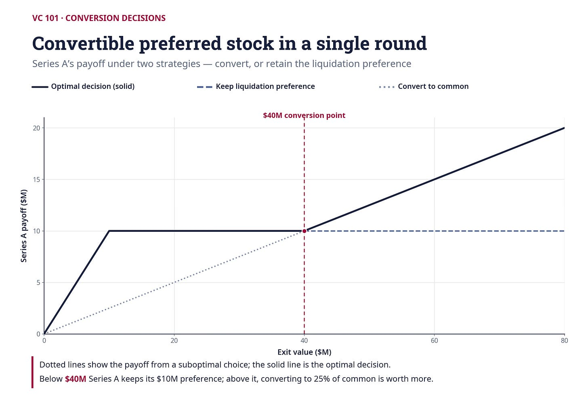

> **Convertible Preferred Stock in a Single Round**
>
> This figure shows investor payoffs under two strategies (conversion and retaining liquidation preference) at exit time. The dotted lines show payoff for suboptimal decision and solid lines show payoffs under optimal conversion decision.

Now Series B is in the picture. Here are the key numbers:

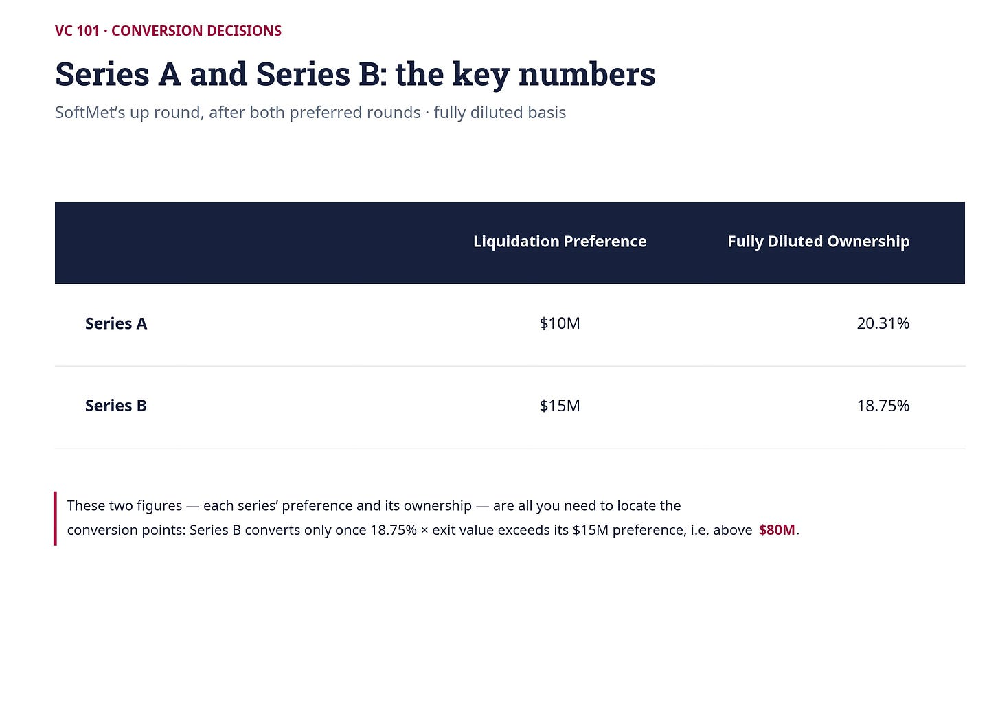

Series B’s conversion point is straightforward: it won’t convert unless it gets more than $15 million from converting. That means it needs 18.75% × V > $15M, or V > $80 million. V is the exit value. At exit values below $80 million, Series B prefers its liquidation preference.

But what about Series A? Before Round B, it converted at $40 million. Does that still hold? Let’s check. At an exit of $40 million, Series B does *not* convert (since $40M < $80M). Series B claims its $15 million liquidation preference. That leaves $25 million for common shareholders and any converting preferred holders.

If Series A converts at $40 million, it becomes a common shareholder. With Series B not converting, Series A’s share of common stock goes back up to 25% (its original pre-Round B ownership of common), but it only gets 25% of the $25 million left after Series B takes its preference. That’s $6.25 million — far less than the $10 million liquidation preference Series A could have kept.

So Series A’s old conversion point no longer works.

The presence of Series B’s liquidation preference eats into what Series A would get upon conversion. This points to a general principle: *adding a new preferred series changes the conversion decisions of all outstanding preferred series.*

To find Series A’s new conversion point, we need to find the exit value where Series A is indifferent between converting and retaining its preference, assuming Series B does not convert:

Series A converts when: 25% × (V − $15M) = $10M

Solving: V = $55 million

The new conversion point of Series A is $55 million — up from $40 million. Intuitively, once Series B takes its $15 million off the top, we’re essentially back to the single-round scenario with $40 million left for common shareholders and Series A. At $55 million exit, Series B’s payoff from converting would be 18.75% × $55M = $10.3M, which is less than its $15 million preference — confirming that our assumption (Series B does not convert at $55M) was correct.

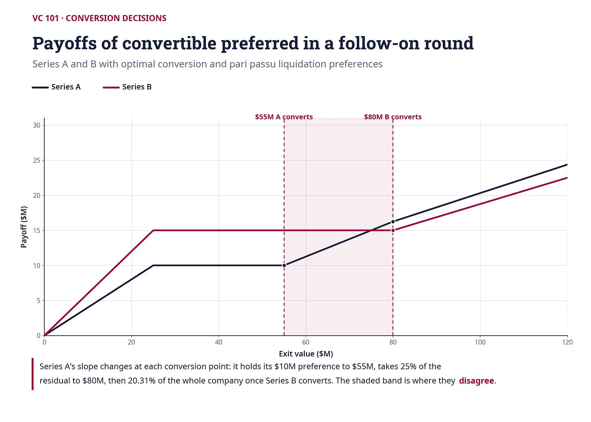

> **Payoffs of Convertible Preferred Stocks in a Follow-On Round**
>
> This figure shows the payoffs of Series A and B in SoftMet’s example with A and B optimally converting and pari passu liquidation preference provision. Note that the slope of the Series A payoff changes at the Series B optimal conversion point.

It also shows that the payoff of Series A can now be subdivided into four distinct regions. In the first region, for the exit values up to $25 million, for each additional dollar of exit value, Series A receives $0.40 (again, assuming pari passu). In the second region, for exit values between $25 million and $55 million, Series A receives its liquidation preference of $10 million and optimally does not convert. In the remaining two regions, Series A optimally converts. In the third region, for exit values between $55 million and $80 million, Series B does not convert and thus for each additional dollar of exit value, Series A receives $0.25 (the rest is received by common shareholders). Finally, in the fourth region, for exit values exceeding $80 million, Series B also converts. Series A now owns 20.31% of common shares and thus for each additional dollar increase in value it receives $0.2031. This explains yet another change in the slope of the Series A payoff at $80 million.

Conversion decisions depend on each other. If one class of investors changes its decision (that is, its optimal conversion point changes), for example, because some terms of its contract with the company have been renegotiated, all the other investors will need to rethink their optimal conversion policies. As one can guess, with many series and multiple conversion points, that could be quite complicated!

## The ordering-by-share-price trick

With two series, you can work through the conversion points by trial and error. But with six or twelve series — which is common for late-stage companies — you need a system. Here’s one that works.

For each preferred series, calculate the **conversion price per share** (SP): the per-share payoff at which that series is indifferent between converting and keeping its preference. For a standard 1X liquidation multiple with conversion ratio of 1:

SP = Liquidation Preference / Number of Shares on Fully Diluted Basis = OIP

Now rank the series from lowest SP to highest. The series with the lowest SP converts first (at the lowest exit value), and so on up the ladder. This gives you the conversion order immediately, without having to guess which series converts when.

For SoftMet’s up round: Series A’s SP is $4 (its OIP) and Series B’s SP is $6.50. So Series A converts first. That’s consistent with what we found: Series A’s conversion point ($55M) is below Series B’s ($80M).

For the *down* round, the picture flips. Recall that in the down round, Series B receives 10 million shares at an OIP of just $1.50. Now:

Series A SP: $4.00 per share

Series B SP: $1.50 per share

Series B now converts *before* Series A. The conversion points in the down round are:

Series B: $10M + $15M + $1.50 × 7.5M = $36.25 million

Series A: $10M + $4 × (10M + 7.5M) = $80 million

This result — that the ordering of conversion decisions can reverse depending on whether you’re in an up or down round — is one of the less intuitive features of multi-round VC structures.

## Disagreement ranges: where investors can’t agree

In SoftMet’s up round, for all exit values below $55 million, both Series A and B agree: don’t convert. For all values above $80 million, both agree: convert. But for exit values between $55 million and $80 million, they disagree. Series A wants to convert; Series B doesn’t.

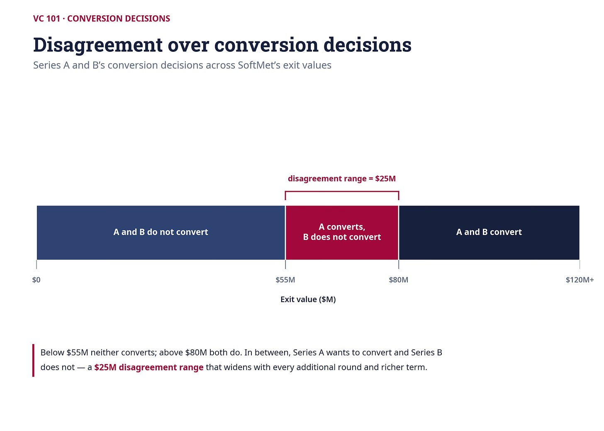

> **Disagreement over Conversion Decisions**
>
> This figure shows the conversion decisions of Series A and B at different exit values of SoftMet

This **disagreement range** — the gap between the lowest and highest conversion points — matters enormously, as we’ll see in the next article when we discuss IPOs. For now, what matters is that as companies raise more rounds, the disagreement range tends to widen.

To see this, suppose SoftMet raises a Series C: $30 million at a post-money valuation of $150 million. The new OIP is $9.75. Now we have three conversion prices per share:

Series A: $4.00 → converts first

Series B: $6.50 → converts second

Series C: $9.75 → converts last

The conversion points shift upward for all existing investors, because Series C’s liquidation preference of $30 million now sits on top of the stack:

Series A conversion point: $10M + $15M + $30M + $4 × 7.5M = $85 million (was $55M)

Series B conversion point: $6.5 × 2.5M + $15M + $30M + $6.5 × 7.5M = $110 million (was $80M)

Series C conversion point: $9.75 × 2.5M + $9.75 × 2.31M + $30M + $9.75 × 7.5M = $150 million

The disagreement range ballooned from $25 million (between $55M and $80M with just two series) to $65 million (between $85M and $150M with three series). Each new round of financing pushes conversion points higher and stretches the range over which investors can’t agree.

## How terms affect the disagreement range

The conversion points — and thus the disagreement range — don’t just depend on how many rounds a company has raised. They also depend on the terms of each series. The table below shows how different terms for Series B affect both series’ conversion points in SoftMet’s two-round structure:

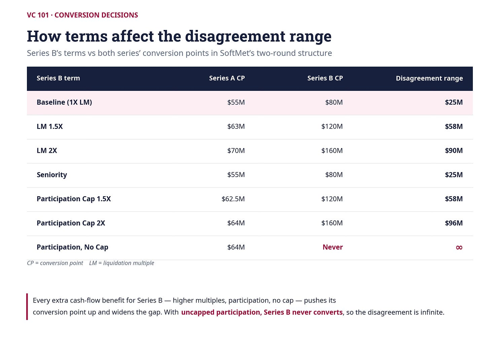

Every additional cash flow benefit for Series B investors — higher liquidation multiples, participation rights, uncapped participation — pushes their conversion point higher and widens the disagreement. Notice the last row: with uncapped participation, Series B *never* converts, because participation already gives them the upside without giving up the liquidation preference. The disagreement is then infinite.

## Key takeaways

**New rounds shift existing conversion points.** Adding Series B changes where Series A optimally converts. The new liquidation preference on top of the stack means earlier investors need a higher exit value before conversion makes sense.

**The SP ordering trick simplifies the analysis.** Calculate each series’ conversion price per share (liquidation preference ÷ shares). Rank from lowest to highest. That’s the conversion order. The series with the lowest SP converts first.

**Disagreement ranges widen with more rounds and more generous terms.** Every new series, every higher liquidation multiple, every participation right pushes conversion points apart. In a company with many rounds, investors may disagree over a very wide range of exit values.

**Conversion decisions are interdependent.** If one investor’s terms change — whether through renegotiation or a new round — everyone else’s optimal behavior changes too.

*Next article: **The Hold-Up Problem and Mandatory Conversion: Who Controls the IPO?** We’ll see why these conversion disagreements have particularly dramatic consequences when a company wants to go public, how one investor can single-handedly derail an IPO, and what contractual tools exist to prevent it — including real examples from Palantir, Jasper, and Square.*

---
## The Hold-Up Problem and Mandatory Conversion: Who Controls the IPO?

*Published 2026-07-03. Source: https://ilyastrebulaev.substack.com/p/the-hold-up-problem-and-mandatory*

In the previous article, we saw that investors in different rounds can disagree about whether to convert their preferred stock. For a range of exit values, some want to convert and others don’t. That’s interesting as an analytical exercise — but does it actually matter in practice?

It matters enormously. And the reason has everything to do with the difference between a sale and an IPO.

This article — the final installment in our series on cash flows in follow-on rounds — explains why conversion disagreements create a genuine conflict of interest between investors, how a single holdout can derail an IPO, and what contractual solutions exist to address the problem. It draws on real contracts from Palantir, Jasper Wireless, and Square.

#### **Sale vs. IPO: why the exit type matters**

When they exit successfully, VC-backed companies typically exit in one of two ways. In a **sale** (also called an acquisition or merger), the company’s assets are bought by another entity — the acquirer — and the company ceases to exist. In an **initial public offering (IPO)**, the company raises capital by selling its common stock to the public for the first time. Both give existing investors an opportunity to cash out.

The critical difference for our purposes: in a sale, each investor can independently decide whether to convert. The acquirer pays the exit price, investors make their optimal conversion choices, and the waterfall provisions determine who gets what. Investors can disagree about conversion, but that disagreement doesn’t prevent the transaction from happening.

In an IPO, the situation is fundamentally different. Companies going public for the first time are expected to have a “clean” capital structure. Practically, this means *all* preferred shareholders need to convert their shares into common stock. If even one investor refuses to convert, the IPO cannot proceed.

#### **Value transfer: when going public costs you money**

Let’s revisit SoftMet – the startup we met in our previous articles – with its two series of preferred stock (Series A: $10M, 20.31% ownership; Series B: $15M, 18.75% ownership). Imagine the company is choosing between a sale at $65 million and an IPO expected to be priced at $70 million.

On its face, $70 million looks obviously better than $65 million for everyone.

It is not.

Series A investors prefer the IPO. At both values, they optimally convert (since both exceed their $55M conversion point), and $70 million gives them a larger payout. Common shareholders also prefer the IPO — higher total value means a higher per-share price.

Series B investors, however, face a different calculation.

If the company is *sold* at $65 million, Series B retains its liquidation preference and receives $15 million. If the company goes *public* at $70 million, Series B must convert to common stock and receives:

18.75% × $70M = $13.125 million

Series B would receive $1.875 million *less* by going public at the higher value. The $1.875 million gap is a **value transfer**: forced conversion shifts money from Series B to the other shareholders.

Series B is better off if the company is sold at a *lower* price than if it goes public at a *higher* one.

This value transfer exists for any IPO value between the lowest and highest conversion points. It’s largest when the IPO is valued at the total liquidation preference ($25 million in SoftMet’s case) and shrinks as the value rises. Once the IPO value exceeds Series B’s conversion point of $80 million, Series B would want to convert anyway, and there’s no conflict.

#### **The hold-up problem**

Series B has a rational incentive to block the IPO. And that’s exactly what it can do — simply by refusing to convert.

This is the **hold-up problem**: a situation in which one party prevents everyone else from pursuing a course of action that everyone else agrees on, by refusing to cooperate.

The hold-up problem gets worse with more investors. Each additional round of funding introduces another series with its own conversion point. Even if only one class of investors holds a small fraction of the company on a fully diluted basis, that one class can hold up the IPO if conversion isn’t in its interest.

The hold-up problem also gets worse with more generous terms. As we showed in the previous article, higher liquidation multiples, participation rights, and uncapped participation all push conversion points higher and widen the disagreement range. The wider the disagreement range, the more likely it is that a proposed IPO falls within it.

Disagreements don’t have to be only about the *type* of exit. They can also be about *timing*.

Series B investors may prefer to wait, expecting the company’s value to rise above their conversion point. Founders and earlier investors may be ready to go public now. No matter the nature of the disagreement, the hold-up problem is a genuine and recurring concern in VC-backed companies.

An important caveat: if the same investor holds both Series A and Series B, there is no conflict. The investor cares about the total value of its combined holdings, not the value of each series independently. The hold-up problem only arises when different investors hold different series.

#### **Mandatory conversion: the contractual solution**

**Mandatory conversion** (also known as **automatic conversion**) is a contractual clause that gives the company and some of its shareholders the right to*force* other shareholders to convert their preferred shares into common stock under specified conditions. Meaning: these preferred shareholders will have to convert even if it is against their interest to do so. It is the primary contractual tool for resolving the hold-up problem.

The names “mandatory” and “automatic” stand in sharp contrast to the “optional” conversion we’ve discussed so far. In optional conversion, investors choose freely. In mandatory conversion, investors convert whether they like it or not. Once converted, all special rights of preferred stock — liquidation preference, participation, seniority — are lost permanently.

There is a fundamental economic trade-off here.

Making forced conversion easier devalues the protections that preferred shareholders receive. Investors who realize they can be forced to convert will demand a lower price (or more shares) to compensate for the reduced protection. On the other hand, making forced conversion easier alleviates the hold-up problem, which can be enormously valuable when the company is ready to go public. The final terms reflect this trade-off.

#### **The qualified IPO threshold**

The most common trigger for mandatory conversion is a **qualified IPO** — an IPO that meets certain value thresholds. These thresholds can be specified in terms of IPO issue price, net or gross proceeds, total valuation, or some combination.

Consider Palantir Technologies. Here is the automatic conversion clause from its 2015 contract:

*“Each share of Preferred Stock shall automatically be converted into … Common Stock … upon … a firm commitment underwritten public offering…, the public offering price of which is not less than $150 million in the aggregate (net of underwriting discounts and commissions) and immediately prior to which the IPO Valuation … of this corporation equals at least $5 billion.”*

Two conditions must be met: net IPO proceeds of at least $150 million, and a company valuation at IPO of at least $5 billion. The contract further defines “IPO Valuation” as the IPO share price multiplied by total shares outstanding on a fully diluted basis, as stated in the final prospectus.

Palantir raised its Series K round at a post-money valuation of roughly $20 billion, so the $5 billion threshold may seem low. But VC-backed companies face highly unpredictable futures. A $5 billion floor given a $20 billion post-money is far from trivial — it protects investors against being forced to convert in a dramatically deteriorated scenario.

Palantir’s contract also includes a second path to mandatory conversion:

*“… or (ii) the date specified by written consent or agreement of the holders of a majority of the then outstanding shares of Preferred Stock (voting together as a single class and not as separate series, and on an as-converted basis).”*

This means the majority of preferred shareholders can vote to force conversion at *any* time, regardless of whether the IPO meets the qualified threshold. Common shareholders don’t vote on this. The decision is exclusively among preferred holders, which creates a clear potential for earlier (and cheaper) series to outvote later (and more expensive) series.

#### **Palantir’s eleven series and the conflict within**

To see the potential for conflict, consider the original issue prices across Palantir’s many rounds:

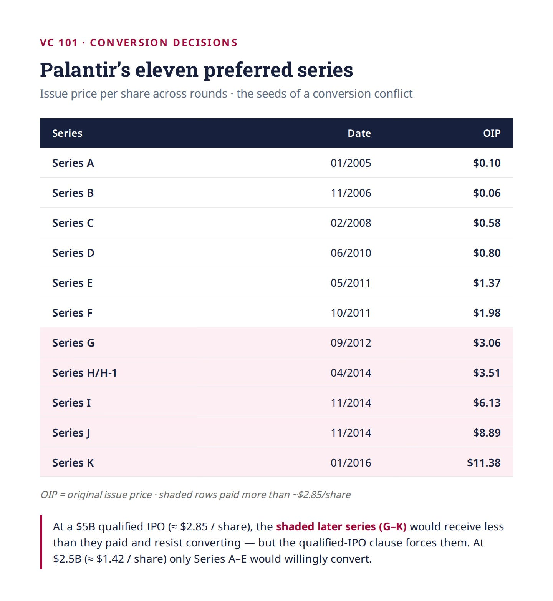

If Palantir went public at the qualified IPO threshold of $5 billion (without issuing further shares), each common share would be worth roughly $2.85. At that price, Series G, H, H-1, I, J, and K would all receive less per share than what they paid. They would strongly prefer not to convert. But the qualified IPO clause would force them to.

What if Palantir went public at $2.5 billion — below the qualified threshold? Now the per-share price drops to about $1.42. The qualified IPO clause doesn’t trigger.

But the majority-vote clause might. Series A through E, who all paid less than $1.42 per share, would prefer to convert and go public. Whether they can force conversion depends on whether they collectively hold enough shares to constitute a majority of the preferred stock.

#### **Exemption clauses: how late-stage investors protect themselves**

Investors who pay the highest prices have the most to lose from forced conversion. They often negotiate **automatic exemption clauses** (also called **mandatory exemption clauses**) — provisions that shield specific series from being forced to convert, or make forcing them more difficult.

Jasper Wireless provides a textbook example. Jasper’s 2014 contract defines a qualified IPO (gross proceeds of at least $50 million) but then adds a carve-out:

*“… provided, however, that if the shares of Common Stock sold in such Qualified Public Offering are sold at a price per share less than 1.25 times the Original Issue Price of the Series E Preferred Stock, then the shares of Series E Preferred Stock shall not be so converted without the vote or written consent of the holders of a majority of the then outstanding shares of Series E Preferred Stock, voting as a separate series.”*

Series E paid an OIP of $5.50 per share. Unless the IPO price is at least $6.88 (1.25× the OIP), Series E cannot be forced to convert without the consent of a majority of Series E holders. Since all earlier series have lower OIPs, this clause specifically protects Series E against being outvoted by earlier, cheaper investors.

Jasper’s Series E also negotiated a separate exemption for sales: in any liquidation event where Series E’s liquidation preference exceeds what it would receive from conversion, Series E cannot be forced to convert. And if the company wants to go public in a non-qualified IPO (gross proceeds under $50 million), any of Series B through F can block it by voting as a separate series.

These exemptions substantially increase the bargaining power of late-stage investors in future negotiations over exit strategy. Unless the company is doing well enough that the IPO price comfortably exceeds the exemption threshold, the protected investors effectively have a veto.

#### **IPO ratchets: the Square example**

A related protection mechanism is the **IPO ratchet** — a provision that compensates investors if the company goes public at a price below what they paid. These ratchets guarantee a certain return per share in the event of a disappointing IPO.

Square, the payments company, provides a dramatic real-world example. In October 2014, Square raised $150 million in a Series E round, issuing 9.7 million preferred shares at $15.46 per share. Those shares came with standard preferred protections for downside scenarios but also an IPO-specific guarantee: Series E investors were promised at least $18.56 per share in an IPO, with that claim senior to all other shareholders.

In November 2015, Square went public at $9 per share — 42% below the Series E price. Without the ratchet, Series E investors would have taken a significant loss on paper. But the contractual protection kicked in: Series E received additional shares until the effective value reached $18.56 per share, substantially more than other shareholders received.

The implications for valuation are striking. Square’s Series E post-money valuation implied the company was worth $6 billion. But a careful analysis that accounts for the ratchet provision — recognizing that Series E shares were worth substantially more than other shares because of their downside protection — puts the company’s fair value at closer to $2.2 billion. The gap between the headline valuation and the economic reality was almost entirely driven by the ratchet.

Square is a stark reminder that contractual terms matter. Post-money valuation is a headline number, not the whole story.

#### **Key takeaways**

- **Sales and IPOs are fundamentally different for conversion.** In a sale, investors make independent conversion decisions. In an IPO, all preferred must convert — and any holdout can block the deal.
- **Value transfer creates rational incentives to block IPOs.** When an investor gets more from its liquidation preference than from conversion, going public at any price within the disagreement range destroys value for that investor.
- **Mandatory conversion addresses the hold-up problem.** Qualified IPO thresholds and majority-vote mechanisms give the company tools to force conversion, but at the cost of making preferred shares less valuable.
- **Late-stage investors negotiate exemptions.** Automatic exemption clauses (as in Jasper) and IPO ratchets (as in Square) protect investors who paid the highest prices. These provisions can dramatically affect both the company’s exit options and its true valuation.
- **Post-money valuation is not the whole story.** When different share classes have different rights, the headline valuation can be misleading. Understanding the actual contractual terms is essential to knowing what a company — and each investor’s stake — is truly worth.

*This concludes our five-part series on cash flows in follow-on VC rounds. We started with dilution, moved through pro rata rights and liquidation waterfalls, worked through conversion mechanics across multiple rounds, and ended with the conflicts that arise when companies try to exit. The common thread: in venture capital, the fine print is never just fine print. Every term you negotiate today shapes your options tomorrow.*

---
## The Deal Funnel: Why VCs Say No to 99 Out of 100 Startups

*Published 2026-07-20. Source: https://ilyastrebulaev.substack.com/p/the-deal-funnel-why-vcs-say-no-to*

An average venture capitalist reviews more than 100 startups before making a single investment. To be specific, my research shows the average number of startups reviewed for each investment is 101.

That is a remarkable number that every founder and investor need to ponder about. One hundred and one companies that made it far enough to enter the VC deal funnel, took up some measurable amount of an investor’s attention, and were then, overwhelmingly, discarded. If you are a founder about to raise, this is the number you are up against. If you are an investor, this is the machinery you are running, whether or not you have ever drawn it on paper.

For IT-focused investors the number climbs to roughly 150. For early-stage investors it’s about 120. For healthcare VCs it is 78 startups per closed deal. (If you wonder why healthcare is so different, it is more difficult to evaluate healthcare investments and there is a smaller universe of healthcare founders.) However you slice the industry, the ratio is brutal. For each deal, investors rapidly assess a small number of high-signal factors and use them to decide whether this deal deserves more of a scarce resource — time. As the startup travels through the deal funnel, investors change the ways they assess the deal quality and prospects.

This post is about where those hundred deals come from and how they get filtered down to one. Understanding the funnel is not optional knowledge for founders: if you don’t know how the filter works, you are more likely to end up on the wrong side of it. And if you are an investor, I hope that you will review your deal funnel carefully and compare notes after digesting this post.

### **First, you have to find the deals**

Before investors can evaluate anything, they have to locate it. **Deal sourcing** is the process by which investors identify potential investment opportunities — and in the industry, those opportunities are simply called **deals**.

Many VCs firmly believe sourcing is the critical ingredient of their secret sauce. This is especially true at the earliest stages, where uncertainty is enormous and there is no centralized information resource telling you which companies exist and which are any good. Investors are particularly hungry for proprietary deals: opportunities only they can see, or that they see before anyone else does. In the recent past, many VCs concentrated on nursing proprietary deals. This still holds true, but today the cost for searching for deals with all new AI tools is lower – there are fewer proprietary deals and VCs need to find new ways to generate them. More than 60% of deals are not proprietary.

The output of deal sourcing is **deal flow** — the total number of investment opportunities an investor gets to consider, measured per unit of time. A typical active early-stage VC firm has a deal flow of roughly 1,000 opportunities per year. This, of course, depends on the size of the firm and the number of people working there. Some see a few dozen; some see many thousands. Quantity is only half the story, though. What matters is the quality of what’s flowing in and the investor’s ability to pick correctly out of it.

So where do the deals actually come from? Roughly, in order of volume:

A few of these deserve unpacking.

**On proactive self-generation**, here’s how it works at one VC firm with several general partners and associates. The whole investment team develops a thesis, narrowing it down to a specific vertical. Associates then run a meta-search to identify every startup they can find in that narrow space. The search deliberately over-generates — the point is to see the entire playing field. Analysis then cuts the list down to maybe a dozen genuinely interesting opportunities. Finally, the team works its professional network to get warm introductions to each one. Note that even the “outbound” channel terminates in a network introduction.

**On investor referrals**, consider a company called SelfScore. Theresia Gouw, a partner at Aspect Ventures, put a relatively small seed check into the company in 2014. She then introduced it to Sameer Gandhi at Accel, and the two of them co-led SelfScore’s Series A in June 2015. During that process they brought in a third investor, Blake Modersitzki of Pelion Venture Partners, whom they had syndicated with before. Pelion took a small piece of the Series A — and then led the next round in 2016. Each introduction was backed by real money. That’s what makes investor referrals credible in a way that most introductions aren’t.

### **The cold-call experiment**

About one in ten deals starts with a cold call. This is odd, because if you ask investors about cold outreach, most will tell you it doesn’t work — they don’t respond to emails from founders they don’t know and haven’t been introduced to through a trusted source. And yet investors of every kind, successful and less so, large funds and small, report the same figure: roughly one in ten.

A few years ago my research team decided to test this directly. We sent short introductory cold emails to angels and venture capitalists, ostensibly from fictitious entrepreneurs, each containing a one-paragraph pitch for a very early-stage startup.

Everything was stacked against these emails. The match between investor interests and startup characteristics was deliberately imperfect — mismatches on geography, on industry. And plenty of the messages presumably died in spam filters before a human ever saw them.

We did not expect much. Our VC friends were blunter than that. One prominent investor told us, in so many words, that a bunch of losers might reply but not a single reasonable VC would.

Here is what happened. Almost 10% of investors responded with interest to at least one email — requesting a meeting, a call, follow-up detail, or a deck. Because many investors received more than one pitch, the unconditional per-pitch response rate was lower, but at over 4% it still amounted to nearly 3,500 interested replies. And the distribution was revealing: of the 50 pitches we used, the top five drew an overall response rate of 13%, and 17% from VCs specifically. One in six venture capitalists responded to a cold pitch from those startups.

It suggests that a founder with a promising company and a well-structured, thoughtful pitch can get real traction from cold outreach. That is genuinely good news for entrepreneurs who don’t have strong networks and need backers.

There’s a coda. Whenever I present these results to a room of investors and mention that everyone told us the study was impossible because no investor ever replies to cold outreach, a line forms afterward. Angel after angel, VC after VC, comes up to tell me about the investment they made that started with a cold call from a founder.

Want to learn more about this experiment and the cold pitch: review this post.

### **Why investors work so hard on sourcing**

The logic of building diverse sourcing is straightforward: a broader web catches more. More means a better chance of catching something extraordinary. Diverse sourcing brings another critical benefit: you never know where that one super successful deal will come from. Often, the best deals come from unexpected sources.

It’s why angels join angel groups — the primary benefit is pooling deal flow from people you trust who are experts in fields (and thus get sourcing) you aren’t. Sand Hill Angels is a useful illustration. Founded in 2000, SHA is a consortium of more than 100 individual angels in Silicon Valley. It sources chiefly through three pipelines: its website, member referrals, and referrals from syndicate venture investors or accelerators. Website applicants submit through a platform for managing angel group opportunities. But most actual investments come from member referrals. I have SHA members come to my Stanford VC class every year to share their experience. One after another, they say the main reason they joined: to share in high-quality deal flow from trusted people who were experts in their own fields — diversifying both the flow and the resulting portfolio, and leveraging the group’s combined knowledge. To widen the aperture further, SHA spent years as a limited partner in the accelerators, such as 500 Startups, which expanded deal flow and gave the group access to outside expertise. It should come as no surprise then that in my rankings of unicorn investors SHA comes close to the top of accelerators and angel clubs.

For new investors — a freshly hired associate at a VC firm, say — building a personal sourcing network is close to the top priority, and for good reason: deal flow is what venture investors consider their crucial value-add, the thing that sets them apart. Attending startup presentations, industry conferences, and increasing your rolodex of diverse contacts increases the number of potential deals you come across. Reputation compounds: become known as genuinely helpful to founders and knowledgeable about a specific space, and flow increases. As my co-teacher Brian Jacobs likes saying to our MBA students, “the best day to increase your rolodex was yesterday.” But it is never too late.

Diversification of sources is critical. If you utilize LinkedIn, my advice is to check how diverse your contacts are: geography, industry, education, role, type of companies. If most of your contacts come from one industry or one geography or one school, you are less likely to be successful as an investor.

But nothing generates deal flow like success. In early-stage investing, success breeds success. An investor associated with one great proprietary deal will find the next ones much easier to come by. Blake Jackson and I recently looked at VCs who marginally made it to the Midas list that Forbes published annually. We compared them to VCs who, according to our analysis, were just outside the top 100. They were very close but did not make it. If you are number 99 and the other investor is number 101, you might think the difference is small. But we found that the difference is large. Making it to the Midas list increases your ability to make more investments quite a bit (this finding is so interesting that I will devote an entire post to what we found.)

Practical implications: For an investor, think hard about your network and sourcing. Think of the successful deals in your space or geography that did*not*enter your deal flow. How could this have happened, what should you do to make sure it does not happen again? At the end of the day, it is the quality of sourcing matters. If you even did not have the best deals enter your deal funnel, something serious is off. My research finds that what may really differentiates great VCs is the quality of their referral network and sourcing mechanisms. Pay attention.

For a founder, warm intro is usually better than a cold outreach, but don’t despair about cold emails if you do them well. Moreover, note I used “usually” in the previous sentence: it is the quality of the warm intro that matters. Have your warm introducer generated any successful deals for the VCs before? What is their reputation? Even better, think hard about what you should do so that VCs reach out to you, and not vice versa. Or if you reach out to a VC, do it first before you need to fundraise. As Scott Sandell, a very successful VC investor, told my Stanford MBA class: “If you ask for money, VCs give advice. If you ask for advice, VCs give money.” This is so true.

### **Inside the funnel: from 101 to one**

VCs report spending about 15 hours a week sourcing and screening deals. The only thing that takes more of their time is helping their existing portfolio companies, at 18 hours. So the screening process — from a glance at an intro email through to a final investment decision — is a substantial fraction of the VC job.

Here is the shape of a typical early-stage deal funnel:

Look at where the funnel narrows most sharply. It’s at the very top — and that’s not an accident. Each successive stage costs the investor dramatically more time than the last, so the cheapest filter has to do the heaviest lifting.

**Initial screening** is where roughly 70 of 100 opportunities die, usually within minutes and without any meeting at all. Investors do differ here: larger funds are more willing to meet founders, probably because they have junior staff to delegate exploratory meetings to. California investors are also more likely to meet likely because they feel competitive heat. Importantly, my data shows that more successful investors are also more willing to take meetings. That did not come as a surprise to me as in my previous research more successful investors were also more likely to respond to cold emails from founders. (They are also willing to run more of them through further expensive screening stages: sweat pays off in the VC world.) Anyway, the headline holds everywhere. More than half, often three-quarters, are gone almost immediately for any kind of VC investor.

Some of that could be simple mismatch. Startup can be too early for investors, or outside their vertical, or in the wrong geography. Any founder worth the name should know an investor’s mandate before approaching them. The far more interesting question is why investors pass on deals that *are* in their space, at their stage, in their geography. That’s the subject of my future post.

**Meeting the management** is informal on the surface — coffee or zoom chat, no slides necessarily. Founders should hold no illusions about what’s happening. They and their company are being evaluated, scrutinized, and compared against thousands of other teams and ideas and against patterns of success the investor is familiar with. The investor decides whether to escalate. I use that word “escalate” here deliberately. A half-hour meeting is genuinely expensive when you review 200 deals a year. But the next stage is far more expensive, because it means spending hours and hours of your time and other people’s time on one deal.

**Reviewing with partners** is where the funnel collapses hardest: only about 10 of the original 100 make it, roughly a third of those who got a meeting. In Silicon Valley and most other hubs the traditional day for this is Monday. Discussion comes with a concise investment memo summarizing the deal, its benefits, its risks; often a presentation by the founders to the whole partnership or angel club. Investors may also reach outside the firm at this stage, calling academics or industry executives to gauge product potential and market interest.

Bringing a deal to partners is not a decision taken lightly, and the reason is only partly about time. Investors care about their reputation inside their own firm. Nobody wants to be the partner who wastes everyone’s Monday on a weak deal.

**Due diligence** — DD, in industry shorthand — is a comprehensive appraisal of the potential investment (of course, “comprehensive” depends on startup’s stage). The specific steps vary with stage and with how much data exists. Of every five deals that enter DD, fewer than two come out the other side. Those that do get a term sheet: a document summarizing the terms on which the investor is prepared to invest.

And then the baton changes hands. Up to that moment, the founders have been convincing the investor. Once the term sheet lands, the founders decide — accept, negotiate, or pass and keep talking to others. Which is why, on average, 1.7 term sheets are required per completed investment. That ratio is 1.5 at early stage and 2.3 at late stage, because later-stage companies are more visible, offer less proprietary access, and attract more competing offers.

Some (very important!) practical implications for founders. First of all, whenever you are fundraising, always know where you are in the deal funnel for every investor you target. That’s because the way you should approach the investor and the entire process change as you move through the funnel. So often, I see founders that have the same email and the same deck for all the stages: this is a mistake. At the initial screening, investors don’t really make a decision to invest: they make a decision whether to escalate and spend more effort on you. They ask different questions at a later stage. Once you are invited to meet another partner, you are one out of ten, great progress! But requirements also change.

Remember this: at initial screening send an email that survives 30 seconds, at the meeting the management stage prepare for a 30-minute conversation that will escalate to due diligence, and at the DD stage help prep a memo someone else will write about you to people you may have never meet. Again, let me repeat: one of the most common mistakes I see is that founders prepare one deck, one conversation, one line of arguments for all the stages.

Second, a good strategy is to be helpful to investors. VCs are super busy. Help them by anticipating all the questions they want to ask (check my list of 100+ questions VCs ask I prepared especially for this). Prepare DD materials they can share with their partners.

Third, founders often ask me whether it makes sense to meet with junior personnel at larger VC firms. I’d say yes, because they act as deal scouts. They can’t cut a check, but they can introduce you to the right partner who will be making a decision. But beware: my favorite expression is “incentives drive behavior.” Junior VCs may have incentives other than maximizing returns for their LPs; they care about their reputation and their career, and much depends on their standing and relationship with more senior partners. Again, help junior VCs by learning about them. Most importantly, learn who is the right person in the target VC firm. At the end of the day, even though VC fund will invest in you, your long-term relationship will be with one partner.

### **The funnel isn’t a law of nature**

Everything above is representative, not universal. Every firm develops its own idiosyncratic process and its own culture around decisions. For investors, it is an opportunity to learn from other VCs. For founders, it makes the process trickier. Junior VCs here could be helpful if you establish a good rapport with them: try to find out how decisions are made and who makes them.

One VC I know, a partner at a mid-size early-stage IT fund, brings founders in for a formal presentation to the full partnership *at the end* of due diligence — by which point the decision to offer a term sheet has effectively already been made. Another, a partner at a firm of four or five, makes his own investment decisions up to a financial threshold; partners advise each other but own their calls. That changes the shape of the funnel entirely.

Stage changes it too. Later-stage companies have harder financial data and detailed customer information, and that data is sensitive. They’ll only open up to investors serious enough to demonstrate commitment. So the order inverts: the investor produces a term sheet *contingent* on further diligence, and only if the terms are acceptable does the company open the data room.

And competition can compress the funnel or blow it up completely. When a startup is visibly hot and a competitor puts a term sheet on the table, an investor may have to decide at the speed of lightning whether to throw a competing offer into the ring — without proper review, without diligence, at their own risk.

Which brings us to preemptive term sheets. Occasionally a VC will offer one before any formal diligence, specifically to lock up a deal. These term sheets are exclusive: sign, and you’re obliged to negotiate in good faith with that investor and not shop the deal simultaneously. The investor’s calculation is that this company is going to attract a crowd, and speed beats process. This is more likely to happen if the investor already knows the founders, perhaps in a different capacity (say, as an employee of a company the investor backed previously).

Founders receiving a preemptive term sheet should ask what the rationale is. There’s a real trade-off. A bird in the hand — one workable signed term sheet — beats the prospect of several. But generating multiple term sheets improves your bargaining power and raises the odds of finding an investor who actually fits. What founders should absolutely register is the signal: preemption means an investor believes you are about to be hot. That is information, and you should use it.

### **Key Takeaways**

- **The funnel is a time-allocation machine, not just a quality-detection machine.**Every stage costs more than the one before it, which is why 70% of deals die at the cheapest filter. Investors aren’t being lazy at the top of the funnel — they’re being economical, because the alternative is spending real hours on companies they were always going to pass on.
- **Sourcing is a network, and networks compound.**Roughly 60% of deals arrive through professional networks or proactive outbound that terminates in a network introduction. This is why investors treat reputation as an asset and why success breeds success. It’s also why founders should think hard about who introduces them, not just whether they get introduced.
- **Cold outreach works better than anyone admits.**One in ten deals starts this way, and our experiment found nearly 10% of investors responding with interest to a cold email from a stranger — rising to one in six VCs for the strongest pitches. If you lack a network, you are not locked out. You just need the pitch to be genuinely good.
- **The term sheet is a handoff, not a finish line.**It takes 1.7 term sheets to produce one investment, which means roughly four in ten offers are declined or lost. The moment an investor commits, the leverage shifts to you — and a preemptive offer is the loudest signal you will ever get that other investors are about to want in.

*Next post: **The First Two Minutes — How Investors Decide to Pass Before You’ve Finished Talking.**We’ll look at the critical-flaw approach, the specific red flags investors scan for, and what the evidence from Dragon’s Den tells us about how these snap judgments actually get made. Why it is crucially important: because deal selection is equally or even more important than deal sourcing.*

---
## Jockey or Horse? The Oldest Debate in Venture Capital

*Published 2026-08-07. Source: https://ilyastrebulaev.substack.com/p/jockey-or-horse-the-oldest-debate*

In the mid-1980s, Don Valentine of Sequoia looked at a small networking startup called Cisco. Many investors had already passed, and they had passed for the same reason: the management team looked weak.

Valentine invested anyway. He thought the market for Cisco’s product was enormous. Then he replaced the founding team essentially on the spot.

Cisco went on to dominate computer networking. The story is famous among investors and infamous among entrepreneurs, and it sits at the center of the oldest unresolved argument in venture capital: do you bet on the jockey or the horse?

#### **The case for the jockey**

The classic statement comes from General George Doriot, the founder of the modern venture capital industry: give me an A management team with a B product idea, or a B management team with an A product idea, and I’ll take the first every time.

One of Greylock’s founders put the rationale well. Making an investment in an entrepreneurial company is a marathon, not a sprint. The rules of engagement will change: the competitive landscape shifts, and you have to reposition the company, not by 180 degrees but by 15 or 20, as you build it. An A team can execute that turn. A poor team, however good the initial product idea, in all likelihood cannot navigate it.

That argument is about adaptability under uncertainty, and it is genuinely powerful. Most of today’s venture capitalists agree with it. Here is what my research shows:

Out of more than a thousand VCs we surveyed, 47% say the team is by far the most important factor in selection. The second-place factor, business model, scores only half as many. Early-stage investors weight the team more heavily than late-stage investors, which makes intuitive sense, but even late-stage investors put it far above everything else. And not surprisingly, when we allowed VCs to identify more than one important factor, the team was identified as important or very important 95% of the time.

We approached the question from the other end too, asking what drives successful and failed investments. Team again, by a wide margin, and, strikingly, symmetrically. Fifty-five percent named the team as the most important factor for success, and the identical 55% named it for failure. The team giveth and the team taketh away.

Founders, note: only one group put the team in second place, healthcare VCs, and even there it was neck and neck with product. The reason is instructive. In healthcare innovation, investors expect the product to be substantially further along by the time they invest, and, bluntly, the management team is easier to replace once the product exists.

#### **The case for the horse**

So the matter is settled. Except that it isn’t, for a reason that’s easy to miss when you read the headline number.

Forty-seven percent say the team is most important. Which means fifty-three percent don’t. They just don’t agree with each other about what does matter most, so their votes scatter across several factors and no single alternative tops the chart. The team wins by plurality, not by majority.

And some of the most storied investors in the industry are firmly in the other camp. Tom Perkins, co-founder of Kleiner Perkins, evaluated a company’s technological position above all: was the technology superior to the alternatives, and was it proprietary? Valentine’s Cisco bet was a pure market call, made in the explicit knowledge that the team was the weak part, on the theory that the team was the replaceable part.

That is the crux of the horse argument. Teams can be swapped; markets cannot.

And there is a harder version of the argument that rarely gets said out loud. In an ideal world investors would select companies with both a strong business and a strong team. In reality, that combination essentially never presents itself, and when it appears to, experienced investors assume they are missing something. What actually arrives is a company with a relatively weaker management team or a relatively weaker business. So the question is not which you prefer. It’s which weakness you are willing to underwrite.

Note also what “weaker” really means here. It covers uncertainty as much as deficiency. Far less is known about the leadership qualities of a first-time founder than about a market that already exists and can be measured. A first-time founder isn’t necessarily worse. They are harder to read. And investors making rapid decisions under time pressure systematically discount what they cannot read. On the other hand, imagine markets that don’t exist yet, as AI was until very recently. Then the market uncertainty is so large that team quality is not only more critical but also, relatively speaking, less certain. This explains why in healthcare, for example, management team quality is less important: not because team’s quality does not matter, but because the other “horse” parameters – market, product, business model – are less uncertain.

#### **What the evidence says**

The jockey-versus-horse question is punishingly difficult to study in the field, but Steven Kaplan from the University of Chicago, Berk Sensoy, now at Vanderbilt University, and Per Strömberg, now at the Stockholm School of Economics, found an ingenious way in. They took 50 successful VC-backed companies and traced the evolution of their characteristics from the earliest business plan all the way through to IPO. What makes the study remarkable is the access: business plans at multiple points across the life cycle, which almost never survive in a form researchers can see.

A note aside: there are many great academic studies of venture capital and entrepreneurship done by my academic colleagues around the world and they should really be better known. As I am writing this, I would like to commit myself to bring more of this hard and practically relevant evidence to my Substack audience!!

The findings were lopsided. Business lines were remarkably stable. These companies competed against similar competitors and sold to similar customers at every stage. The horse, in other words, barely changed.

The jockey changed constantly. Fewer than three-quarters of the CEOs at IPO had been CEO at the time of the original VC investment. Of the next four top executives at IPO, only about half had been in senior roles at the early stage. Management turnover was substantial and routine.

The implication cuts against what investors say about themselves: at the margin, investors in startups place more weight on the horse than on the management team, as judged by the evolution of the startups. Whatever they believe they’re doing, the businesses persist and the people get replaced.

This aligns with earlier work from the Stanford Project on Emerging Companies, a major 1990s initiative studying high-growth early-stage firms. Researchers there tracked the evolution of top management teams and found that the human capital characteristics of founding teams predicted neither venture capital financing nor going public.

These findings are not inconsistent with each other. When VCs invest, management team quality matters dramatically. But as many management teams don’t execute well, they get replaced over time. This is related to my next point. Founders and aspirational founders, pay attention!

#### **Very early stage versus everything else**

There is one caveat to these studies that I need to discuss. The data comes from the growth stage, after the firm has been formed. In the study of 50 VC-backed companies, the median company was already 23 months old at the time of the business plan being analyzed. Nearly two years in. By then the business exists, the customers exist, and the question of who founded it has already receded.

The role of the team at the genuinely early stage is far more important, and there’s evidence for that too. Amar Bhide at Columbia University studied 100 companies from Inc. Magazine’s list of the 500 fastest-growing companies. He found that founders tended to replicate or modify an idea encountered in previous employment, and did relatively little formal planning before starting. As a result these companies were highly prone to adjusting their initial business concepts. Even though this study was done some time ago, the basic mechanism aligns with my experience.

If the business concept is fluid at formation, if the horse itself is still being chosen, then the founder is the only stable input and their quality is, so to say, less uncertain. At that stage the entrepreneur is by far the more critical resource.

So the two bodies of evidence may not conflict at all. They may simply be describing different moments. At formation, the jockey picks the horse. By month 23, the horse is running and the jockey can be substituted.

#### **Where investors actually disagree**

There is a way of reading all this data that I think is more useful than picking a side.

Recall from the previous post that 95% of investors say the team is an important factor. Now set that beside the 47% who rank it as most important. The gap between those two numbers, nearly half the market, is composed of investors who consider the team carefully and then decide something else matters more.

That gap is the actual structure of the market. Investors do not disagree about which factors exist; they disagree about the weights. And because they disagree about the weights, the same company genuinely is a different investment proposition to different investors, whatever the deck says. The difference sits in the evaluation function.

The healthcare exception makes this concrete. Healthcare VCs are the only group that doesn’t rank the team first, and the reason I believe is straightforward: by the time they invest, the product is more likely to be substantially developed, and a developed product makes the team more replaceable. Same investors, same instincts, different weights,driven entirely by what the asset looks like at the moment of investment.

Which suggests the honest version of the jockey-horse question isn’t “which matters more?” It’s “which matters more, at this stage, in this industry, for this deal?” That question has answers.

#### **What this means in practice**

Several things follow which are important for founders and investors to keep in mind.

- **For founders,** the practical fact is that investors you meet will differ substantially in the weights they place on these factors. The Doriot disciple and the Valentine disciple will run the same meeting and hear completely different things. Knowing which one you’re sitting across from is worth more than any amount of polish on your deck. Ask yourself a question too: at this stage, is my horse quality more uncertain, or my team quality? And how do the weights at this stage compare to similar companies from an investor’s perspective?
- **For investors,** there’s a structural shift worth noticing. Founders increasingly seek funding at an earlier stage of company development, which makes the team a more critical factor than it was. I really believe this is behind the Doriot disciples winning in recent years. But this cuts both ways. The earlier you back founders, the more likely you are to encounter tension between the qualities of the management team and the eventual needs of the firm. Should we then expect higher managerial turnover? Likely. Or should we expect contractual terms to reflect the risk investors and founders are taking? Likely as well. As an investor, it is important to think about what kind of scenarios you can foresee and whether you can prepare for them now.

#### **Key Takeaways**

1. **The team wins by plurality, not majority.** Forty-seven percent of VCs call the team the most important factor, which means 53% don’t. They simply disagree with each other about the alternative, so no rival factor tops the chart. The consensus is thinner than the headline suggests.
2. **What investors say and what happens to companies diverge.** Across 50 successful VC-backed companies, business lines stayed remarkably stable while management turned over constantly: fewer than three-quarters of CEOs at IPO had held the job at first investment. At the margin, the evidence favors the horse.
3. **The stage is doing most of the work in this argument.** The studies favoring the horse examined companies that were already about two years old. Bhide’s work suggests that at genuine formation, when the business concept itself is still fluid, the founder is the only stable input. Both camps may be right about different moments.
4. **Team is 95% considered but nowhere near 95% decisive.** Nineteen of twenty investors weigh it. Under half let it decide. Founders should not assume that a strong team narrative is sufficient, and investors should not assume that citing the team is the same as having a thesis.
5. **Know which camp your investor is in.** The Doriot disciple and the Valentine disciple will sit through the identical pitch and evaluate you on different axes. That is knowable before the meeting, and it should shape what you lead with.

*Next post: Inside the Investment Committee. How VCs actually make decisions. Investment memos, why most VCs skip DCF entirely, the Monday partner meeting, and the evidence that unanimity is quietly destroying returns.*

---
## Due Diligence: What Investors Actually Do With Those 120 Hours

*Published 2026-08-28. Source: https://ilyastrebulaev.substack.com/p/due-diligence-what-investors-actually*

An investor spends roughly 120 hours on the due diligence that eventually leads to an investment.

But recall the funnel. Most due diligence is performed on deals that never close. Add up the hours burned on those, and the real figure is well north of 250 hours of diligence per completed investment. Three weeks of full-time work, per deal, most of it spent on companies VCs will pass on.

That number tells you something important: VCs take this seriously. It also tells founders something they rarely internalize — the process is long, and you need to be alive at the end of it.

#### **A mirror image of the screen**

In the last article we looked at initial screening, where the goal is to reject as many deals as possible as efficiently as possible — maximizing speed and accepting that some excellent deals will fall through the cracks.

Due diligence inverts this. The goal now is to gather as much pertinent, comprehensive information as possible within a reasonable time frame, so the investor can make an informed decision. The algorithm changes accordingly. At the top of the deal funnel, investors follow the fast line – they seek for a reason to reject the deal. Once the deal passes that threshold, investors switch to weighing strengths against weaknesses, and — unless a red flag resurfaces in light of new information — the decision no longer hinges on any single overriding factor. It hinges on the combination.

This is precisely why two investors looking at identical information routinely reach opposite conclusions at this stage. There are essentially infinite ways to weigh the factors, and investors are usually guided by their own history — whatever seemed to work before. Founders, take note. While you may have a dream investor in your mind, always work with more than one, as overarching uncertainty is huge.

Four considerations frame the whole process:

There is something else that I need to emphasize: VC due diligence is not about gambling. It is also not about de-risking everything. It is about selecting factors that you cannot de-risk and admitting it freely to yourself. Founders, you need to work on what kind of risks you and your startup possess will be acceptable to investors and which ones will not.

#### **Where the hours go**

As my research confirmed, the 120-hour average conceals enormous variation:

Sometimes the clock gets compressed violently. Competitive pressure is usually the reason — if a company already holds a term sheet, or several, an investor may need to decide overnight. And investors are not above piggybacking. In a syndicate, the lead typically does most of the diligence while the others play a secondary role. Those others still make their own decisions, but they are leaning heavily on the lead’s work.

#### **What they actually do**

Due diligence is not one activity. It’s a checklist that gets worked through in parallel:

Reference calls are the engine of all this. Investors make about ten per deal on average — eight at early stage, thirteen at late stage. Ten conversations about you, your product, and your industry, most of them with people you didn’t choose and won’t hear about.

Many investors, particularly at VC firms, also write one or more investment memos during this period. The memo gets everyone on the same page and makes the eventual group decision more efficient. It also takes real time. We’ll come back to memos in another article.

#### **83 days**

Founders should be prepared for a hard truth: even when the deal gets done, cash arrives later than you think. From the start of deal screening to consummation takes an average of **83 days**. It’s faster for some — California, IT, early stage — but it still takes at least two months in nearly every category.

This is where founders get often negatively surprised. Not by a bad product or a small market, but by arithmetic.

The rule of thumb: allow a double buffer. If deals of your type take an average of 60 days, hold enough cash to survive 120. Sometimes more. If your burn is $100,000 a month and closing takes six months, you want $1.2 million in the bank when you start — not $600,000. And in my experience, so many founders have less than $300,000 in this situation! Not good. You will lose your bargaining power and will not be able to get multiple term sheets. Worse, you will lose the control of your startup or run out of money.

Let’s dig deeper into this as this is so critical. The reason is not only survival. It’s leverage. As cash reserves dwindle and the process drags, two things degrade simultaneously: employee motivation, and your bargaining power. New investors — and existing ones that reinvest — can smell desperation, and they will price it. Lower valuation means substantial dilution, and it lands disproportionately on common shareholders. Which is to say: on you and your team.

Founders often frame this as a trade-off between unfair dilution from raising too early and disaster from raising too late. But note (!) that starting early does not mean closing early. As you generate more interest, valuation may rise — even from an earlier starting point.

#### **The factors that decide it**

Investors face more unknowns than knowns, and they know that many investments will fail regardless of how hard they work. That is simply the nature of the asset class. But this makes diligence more important, not less. With failure rates that high, shaving the failure rate even slightly improves your odds meaningfully. More crucially, good diligence helps avoid missing the outlier that pays for everything else.

When my colleagues and I asked VCs which factors are important in selecting deals, investors converge sharply:

Ninety-five percent — nineteen of every twenty investors — name the team. But note what this figure does and doesn’t say. It says the team is nearly universally considered. It does not say the team is decisive. That distinction is the subject of the next article, and it is more contested than it looks.

The variation between investors is the real story here. Nobody expects a perfect deal where every factor is positive. In fact, if one appeared, they’d assume something was wrong with it. One managing partner of a major Silicon Valley VC firm told his partners on investment committee in my presence: “This deal seems too good. Let’s check again and discuss tomorrow.” What exists instead is strengths, weaknesses, and irreducible unknowns. Where investors differ wildly is in the *weights*. Which means when you walk into a meeting, the single most useful thing you can know is what that particular investor weighs heavily. It will determine, more than anything else, how you get evaluated.

#### **The cheat sheets**

What follows is what investors are actually trying to answer, factor by factor. For founders: work through these for your own company. Discuss them with co-founders, mentors, advisors. If you find a question where your answer is unsatisfactory, congratulate yourself — you just found a weak spot before an investor did, and now you have time to fix it.

For investors: make it concrete. Take the most recent opportunity you looked at and run every question against it. Any question where you feel you ought to have an answer and don’t is a learning experience.

See my especial cheat sheet article that goes into depths about each of these questions.

##### **Founders and team**

Investors are looking for five qualities: industry experience, entrepreneurial experience, ability, teamwork, and passion. They get at them by talking to the founders and the team, making reference calls, and pattern-matching against every founder they’ve encountered before — successful and failed. Some larger firms now retain professional psychologists to help assess things like resilience and team-building capability.

Resilience deserves a note. However successful a startup eventually becomes, all of them pass through multiple near-death experiences. The old line about when the going gets tough applies with unusual literalness here. Founders who aren’t tough enough don’t survive the rollercoaster — and investors know it, which is why they probe for it.

##### **Business model, product, market**

**Business model**

**Product**

**Market**

##### **Valuation, exit, and fit**

**Valuation and funding factors**

**Fit and value-add factors**

That last cluster is worth dwelling on, because founders systematically ignore it. An investor can love your team, your product, and your market, and still pass because the exit horizon doesn’t fit their fund’s remaining life, or because they lack dry powder for your follow-on, or because they already back a competitor. None of that is about you. All of it is knowable in advance.

#### **Key Takeaways**

- **Diligence inverts the screen.**Screening optimizes for speed and rejects on a single flaw. Diligence optimizes for accuracy and decides on the combination. This is why two investors with identical information reach opposite conclusions — they weight differently.
- **Investors spend 250+ hours per closed deal.**The 120-hour figure covers only the deals that close; add the ones that don’t and the true cost is far higher. Early-stage diligence runs about 80 hours, late-stage over 180, and California investors move roughly 50 hours faster than the East Coast.
- **Budget 83 days, and hold double the cash.**That’s the average from first screen to money in the bank. If your burn is $100K a month and closing takes six months, you want $1.2 million on hand — not because of the burn, but because dwindling cash destroys your bargaining power exactly when you need it.
- **The cheat sheets are a gift, so use them adversarially.**Run every question against your own company. Any question you can’t answer well is a weak spot you found before an investor did — and you still have time to fix it.
- **Some rejections have nothing to do with you.**Fund horizon, dry powder, portfolio conflicts, and LP perception can kill a deal an investor genuinely likes. Do your homework on the fund before you spend three months on its process.

---
## Paywalled lectures from the same class (text not included)

These notes exist on Substack for paid subscribers only. Titles and dates only:

- 2026-04-30 — Diligence yourself before investors do. The 70+ questions smart VCs will ask you
  https://ilyastrebulaev.substack.com/p/diligence-yourself-before-investors
- 2026-05-12 — Venture Capital 101: Series A Cheat Sheet — Who Wins When Every Term Goes Up
  https://ilyastrebulaev.substack.com/p/the-series-a-cheat-sheet-who-wins
- 2026-06-27 — Cold Pitch: How to Ensure the Investor Gets Back to You
  https://ilyastrebulaev.substack.com/p/cold-pitch-how-to-ensure-the-investor
- 2026-08-12 — Inside the Investment Committee: How VCs Actually Make Decisions
  https://ilyastrebulaev.substack.com/p/inside-the-investment-committee-how
- 2026-08-26 — Fundraising Playbook: Avoiding Common Pitfalls
  https://ilyastrebulaev.substack.com/p/fundraising-playbook-avoiding-common

Still unpublished in the public series (listed in the course roadmap): investor-type map; angel investors; VC industry primer; startup lifecycle; power law / illiquidity; ownership and the VC seat; VCs vs angels; the first two minutes / critical-flaw screen; investment memo writing; follow-on / escalation of commitment; anti-dilution; SAFEs and convertible notes; founder and employee vesting; option pool; corporate governance and boards; startup valuation methods; exits (M&A, IPO, liquidation).

